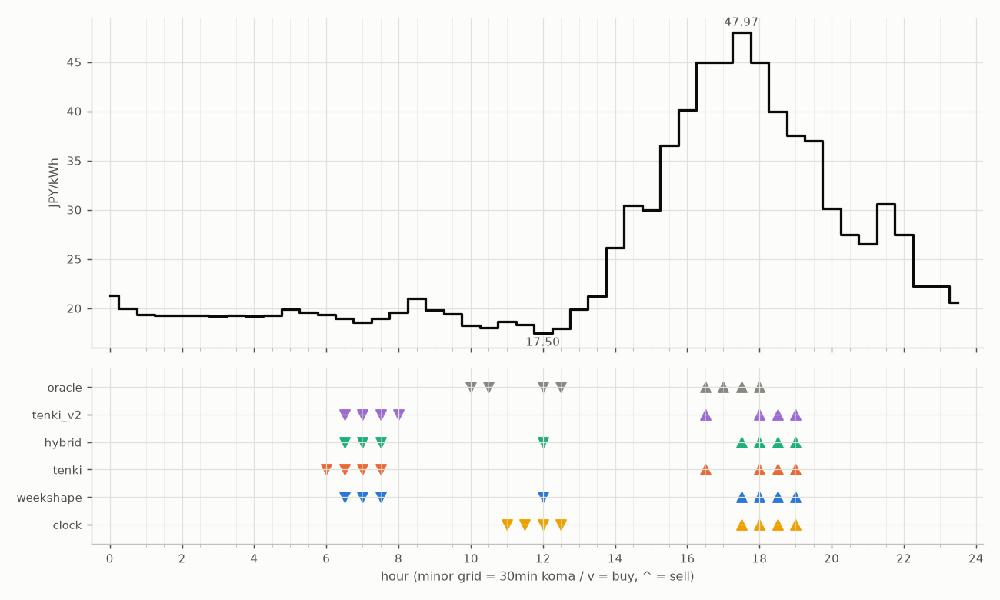
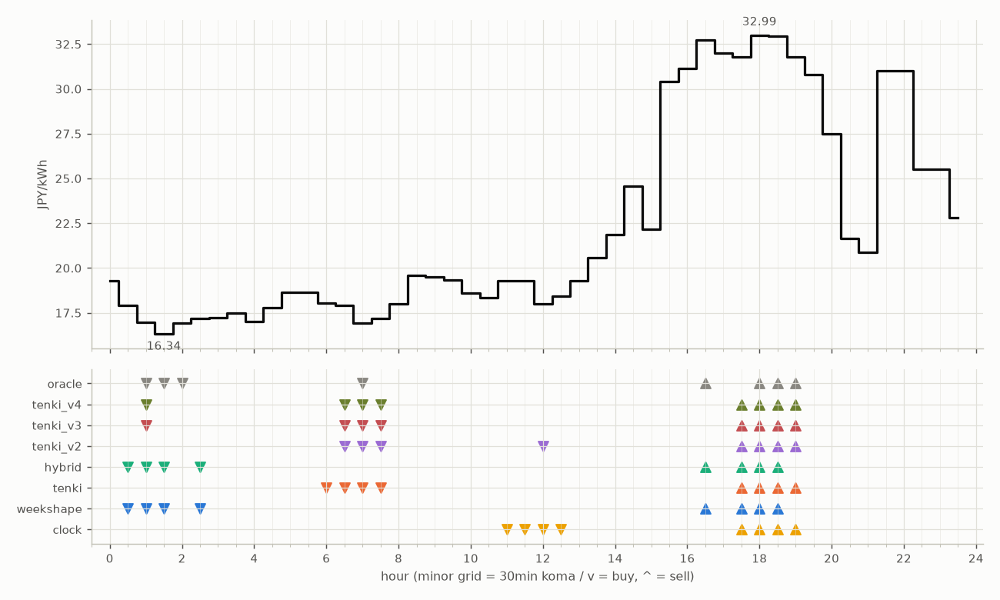
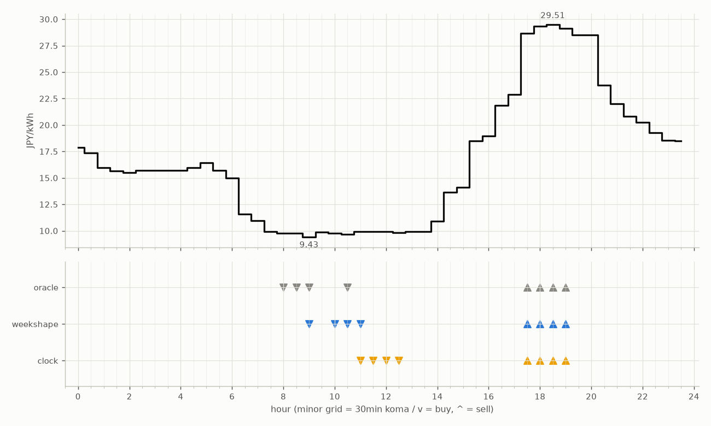
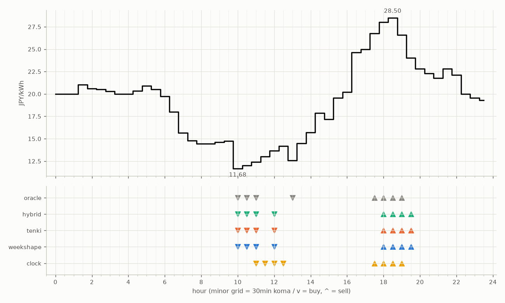
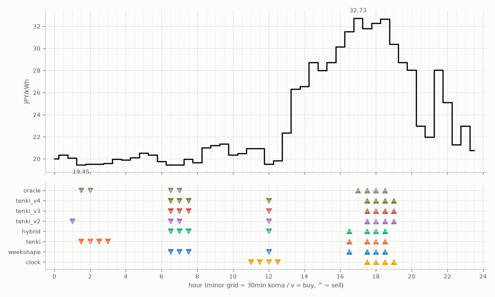
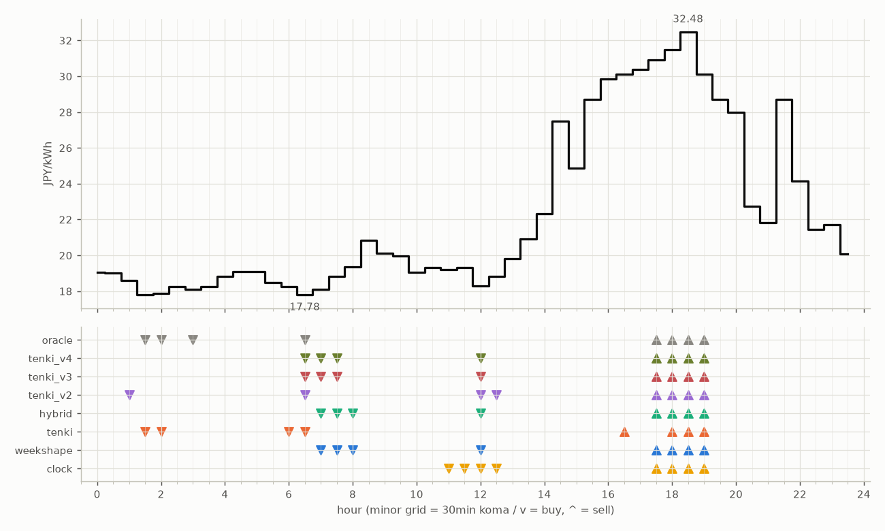
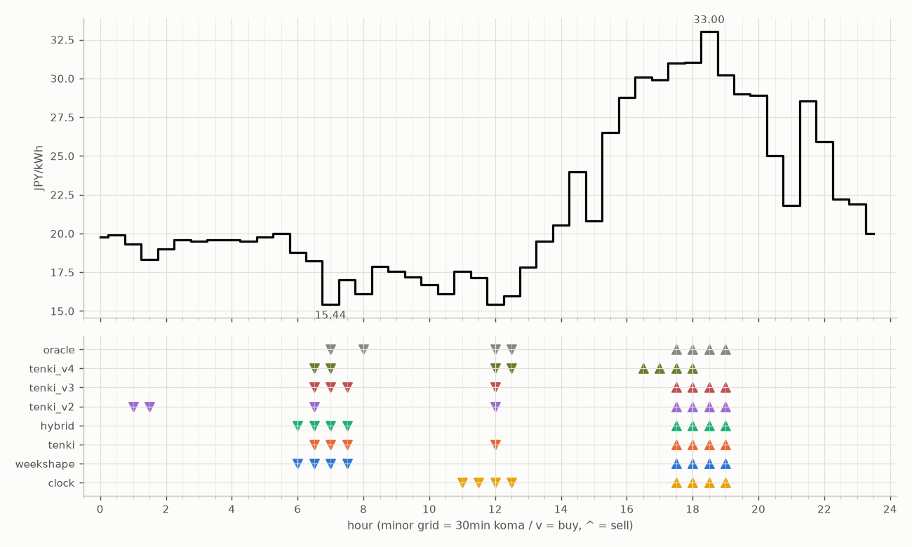
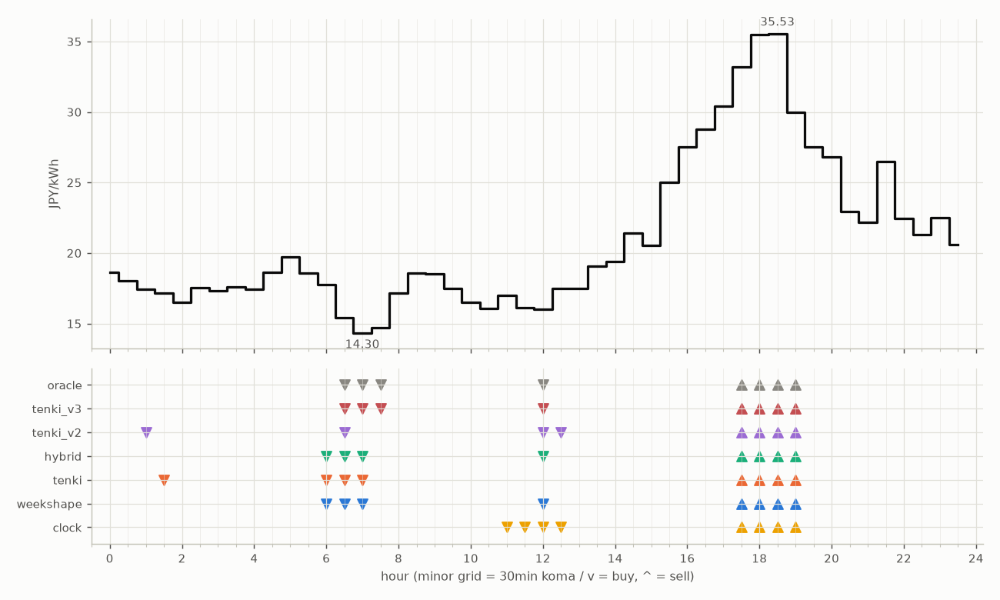
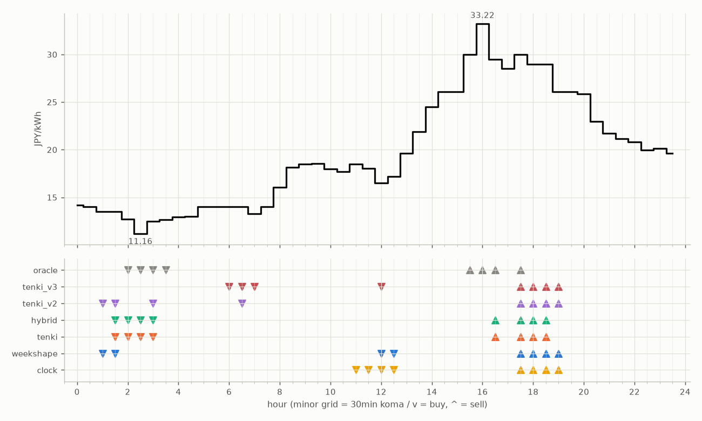

# 日次解剖 — 各機体の売買と因子の記録

勝敗の原因を考えるための記録。picks（提出時_meta）と価格データから毎回再生成される。

### 2026-08-25（信号: 平常）

- 因子: 日射予報 670 W/m2 / 実測 未確定（実測は約5日遅れ） / 乖離 +27 W/m2（普段より晴れる方向。直近28日平均 643、判定は絶対値 0 vs 閾値 194）
- 価格の形: 最安 12:00 17.50円 / 最高 17:30 47.97円 / 山谷比 2.7倍

| 機体 | 充電（買い） | 平均買値 | 放電（売り） | 平均売値 | 損益 |
|---|---|---|---|---|---|
| clock | 11:00, 11:30, 12:00, 12:30 | 18.11円 | 17:30, 18:00, 18:30, 19:00 | 42.62円 | +206円 |
| weekshape | 06:30, 07:00, 07:30, 12:00 | 18.51円 | 17:30, 18:00, 18:30, 19:00 | 42.62円 | +202円 |
| tenki | 06:00, 06:30, 07:00, 07:30 | 18.97円 | 16:30, 18:00, 18:30, 19:00 | 41.88円 | +190円 |
| tenki_v2 | 06:30, 07:00, 07:30, 08:00 | 19.03円 | 16:30, 18:00, 18:30, 19:00 | 41.88円 | +190円 |
| hybrid | 06:30, 07:00, 07:30, 12:00 | 18.51円 | 17:30, 18:00, 18:30, 19:00 | 42.62円 | +202円 |
| oracle | 10:00, 10:30, 12:00, 12:30 | 17.92円 | 16:30, 17:00, 17:30, 18:00 | 45.74円 | +234円 |

**48コマ価格（円/kWh。太字=最安/最高）**

| 00:00 | 00:30 | 01:00 | 01:30 | 02:00 | 02:30 | 03:00 | 03:30 | 04:00 | 04:30 | 05:00 | 05:30 | 06:00 | 06:30 | 07:00 | 07:30 | 08:00 | 08:30 | 09:00 | 09:30 | 10:00 | 10:30 | 11:00 | 11:30 |
|---|---|---|---|---|---|---|---|---|---|---|---|---|---|---|---|---|---|---|---|---|---|---|---|
| 21.28 | 19.95 | 19.33 | 19.29 | 19.29 | 19.29 | 19.18 | 19.29 | 19.18 | 19.31 | 19.88 | 19.59 | 19.33 | 19.00 | 18.54 | 19.00 | 19.59 | 20.97 | 19.86 | 19.44 | 18.25 | 18.00 | 18.63 | 18.37 |

| 12:00 | 12:30 | 13:00 | 13:30 | 14:00 | 14:30 | 15:00 | 15:30 | 16:00 | 16:30 | 17:00 | 17:30 | 18:00 | 18:30 | 19:00 | 19:30 | 20:00 | 20:30 | 21:00 | 21:30 | 22:00 | 22:30 | 23:00 | 23:30 |
|---|---|---|---|---|---|---|---|---|---|---|---|---|---|---|---|---|---|---|---|---|---|---|---|
| **17.50** | 17.92 | 19.90 | 21.25 | 26.13 | 30.41 | 30.00 | 36.53 | 40.10 | 45.00 | 45.00 | **47.97** | 45.00 | 40.00 | 37.52 | 37.02 | 30.11 | 27.50 | 26.50 | 30.62 | 27.50 | 22.26 | 22.25 | 20.61 |

### 2026-08-24（信号: 平常）

- 因子: 日射予報 649 W/m2 / 実測 未確定（実測は約5日遅れ） / 乖離 +7 W/m2（普段より晴れる方向。直近28日平均 643、判定は絶対値 1 vs 閾値 195）
- 価格の形: 最安 01:30 16.34円 / 最高 18:00 32.99円 / 山谷比 2.0倍

| 機体 | 充電（買い） | 平均買値 | 放電（売り） | 平均売値 | 損益 |
|---|---|---|---|---|---|
| clock | 11:00, 11:30, 12:00, 12:30 | 18.76円 | 17:30, 18:00, 18:30, 19:00 | 32.39円 | +105円 |
| weekshape | 00:30, 01:00, 01:30, 02:30 | 17.11円 | 16:30, 17:30, 18:00, 18:30 | 32.62円 | +123円 |
| tenki | 06:00, 06:30, 07:00, 07:30 | 17.52円 | 17:30, 18:00, 18:30, 19:00 | 32.39円 | +117円 |
| tenki_v2 | 06:30, 07:00, 07:30, 12:00 | 17.51円 | 17:30, 18:00, 18:30, 19:00 | 32.39円 | +117円 |
| tenki_v3 | 01:00, 06:30, 07:00, 07:30 | 17.25円 | 17:30, 18:00, 18:30, 19:00 | 32.39円 | +120円 |
| tenki_v4 | 01:00, 06:30, 07:00, 07:30 | 17.25円 | 17:30, 18:00, 18:30, 19:00 | 32.39円 | +120円 |
| hybrid | 00:30, 01:00, 01:30, 02:30 | 17.11円 | 16:30, 17:30, 18:00, 18:30 | 32.62円 | +123円 |
| oracle | 01:00, 01:30, 02:00, 07:00 | 16.80円 | 16:30, 18:00, 18:30, 19:00 | 32.62円 | +127円 |

**48コマ価格（円/kWh。太字=最安/最高）**

| 00:00 | 00:30 | 01:00 | 01:30 | 02:00 | 02:30 | 03:00 | 03:30 | 04:00 | 04:30 | 05:00 | 05:30 | 06:00 | 06:30 | 07:00 | 07:30 | 08:00 | 08:30 | 09:00 | 09:30 | 10:00 | 10:30 | 11:00 | 11:30 |
|---|---|---|---|---|---|---|---|---|---|---|---|---|---|---|---|---|---|---|---|---|---|---|---|
| 19.28 | 17.92 | 16.99 | **16.34** | 16.94 | 17.17 | 17.23 | 17.50 | 17.00 | 17.80 | 18.63 | 18.65 | 18.03 | 17.92 | 16.94 | 17.17 | 18.00 | 19.60 | 19.49 | 19.33 | 18.61 | 18.36 | 19.29 | 19.29 |

| 12:00 | 12:30 | 13:00 | 13:30 | 14:00 | 14:30 | 15:00 | 15:30 | 16:00 | 16:30 | 17:00 | 17:30 | 18:00 | 18:30 | 19:00 | 19:30 | 20:00 | 20:30 | 21:00 | 21:30 | 22:00 | 22:30 | 23:00 | 23:30 |
|---|---|---|---|---|---|---|---|---|---|---|---|---|---|---|---|---|---|---|---|---|---|---|---|
| 18.00 | 18.44 | 19.30 | 20.58 | 21.87 | 24.56 | 22.15 | 30.40 | 31.13 | 32.72 | 32.01 | 31.79 | **32.99** | 32.96 | 31.80 | 30.81 | 27.50 | 21.65 | 20.87 | 30.99 | 30.99 | 25.50 | 25.50 | 22.81 |

### 2026-08-23（信号: ?）

- 因子: picksの_meta欠落
- 価格の形: 最安 09:00 9.43円 / 最高 18:30 29.51円 / 山谷比 3.1倍

| 機体 | 充電（買い） | 平均買値 | 放電（売り） | 平均売値 | 損益 |
|---|---|---|---|---|---|
| clock | 11:00, 11:30, 12:00, 12:30 | 9.91円 | 17:30, 18:00, 18:30, 19:00 | 29.17円 | +164円 |
| weekshape | 09:00, 10:00, 10:30, 11:00 | 9.71円 | 17:30, 18:00, 18:30, 19:00 | 29.17円 | +166円 |
| oracle | 08:00, 08:30, 09:00, 10:30 | 9.66円 | 17:30, 18:00, 18:30, 19:00 | 29.17円 | +167円 |

**48コマ価格（円/kWh。太字=最安/最高）**

| 00:00 | 00:30 | 01:00 | 01:30 | 02:00 | 02:30 | 03:00 | 03:30 | 04:00 | 04:30 | 05:00 | 05:30 | 06:00 | 06:30 | 07:00 | 07:30 | 08:00 | 08:30 | 09:00 | 09:30 | 10:00 | 10:30 | 11:00 | 11:30 |
|---|---|---|---|---|---|---|---|---|---|---|---|---|---|---|---|---|---|---|---|---|---|---|---|
| 17.88 | 17.37 | 15.97 | 15.65 | 15.49 | 15.69 | 15.69 | 15.69 | 15.69 | 15.96 | 16.45 | 15.69 | 15.00 | 11.59 | 10.96 | 9.94 | 9.77 | 9.77 | **9.43** | 9.87 | 9.77 | 9.69 | 9.94 | 9.94 |

| 12:00 | 12:30 | 13:00 | 13:30 | 14:00 | 14:30 | 15:00 | 15:30 | 16:00 | 16:30 | 17:00 | 17:30 | 18:00 | 18:30 | 19:00 | 19:30 | 20:00 | 20:30 | 21:00 | 21:30 | 22:00 | 22:30 | 23:00 | 23:30 |
|---|---|---|---|---|---|---|---|---|---|---|---|---|---|---|---|---|---|---|---|---|---|---|---|
| 9.94 | 9.81 | 9.94 | 9.94 | 10.91 | 13.65 | 14.12 | 18.48 | 18.94 | 21.84 | 22.88 | 28.68 | 29.34 | **29.51** | 29.14 | 28.49 | 28.51 | 23.76 | 22.00 | 20.83 | 20.27 | 19.29 | 18.52 | 18.49 |

### 2026-08-22（信号: 平常）

- 因子: 日射予報 578 W/m2 / 実測 未確定（実測は約5日遅れ） / 乖離 -65 W/m2（普段より曇る方向。直近28日平均 643、判定は絶対値 81 vs 閾値 195）
- 価格の形: 最安 10:00 11.68円 / 最高 18:30 28.50円 / 山谷比 2.4倍

| 機体 | 充電（買い） | 平均買値 | 放電（売り） | 平均売値 | 損益 |
|---|---|---|---|---|---|
| clock | 11:00, 11:30, 12:00, 12:30 | 13.31円 | 17:30, 18:00, 18:30, 19:00 | 27.46円 | +115円 |
| weekshape | 10:00, 10:30, 11:00, 12:00 | 12.43円 | 18:00, 18:30, 19:00, 19:30 | 26.78円 | +119円 |
| tenki | 10:00, 10:30, 11:00, 12:00 | 12.43円 | 18:00, 18:30, 19:00, 19:30 | 26.78円 | +119円 |
| hybrid | 10:00, 10:30, 11:00, 12:00 | 12.43円 | 18:00, 18:30, 19:00, 19:30 | 26.78円 | +119円 |
| oracle | 10:00, 10:30, 11:00, 13:00 | 12.16円 | 17:30, 18:00, 18:30, 19:00 | 27.46円 | +127円 |

**48コマ価格（円/kWh。太字=最安/最高）**

| 00:00 | 00:30 | 01:00 | 01:30 | 02:00 | 02:30 | 03:00 | 03:30 | 04:00 | 04:30 | 05:00 | 05:30 | 06:00 | 06:30 | 07:00 | 07:30 | 08:00 | 08:30 | 09:00 | 09:30 | 10:00 | 10:30 | 11:00 | 11:30 |
|---|---|---|---|---|---|---|---|---|---|---|---|---|---|---|---|---|---|---|---|---|---|---|---|
| 20.00 | 20.01 | 20.00 | 21.04 | 20.59 | 20.51 | 20.31 | 20.01 | 20.01 | 20.33 | 20.91 | 20.50 | 19.72 | 18.01 | 15.65 | 14.80 | 14.44 | 14.45 | 14.60 | 14.74 | **11.68** | 12.00 | 12.39 | 13.00 |

| 12:00 | 12:30 | 13:00 | 13:30 | 14:00 | 14:30 | 15:00 | 15:30 | 16:00 | 16:30 | 17:00 | 17:30 | 18:00 | 18:30 | 19:00 | 19:30 | 20:00 | 20:30 | 21:00 | 21:30 | 22:00 | 22:30 | 23:00 | 23:30 |
|---|---|---|---|---|---|---|---|---|---|---|---|---|---|---|---|---|---|---|---|---|---|---|---|
| 13.65 | 14.19 | 12.59 | 14.49 | 15.69 | 17.88 | 17.17 | 19.56 | 20.19 | 24.65 | 25.00 | 26.75 | 28.01 | **28.50** | 26.58 | 24.01 | 22.80 | 22.29 | 21.79 | 22.80 | 22.12 | 20.00 | 19.57 | 19.31 |

### 2026-08-21（信号: 平常）

- 因子: 日射予報 480 W/m2 / 実測 未確定（実測は約5日遅れ） / 乖離 -163 W/m2（普段より曇る方向。直近28日平均 643、判定は絶対値 179 vs 閾値 195）
- 価格の形: 最安 01:30 19.45円 / 最高 17:00 32.73円 / 山谷比 1.7倍

| 機体 | 充電（買い） | 平均買値 | 放電（売り） | 平均売値 | 損益 |
|---|---|---|---|---|---|
| clock | 11:00, 11:30, 12:00, 12:30 | 20.31円 | 17:30, 18:00, 18:30, 19:00 | 31.77円 | +84円 |
| weekshape | 06:30, 07:00, 07:30, 12:00 | 19.60円 | 16:30, 17:30, 18:00, 18:30 | 32.06円 | +93円 |
| tenki | 01:30, 02:00, 02:30, 03:00 | 19.52円 | 16:30, 17:30, 18:00, 18:30 | 32.06円 | +94円 |
| tenki_v2 | 01:00, 06:30, 07:00, 12:00 | 19.62円 | 17:30, 18:00, 18:30, 19:00 | 31.77円 | +91円 |
| tenki_v3 | 06:30, 07:00, 07:30, 12:00 | 19.60円 | 17:30, 18:00, 18:30, 19:00 | 31.77円 | +91円 |
| tenki_v4 | 06:30, 07:00, 07:30, 12:00 | 19.60円 | 17:30, 18:00, 18:30, 19:00 | 31.77円 | +91円 |
| hybrid | 06:30, 07:00, 07:30, 12:00 | 19.60円 | 16:30, 17:30, 18:00, 18:30 | 32.06円 | +93円 |
| oracle | 01:30, 02:00, 06:30, 07:00 | 19.47円 | 17:00, 17:30, 18:00, 18:30 | 32.36円 | +97円 |

**48コマ価格（円/kWh。太字=最安/最高）**

| 00:00 | 00:30 | 01:00 | 01:30 | 02:00 | 02:30 | 03:00 | 03:30 | 04:00 | 04:30 | 05:00 | 05:30 | 06:00 | 06:30 | 07:00 | 07:30 | 08:00 | 08:30 | 09:00 | 09:30 | 10:00 | 10:30 | 11:00 | 11:30 |
|---|---|---|---|---|---|---|---|---|---|---|---|---|---|---|---|---|---|---|---|---|---|---|---|
| 20.00 | 20.35 | 20.08 | **19.45** | 19.52 | 19.52 | 19.58 | 19.97 | 19.90 | 20.10 | 20.53 | 20.34 | 19.78 | 19.45 | 19.45 | 19.97 | 19.67 | 21.00 | 21.22 | 21.36 | 20.36 | 20.48 | 20.94 | 20.94 |

| 12:00 | 12:30 | 13:00 | 13:30 | 14:00 | 14:30 | 15:00 | 15:30 | 16:00 | 16:30 | 17:00 | 17:30 | 18:00 | 18:30 | 19:00 | 19:30 | 20:00 | 20:30 | 21:00 | 21:30 | 22:00 | 22:30 | 23:00 | 23:30 |
|---|---|---|---|---|---|---|---|---|---|---|---|---|---|---|---|---|---|---|---|---|---|---|---|
| 19.52 | 19.84 | 22.36 | 26.30 | 26.57 | 28.71 | 28.00 | 28.71 | 30.15 | 31.51 | **32.73** | 31.79 | 32.28 | 32.65 | 30.37 | 28.71 | 28.02 | 22.96 | 21.98 | 28.02 | 25.11 | 21.29 | 22.96 | 20.78 |

### 2026-08-20（信号: 平常）

- 因子: 日射予報 567 W/m2 / 実測 未確定（実測は約5日遅れ） / 乖離 -75 W/m2（普段より曇る方向。直近28日平均 643、判定は絶対値 91 vs 閾値 194）
- 価格の形: 最安 06:30 17.78円 / 最高 18:30 32.48円 / 山谷比 1.8倍

| 機体 | 充電（買い） | 平均買値 | 放電（売り） | 平均売値 | 損益 |
|---|---|---|---|---|---|
| clock | 11:00, 11:30, 12:00, 12:30 | 18.91円 | 17:30, 18:00, 18:30, 19:00 | 31.25円 | +93円 |
| weekshape | 07:00, 07:30, 08:00, 12:00 | 18.64円 | 17:30, 18:00, 18:30, 19:00 | 31.25円 | +96円 |
| tenki | 01:30, 02:00, 06:00, 06:30 | 17.93円 | 16:30, 18:00, 18:30, 19:00 | 31.04円 | +101円 |
| tenki_v2 | 01:00, 06:30, 12:00, 12:30 | 18.37円 | 17:30, 18:00, 18:30, 19:00 | 31.25円 | +99円 |
| tenki_v3 | 06:30, 07:00, 07:30, 12:00 | 18.25円 | 17:30, 18:00, 18:30, 19:00 | 31.25円 | +100円 |
| tenki_v4 | 06:30, 07:00, 07:30, 12:00 | 18.25円 | 17:30, 18:00, 18:30, 19:00 | 31.25円 | +100円 |
| hybrid | 07:00, 07:30, 08:00, 12:00 | 18.64円 | 17:30, 18:00, 18:30, 19:00 | 31.25円 | +96円 |
| oracle | 01:30, 02:00, 03:00, 06:30 | 17.89円 | 17:30, 18:00, 18:30, 19:00 | 31.25円 | +104円 |

**48コマ価格（円/kWh。太字=最安/最高）**

| 00:00 | 00:30 | 01:00 | 01:30 | 02:00 | 02:30 | 03:00 | 03:30 | 04:00 | 04:30 | 05:00 | 05:30 | 06:00 | 06:30 | 07:00 | 07:30 | 08:00 | 08:30 | 09:00 | 09:30 | 10:00 | 10:30 | 11:00 | 11:30 |
|---|---|---|---|---|---|---|---|---|---|---|---|---|---|---|---|---|---|---|---|---|---|---|---|
| 19.06 | 19.00 | 18.58 | 17.81 | 17.88 | 18.25 | 18.10 | 18.25 | 18.81 | 19.07 | 19.09 | 18.47 | 18.27 | **17.78** | 18.10 | 18.81 | 19.34 | 20.84 | 20.10 | 19.95 | 19.06 | 19.32 | 19.21 | 19.32 |

| 12:00 | 12:30 | 13:00 | 13:30 | 14:00 | 14:30 | 15:00 | 15:30 | 16:00 | 16:30 | 17:00 | 17:30 | 18:00 | 18:30 | 19:00 | 19:30 | 20:00 | 20:30 | 21:00 | 21:30 | 22:00 | 22:30 | 23:00 | 23:30 |
|---|---|---|---|---|---|---|---|---|---|---|---|---|---|---|---|---|---|---|---|---|---|---|---|
| 18.30 | 18.81 | 19.80 | 20.93 | 22.32 | 27.50 | 24.88 | 28.71 | 29.86 | 30.10 | 30.40 | 30.92 | 31.48 | **32.48** | 30.11 | 28.71 | 28.00 | 22.75 | 21.84 | 28.71 | 24.14 | 21.44 | 21.73 | 20.07 |

### 2026-08-19（信号: 平常）

- 因子: 日射予報 615 W/m2 / 実測 707 / 乖離 -30 W/m2（普段より曇る方向。直近28日平均 644、判定は絶対値 47 vs 閾値 194）
- 価格の形: 最安 07:00 15.44円 / 最高 18:30 33.00円 / 山谷比 2.1倍

| 機体 | 充電（買い） | 平均買値 | 放電（売り） | 平均売値 | 損益 |
|---|---|---|---|---|---|
| clock | 11:00, 11:30, 12:00, 12:30 | 16.52円 | 17:30, 18:00, 18:30, 19:00 | 31.30円 | +118円 |
| weekshape | 06:00, 06:30, 07:00, 07:30 | 17.36円 | 17:30, 18:00, 18:30, 19:00 | 31.30円 | +109円 |
| tenki | 06:30, 07:00, 07:30, 12:00 | 16.52円 | 17:30, 18:00, 18:30, 19:00 | 31.30円 | +118円 |
| tenki_v2 | 01:00, 01:30, 06:30, 12:00 | 17.83円 | 17:30, 18:00, 18:30, 19:00 | 31.30円 | +105円 |
| tenki_v3 | 06:30, 07:00, 07:30, 12:00 | 16.52円 | 17:30, 18:00, 18:30, 19:00 | 31.30円 | +118円 |
| hybrid | 06:00, 06:30, 07:00, 07:30 | 17.36円 | 17:30, 18:00, 18:30, 19:00 | 31.30円 | +109円 |
| tenki_v4 | 06:30, 07:00, 12:00, 12:30 | 16.27円 | 16:30, 17:00, 17:30, 18:00 | 30.50円 | +112円 |
| oracle | 07:00, 08:00, 12:00, 12:30 | 15.73円 | 17:30, 18:00, 18:30, 19:00 | 31.30円 | +126円 |

**48コマ価格（円/kWh。太字=最安/最高）**

| 00:00 | 00:30 | 01:00 | 01:30 | 02:00 | 02:30 | 03:00 | 03:30 | 04:00 | 04:30 | 05:00 | 05:30 | 06:00 | 06:30 | 07:00 | 07:30 | 08:00 | 08:30 | 09:00 | 09:30 | 10:00 | 10:30 | 11:00 | 11:30 |
|---|---|---|---|---|---|---|---|---|---|---|---|---|---|---|---|---|---|---|---|---|---|---|---|
| 19.77 | 19.89 | 19.30 | 18.34 | 19.00 | 19.60 | 19.50 | 19.60 | 19.60 | 19.50 | 19.78 | 20.00 | 18.77 | 18.22 | **15.44** | 16.99 | 16.09 | 17.87 | 17.57 | 17.21 | 16.70 | 16.09 | 17.54 | 17.15 |

| 12:00 | 12:30 | 13:00 | 13:30 | 14:00 | 14:30 | 15:00 | 15:30 | 16:00 | 16:30 | 17:00 | 17:30 | 18:00 | 18:30 | 19:00 | 19:30 | 20:00 | 20:30 | 21:00 | 21:30 | 22:00 | 22:30 | 23:00 | 23:30 |
|---|---|---|---|---|---|---|---|---|---|---|---|---|---|---|---|---|---|---|---|---|---|---|---|
| 15.45 | 15.96 | 17.84 | 19.50 | 20.52 | 23.98 | 20.82 | 26.50 | 28.76 | 30.07 | 29.92 | 30.99 | 31.01 | **33.00** | 30.22 | 29.00 | 28.90 | 25.01 | 21.79 | 28.55 | 25.92 | 22.22 | 21.91 | 20.00 |

### 2026-08-18（信号: 平常）

- 因子: 日射予報 560 W/m2 / 実測 653 / 乖離 -88 W/m2（普段より曇る方向。直近28日平均 648、判定は絶対値 110 vs 閾値 194）
- 価格の形: 最安 07:00 14.30円 / 最高 18:30 35.53円 / 山谷比 2.5倍

| 機体 | 充電（買い） | 平均買値 | 放電（売り） | 平均売値 | 損益 |
|---|---|---|---|---|---|
| clock | 11:00, 11:30, 12:00, 12:30 | 16.66円 | 17:30, 18:00, 18:30, 19:00 | 33.56円 | +138円 |
| weekshape | 06:00, 06:30, 07:00, 12:00 | 15.88円 | 17:30, 18:00, 18:30, 19:00 | 33.56円 | +146円 |
| tenki | 01:30, 06:00, 06:30, 07:00 | 16.16円 | 17:30, 18:00, 18:30, 19:00 | 33.56円 | +143円 |
| tenki_v2 | 01:00, 06:30, 12:00, 12:30 | 16.61円 | 17:30, 18:00, 18:30, 19:00 | 33.56円 | +138円 |
| tenki_v3 | 06:30, 07:00, 07:30, 12:00 | 15.12円 | 17:30, 18:00, 18:30, 19:00 | 33.56円 | +153円 |
| hybrid | 06:00, 06:30, 07:00, 12:00 | 15.88円 | 17:30, 18:00, 18:30, 19:00 | 33.56円 | +146円 |
| oracle | 06:30, 07:00, 07:30, 12:00 | 15.12円 | 17:30, 18:00, 18:30, 19:00 | 33.56円 | +153円 |

**48コマ価格（円/kWh。太字=最安/最高）**

| 00:00 | 00:30 | 01:00 | 01:30 | 02:00 | 02:30 | 03:00 | 03:30 | 04:00 | 04:30 | 05:00 | 05:30 | 06:00 | 06:30 | 07:00 | 07:30 | 08:00 | 08:30 | 09:00 | 09:30 | 10:00 | 10:30 | 11:00 | 11:30 |
|---|---|---|---|---|---|---|---|---|---|---|---|---|---|---|---|---|---|---|---|---|---|---|---|
| 18.64 | 18.03 | 17.46 | 17.17 | 16.50 | 17.54 | 17.31 | 17.60 | 17.45 | 18.64 | 19.71 | 18.58 | 17.75 | 15.42 | **14.30** | 14.72 | 17.17 | 18.56 | 18.51 | 17.50 | 16.50 | 16.09 | 17.00 | 16.10 |

| 12:00 | 12:30 | 13:00 | 13:30 | 14:00 | 14:30 | 15:00 | 15:30 | 16:00 | 16:30 | 17:00 | 17:30 | 18:00 | 18:30 | 19:00 | 19:30 | 20:00 | 20:30 | 21:00 | 21:30 | 22:00 | 22:30 | 23:00 | 23:30 |
|---|---|---|---|---|---|---|---|---|---|---|---|---|---|---|---|---|---|---|---|---|---|---|---|
| 16.04 | 17.50 | 17.49 | 19.06 | 19.40 | 21.39 | 20.52 | 25.00 | 27.50 | 28.76 | 30.40 | 33.22 | 35.48 | **35.53** | 30.00 | 27.50 | 26.80 | 22.96 | 22.20 | 26.50 | 22.44 | 21.30 | 22.49 | 20.61 |

### 2026-08-17（信号: 強）

- 因子: 日射予報 390 W/m2 / 実測 631 / 乖離 -262 W/m2（普段より曇る方向。直近28日平均 653、判定は絶対値 284 vs 閾値 194）
- 価格の形: 最安 02:30 11.16円 / 最高 16:00 33.22円 / 山谷比 3.0倍

| 機体 | 充電（買い） | 平均買値 | 放電（売り） | 平均売値 | 損益 |
|---|---|---|---|---|---|
| clock | 11:00, 11:30, 12:00, 12:30 | 17.55円 | 17:30, 18:00, 18:30, 19:00 | 28.52円 | +83円 |
| weekshape | 01:00, 01:30, 12:00, 12:30 | 15.17円 | 17:30, 18:00, 18:30, 19:00 | 28.52円 | +107円 |
| tenki | 01:30, 02:00, 02:30, 03:00 | 12.47円 | 16:30, 17:30, 18:00, 18:30 | 29.38円 | +141円 |
| tenki_v2 | 01:00, 01:30, 03:00, 06:30 | 13.37円 | 17:30, 18:00, 18:30, 19:00 | 28.52円 | +125円 |
| tenki_v3 | 06:00, 06:30, 07:00, 12:00 | 14.45円 | 17:30, 18:00, 18:30, 19:00 | 28.52円 | +114円 |
| hybrid | 01:30, 02:00, 02:30, 03:00 | 12.47円 | 16:30, 17:30, 18:00, 18:30 | 29.38円 | +141円 |
| oracle | 02:00, 02:30, 03:00, 03:30 | 12.25円 | 15:30, 16:00, 16:30, 17:30 | 30.68円 | +155円 |

**48コマ価格（円/kWh。太字=最安/最高）**

| 00:00 | 00:30 | 01:00 | 01:30 | 02:00 | 02:30 | 03:00 | 03:30 | 04:00 | 04:30 | 05:00 | 05:30 | 06:00 | 06:30 | 07:00 | 07:30 | 08:00 | 08:30 | 09:00 | 09:30 | 10:00 | 10:30 | 11:00 | 11:30 |
|---|---|---|---|---|---|---|---|---|---|---|---|---|---|---|---|---|---|---|---|---|---|---|---|
| 14.20 | 13.99 | 13.50 | 13.50 | 12.72 | **11.16** | 12.50 | 12.64 | 12.93 | 12.99 | 13.99 | 13.99 | 13.99 | 13.99 | 13.30 | 14.00 | 16.05 | 18.16 | 18.50 | 18.54 | 18.00 | 17.71 | 18.47 | 18.05 |

| 12:00 | 12:30 | 13:00 | 13:30 | 14:00 | 14:30 | 15:00 | 15:30 | 16:00 | 16:30 | 17:00 | 17:30 | 18:00 | 18:30 | 19:00 | 19:30 | 20:00 | 20:30 | 21:00 | 21:30 | 22:00 | 22:30 | 23:00 | 23:30 |
|---|---|---|---|---|---|---|---|---|---|---|---|---|---|---|---|---|---|---|---|---|---|---|---|
| 16.50 | 17.17 | 19.61 | 21.90 | 24.50 | 26.10 | 26.10 | 30.00 | **33.22** | 29.50 | 28.50 | 30.00 | 29.00 | 29.00 | 26.10 | 26.10 | 25.83 | 22.96 | 21.71 | 21.15 | 20.84 | 19.98 | 20.14 | 19.65 |

### 2026-08-16（信号: 強）

- 因子: 日射予報 324 W/m2 / 実測 519 / 乖離 -335 W/m2（普段より曇る方向。直近28日平均 659、判定は絶対値 347 vs 閾値 194）
- 価格の形: 最安 10:30 8.00円 / 最高 18:30 20.38円 / 山谷比 2.5倍

| 機体 | 充電（買い） | 平均買値 | 放電（売り） | 平均売値 | 損益 |
|---|---|---|---|---|---|
| clock | 11:00, 11:30, 12:00, 12:30 | 8.14円 | 17:30, 18:00, 18:30, 19:00 | 19.93円 | +98円 |
| weekshape | 09:00, 10:00, 10:30, 11:00 | 8.16円 | 17:30, 18:00, 18:30, 19:00 | 19.93円 | +98円 |
| tenki | 01:30, 05:30, 06:00, 06:30 | 11.64円 | 18:00, 18:30, 19:00, 19:30 | 20.00円 | +64円 |
| hybrid | 01:30, 05:30, 06:00, 06:30 | 11.64円 | 18:00, 18:30, 19:00, 19:30 | 20.00円 | +64円 |
| oracle | 07:30, 10:30, 11:00, 12:00 | 8.03円 | 18:00, 18:30, 19:00, 19:30 | 20.00円 | +100円 |

**48コマ価格（円/kWh。太字=最安/最高）**

| 00:00 | 00:30 | 01:00 | 01:30 | 02:00 | 02:30 | 03:00 | 03:30 | 04:00 | 04:30 | 05:00 | 05:30 | 06:00 | 06:30 | 07:00 | 07:30 | 08:00 | 08:30 | 09:00 | 09:30 | 10:00 | 10:30 | 11:00 | 11:30 |
|---|---|---|---|---|---|---|---|---|---|---|---|---|---|---|---|---|---|---|---|---|---|---|---|
| 14.01 | 12.93 | 11.31 | 13.50 | 12.99 | 12.64 | 12.64 | 12.93 | 12.99 | 13.00 | 13.20 | 11.40 | 11.36 | 10.30 | 8.77 | 8.12 | 9.50 | 9.56 | 8.33 | 9.15 | 8.33 | **8.00** | 8.00 | 8.34 |

| 12:00 | 12:30 | 13:00 | 13:30 | 14:00 | 14:30 | 15:00 | 15:30 | 16:00 | 16:30 | 17:00 | 17:30 | 18:00 | 18:30 | 19:00 | 19:30 | 20:00 | 20:30 | 21:00 | 21:30 | 22:00 | 22:30 | 23:00 | 23:30 |
|---|---|---|---|---|---|---|---|---|---|---|---|---|---|---|---|---|---|---|---|---|---|---|---|
| 8.00 | 8.22 | 8.51 | 9.70 | 9.40 | 9.82 | 9.71 | 12.94 | 14.03 | 16.60 | 18.77 | 19.19 | 19.88 | **20.38** | 20.25 | 19.50 | 18.79 | 18.14 | 17.48 | 16.27 | 16.09 | 15.00 | 14.01 | 10.31 |

### 2026-08-15（信号: 強）

- 因子: 日射予報 455 W/m2 / 実測 622 / 乖離 -204 W/m2（普段より曇る方向。直近28日平均 659、判定は絶対値 215 vs 閾値 194）
- 価格の形: 最安 12:00 8.00円 / 最高 17:00 18.44円 / 山谷比 2.3倍

| 機体 | 充電（買い） | 平均買値 | 放電（売り） | 平均売値 | 損益 |
|---|---|---|---|---|---|
| clock | 11:00, 11:30, 12:00, 12:30 | 8.10円 | 17:30, 18:00, 18:30, 19:00 | 16.96円 | +72円 |
| weekshape | 10:00, 10:30, 11:00, 12:00 | 8.67円 | 18:00, 18:30, 19:00, 19:30 | 17.03円 | +67円 |
| tenki | 06:30, 10:00, 10:30, 11:00 | 9.26円 | 18:00, 18:30, 19:00, 19:30 | 17.03円 | +61円 |
| hybrid | 06:30, 10:00, 10:30, 11:00 | 9.26円 | 18:00, 18:30, 19:00, 19:30 | 17.03円 | +61円 |
| oracle | 11:00, 11:30, 12:00, 13:00 | 8.06円 | 17:00, 18:00, 19:00, 19:30 | 17.42円 | +77円 |

**48コマ価格（円/kWh。太字=最安/最高）**

| 00:00 | 00:30 | 01:00 | 01:30 | 02:00 | 02:30 | 03:00 | 03:30 | 04:00 | 04:30 | 05:00 | 05:30 | 06:00 | 06:30 | 07:00 | 07:30 | 08:00 | 08:30 | 09:00 | 09:30 | 10:00 | 10:30 | 11:00 | 11:30 |
|---|---|---|---|---|---|---|---|---|---|---|---|---|---|---|---|---|---|---|---|---|---|---|---|
| 13.58 | 12.60 | 10.29 | 13.58 | 13.03 | 13.03 | 13.58 | 15.00 | 15.13 | 15.44 | 16.00 | 15.41 | 12.60 | 10.34 | 9.76 | 9.76 | 9.53 | 9.50 | 9.00 | 9.00 | 9.24 | 9.29 | 8.16 | 8.07 |

| 12:00 | 12:30 | 13:00 | 13:30 | 14:00 | 14:30 | 15:00 | 15:30 | 16:00 | 16:30 | 17:00 | 17:30 | 18:00 | 18:30 | 19:00 | 19:30 | 20:00 | 20:30 | 21:00 | 21:30 | 22:00 | 22:30 | 23:00 | 23:30 |
|---|---|---|---|---|---|---|---|---|---|---|---|---|---|---|---|---|---|---|---|---|---|---|---|
| **8.00** | 8.16 | 8.00 | 9.29 | 8.65 | 9.76 | 9.71 | 11.50 | 13.53 | 17.00 | **18.44** | 16.74 | 17.22 | 16.88 | 17.01 | 17.01 | 16.09 | 15.44 | 14.72 | 14.28 | 14.19 | 13.92 | 14.54 | 13.03 |

### 2026-08-14（信号: 強）

- 因子: 日射予報 345 W/m2 / 実測 626 / 乖離 -314 W/m2（普段より曇る方向。直近28日平均 658、判定は絶対値 325 vs 閾値 194）
- 価格の形: 最安 10:00 8.00円 / 最高 18:30 18.47円 / 山谷比 2.3倍

| 機体 | 充電（買い） | 平均買値 | 放電（売り） | 平均売値 | 損益 |
|---|---|---|---|---|---|
| clock | 11:00, 11:30, 12:00, 12:30 | 9.23円 | 17:30, 18:00, 18:30, 19:00 | 18.05円 | +71円 |
| weekshape | 06:00, 06:30, 07:00, 07:30 | 10.36円 | 16:30, 17:30, 18:00, 18:30 | 17.12円 | +50円 |
| tenki | 01:00, 01:30, 02:00, 02:30 | 12.15円 | 16:30, 17:30, 18:00, 18:30 | 17.12円 | +32円 |
| hybrid | 01:00, 01:30, 02:00, 02:30 | 12.15円 | 16:30, 17:30, 18:00, 18:30 | 17.12円 | +32円 |
| oracle | 09:30, 10:00, 10:30, 11:00 | 8.37円 | 17:30, 18:00, 18:30, 19:00 | 18.05円 | +79円 |

**48コマ価格（円/kWh。太字=最安/最高）**

| 00:00 | 00:30 | 01:00 | 01:30 | 02:00 | 02:30 | 03:00 | 03:30 | 04:00 | 04:30 | 05:00 | 05:30 | 06:00 | 06:30 | 07:00 | 07:30 | 08:00 | 08:30 | 09:00 | 09:30 | 10:00 | 10:30 | 11:00 | 11:30 |
|---|---|---|---|---|---|---|---|---|---|---|---|---|---|---|---|---|---|---|---|---|---|---|---|
| 13.19 | 10.81 | 9.13 | 13.19 | 13.10 | 13.19 | 13.19 | 14.19 | 14.92 | 15.50 | 16.96 | 15.86 | 11.10 | 10.44 | 10.13 | 9.76 | 9.58 | 9.53 | 9.13 | 8.47 | **8.00** | 8.01 | 9.00 | 9.24 |

| 12:00 | 12:30 | 13:00 | 13:30 | 14:00 | 14:30 | 15:00 | 15:30 | 16:00 | 16:30 | 17:00 | 17:30 | 18:00 | 18:30 | 19:00 | 19:30 | 20:00 | 20:30 | 21:00 | 21:30 | 22:00 | 22:30 | 23:00 | 23:30 |
|---|---|---|---|---|---|---|---|---|---|---|---|---|---|---|---|---|---|---|---|---|---|---|---|
| 9.24 | 9.45 | 9.53 | 9.76 | 9.76 | 10.52 | 9.76 | 10.53 | 11.21 | 13.99 | 17.12 | 18.00 | 18.00 | **18.47** | 17.75 | 17.75 | 15.15 | 14.72 | 13.75 | 15.15 | 14.92 | 13.42 | 13.01 | 10.94 |
