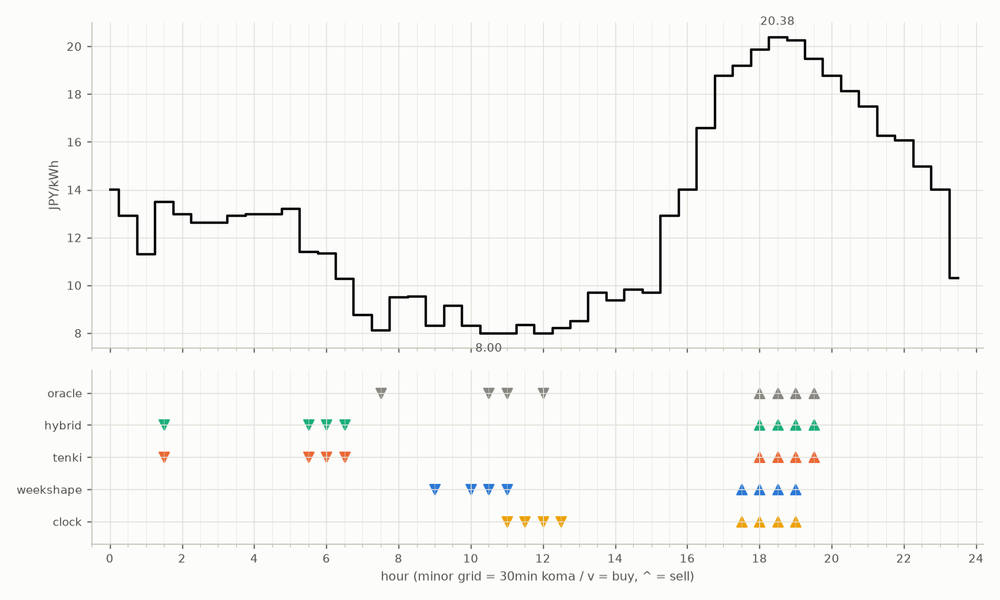
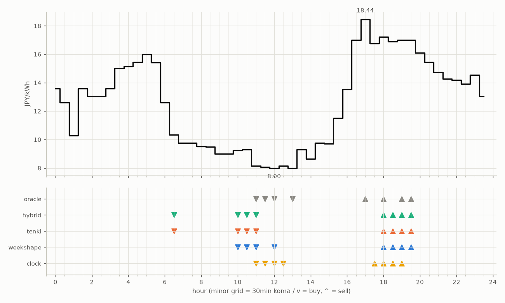
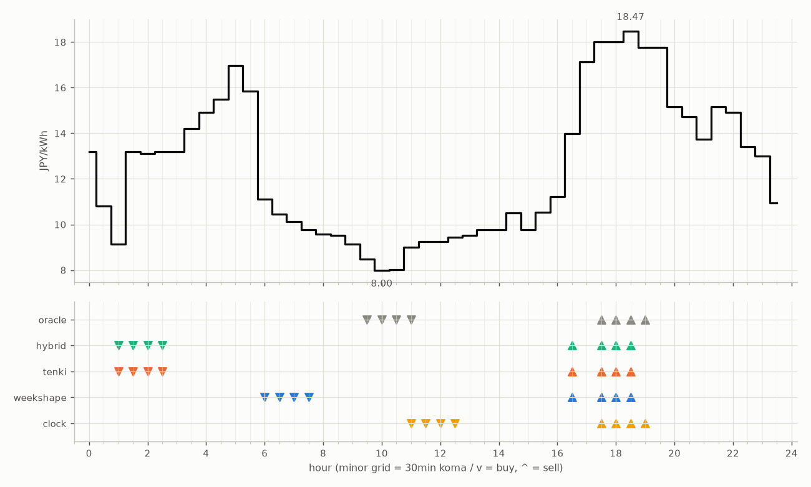

# 日次解剖 — 各機体の売買と因子の記録

勝敗の原因を考えるための記録。picks（提出時_meta）と価格データから毎回再生成される。

### 2026-08-16（信号: 強）

- 因子: 日射予報 324 W/m2 / 実測 未確定（実測は約5日遅れ） / 平年乖離 347（閾値 194）
- 価格の形: 最安 10:30 8.00円 / 最高 18:30 20.38円 / 山谷比 2.5倍

| 機体 | 充電（買い） | 平均買値 | 放電（売り） | 平均売値 | 損益 |
|---|---|---|---|---|---|
| clock | 11:00, 11:30, 12:00, 12:30 | 8.14円 | 17:30, 18:00, 18:30, 19:00 | 19.93円 | +98円 |
| weekshape | 09:00, 10:00, 10:30, 11:00 | 8.16円 | 17:30, 18:00, 18:30, 19:00 | 19.93円 | +98円 |
| tenki | 01:30, 05:30, 06:00, 06:30 | 11.64円 | 18:00, 18:30, 19:00, 19:30 | 20.00円 | +64円 |
| hybrid | 01:30, 05:30, 06:00, 06:30 | 11.64円 | 18:00, 18:30, 19:00, 19:30 | 20.00円 | +64円 |
| oracle | 07:30, 10:30, 11:00, 12:00 | 8.03円 | 18:00, 18:30, 19:00, 19:30 | 20.00円 | +100円 |

**48コマ価格（円/kWh。太字=最安/最高）**

| 00:00 | 00:30 | 01:00 | 01:30 | 02:00 | 02:30 | 03:00 | 03:30 | 04:00 | 04:30 | 05:00 | 05:30 | 06:00 | 06:30 | 07:00 | 07:30 | 08:00 | 08:30 | 09:00 | 09:30 | 10:00 | 10:30 | 11:00 | 11:30 |
|---|---|---|---|---|---|---|---|---|---|---|---|---|---|---|---|---|---|---|---|---|---|---|---|
| 14.01 | 12.93 | 11.31 | 13.50 | 12.99 | 12.64 | 12.64 | 12.93 | 12.99 | 13.00 | 13.20 | 11.40 | 11.36 | 10.30 | 8.77 | 8.12 | 9.50 | 9.56 | 8.33 | 9.15 | 8.33 | **8.00** | 8.00 | 8.34 |

| 12:00 | 12:30 | 13:00 | 13:30 | 14:00 | 14:30 | 15:00 | 15:30 | 16:00 | 16:30 | 17:00 | 17:30 | 18:00 | 18:30 | 19:00 | 19:30 | 20:00 | 20:30 | 21:00 | 21:30 | 22:00 | 22:30 | 23:00 | 23:30 |
|---|---|---|---|---|---|---|---|---|---|---|---|---|---|---|---|---|---|---|---|---|---|---|---|
| 8.00 | 8.22 | 8.51 | 9.70 | 9.40 | 9.82 | 9.71 | 12.94 | 14.03 | 16.60 | 18.77 | 19.19 | 19.88 | **20.38** | 20.25 | 19.50 | 18.79 | 18.14 | 17.48 | 16.27 | 16.09 | 15.00 | 14.01 | 10.31 |

### 2026-08-15（信号: 強）

- 因子: 日射予報 455 W/m2 / 実測 未確定（実測は約5日遅れ） / 平年乖離 215（閾値 194）
- 価格の形: 最安 12:00 8.00円 / 最高 17:00 18.44円 / 山谷比 2.3倍

| 機体 | 充電（買い） | 平均買値 | 放電（売り） | 平均売値 | 損益 |
|---|---|---|---|---|---|
| clock | 11:00, 11:30, 12:00, 12:30 | 8.10円 | 17:30, 18:00, 18:30, 19:00 | 16.96円 | +72円 |
| weekshape | 10:00, 10:30, 11:00, 12:00 | 8.67円 | 18:00, 18:30, 19:00, 19:30 | 17.03円 | +67円 |
| tenki | 06:30, 10:00, 10:30, 11:00 | 9.26円 | 18:00, 18:30, 19:00, 19:30 | 17.03円 | +61円 |
| hybrid | 06:30, 10:00, 10:30, 11:00 | 9.26円 | 18:00, 18:30, 19:00, 19:30 | 17.03円 | +61円 |
| oracle | 11:00, 11:30, 12:00, 13:00 | 8.06円 | 17:00, 18:00, 19:00, 19:30 | 17.42円 | +77円 |

**48コマ価格（円/kWh。太字=最安/最高）**

| 00:00 | 00:30 | 01:00 | 01:30 | 02:00 | 02:30 | 03:00 | 03:30 | 04:00 | 04:30 | 05:00 | 05:30 | 06:00 | 06:30 | 07:00 | 07:30 | 08:00 | 08:30 | 09:00 | 09:30 | 10:00 | 10:30 | 11:00 | 11:30 |
|---|---|---|---|---|---|---|---|---|---|---|---|---|---|---|---|---|---|---|---|---|---|---|---|
| 13.58 | 12.60 | 10.29 | 13.58 | 13.03 | 13.03 | 13.58 | 15.00 | 15.13 | 15.44 | 16.00 | 15.41 | 12.60 | 10.34 | 9.76 | 9.76 | 9.53 | 9.50 | 9.00 | 9.00 | 9.24 | 9.29 | 8.16 | 8.07 |

| 12:00 | 12:30 | 13:00 | 13:30 | 14:00 | 14:30 | 15:00 | 15:30 | 16:00 | 16:30 | 17:00 | 17:30 | 18:00 | 18:30 | 19:00 | 19:30 | 20:00 | 20:30 | 21:00 | 21:30 | 22:00 | 22:30 | 23:00 | 23:30 |
|---|---|---|---|---|---|---|---|---|---|---|---|---|---|---|---|---|---|---|---|---|---|---|---|
| **8.00** | 8.16 | 8.00 | 9.29 | 8.65 | 9.76 | 9.71 | 11.50 | 13.53 | 17.00 | **18.44** | 16.74 | 17.22 | 16.88 | 17.01 | 17.01 | 16.09 | 15.44 | 14.72 | 14.28 | 14.19 | 13.92 | 14.54 | 13.03 |

### 2026-08-14（信号: 強）

- 因子: 日射予報 345 W/m2 / 実測 未確定（実測は約5日遅れ） / 平年乖離 325（閾値 194）
- 価格の形: 最安 10:00 8.00円 / 最高 18:30 18.47円 / 山谷比 2.3倍

| 機体 | 充電（買い） | 平均買値 | 放電（売り） | 平均売値 | 損益 |
|---|---|---|---|---|---|
| clock | 11:00, 11:30, 12:00, 12:30 | 9.23円 | 17:30, 18:00, 18:30, 19:00 | 18.05円 | +71円 |
| weekshape | 06:00, 06:30, 07:00, 07:30 | 10.36円 | 16:30, 17:30, 18:00, 18:30 | 17.12円 | +50円 |
| tenki | 01:00, 01:30, 02:00, 02:30 | 12.15円 | 16:30, 17:30, 18:00, 18:30 | 17.12円 | +32円 |
| hybrid | 01:00, 01:30, 02:00, 02:30 | 12.15円 | 16:30, 17:30, 18:00, 18:30 | 17.12円 | +32円 |
| oracle | 09:30, 10:00, 10:30, 11:00 | 8.37円 | 17:30, 18:00, 18:30, 19:00 | 18.05円 | +79円 |

**48コマ価格（円/kWh。太字=最安/最高）**

| 00:00 | 00:30 | 01:00 | 01:30 | 02:00 | 02:30 | 03:00 | 03:30 | 04:00 | 04:30 | 05:00 | 05:30 | 06:00 | 06:30 | 07:00 | 07:30 | 08:00 | 08:30 | 09:00 | 09:30 | 10:00 | 10:30 | 11:00 | 11:30 |
|---|---|---|---|---|---|---|---|---|---|---|---|---|---|---|---|---|---|---|---|---|---|---|---|
| 13.19 | 10.81 | 9.13 | 13.19 | 13.10 | 13.19 | 13.19 | 14.19 | 14.92 | 15.50 | 16.96 | 15.86 | 11.10 | 10.44 | 10.13 | 9.76 | 9.58 | 9.53 | 9.13 | 8.47 | **8.00** | 8.01 | 9.00 | 9.24 |

| 12:00 | 12:30 | 13:00 | 13:30 | 14:00 | 14:30 | 15:00 | 15:30 | 16:00 | 16:30 | 17:00 | 17:30 | 18:00 | 18:30 | 19:00 | 19:30 | 20:00 | 20:30 | 21:00 | 21:30 | 22:00 | 22:30 | 23:00 | 23:30 |
|---|---|---|---|---|---|---|---|---|---|---|---|---|---|---|---|---|---|---|---|---|---|---|---|
| 9.24 | 9.45 | 9.53 | 9.76 | 9.76 | 10.52 | 9.76 | 10.53 | 11.21 | 13.99 | 17.12 | 18.00 | 18.00 | **18.47** | 17.75 | 17.75 | 15.15 | 14.72 | 13.75 | 15.15 | 14.92 | 13.42 | 13.01 | 10.94 |
