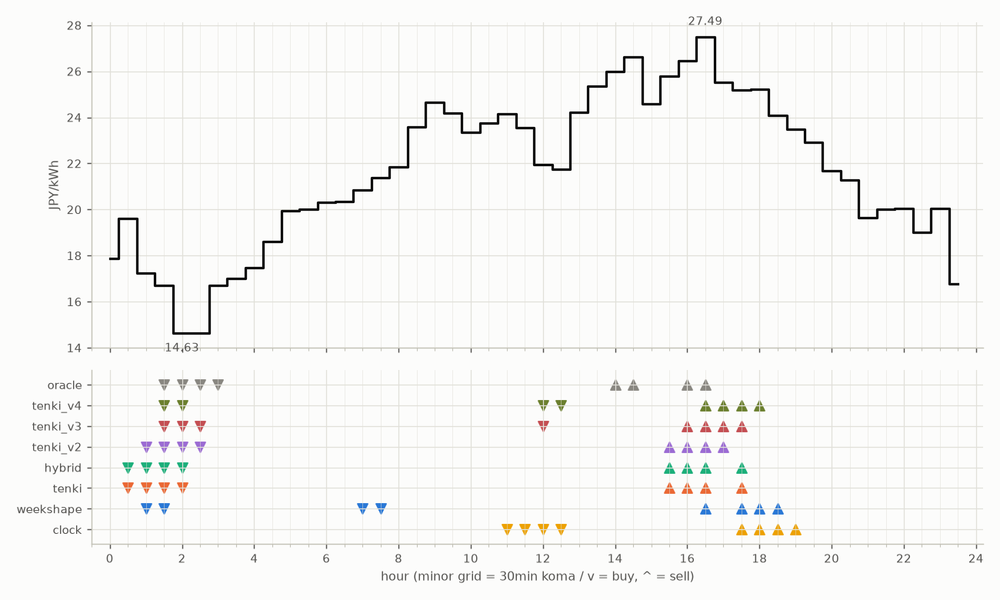

# JEPX仮想蓄電池 フォワード運用レポート

戦略凍結: 2026-08-12 / フォワード開始: 2026-08-14受渡分 / 生成: 2026-09-08 18:06 JST

## 累計成績（リーグ27日目）

| 機体 | 累計損益 | 事前でない日 | **対oracle（共通12日）** | 対oracle（各自の出場日） | 対clock差（pt） |
|---|---|---|---|---|---|
| tenki_v3 | 3,236円 | 30%（8/27日・BT補完） | **83.5%** | 86.0% | +30.1 |
| tenki_v2 | 3,163円 | 26%（7/27日・BT補完） | **83.0%** | 84.4% | +25.9 |
| tenki_v4 | 3,185円 | 37%（10/27日・BT補完） | **80.2%** | 83.1% | +29.5 |
| weekshape | 3,076円 | 56%（15/27日・再計算） | **77.9%** | 77.9% | +30.3 |
| hybrid | 3,093円 | 15%（4/27日・BT3日+再計算1日） | **77.2%** | 82.4% | +20.3 |
| tenki | 3,101円 | 15%（4/27日・BT3日+再計算1日） | **77.1%** | 82.1% | +20.1 |
| clock | 2,471円 | 56%（15/27日・再計算） | **47.6%** | 47.6% | +0.0 |
| oracle | 3,713円 | — | 100.0% | 100.0% | — |

累計損益は**BT補完込み**（参戦前の欠場日を、当時入手可能だったデータのみで再現したバックテストで補完）。**事前でない日**＝価格公表前にコミットされていない日。内訳は**BT補完**（参戦前の穴埋め）と**再計算**（提出が無く採点時にコードから作った日）。clockとweekshapeは2026-08-27まで提出型ではなかったため、それ以前は全日が再計算。**対oracle%と対clock差は事前コミット済みのフォワード日のみ**で計算——対oracle%は値幅のスケールを、対clock差（常設ベンチとの同日ペア差）は時代の取りやすさを一次補正する。

**順位は「対oracle（共通12日）」で付ける。** 「各自の出場日」の列は機体ごとに分母の日が違うので、**順位に使うと難しい日を欠場した機体ほど上に来る**——2026-08-29の敵対的レビューで実際にそうなっていた（tenki_v3が首位に見えていたが、同じ日で揃えるとtenkiとhybridが上）。参考として残すが、比較には使わない。

## 期間別（ISO週別、*=BT補完を含む）

| 週 | tenki | hybrid | clock | weekshape | tenki_v2 | tenki_v3 | tenki_v4 | oracle |
|---|---|---|---|---|---|---|---|---|
| 2026-W33 | 158 | 158 | 241 | 215 | 165* | 180* | 181* | 257 |
| 2026-W34 | 880* | 870* | 796 | 836 | 841* | 856* | 859* | 928 |
| 2026-W35 | 990* | 991* | 842 | 928 | 981* | 1,008* | 1,008* | 1,110 |
| 2026-W36 | 773 | 773 | 499 | 795 | 837 | 860 | 860 | 1,060 |
| 2026-W37 | 301 | 301 | 93 | 301 | 339 | 331 | 276 | 360 |

## 直接対決（全機体出場日 17日のみ）

| 機体 | 累計損益 | 対oracle |
|---|---|---|
| tenki_v3 | 1,930円 | 85.8% |
| tenki_v2 | 1,903円 | 84.6% |
| tenki_v4 | 1,869円 | 83.1% |
| tenki | 1,823円 | 81.1% |
| hybrid | 1,816円 | 80.8% |
| weekshape | 1,775円 | 78.9% |
| clock | 1,207円 | 53.7% |
| oracle | 2,249円 | 100.0% |
## 直近日の解剖（全日分は [daily_anatomy.md](daily_anatomy.md)）

### 2026-09-09（信号: 強）

- 因子: 日射予報 198 W/m2 / 実測 未確定（実測は約5日遅れ） / 乖離 -392 W/m2（普段より曇る方向。直近28日平均 589、判定は絶対値 416 vs 閾値 195）
- 価格の形: 最安 02:00 14.63円 / 最高 16:30 27.49円 / 山谷比 1.9倍

| 機体 | 充電（買い） | 平均買値 | 放電（売り） | 平均売値 | 損益 |
|---|---|---|---|---|---|
| clock | 11:00, 11:30, 12:00, 12:30 | 22.84円 | 17:30, 18:00, 18:30, 19:00 | 24.50円 | -7円 |
| weekshape | 01:00, 01:30, 07:00, 07:30 | 19.04円 | 16:30, 17:30, 18:00, 18:30 | 25.50円 | +40円 |
| tenki | 00:30, 01:00, 01:30, 02:00 | 17.05円 | 15:30, 16:00, 16:30, 17:30 | 26.23円 | +67円 |
| tenki_v2 | 01:00, 01:30, 02:00, 02:30 | 15.80円 | 15:30, 16:00, 16:30, 17:00 | 26.31円 | +80円 |
| tenki_v3 | 01:30, 02:00, 02:30, 12:00 | 16.98円 | 16:00, 16:30, 17:00, 17:30 | 26.17円 | +67円 |
| tenki_v4 | 01:30, 02:00, 12:00, 12:30 | 18.76円 | 16:30, 17:00, 17:30, 18:00 | 25.86円 | +46円 |
| hybrid | 00:30, 01:00, 01:30, 02:00 | 17.05円 | 15:30, 16:00, 16:30, 17:30 | 26.23円 | +67円 |
| oracle | 01:30, 02:00, 02:30, 03:00 | 15.68円 | 14:00, 14:30, 16:00, 16:30 | 26.64円 | +83円 |

**48コマ価格（円/kWh。太字=最安/最高）**

| 00:00 | 00:30 | 01:00 | 01:30 | 02:00 | 02:30 | 03:00 | 03:30 | 04:00 | 04:30 | 05:00 | 05:30 | 06:00 | 06:30 | 07:00 | 07:30 | 08:00 | 08:30 | 09:00 | 09:30 | 10:00 | 10:30 | 11:00 | 11:30 |
|---|---|---|---|---|---|---|---|---|---|---|---|---|---|---|---|---|---|---|---|---|---|---|---|
| 17.87 | 19.62 | 17.24 | 16.72 | **14.63** | 14.63 | 16.72 | 17.00 | 17.46 | 18.61 | 19.95 | 20.01 | 20.31 | 20.33 | 20.83 | 21.38 | 21.85 | 23.59 | 24.64 | 24.17 | 23.35 | 23.75 | 24.16 | 23.54 |

| 12:00 | 12:30 | 13:00 | 13:30 | 14:00 | 14:30 | 15:00 | 15:30 | 16:00 | 16:30 | 17:00 | 17:30 | 18:00 | 18:30 | 19:00 | 19:30 | 20:00 | 20:30 | 21:00 | 21:30 | 22:00 | 22:30 | 23:00 | 23:30 |
|---|---|---|---|---|---|---|---|---|---|---|---|---|---|---|---|---|---|---|---|---|---|---|---|
| 21.94 | 21.74 | 24.23 | 25.35 | 26.00 | 26.61 | 24.60 | 25.78 | 26.44 | **27.49** | 25.53 | 25.20 | 25.23 | 24.09 | 23.50 | 22.92 | 21.69 | 21.27 | 19.65 | 20.00 | 20.03 | 19.01 | 20.04 | 16.76 |

## 明日のpicks（受渡日 2026-09-10、信号: 強）

日射予報の乖離 -328 W/m2（普段より曇る方向。直近28日平均 589、判定は絶対値 328 vs 閾値 195）

| 機体 | 充電（買い） | 放電（売り） |
|---|---|---|
| clock | 11:00, 11:30, 12:00, 12:30 | 17:30, 18:00, 18:30, 19:00 |
| weekshape | 01:30, 02:00, 06:00, 06:30 | 16:30, 17:30, 18:00, 18:30 |
