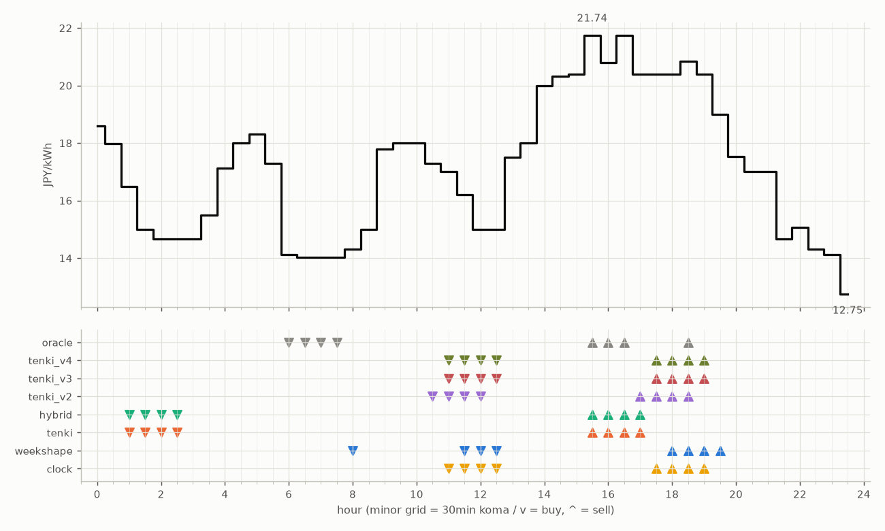

# JEPX仮想蓄電池 フォワード運用レポート

戦略凍結: 2026-08-12 / フォワード開始: 2026-08-14受渡分 / 生成: 2026-09-25 18:46 JST

## 累計成績（リーグ44日目）

| 機体 | 累計損益 | 事前でない日 | **対oracle（共通29日）** | 対oracle（各自の出場日） | 対clock差（pt） |
|---|---|---|---|---|---|
| tenki_v3 | 5,395円 | 18%（8/44日・BT補完） | **89.2%** | 89.5% | +20.5 |
| tenki_v4 | 5,347円 | 23%（10/44日・BT補完） | **87.9%** | 88.4% | +19.6 |
| tenki_v2 | 5,247円 | 16%（7/44日・BT補完） | **87.1%** | 87.0% | +17.2 |
| tenki | 4,976円 | 9%（4/44日・BT3日+再計算1日） | **79.4%** | 81.6% | +10.5 |
| weekshape | 4,660円 | 34%（15/44日・再計算） | **72.4%** | 72.4% | +4.1 |
| hybrid | 4,586円 | 9%（4/44日・BT3日+再計算1日） | **69.9%** | 74.7% | +3.6 |
| clock | 4,400円 | 34%（15/44日・再計算） | **68.3%** | 68.3% | +0.0 |
| oracle | 6,027円 | — | 100.0% | 100.0% | — |

累計損益は**BT補完込み**（参戦前の欠場日を、当時入手可能だったデータのみで再現したバックテストで補完）。**事前でない日**＝価格公表前にコミットされていない日。内訳は**BT補完**（参戦前の穴埋め）と**再計算**（提出が無く採点時にコードから作った日）。clockとweekshapeは2026-08-27まで提出型ではなかったため、それ以前は全日が再計算。**対oracle%と対clock差は事前コミット済みのフォワード日のみ**で計算——対oracle%は値幅のスケールを、対clock差（常設ベンチとの同日ペア差）は時代の取りやすさを一次補正する。

**順位は「対oracle（共通29日）」で付ける。** 「各自の出場日」の列は機体ごとに分母の日が違うので、**順位に使うと難しい日を欠場した機体ほど上に来る**——2026-08-29の敵対的レビューで実際にそうなっていた（tenki_v3が首位に見えていたが、同じ日で揃えるとtenkiとhybridが上）。参考として残すが、比較には使わない。

## 期間別（ISO週別、*=BT補完を含む）

| 週 | tenki | hybrid | clock | weekshape | tenki_v2 | tenki_v3 | tenki_v4 | oracle |
|---|---|---|---|---|---|---|---|---|
| 2026-W33 | 158 | 158 | 241 | 215 | 165* | 180* | 181* | 257 |
| 2026-W34 | 880* | 870* | 796 | 836 | 841* | 856* | 859* | 928 |
| 2026-W35 | 990* | 991* | 842 | 928 | 981* | 1,008* | 1,008* | 1,110 |
| 2026-W36 | 773 | 773 | 499 | 795 | 837 | 860 | 860 | 1,060 |
| 2026-W37 | 731 | 724 | 465 | 714 | 775 | 764 | 707 | 817 |
| 2026-W38 | 644 | 591 | 635 | 690 | 841 | 847 | 829 | 880 |
| 2026-W39 | 800 | 479 | 922 | 481 | 807 | 880 | 902 | 976 |

## 直接対決（全機体出場日 34日のみ）

| 機体 | 累計損益 | 対oracle |
|---|---|---|
| tenki_v3 | 4,089円 | 89.6% |
| tenki_v4 | 4,032円 | 88.4% |
| tenki_v2 | 3,987円 | 87.4% |
| tenki | 3,698円 | 81.0% |
| weekshape | 3,360円 | 73.6% |
| hybrid | 3,310円 | 72.5% |
| clock | 3,136円 | 68.7% |
| oracle | 4,563円 | 100.0% |
## 直近日の解剖（全日分は [daily_anatomy.md](daily_anatomy.md)）

### 2026-09-26（信号: 強）

- 因子: 日射予報 142 W/m2 / 実測 未確定（実測は約5日遅れ） / 乖離 -340 W/m2（普段より曇る方向。判定時の直近28日平均 482、判定は絶対値 340 vs 閾値 200）
- 価格の形: 最安 23:30 12.75円 / 最高 15:30 21.74円 / 山谷比 1.7倍

| 機体 | 充電（買い） | 平均買値 | 放電（売り） | 平均売値 | 損益 |
|---|---|---|---|---|---|
| clock | 11:00, 11:30, 12:00, 12:30 | 15.80円 | 17:30, 18:00, 18:30, 19:00 | 20.51円 | +27円 |
| weekshape | 08:00, 11:30, 12:00, 12:30 | 15.13円 | 18:00, 18:30, 19:00, 19:30 | 20.16円 | +31円 |
| tenki | 01:00, 01:30, 02:00, 02:30 | 15.21円 | 15:30, 16:00, 16:30, 17:00 | 21.17円 | +39円 |
| tenki_v2 | 10:30, 11:00, 11:30, 12:00 | 16.37円 | 17:00, 17:30, 18:00, 18:30 | 20.51円 | +21円 |
| tenki_v3 | 11:00, 11:30, 12:00, 12:30 | 15.80円 | 17:30, 18:00, 18:30, 19:00 | 20.51円 | +27円 |
| tenki_v4 | 11:00, 11:30, 12:00, 12:30 | 15.80円 | 17:30, 18:00, 18:30, 19:00 | 20.51円 | +27円 |
| hybrid | 01:00, 01:30, 02:00, 02:30 | 15.21円 | 15:30, 16:00, 16:30, 17:00 | 21.17円 | +39円 |
| oracle | 06:00, 06:30, 07:00, 07:30 | 14.05円 | 15:30, 16:00, 16:30, 18:30 | 21.28円 | +52円 |

**48コマ価格（円/kWh。太字=最安/最高）**

| 00:00 | 00:30 | 01:00 | 01:30 | 02:00 | 02:30 | 03:00 | 03:30 | 04:00 | 04:30 | 05:00 | 05:30 | 06:00 | 06:30 | 07:00 | 07:30 | 08:00 | 08:30 | 09:00 | 09:30 | 10:00 | 10:30 | 11:00 | 11:30 |
|---|---|---|---|---|---|---|---|---|---|---|---|---|---|---|---|---|---|---|---|---|---|---|---|
| 18.59 | 17.98 | 16.50 | 15.00 | 14.67 | 14.67 | 14.67 | 15.50 | 17.12 | 18.01 | 18.30 | 17.29 | 14.12 | 14.03 | 14.03 | 14.03 | 14.31 | 15.00 | 17.80 | 18.00 | 18.00 | 17.29 | 17.00 | 16.20 |

| 12:00 | 12:30 | 13:00 | 13:30 | 14:00 | 14:30 | 15:00 | 15:30 | 16:00 | 16:30 | 17:00 | 17:30 | 18:00 | 18:30 | 19:00 | 19:30 | 20:00 | 20:30 | 21:00 | 21:30 | 22:00 | 22:30 | 23:00 | 23:30 |
|---|---|---|---|---|---|---|---|---|---|---|---|---|---|---|---|---|---|---|---|---|---|---|---|
| 15.00 | 15.00 | 17.50 | 18.01 | 20.00 | 20.33 | 20.40 | **21.74** | 20.80 | 21.74 | 20.40 | 20.40 | 20.40 | 20.85 | 20.40 | 19.00 | 17.54 | 17.00 | 17.00 | 14.67 | 15.06 | 14.31 | 14.12 | **12.75** |

## 明日のpicks（受渡日 2026-09-27、信号: 強）

日射予報の乖離 -274 W/m2（普段より曇る方向。判定時の直近28日平均 482、判定は絶対値 274 vs 閾値 200）

| 機体 | 充電（買い） | 放電（売り） |
|---|---|---|
| clock | 11:00, 11:30, 12:00, 12:30 | 17:30, 18:00, 18:30, 19:00 |
| weekshape | 10:00, 11:00, 11:30, 12:00 | 18:00, 18:30, 19:00, 19:30 |
