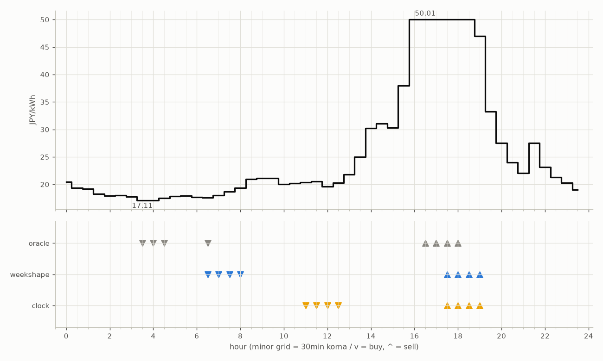

# JEPX仮想蓄電池 フォワード運用レポート

戦略凍結: 2026-08-12 / フォワード開始: 2026-08-14受渡分 / 生成: 2026-08-25 14:08 JST

> ⚠ 8/23受渡: 気象予報の取得に失敗し天気系4機体は**欠場**（実力ではなく計測の欠測。後日、予報アーカイブからBT補完される）
> ⚠ 8/26受渡: 気象予報の取得に失敗し天気系4機体は**欠場**（実力ではなく計測の欠測。後日、予報アーカイブからBT補完される）

## 累計成績（リーグ13日目）

| 機体 | 累計損益 | BT率 | 対oracle（Fwd） | 対clock差（Fwd, pt） |
|---|---|---|---|---|
| tenki_v4 | 881円 | 56%（5/9日） | 93.5% | +5.1 |
| tenki_v3 | 876円 | 33%（3/9日） | 91.5% | +9.9 |
| weekshape | 1,638円 | 0% | 89.9% | +2.5 |
| clock | 1,592円 | 0% | 87.3% | +0.0 |
| tenki_v2 | 1,149円 | 36%（4/11日） | 86.9% | +3.8 |
| hybrid | 1,187円 | 0% | 86.1% | +0.2 |
| tenki | 1,181円 | 0% | 85.6% | -0.2 |
| oracle | 1,823円 | 0% | 100.0% | — |

累計損益は**BT補完込み**（参戦前の欠場日を、当時入手可能だったデータのみで再現したバックテストで補完。BT率＝そのうち事前コミットでない日の割合。割り引いて読む）。**対oracle%と対clock差は事前コミット済みのフォワード日のみ**で計算——対oracle%は値幅のスケールを、対clock差（常設ベンチとの同日ペア差）は時代の取りやすさを一次補正する。完全対等の比較は下の直接対決（共通日のみ）

## 期間別（ISO週別、*=BT補完を含む）

| 週 | clock | weekshape | tenki | hybrid | tenki_v2 | tenki_v3 | tenki_v4 | oracle |
|---|---|---|---|---|---|---|---|---|
| 2026-W33 | 241 | 215 | 158 | 158 | 165* | 180* | 181* | 257 |
| 2026-W34 | 796 | 836 | 715 | 704 | 677* | 577 | 580* | 928 |
| 2026-W35 | 555 | 587 | 308 | 325 | 307 | 120 | 120 | 639 |

## 直接対決（全機体出場日 4日のみ）

| 機体 | 累計損益 | 対oracle |
|---|---|---|
| tenki | 430円 | 94.9% |
| tenki_v3 | 429円 | 94.7% |
| tenki_v4 | 424円 | 93.5% |
| weekshape | 422円 | 93.1% |
| hybrid | 422円 | 93.1% |
| tenki_v2 | 412円 | 90.9% |
| clock | 401円 | 88.4% |
| oracle | 453円 | 100.0% |
## 直近日の解剖（全日分は [daily_anatomy.md](daily_anatomy.md)）

### 2026-08-26（信号: ?）

- 因子: picksの_meta欠落
- 価格の形: 最安 03:30 17.11円 / 最高 16:30 50.01円 / 山谷比 2.9倍

| 機体 | 充電（買い） | 平均買値 | 放電（売り） | 平均売値 | 損益 |
|---|---|---|---|---|---|
| clock | 11:00, 11:30, 12:00, 12:30 | 20.19円 | 17:30, 18:00, 18:30, 19:00 | 49.26円 | +244円 |
| weekshape | 06:30, 07:00, 07:30, 08:00 | 18.40円 | 17:30, 18:00, 18:30, 19:00 | 49.26円 | +262円 |
| oracle | 03:30, 04:00, 04:30, 06:30 | 17.32円 | 16:30, 17:00, 17:30, 18:00 | 50.01円 | +278円 |

**48コマ価格（円/kWh。太字=最安/最高）**

| 00:00 | 00:30 | 01:00 | 01:30 | 02:00 | 02:30 | 03:00 | 03:30 | 04:00 | 04:30 | 05:00 | 05:30 | 06:00 | 06:30 | 07:00 | 07:30 | 08:00 | 08:30 | 09:00 | 09:30 | 10:00 | 10:30 | 11:00 | 11:30 |
|---|---|---|---|---|---|---|---|---|---|---|---|---|---|---|---|---|---|---|---|---|---|---|---|
| 20.46 | 19.33 | 19.22 | 18.23 | 17.92 | 18.00 | 17.77 | **17.11** | 17.11 | 17.47 | 17.86 | 17.92 | 17.68 | 17.58 | 18.00 | 18.64 | 19.37 | 20.94 | 21.10 | 21.10 | 20.00 | 20.17 | 20.39 | 20.50 |

| 12:00 | 12:30 | 13:00 | 13:30 | 14:00 | 14:30 | 15:00 | 15:30 | 16:00 | 16:30 | 17:00 | 17:30 | 18:00 | 18:30 | 19:00 | 19:30 | 20:00 | 20:30 | 21:00 | 21:30 | 22:00 | 22:30 | 23:00 | 23:30 |
|---|---|---|---|---|---|---|---|---|---|---|---|---|---|---|---|---|---|---|---|---|---|---|---|
| 19.59 | 20.28 | 21.77 | 25.00 | 30.22 | 31.06 | 30.28 | 38.00 | 50.00 | **50.01** | 50.01 | 50.01 | 50.01 | 50.01 | 47.02 | 33.23 | 27.50 | 24.00 | 22.06 | 27.50 | 23.17 | 21.31 | 20.30 | 19.04 |

## 明日のpicks（受渡日 2026-08-27、信号: 強）

日射予報の乖離 -266 W/m2（普段より曇る方向。直近28日平均 643、判定は絶対値 266 vs 閾値 195）

| 機体 | 充電（買い） | 放電（売り） |
|---|---|---|
| clock | 11:00, 11:30, 12:00, 12:30 | 17:30, 18:00, 18:30, 19:00 |
| weekshape | 07:00, 07:30, 08:00, 12:00 | 17:30, 18:00, 18:30, 19:00 |
