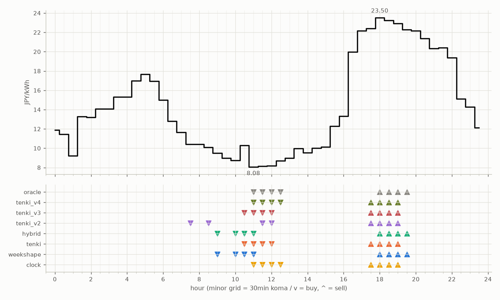

# JEPX仮想蓄電池 フォワード運用レポート

戦略凍結: 2026-08-12 / フォワード開始: 2026-08-14受渡分 / 生成: 2026-09-12 17:47 JST

## 累計成績（リーグ31日目）

| 機体 | 累計損益 | 事前でない日 | **対oracle（共通16日）** | 対oracle（各自の出場日） | 対clock差（pt） |
|---|---|---|---|---|---|
| tenki_v3 | 3,668円 | 26%（8/31日・BT補完） | **85.8%** | 87.3% | +27.5 |
| tenki_v2 | 3,599円 | 23%（7/31日・BT補完） | **85.7%** | 86.0% | +24.2 |
| tenki_v4 | 3,616円 | 32%（10/31日・BT補完） | **83.2%** | 85.0% | +26.7 |
| tenki | 3,531円 | 13%（4/31日・BT3日+再計算1日） | **80.7%** | 83.6% | +19.1 |
| weekshape | 3,489円 | 48%（15/31日・再計算） | **80.5%** | 80.5% | +25.8 |
| hybrid | 3,516円 | 13%（4/31日・BT3日+再計算1日） | **80.5%** | 83.7% | +19.1 |
| clock | 2,843円 | 48%（15/31日・再計算） | **54.8%** | 54.8% | +0.0 |
| oracle | 4,171円 | — | 100.0% | 100.0% | — |

累計損益は**BT補完込み**（参戦前の欠場日を、当時入手可能だったデータのみで再現したバックテストで補完）。**事前でない日**＝価格公表前にコミットされていない日。内訳は**BT補完**（参戦前の穴埋め）と**再計算**（提出が無く採点時にコードから作った日）。clockとweekshapeは2026-08-27まで提出型ではなかったため、それ以前は全日が再計算。**対oracle%と対clock差は事前コミット済みのフォワード日のみ**で計算——対oracle%は値幅のスケールを、対clock差（常設ベンチとの同日ペア差）は時代の取りやすさを一次補正する。

**順位は「対oracle（共通16日）」で付ける。** 「各自の出場日」の列は機体ごとに分母の日が違うので、**順位に使うと難しい日を欠場した機体ほど上に来る**——2026-08-29の敵対的レビューで実際にそうなっていた（tenki_v3が首位に見えていたが、同じ日で揃えるとtenkiとhybridが上）。参考として残すが、比較には使わない。

## 期間別（ISO週別、*=BT補完を含む）

| 週 | tenki | hybrid | clock | weekshape | tenki_v2 | tenki_v3 | tenki_v4 | oracle |
|---|---|---|---|---|---|---|---|---|
| 2026-W33 | 158 | 158 | 241 | 215 | 165* | 180* | 181* | 257 |
| 2026-W34 | 880* | 870* | 796 | 836 | 841* | 856* | 859* | 928 |
| 2026-W35 | 990* | 991* | 842 | 928 | 981* | 1,008* | 1,008* | 1,110 |
| 2026-W36 | 773 | 773 | 499 | 795 | 837 | 860 | 860 | 1,060 |
| 2026-W37 | 731 | 724 | 465 | 714 | 775 | 764 | 707 | 817 |

## 直接対決（全機体出場日 21日のみ）

| 機体 | 累計損益 | 対oracle |
|---|---|---|
| tenki_v3 | 2,363円 | 87.3% |
| tenki_v2 | 2,339円 | 86.4% |
| tenki_v4 | 2,301円 | 85.0% |
| tenki | 2,253円 | 83.3% |
| hybrid | 2,239円 | 82.7% |
| weekshape | 2,188円 | 80.9% |
| clock | 1,579円 | 58.3% |
| oracle | 2,707円 | 100.0% |
## 直近日の解剖（全日分は [daily_anatomy.md](daily_anatomy.md)）

### 2026-09-13（信号: 平常）

- 因子: 日射予報 373 W/m2 / 実測 未確定（実測は約5日遅れ） / 乖離 -188 W/m2（普段より曇る方向。直近28日平均 561、判定は絶対値 188 vs 閾値 196）
- 価格の形: 最安 11:00 8.08円 / 最高 18:00 23.50円 / 山谷比 2.9倍

| 機体 | 充電（買い） | 平均買値 | 放電（売り） | 平均売値 | 損益 |
|---|---|---|---|---|---|
| clock | 11:00, 11:30, 12:00, 12:30 | 8.27円 | 17:30, 18:00, 18:30, 19:00 | 23.01円 | +125円 |
| weekshape | 09:00, 10:00, 10:30, 11:00 | 9.15円 | 18:00, 18:30, 19:00, 19:30 | 22.98円 | +116円 |
| tenki | 10:30, 11:00, 11:30, 12:00 | 8.67円 | 17:30, 18:00, 18:30, 19:00 | 23.01円 | +121円 |
| tenki_v2 | 07:30, 08:30, 11:30, 12:00 | 9.20円 | 17:30, 18:00, 18:30, 19:00 | 23.01円 | +116円 |
| tenki_v3 | 10:30, 11:00, 11:30, 12:00 | 8.67円 | 17:30, 18:00, 18:30, 19:00 | 23.01円 | +121円 |
| tenki_v4 | 11:00, 11:30, 12:00, 12:30 | 8.27円 | 17:30, 18:00, 18:30, 19:00 | 23.01円 | +125円 |
| hybrid | 09:00, 10:00, 10:30, 11:00 | 9.15円 | 18:00, 18:30, 19:00, 19:30 | 22.98円 | +116円 |
| oracle | 11:00, 11:30, 12:00, 12:30 | 8.27円 | 18:00, 18:30, 19:00, 19:30 | 22.98円 | +125円 |

**48コマ価格（円/kWh。太字=最安/最高）**

| 00:00 | 00:30 | 01:00 | 01:30 | 02:00 | 02:30 | 03:00 | 03:30 | 04:00 | 04:30 | 05:00 | 05:30 | 06:00 | 06:30 | 07:00 | 07:30 | 08:00 | 08:30 | 09:00 | 09:30 | 10:00 | 10:30 | 11:00 | 11:30 |
|---|---|---|---|---|---|---|---|---|---|---|---|---|---|---|---|---|---|---|---|---|---|---|---|
| 11.90 | 11.43 | 9.22 | 13.27 | 13.21 | 14.08 | 14.09 | 15.30 | 15.30 | 16.98 | 17.68 | 16.95 | 15.00 | 12.82 | 11.66 | 10.40 | 10.40 | 10.11 | 9.51 | 8.96 | 8.72 | 10.31 | **8.08** | 8.13 |

| 12:00 | 12:30 | 13:00 | 13:30 | 14:00 | 14:30 | 15:00 | 15:30 | 16:00 | 16:30 | 17:00 | 17:30 | 18:00 | 18:30 | 19:00 | 19:30 | 20:00 | 20:30 | 21:00 | 21:30 | 22:00 | 22:30 | 23:00 | 23:30 |
|---|---|---|---|---|---|---|---|---|---|---|---|---|---|---|---|---|---|---|---|---|---|---|---|
| 8.17 | 8.68 | 8.96 | 9.98 | 9.53 | 10.00 | 10.12 | 12.30 | 13.32 | 19.98 | 22.16 | 22.39 | **23.50** | 23.23 | 22.91 | 22.27 | 22.16 | 21.36 | 20.33 | 20.40 | 19.38 | 15.10 | 14.28 | 12.13 |

## 明日のpicks（受渡日 2026-09-14、信号: 平常）

日射予報の乖離 +26 W/m2（普段より晴れる方向。直近28日平均 561、判定は絶対値 26 vs 閾値 196）

| 機体 | 充電（買い） | 放電（売り） |
|---|---|---|
| clock | 11:00, 11:30, 12:00, 12:30 | 17:30, 18:00, 18:30, 19:00 |
| weekshape | 02:30, 03:00, 03:30, 04:00 | 16:30, 17:00, 17:30, 18:00 |
