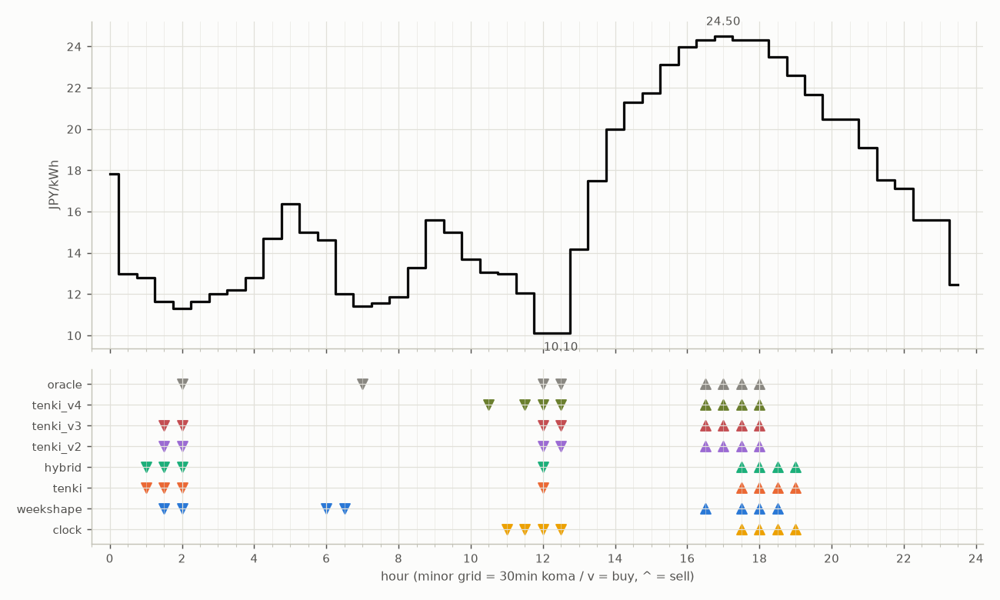

# JEPX仮想蓄電池 フォワード運用レポート

戦略凍結: 2026-08-12 / フォワード開始: 2026-08-14受渡分 / 生成: 2026-09-09 18:08 JST

## 累計成績（リーグ28日目）

| 機体 | 累計損益 | 事前でない日 | **対oracle（共通13日）** | 対oracle（各自の出場日） | 対clock差（pt） |
|---|---|---|---|---|---|
| tenki_v3 | 3,348円 | 29%（8/28日・BT補完） | **84.5%** | 86.5% | +29.2 |
| tenki_v2 | 3,275円 | 25%（7/28日・BT補完） | **84.1%** | 85.0% | +25.2 |
| tenki_v4 | 3,292円 | 36%（10/28日・BT補完） | **81.1%** | 83.7% | +28.3 |
| weekshape | 3,170円 | 54%（15/28日・再計算） | **78.2%** | 78.2% | +28.0 |
| hybrid | 3,193円 | 14%（4/28日・BT3日+再計算1日） | **77.9%** | 82.6% | +19.6 |
| tenki | 3,201円 | 14%（4/28日・BT3日+再計算1日） | **77.8%** | 82.3% | +19.3 |
| clock | 2,572円 | 54%（15/28日・再計算） | **50.2%** | 50.2% | +0.0 |
| oracle | 3,826円 | — | 100.0% | 100.0% | — |

累計損益は**BT補完込み**（参戦前の欠場日を、当時入手可能だったデータのみで再現したバックテストで補完）。**事前でない日**＝価格公表前にコミットされていない日。内訳は**BT補完**（参戦前の穴埋め）と**再計算**（提出が無く採点時にコードから作った日）。clockとweekshapeは2026-08-27まで提出型ではなかったため、それ以前は全日が再計算。**対oracle%と対clock差は事前コミット済みのフォワード日のみ**で計算——対oracle%は値幅のスケールを、対clock差（常設ベンチとの同日ペア差）は時代の取りやすさを一次補正する。

**順位は「対oracle（共通13日）」で付ける。** 「各自の出場日」の列は機体ごとに分母の日が違うので、**順位に使うと難しい日を欠場した機体ほど上に来る**——2026-08-29の敵対的レビューで実際にそうなっていた（tenki_v3が首位に見えていたが、同じ日で揃えるとtenkiとhybridが上）。参考として残すが、比較には使わない。

## 期間別（ISO週別、*=BT補完を含む）

| 週 | tenki | hybrid | clock | weekshape | tenki_v2 | tenki_v3 | tenki_v4 | oracle |
|---|---|---|---|---|---|---|---|---|
| 2026-W33 | 158 | 158 | 241 | 215 | 165* | 180* | 181* | 257 |
| 2026-W34 | 880* | 870* | 796 | 836 | 841* | 856* | 859* | 928 |
| 2026-W35 | 990* | 991* | 842 | 928 | 981* | 1,008* | 1,008* | 1,110 |
| 2026-W36 | 773 | 773 | 499 | 795 | 837 | 860 | 860 | 1,060 |
| 2026-W37 | 401 | 401 | 194 | 395 | 451 | 443 | 383 | 472 |

## 直接対決（全機体出場日 18日のみ）

| 機体 | 累計損益 | 対oracle |
|---|---|---|
| tenki_v3 | 2,042円 | 86.5% |
| tenki_v2 | 2,015円 | 85.3% |
| tenki_v4 | 1,976円 | 83.7% |
| tenki | 1,923円 | 81.4% |
| hybrid | 1,916円 | 81.1% |
| weekshape | 1,869円 | 79.2% |
| clock | 1,308円 | 55.4% |
| oracle | 2,361円 | 100.0% |
## 直近日の解剖（全日分は [daily_anatomy.md](daily_anatomy.md)）

### 2026-09-10（信号: 強）

- 因子: 日射予報 350 W/m2 / 実測 未確定（実測は約5日遅れ） / 乖離 -239 W/m2（普段より曇る方向。直近28日平均 589、判定は絶対値 239 vs 閾値 195）
- 価格の形: 最安 12:30 10.10円 / 最高 17:00 24.50円 / 山谷比 2.4倍

| 機体 | 充電（買い） | 平均買値 | 放電（売り） | 平均売値 | 損益 |
|---|---|---|---|---|---|
| clock | 11:00, 11:30, 12:00, 12:30 | 11.31円 | 17:30, 18:00, 18:30, 19:00 | 23.69円 | +101円 |
| weekshape | 01:30, 02:00, 06:00, 06:30 | 12.39円 | 16:30, 17:30, 18:00, 18:30 | 24.12円 | +94円 |
| tenki | 01:00, 01:30, 02:00, 12:00 | 11.46円 | 17:30, 18:00, 18:30, 19:00 | 23.69円 | +100円 |
| tenki_v2 | 01:30, 02:00, 12:00, 12:30 | 10.79円 | 16:30, 17:00, 17:30, 18:00 | 24.37円 | +112円 |
| tenki_v3 | 01:30, 02:00, 12:00, 12:30 | 10.79円 | 16:30, 17:00, 17:30, 18:00 | 24.37円 | +112円 |
| tenki_v4 | 10:30, 11:30, 12:00, 12:30 | 11.33円 | 16:30, 17:00, 17:30, 18:00 | 24.37円 | +107円 |
| hybrid | 01:00, 01:30, 02:00, 12:00 | 11.46円 | 17:30, 18:00, 18:30, 19:00 | 23.69円 | +100円 |
| oracle | 02:00, 07:00, 12:00, 12:30 | 10.73円 | 16:30, 17:00, 17:30, 18:00 | 24.37円 | +113円 |

**48コマ価格（円/kWh。太字=最安/最高）**

| 00:00 | 00:30 | 01:00 | 01:30 | 02:00 | 02:30 | 03:00 | 03:30 | 04:00 | 04:30 | 05:00 | 05:30 | 06:00 | 06:30 | 07:00 | 07:30 | 08:00 | 08:30 | 09:00 | 09:30 | 10:00 | 10:30 | 11:00 | 11:30 |
|---|---|---|---|---|---|---|---|---|---|---|---|---|---|---|---|---|---|---|---|---|---|---|---|
| 17.84 | 12.99 | 12.79 | 11.63 | 11.32 | 11.63 | 12.00 | 12.20 | 12.79 | 14.69 | 16.37 | 15.01 | 14.61 | 12.00 | 11.41 | 11.55 | 11.88 | 13.30 | 15.59 | 15.00 | 13.68 | 13.07 | 13.00 | 12.05 |

| 12:00 | 12:30 | 13:00 | 13:30 | 14:00 | 14:30 | 15:00 | 15:30 | 16:00 | 16:30 | 17:00 | 17:30 | 18:00 | 18:30 | 19:00 | 19:30 | 20:00 | 20:30 | 21:00 | 21:30 | 22:00 | 22:30 | 23:00 | 23:30 |
|---|---|---|---|---|---|---|---|---|---|---|---|---|---|---|---|---|---|---|---|---|---|---|---|
| 10.11 | **10.10** | 14.16 | 17.51 | 20.00 | 21.28 | 21.74 | 23.13 | 23.96 | 24.32 | **24.50** | 24.32 | 24.33 | 23.51 | 22.61 | 21.67 | 20.46 | 20.48 | 19.10 | 17.54 | 17.11 | 15.59 | 15.59 | 12.45 |

## 明日のpicks（受渡日 2026-09-11、信号: 強）

日射予報の乖離 -395 W/m2（普段より曇る方向。直近28日平均 589、判定は絶対値 395 vs 閾値 195）

| 機体 | 充電（買い） | 放電（売り） |
|---|---|---|
| clock | 11:00, 11:30, 12:00, 12:30 | 17:30, 18:00, 18:30, 19:00 |
| weekshape | 00:30, 01:00, 06:00, 06:30 | 16:30, 17:00, 18:00, 18:30 |
