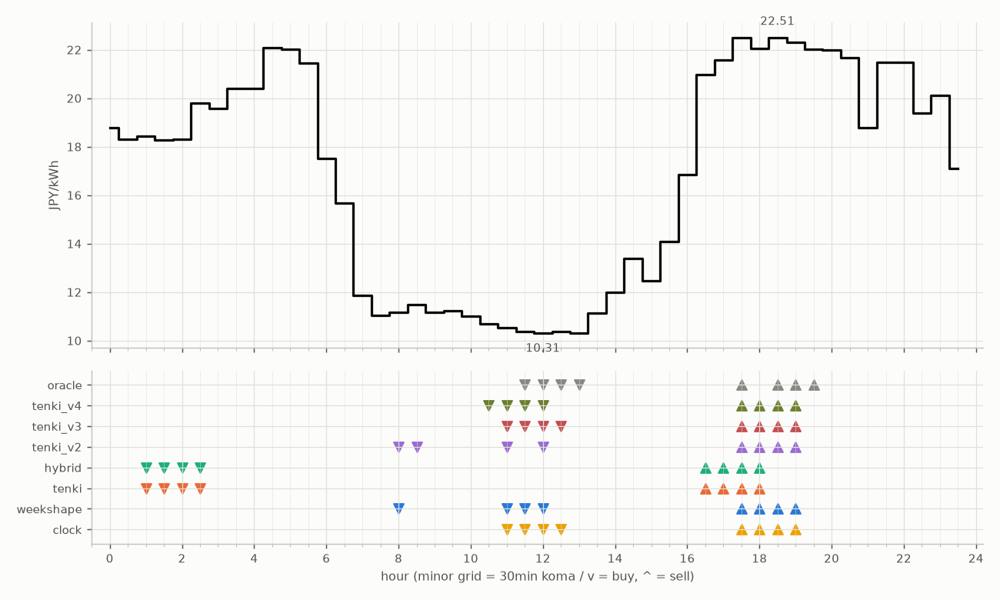

# JEPX仮想蓄電池 フォワード運用レポート

戦略凍結: 2026-08-12 / フォワード開始: 2026-08-14受渡分 / 生成: 2026-09-18 18:12 JST

## 累計成績（リーグ37日目）

| 機体 | 累計損益 | 事前でない日 | **対oracle（共通22日）** | 対oracle（各自の出場日） | 対clock差（pt） |
|---|---|---|---|---|---|
| tenki_v3 | 4,397円 | 22%（8/37日・BT補完） | **88.5%** | 89.0% | +27.6 |
| tenki_v2 | 4,323円 | 19%（7/37日・BT補完） | **88.2%** | 87.7% | +24.7 |
| tenki_v4 | 4,328円 | 27%（10/37日・BT補完） | **85.9%** | 86.9% | +26.4 |
| tenki | 4,127円 | 11%（4/37日・BT3日+再計算1日） | **80.1%** | 82.7% | +17.5 |
| weekshape | 4,061円 | 41%（15/37日・再計算） | **79.2%** | 79.2% | +20.9 |
| hybrid | 4,058円 | 11%（4/37日・BT3日+再計算1日） | **78.1%** | 81.5% | +16.3 |
| clock | 3,362円 | 41%（15/37日・再計算） | **58.3%** | 58.3% | +0.0 |
| oracle | 4,931円 | — | 100.0% | 100.0% | — |

累計損益は**BT補完込み**（参戦前の欠場日を、当時入手可能だったデータのみで再現したバックテストで補完）。**事前でない日**＝価格公表前にコミットされていない日。内訳は**BT補完**（参戦前の穴埋め）と**再計算**（提出が無く採点時にコードから作った日）。clockとweekshapeは2026-08-27まで提出型ではなかったため、それ以前は全日が再計算。**対oracle%と対clock差は事前コミット済みのフォワード日のみ**で計算——対oracle%は値幅のスケールを、対clock差（常設ベンチとの同日ペア差）は時代の取りやすさを一次補正する。

**順位は「対oracle（共通22日）」で付ける。** 「各自の出場日」の列は機体ごとに分母の日が違うので、**順位に使うと難しい日を欠場した機体ほど上に来る**——2026-08-29の敵対的レビューで実際にそうなっていた（tenki_v3が首位に見えていたが、同じ日で揃えるとtenkiとhybridが上）。参考として残すが、比較には使わない。

## 期間別（ISO週別、*=BT補完を含む）

| 週 | tenki | hybrid | clock | weekshape | tenki_v2 | tenki_v3 | tenki_v4 | oracle |
|---|---|---|---|---|---|---|---|---|
| 2026-W33 | 158 | 158 | 241 | 215 | 165* | 180* | 181* | 257 |
| 2026-W34 | 880* | 870* | 796 | 836 | 841* | 856* | 859* | 928 |
| 2026-W35 | 990* | 991* | 842 | 928 | 981* | 1,008* | 1,008* | 1,110 |
| 2026-W36 | 773 | 773 | 499 | 795 | 837 | 860 | 860 | 1,060 |
| 2026-W37 | 731 | 724 | 465 | 714 | 775 | 764 | 707 | 817 |
| 2026-W38 | 595 | 542 | 519 | 573 | 723 | 729 | 711 | 760 |

## 直接対決（全機体出場日 27日のみ）

| 機体 | 累計損益 | 対oracle |
|---|---|---|
| tenki_v3 | 3,092円 | 89.2% |
| tenki_v2 | 3,063円 | 88.4% |
| tenki_v4 | 3,012円 | 86.9% |
| tenki | 2,849円 | 82.2% |
| hybrid | 2,781円 | 80.2% |
| weekshape | 2,761円 | 79.7% |
| clock | 2,098円 | 60.5% |
| oracle | 3,466円 | 100.0% |
## 直近日の解剖（全日分は [daily_anatomy.md](daily_anatomy.md)）

### 2026-09-19（信号: 強）

- 因子: 日射予報 271 W/m2 / 実測 未確定（実測は約5日遅れ） / 乖離 -247 W/m2（普段より曇る方向。判定時の直近28日平均 519、判定は絶対値 247 vs 閾値 199）
- 価格の形: 最安 12:00 10.31円 / 最高 18:30 22.51円 / 山谷比 2.2倍

| 機体 | 充電（買い） | 平均買値 | 放電（売り） | 平均売値 | 損益 |
|---|---|---|---|---|---|
| clock | 11:00, 11:30, 12:00, 12:30 | 10.39円 | 17:30, 18:00, 18:30, 19:00 | 22.33円 | +98円 |
| weekshape | 08:00, 11:00, 11:30, 12:00 | 10.59円 | 17:30, 18:00, 18:30, 19:00 | 22.33円 | +96円 |
| tenki | 01:00, 01:30, 02:00, 02:30 | 18.70円 | 16:30, 17:00, 17:30, 18:00 | 21.77円 | +9円 |
| tenki_v2 | 08:00, 08:30, 11:00, 12:00 | 10.87円 | 17:30, 18:00, 18:30, 19:00 | 22.33円 | +93円 |
| tenki_v3 | 11:00, 11:30, 12:00, 12:30 | 10.39円 | 17:30, 18:00, 18:30, 19:00 | 22.33円 | +98円 |
| tenki_v4 | 10:30, 11:00, 11:30, 12:00 | 10.47円 | 17:30, 18:00, 18:30, 19:00 | 22.33円 | +97円 |
| hybrid | 01:00, 01:30, 02:00, 02:30 | 18.70円 | 16:30, 17:00, 17:30, 18:00 | 21.77円 | +9円 |
| oracle | 11:30, 12:00, 12:30, 13:00 | 10.34円 | 17:30, 18:30, 19:00, 19:30 | 22.32円 | +98円 |

**48コマ価格（円/kWh。太字=最安/最高）**

| 00:00 | 00:30 | 01:00 | 01:30 | 02:00 | 02:30 | 03:00 | 03:30 | 04:00 | 04:30 | 05:00 | 05:30 | 06:00 | 06:30 | 07:00 | 07:30 | 08:00 | 08:30 | 09:00 | 09:30 | 10:00 | 10:30 | 11:00 | 11:30 |
|---|---|---|---|---|---|---|---|---|---|---|---|---|---|---|---|---|---|---|---|---|---|---|---|
| 18.78 | 18.30 | 18.42 | 18.29 | 18.30 | 19.79 | 19.59 | 20.40 | 20.40 | 22.07 | 22.01 | 21.46 | 17.50 | 15.68 | 11.85 | 11.04 | 11.16 | 11.48 | 11.16 | 11.24 | 11.02 | 10.70 | 10.52 | 10.37 |

| 12:00 | 12:30 | 13:00 | 13:30 | 14:00 | 14:30 | 15:00 | 15:30 | 16:00 | 16:30 | 17:00 | 17:30 | 18:00 | 18:30 | 19:00 | 19:30 | 20:00 | 20:30 | 21:00 | 21:30 | 22:00 | 22:30 | 23:00 | 23:30 |
|---|---|---|---|---|---|---|---|---|---|---|---|---|---|---|---|---|---|---|---|---|---|---|---|
| **10.31** | 10.38 | 10.31 | 11.14 | 12.00 | 13.39 | 12.48 | 14.09 | 16.85 | 20.96 | 21.58 | 22.48 | 22.04 | **22.51** | 22.30 | 22.01 | 22.00 | 21.66 | 18.79 | 21.49 | 21.49 | 19.40 | 20.12 | 17.10 |

## 明日のpicks（受渡日 2026-09-20、信号: 強）

日射予報の乖離 -292 W/m2（普段より曇る方向。判定時の直近28日平均 519、判定は絶対値 292 vs 閾値 199）

| 機体 | 充電（買い） | 放電（売り） |
|---|---|---|
| clock | 11:00, 11:30, 12:00, 12:30 | 17:30, 18:00, 18:30, 19:00 |
| weekshape | 10:00, 11:00, 11:30, 12:00 | 18:00, 18:30, 19:00, 19:30 |
