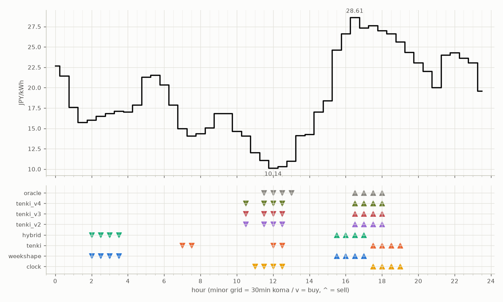

# JEPX仮想蓄電池 フォワード運用レポート

戦略凍結: 2026-08-12 / フォワード開始: 2026-08-14受渡分 / 生成: 2026-09-24 18:29 JST

## 累計成績（リーグ43日目）

| 機体 | 累計損益 | 事前でない日 | **対oracle（共通28日）** | 対oracle（各自の出場日） | 対clock差（pt） |
|---|---|---|---|---|---|
| tenki_v3 | 5,368円 | 19%（8/43日・BT補完） | **89.7%** | 89.9% | +20.7 |
| tenki_v4 | 5,320円 | 23%（10/43日・BT補完） | **88.3%** | 88.8% | +19.9 |
| tenki_v2 | 5,226円 | 16%（7/43日・BT補完） | **87.7%** | 87.5% | +17.5 |
| tenki | 4,936円 | 9%（4/43日・BT3日+再計算1日） | **79.4%** | 81.7% | +10.4 |
| weekshape | 4,629円 | 35%（15/43日・再計算） | **72.6%** | 72.6% | +4.0 |
| hybrid | 4,547円 | 9%（4/43日・BT3日+再計算1日） | **69.8%** | 74.7% | +3.4 |
| clock | 4,373円 | 35%（15/43日・再計算） | **68.5%** | 68.5% | +0.0 |
| oracle | 5,975円 | — | 100.0% | 100.0% | — |

累計損益は**BT補完込み**（参戦前の欠場日を、当時入手可能だったデータのみで再現したバックテストで補完）。**事前でない日**＝価格公表前にコミットされていない日。内訳は**BT補完**（参戦前の穴埋め）と**再計算**（提出が無く採点時にコードから作った日）。clockとweekshapeは2026-08-27まで提出型ではなかったため、それ以前は全日が再計算。**対oracle%と対clock差は事前コミット済みのフォワード日のみ**で計算——対oracle%は値幅のスケールを、対clock差（常設ベンチとの同日ペア差）は時代の取りやすさを一次補正する。

**順位は「対oracle（共通28日）」で付ける。** 「各自の出場日」の列は機体ごとに分母の日が違うので、**順位に使うと難しい日を欠場した機体ほど上に来る**——2026-08-29の敵対的レビューで実際にそうなっていた（tenki_v3が首位に見えていたが、同じ日で揃えるとtenkiとhybridが上）。参考として残すが、比較には使わない。

## 期間別（ISO週別、*=BT補完を含む）

| 週 | tenki | hybrid | clock | weekshape | tenki_v2 | tenki_v3 | tenki_v4 | oracle |
|---|---|---|---|---|---|---|---|---|
| 2026-W33 | 158 | 158 | 241 | 215 | 165* | 180* | 181* | 257 |
| 2026-W34 | 880* | 870* | 796 | 836 | 841* | 856* | 859* | 928 |
| 2026-W35 | 990* | 991* | 842 | 928 | 981* | 1,008* | 1,008* | 1,110 |
| 2026-W36 | 773 | 773 | 499 | 795 | 837 | 860 | 860 | 1,060 |
| 2026-W37 | 731 | 724 | 465 | 714 | 775 | 764 | 707 | 817 |
| 2026-W38 | 644 | 591 | 635 | 690 | 841 | 847 | 829 | 880 |
| 2026-W39 | 761 | 440 | 895 | 450 | 785 | 853 | 875 | 924 |

## 直接対決（全機体出場日 33日のみ）

| 機体 | 累計損益 | 対oracle |
|---|---|---|
| tenki_v3 | 4,062円 | 90.1% |
| tenki_v4 | 4,005円 | 88.8% |
| tenki_v2 | 3,966円 | 87.9% |
| tenki | 3,658円 | 81.1% |
| weekshape | 3,328円 | 73.8% |
| hybrid | 3,270円 | 72.5% |
| clock | 3,109円 | 68.9% |
| oracle | 4,511円 | 100.0% |
## 直近日の解剖（全日分は [daily_anatomy.md](daily_anatomy.md)）

### 2026-09-25（信号: 平常）

- 因子: 日射予報 471 W/m2 / 実測 未確定（実測は約5日遅れ） / 乖離 -10 W/m2（普段より曇る方向。判定時の直近28日平均 482、判定は絶対値 10 vs 閾値 200）
- 価格の形: 最安 12:00 10.14円 / 最高 16:30 28.61円 / 山谷比 2.8倍

| 機体 | 充電（買い） | 平均買値 | 放電（売り） | 平均売値 | 損益 |
|---|---|---|---|---|---|
| clock | 11:00, 11:30, 12:00, 12:30 | 10.89円 | 17:30, 18:00, 18:30, 19:00 | 26.71円 | +133円 |
| weekshape | 02:00, 02:30, 03:00, 03:30 | 16.60円 | 15:30, 16:00, 16:30, 17:00 | 26.80円 | +76円 |
| tenki | 07:00, 07:30, 12:00, 12:30 | 12.38円 | 17:30, 18:00, 18:30, 19:00 | 26.71円 | +118円 |
| tenki_v2 | 10:30, 11:30, 12:00, 12:30 | 11.40円 | 16:30, 17:00, 17:30, 18:00 | 27.64円 | +136円 |
| tenki_v3 | 10:30, 11:30, 12:00, 12:30 | 11.40円 | 16:30, 17:00, 17:30, 18:00 | 27.64円 | +136円 |
| tenki_v4 | 10:30, 11:30, 12:00, 12:30 | 11.40円 | 16:30, 17:00, 17:30, 18:00 | 27.64円 | +136円 |
| hybrid | 02:00, 02:30, 03:00, 03:30 | 16.60円 | 15:30, 16:00, 16:30, 17:00 | 26.80円 | +76円 |
| oracle | 11:30, 12:00, 12:30, 13:00 | 10.63円 | 16:30, 17:00, 17:30, 18:00 | 27.64円 | +143円 |

**48コマ価格（円/kWh。太字=最安/最高）**

| 00:00 | 00:30 | 01:00 | 01:30 | 02:00 | 02:30 | 03:00 | 03:30 | 04:00 | 04:30 | 05:00 | 05:30 | 06:00 | 06:30 | 07:00 | 07:30 | 08:00 | 08:30 | 09:00 | 09:30 | 10:00 | 10:30 | 11:00 | 11:30 |
|---|---|---|---|---|---|---|---|---|---|---|---|---|---|---|---|---|---|---|---|---|---|---|---|
| 22.68 | 21.42 | 17.60 | 15.75 | 16.00 | 16.48 | 16.81 | 17.10 | 17.00 | 17.86 | 21.29 | 21.53 | 20.33 | 17.86 | 15.00 | 14.09 | 14.37 | 15.06 | 16.81 | 16.81 | 14.63 | 14.08 | 12.05 | 11.06 |

| 12:00 | 12:30 | 13:00 | 13:30 | 14:00 | 14:30 | 15:00 | 15:30 | 16:00 | 16:30 | 17:00 | 17:30 | 18:00 | 18:30 | 19:00 | 19:30 | 20:00 | 20:30 | 21:00 | 21:30 | 22:00 | 22:30 | 23:00 | 23:30 |
|---|---|---|---|---|---|---|---|---|---|---|---|---|---|---|---|---|---|---|---|---|---|---|---|
| **10.14** | 10.31 | 11.00 | 14.14 | 14.27 | 17.00 | 18.42 | 24.61 | 26.64 | **28.61** | 27.35 | 27.60 | 27.00 | 26.61 | 25.63 | 24.35 | 23.07 | 22.00 | 20.00 | 24.00 | 24.30 | 23.65 | 23.06 | 19.60 |

## 明日のpicks（受渡日 2026-09-26、信号: 強）

日射予報の乖離 -247 W/m2（普段より曇る方向。判定時の直近28日平均 482、判定は絶対値 247 vs 閾値 200）

| 機体 | 充電（買い） | 放電（売り） |
|---|---|---|
| clock | 11:00, 11:30, 12:00, 12:30 | 17:30, 18:00, 18:30, 19:00 |
| weekshape | 08:00, 11:30, 12:00, 12:30 | 18:00, 18:30, 19:00, 19:30 |
