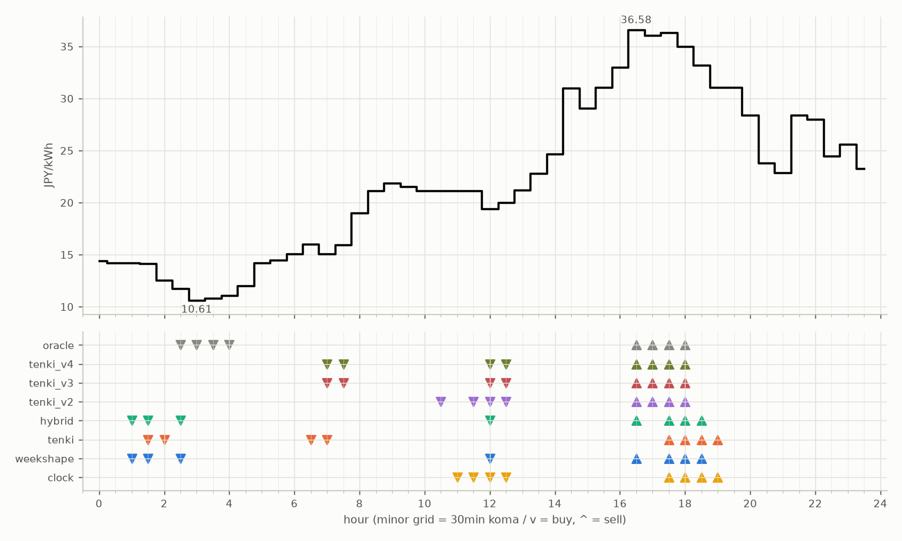

# JEPX仮想蓄電池 フォワード運用レポート

戦略凍結: 2026-08-12 / フォワード開始: 2026-08-14受渡分 / 生成: 2026-08-30 19:07 JST

> ⚠ 8/26受渡: **提出が届いていない**（picksファイルが無い＝strategies側のCIが落ちたか、pushが他のCIと衝突して失われた。気象とは別の原因）のため天気系4機体は**欠場**（実力ではなく計測の欠測。後日、予報アーカイブからBT補完される）
> ⚠ 8/28受渡: **提出が届いていない**（picksファイルが無い＝strategies側のCIが落ちたか、pushが他のCIと衝突して失われた。気象とは別の原因）のため天気系4機体は**欠場**（実力ではなく計測の欠測。後日、予報アーカイブからBT補完される）

## 累計成績（リーグ18日目）

| 機体 | 累計損益 | 事前でない日 | **対oracle（共通8日）** | 対oracle（各自の出場日） | 対clock差（pt） |
|---|---|---|---|---|---|
| hybrid | 1,844円 | 12%（2/16日・BT1日+再計算1日） | **87.4%** | 87.1% | +11.4 |
| tenki | 1,827円 | 12%（2/16日・BT1日+再計算1日） | **87.3%** | 86.2% | +10.5 |
| tenki_v3 | 1,614円 | 33%（5/15日・BT補完） | **85.0%** | 85.4% | +15.9 |
| tenki_v4 | 1,619円 | 47%（7/15日・BT補完） | **84.5%** | 84.5% | +15.7 |
| tenki_v2 | 1,750円 | 31%（5/16日・BT補完） | **81.3%** | 82.1% | +9.9 |
| weekshape | 2,150円 | 83%（15/18日・再計算） | — | — （参考 85.7%・事前3日） | — |
| clock | 1,982円 | 83%（15/18日・再計算） | — | — （参考 79.0%・事前3日） | — |
| oracle | 2,509円 | — | 100.0% | 100.0% | — |

累計損益は**BT補完込み**（参戦前の欠場日を、当時入手可能だったデータのみで再現したバックテストで補完）。**事前でない日**＝価格公表前にコミットされていない日。内訳は**BT補完**（参戦前の穴埋め）と**再計算**（提出が無く採点時にコードから作った日）。clockとweekshapeは2026-08-27まで提出型ではなかったため、それ以前は全日が再計算。**対oracle%と対clock差は事前コミット済みのフォワード日のみ**で計算——対oracle%は値幅のスケールを、対clock差（常設ベンチとの同日ペア差）は時代の取りやすさを一次補正する。

**順位は「対oracle（共通8日）」で付ける。** 「各自の出場日」の列は機体ごとに分母の日が違うので、**順位に使うと難しい日を欠場した機体ほど上に来る**——2026-08-29の敵対的レビューで実際にそうなっていた（tenki_v3が首位に見えていたが、同じ日で揃えるとtenkiとhybridが上）。参考として残すが、比較には使わない。

⚠ **共通日は8日しかない。順位は暫定。**

### 欠場の内訳

- **補完待ち**（10件）: 8/26 hybrid, 8/26 tenki, 8/26 tenki_v2, 8/26 tenki_v3, 8/26 tenki_v4, 8/28 hybrid, 8/28 tenki, 8/28 tenki_v2, 8/28 tenki_v3, 8/28 tenki_v4
  - 予報アーカイブ（約5日遅れ）の到着後に自動で埋まる。埋まれば全機体が同じ日で戦う
- **設計棄権**（2件）: 8/25 tenki_v3, 8/25 tenki_v4
  - 機体が理由つきで出場を辞退した日。**補完しない**——埋めると出さなかった予測を発明することになる

## 期間別（ISO週別、*=BT補完を含む）

| 週 | tenki | hybrid | clock | weekshape | tenki_v2 | tenki_v3 | tenki_v4 | oracle |
|---|---|---|---|---|---|---|---|---|
| 2026-W33 | 158 | 158 | 241 | 215 | 165* | 180* | 181* | 257 |
| 2026-W34 | 880* | 870* | 796 | 836 | 841* | 856* | 859* | 928 |
| 2026-W35 | 627 | 646 | 842 | 928 | 623 | 429 | 429 | 1,110 |
| 2026-W36 | 163 | 171 | 103 | 171 | 121 | 149 | 149 | 215 |

## 直接対決（全機体出場日 8日のみ）

| 機体 | 累計損益 | 対oracle |
|---|---|---|
| hybrid | 913円 | 87.4% |
| tenki | 912円 | 87.3% |
| tenki_v3 | 888円 | 85.0% |
| tenki_v4 | 882円 | 84.5% |
| weekshape | 850円 | 81.4% |
| tenki_v2 | 849円 | 81.3% |
| clock | 718円 | 68.8% |
| oracle | 1,044円 | 100.0% |
## 直近日の解剖（全日分は [daily_anatomy.md](daily_anatomy.md)）

### 2026-08-31（信号: 平常）

- 因子: 日射予報 555 W/m2 / 実測 未確定（実測は約5日遅れ） / 乖離 -91 W/m2（普段より曇る方向。直近28日平均 646、判定は絶対値 80 vs 閾値 195）
- 価格の形: 最安 03:00 10.61円 / 最高 16:30 36.58円 / 山谷比 3.4倍

| 機体 | 充電（買い） | 平均買値 | 放電（売り） | 平均売値 | 損益 |
|---|---|---|---|---|---|
| clock | 11:00, 11:30, 12:00, 12:30 | 20.41円 | 17:30, 18:00, 18:30, 19:00 | 33.89円 | +103円 |
| weekshape | 01:00, 01:30, 02:30, 12:00 | 14.87円 | 16:30, 17:30, 18:00, 18:30 | 35.27円 | +171円 |
| tenki | 01:30, 02:00, 06:30, 07:00 | 14.44円 | 17:30, 18:00, 18:30, 19:00 | 33.89円 | +163円 |
| tenki_v2 | 10:30, 11:30, 12:00, 12:30 | 20.41円 | 16:30, 17:00, 17:30, 18:00 | 35.98円 | +121円 |
| tenki_v3 | 07:00, 07:30, 12:00, 12:30 | 17.61円 | 16:30, 17:00, 17:30, 18:00 | 35.98円 | +149円 |
| tenki_v4 | 07:00, 07:30, 12:00, 12:30 | 17.61円 | 16:30, 17:00, 17:30, 18:00 | 35.98円 | +149円 |
| hybrid | 01:00, 01:30, 02:30, 12:00 | 14.87円 | 16:30, 17:30, 18:00, 18:30 | 35.27円 | +171円 |
| oracle | 02:30, 03:00, 03:30, 04:00 | 11.07円 | 16:30, 17:00, 17:30, 18:00 | 35.98円 | +215円 |

**48コマ価格（円/kWh。太字=最安/最高）**

| 00:00 | 00:30 | 01:00 | 01:30 | 02:00 | 02:30 | 03:00 | 03:30 | 04:00 | 04:30 | 05:00 | 05:30 | 06:00 | 06:30 | 07:00 | 07:30 | 08:00 | 08:30 | 09:00 | 09:30 | 10:00 | 10:30 | 11:00 | 11:30 |
|---|---|---|---|---|---|---|---|---|---|---|---|---|---|---|---|---|---|---|---|---|---|---|---|
| 14.44 | 14.19 | 14.22 | 14.12 | 12.57 | 11.73 | **10.61** | 10.83 | 11.11 | 12.00 | 14.19 | 14.49 | 15.07 | 15.98 | 15.07 | 15.96 | 19.00 | 21.11 | 21.84 | 21.56 | 21.11 | 21.11 | 21.11 | 21.11 |

| 12:00 | 12:30 | 13:00 | 13:30 | 14:00 | 14:30 | 15:00 | 15:30 | 16:00 | 16:30 | 17:00 | 17:30 | 18:00 | 18:30 | 19:00 | 19:30 | 20:00 | 20:30 | 21:00 | 21:30 | 22:00 | 22:30 | 23:00 | 23:30 |
|---|---|---|---|---|---|---|---|---|---|---|---|---|---|---|---|---|---|---|---|---|---|---|---|
| 19.40 | 20.00 | 21.18 | 22.82 | 24.64 | 31.00 | 29.09 | 31.06 | 33.01 | **36.58** | 36.04 | 36.32 | 35.00 | 33.18 | 31.06 | 31.06 | 28.37 | 23.77 | 22.84 | 28.37 | 28.00 | 24.49 | 25.62 | 23.30 |

## 明日のpicks（受渡日 2026-09-01、信号: 平常）

日射予報の乖離 -97 W/m2（普段より曇る方向。直近28日平均 646、判定は絶対値 97 vs 閾値 194）

| 機体 | 充電（買い） | 放電（売り） |
|---|---|---|
| clock | 11:00, 11:30, 12:00, 12:30 | 17:30, 18:00, 18:30, 19:00 |
| weekshape | 07:00, 10:00, 10:30, 12:00 | 17:00, 17:30, 18:00, 18:30 |
