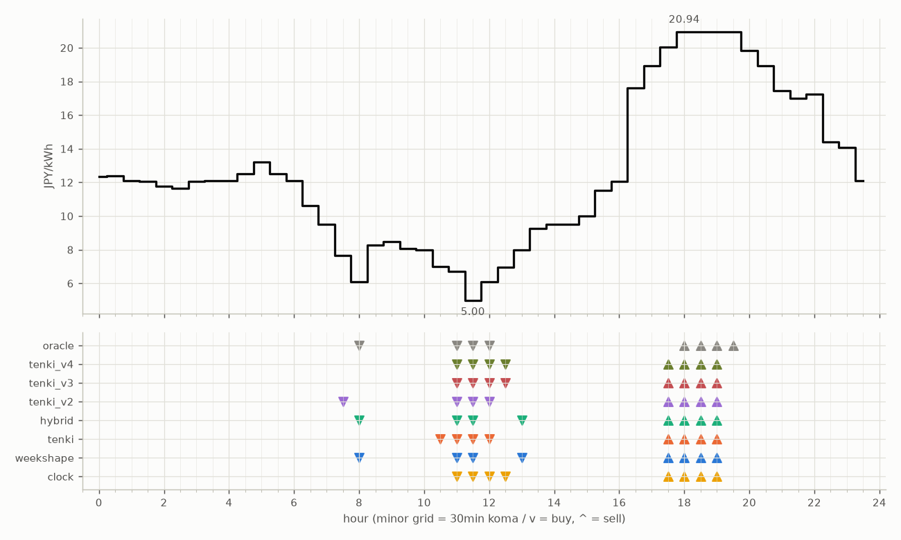

# JEPX仮想蓄電池 フォワード運用レポート

戦略凍結: 2026-08-12 / フォワード開始: 2026-08-14受渡分 / 生成: 2026-09-11 18:09 JST

## 累計成績（リーグ30日目）

| 機体 | 累計損益 | 事前でない日 | **対oracle（共通15日）** | 対oracle（各自の出場日） | 対clock差（pt） |
|---|---|---|---|---|---|
| tenki_v2 | 3,484円 | 23%（7/30日・BT補完） | **85.2%** | 85.7% | +25.5 |
| tenki_v3 | 3,547円 | 27%（8/30日・BT補完） | **85.2%** | 86.8% | +28.9 |
| tenki_v4 | 3,491円 | 33%（10/30日・BT補完） | **82.1%** | 84.3% | +28.0 |
| weekshape | 3,372円 | 50%（15/30日・再計算） | **79.8%** | 79.8% | +27.8 |
| tenki | 3,410円 | 13%（4/30日・BT3日+再計算1日） | **79.7%** | 83.2% | +20.0 |
| hybrid | 3,400円 | 13%（4/30日・BT3日+再計算1日） | **79.7%** | 83.3% | +20.1 |
| clock | 2,718円 | 50%（15/30日・再計算） | **52.0%** | 52.0% | +0.0 |
| oracle | 4,046円 | — | 100.0% | 100.0% | — |

累計損益は**BT補完込み**（参戦前の欠場日を、当時入手可能だったデータのみで再現したバックテストで補完）。**事前でない日**＝価格公表前にコミットされていない日。内訳は**BT補完**（参戦前の穴埋め）と**再計算**（提出が無く採点時にコードから作った日）。clockとweekshapeは2026-08-27まで提出型ではなかったため、それ以前は全日が再計算。**対oracle%と対clock差は事前コミット済みのフォワード日のみ**で計算——対oracle%は値幅のスケールを、対clock差（常設ベンチとの同日ペア差）は時代の取りやすさを一次補正する。

**順位は「対oracle（共通15日）」で付ける。** 「各自の出場日」の列は機体ごとに分母の日が違うので、**順位に使うと難しい日を欠場した機体ほど上に来る**——2026-08-29の敵対的レビューで実際にそうなっていた（tenki_v3が首位に見えていたが、同じ日で揃えるとtenkiとhybridが上）。参考として残すが、比較には使わない。

## 期間別（ISO週別、*=BT補完を含む）

| 週 | tenki | hybrid | clock | weekshape | tenki_v2 | tenki_v3 | tenki_v4 | oracle |
|---|---|---|---|---|---|---|---|---|
| 2026-W33 | 158 | 158 | 241 | 215 | 165* | 180* | 181* | 257 |
| 2026-W34 | 880* | 870* | 796 | 836 | 841* | 856* | 859* | 928 |
| 2026-W35 | 990* | 991* | 842 | 928 | 981* | 1,008* | 1,008* | 1,110 |
| 2026-W36 | 773 | 773 | 499 | 795 | 837 | 860 | 860 | 1,060 |
| 2026-W37 | 610 | 608 | 340 | 598 | 660 | 643 | 582 | 692 |

## 直接対決（全機体出場日 20日のみ）

| 機体 | 累計損益 | 対oracle |
|---|---|---|
| tenki_v3 | 2,242円 | 86.8% |
| tenki_v2 | 2,224円 | 86.1% |
| tenki_v4 | 2,176円 | 84.3% |
| tenki | 2,133円 | 82.6% |
| hybrid | 2,123円 | 82.2% |
| weekshape | 2,072円 | 80.3% |
| clock | 1,454円 | 56.3% |
| oracle | 2,581円 | 100.0% |
## 直近日の解剖（全日分は [daily_anatomy.md](daily_anatomy.md)）

### 2026-09-12（信号: 平常）

- 因子: 日射予報 456 W/m2 / 実測 未確定（実測は約5日遅れ） / 乖離 -105 W/m2（普段より曇る方向。直近28日平均 561、判定は絶対値 133 vs 閾値 195）
- 価格の形: 最安 11:30 5.00円 / 最高 18:00 20.94円 / 山谷比 4.2倍

| 機体 | 充電（買い） | 平均買値 | 放電（売り） | 平均売値 | 損益 |
|---|---|---|---|---|---|
| clock | 11:00, 11:30, 12:00, 12:30 | 6.19円 | 17:30, 18:00, 18:30, 19:00 | 20.71円 | +125円 |
| weekshape | 08:00, 11:00, 11:30, 13:00 | 6.45円 | 17:30, 18:00, 18:30, 19:00 | 20.71円 | +122円 |
| tenki | 10:30, 11:00, 11:30, 12:00 | 6.20円 | 17:30, 18:00, 18:30, 19:00 | 20.71円 | +125円 |
| tenki_v2 | 07:30, 11:00, 11:30, 12:00 | 6.37円 | 17:30, 18:00, 18:30, 19:00 | 20.71円 | +123円 |
| tenki_v3 | 11:00, 11:30, 12:00, 12:30 | 6.19円 | 17:30, 18:00, 18:30, 19:00 | 20.71円 | +125円 |
| tenki_v4 | 11:00, 11:30, 12:00, 12:30 | 6.19円 | 17:30, 18:00, 18:30, 19:00 | 20.71円 | +125円 |
| hybrid | 08:00, 11:00, 11:30, 13:00 | 6.45円 | 17:30, 18:00, 18:30, 19:00 | 20.71円 | +122円 |
| oracle | 08:00, 11:00, 11:30, 12:00 | 5.98円 | 18:00, 18:30, 19:00, 19:30 | 20.94円 | +129円 |

**48コマ価格（円/kWh。太字=最安/最高）**

| 00:00 | 00:30 | 01:00 | 01:30 | 02:00 | 02:30 | 03:00 | 03:30 | 04:00 | 04:30 | 05:00 | 05:30 | 06:00 | 06:30 | 07:00 | 07:30 | 08:00 | 08:30 | 09:00 | 09:30 | 10:00 | 10:30 | 11:00 | 11:30 |
|---|---|---|---|---|---|---|---|---|---|---|---|---|---|---|---|---|---|---|---|---|---|---|---|
| 12.36 | 12.40 | 12.12 | 12.07 | 11.76 | 11.64 | 12.06 | 12.12 | 12.12 | 12.51 | 13.21 | 12.51 | 12.12 | 10.60 | 9.50 | 7.66 | 6.10 | 8.26 | 8.50 | 8.08 | 8.00 | 7.00 | 6.71 | **5.00** |

| 12:00 | 12:30 | 13:00 | 13:30 | 14:00 | 14:30 | 15:00 | 15:30 | 16:00 | 16:30 | 17:00 | 17:30 | 18:00 | 18:30 | 19:00 | 19:30 | 20:00 | 20:30 | 21:00 | 21:30 | 22:00 | 22:30 | 23:00 | 23:30 |
|---|---|---|---|---|---|---|---|---|---|---|---|---|---|---|---|---|---|---|---|---|---|---|---|
| 6.10 | 6.94 | 8.00 | 9.28 | 9.51 | 9.51 | 10.02 | 11.53 | 12.08 | 17.61 | 18.93 | 20.04 | **20.94** | 20.94 | 20.94 | 20.94 | 19.83 | 18.93 | 17.45 | 17.00 | 17.23 | 14.42 | 14.07 | 12.12 |

## 明日のpicks（受渡日 2026-09-13、信号: 平常）

日射予報の乖離 -127 W/m2（普段より曇る方向。直近28日平均 561、判定は絶対値 127 vs 閾値 196）

| 機体 | 充電（買い） | 放電（売り） |
|---|---|---|
| clock | 11:00, 11:30, 12:00, 12:30 | 17:30, 18:00, 18:30, 19:00 |
| weekshape | 09:00, 10:00, 10:30, 11:00 | 18:00, 18:30, 19:00, 19:30 |
