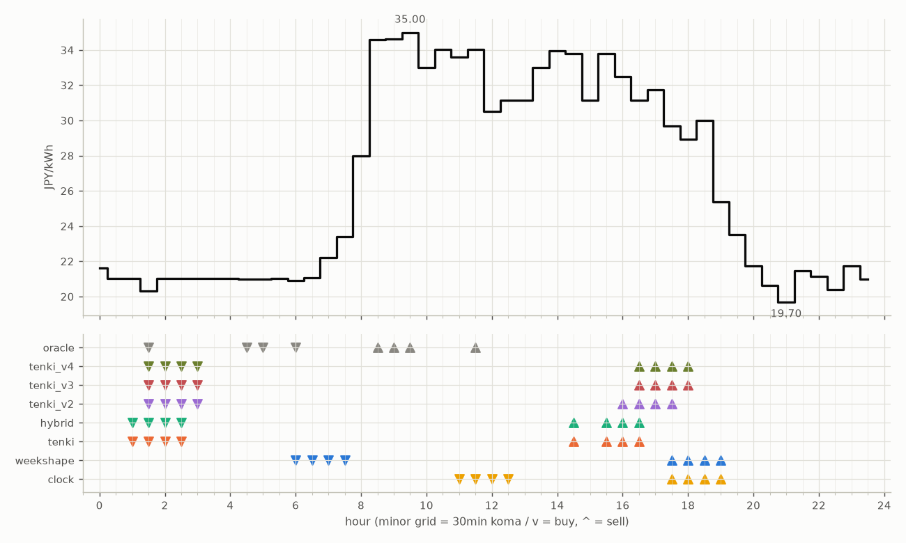

# JEPX仮想蓄電池 フォワード運用レポート

戦略凍結: 2026-08-12 / フォワード開始: 2026-08-14受渡分 / 生成: 2026-09-02 18:10 JST

> ⚠ 8/28受渡: **提出が届いていない**（picksファイルが無い＝strategies側のCIが落ちたか、pushが他のCIと衝突して失われた。気象とは別の原因）のため天気系4機体は**欠場**（実力ではなく計測の欠測。後日、予報アーカイブからBT補完される）

## 累計成績（リーグ21日目）

| 機体 | 累計損益 | 事前でない日 | **対oracle（共通6日）** | 対oracle（各自の出場日） | 対clock差（pt） |
|---|---|---|---|---|---|
| hybrid | 2,298円 | 11%（2/19日・BT1日+再計算1日） | **84.4%** | 86.8% | +17.6 |
| tenki | 2,289円 | 11%（2/19日・BT1日+再計算1日） | **84.2%** | 86.4% | +17.3 |
| tenki_v3 | 2,084円 | 28%（5/18日・BT補完） | **82.4%** | 86.3% | +23.5 |
| tenki_v4 | 2,088円 | 39%（7/18日・BT補完） | **82.4%** | 85.8% | +24.8 |
| weekshape | 2,556円 | 71%（15/21日・再計算） | **78.4%** | 78.4% | +23.4 |
| tenki_v2 | 2,187円 | 26%（5/19日・BT補完） | **77.3%** | 82.2% | +16.6 |
| clock | 2,226円 | 71%（15/21日・再計算） | **55.1%** | 55.1% | +0.0 |
| oracle | 3,039円 | — | 100.0% | 100.0% | — |

累計損益は**BT補完込み**（参戦前の欠場日を、当時入手可能だったデータのみで再現したバックテストで補完）。**事前でない日**＝価格公表前にコミットされていない日。内訳は**BT補完**（参戦前の穴埋め）と**再計算**（提出が無く採点時にコードから作った日）。clockとweekshapeは2026-08-27まで提出型ではなかったため、それ以前は全日が再計算。**対oracle%と対clock差は事前コミット済みのフォワード日のみ**で計算——対oracle%は値幅のスケールを、対clock差（常設ベンチとの同日ペア差）は時代の取りやすさを一次補正する。

**順位は「対oracle（共通6日）」で付ける。** 「各自の出場日」の列は機体ごとに分母の日が違うので、**順位に使うと難しい日を欠場した機体ほど上に来る**——2026-08-29の敵対的レビューで実際にそうなっていた（tenki_v3が首位に見えていたが、同じ日で揃えるとtenkiとhybridが上）。参考として残すが、比較には使わない。

⚠ **共通日は6日しかない。順位は暫定。**

### 欠場の内訳

- **補完待ち**（10件）: 8/26 hybrid, 8/26 tenki, 8/26 tenki_v2, 8/26 tenki_v3, 8/26 tenki_v4, 8/28 hybrid, 8/28 tenki, 8/28 tenki_v2, 8/28 tenki_v3, 8/28 tenki_v4
  - 予報アーカイブ（約5日遅れ）の到着後に自動で埋まる。埋まれば全機体が同じ日で戦う
- **設計棄権**（2件）: 8/25 tenki_v3, 8/25 tenki_v4
  - 機体が理由つきで出場を辞退した日。**補完しない**——埋めると出さなかった予測を発明することになる

## 期間別（ISO週別、*=BT補完を含む）

| 週 | tenki | hybrid | clock | weekshape | tenki_v2 | tenki_v3 | tenki_v4 | oracle |
|---|---|---|---|---|---|---|---|---|
| 2026-W33 | 158 | 158 | 241 | 215 | 165* | 180* | 181* | 257 |
| 2026-W34 | 880* | 870* | 796 | 836 | 841* | 856* | 859* | 928 |
| 2026-W35 | 627 | 646 | 842 | 928 | 623 | 429 | 429 | 1,110 |
| 2026-W36 | 625 | 625 | 346 | 576 | 558 | 619 | 619 | 745 |

## 直接対決（全機体出場日 11日のみ）

| 機体 | 累計損益 | 対oracle |
|---|---|---|
| tenki | 1,374円 | 87.3% |
| hybrid | 1,367円 | 86.8% |
| tenki_v3 | 1,357円 | 86.2% |
| tenki_v4 | 1,352円 | 85.8% |
| tenki_v2 | 1,286円 | 81.7% |
| weekshape | 1,255円 | 79.7% |
| clock | 961円 | 61.1% |
| oracle | 1,575円 | 100.0% |
## 直近日の解剖（全日分は [daily_anatomy.md](daily_anatomy.md)）

### 2026-09-03（信号: 強）

- 因子: 日射予報 179 W/m2 / 実測 未確定（実測は約5日遅れ） / 乖離 -452 W/m2（普段より曇る方向。直近28日平均 631、判定は絶対値 467 vs 閾値 194）
- 価格の形: 最安 21:00 19.70円 / 最高 09:30 35.00円 / 山谷比 1.8倍

| 機体 | 充電（買い） | 平均買値 | 放電（売り） | 平均売値 | 損益 |
|---|---|---|---|---|---|
| clock | 11:00, 11:30, 12:00, 12:30 | 32.32円 | 17:30, 18:00, 18:30, 19:00 | 28.49円 | -65円 |
| weekshape | 06:00, 06:30, 07:00, 07:30 | 21.89円 | 17:30, 18:00, 18:30, 19:00 | 28.49円 | +40円 |
| tenki | 01:00, 01:30, 02:00, 02:30 | 20.86円 | 14:30, 15:30, 16:00, 16:30 | 32.81円 | +88円 |
| tenki_v2 | 01:30, 02:00, 02:30, 03:00 | 20.86円 | 16:00, 16:30, 17:00, 17:30 | 31.27円 | +74円 |
| tenki_v3 | 01:30, 02:00, 02:30, 03:00 | 20.86円 | 16:30, 17:00, 17:30, 18:00 | 30.37円 | +66円 |
| tenki_v4 | 01:30, 02:00, 02:30, 03:00 | 20.86円 | 16:30, 17:00, 17:30, 18:00 | 30.37円 | +66円 |
| hybrid | 01:00, 01:30, 02:00, 02:30 | 20.86円 | 14:30, 15:30, 16:00, 16:30 | 32.81円 | +88円 |
| oracle | 01:30, 04:30, 05:00, 06:00 | 20.81円 | 08:30, 09:00, 09:30, 11:30 | 34.56円 | +104円 |

**48コマ価格（円/kWh。太字=最安/最高）**

| 00:00 | 00:30 | 01:00 | 01:30 | 02:00 | 02:30 | 03:00 | 03:30 | 04:00 | 04:30 | 05:00 | 05:30 | 06:00 | 06:30 | 07:00 | 07:30 | 08:00 | 08:30 | 09:00 | 09:30 | 10:00 | 10:30 | 11:00 | 11:30 |
|---|---|---|---|---|---|---|---|---|---|---|---|---|---|---|---|---|---|---|---|---|---|---|---|
| 21.63 | 21.04 | 21.04 | 20.33 | 21.04 | 21.04 | 21.04 | 21.04 | 21.04 | 21.00 | 21.00 | 21.01 | 20.91 | 21.07 | 22.20 | 23.39 | 28.00 | 34.60 | 34.62 | **35.00** | 32.99 | 34.02 | 33.60 | 34.03 |

| 12:00 | 12:30 | 13:00 | 13:30 | 14:00 | 14:30 | 15:00 | 15:30 | 16:00 | 16:30 | 17:00 | 17:30 | 18:00 | 18:30 | 19:00 | 19:30 | 20:00 | 20:30 | 21:00 | 21:30 | 22:00 | 22:30 | 23:00 | 23:30 |
|---|---|---|---|---|---|---|---|---|---|---|---|---|---|---|---|---|---|---|---|---|---|---|---|
| 30.50 | 31.16 | 31.16 | 32.99 | 33.97 | 33.80 | 31.16 | 33.80 | 32.50 | 31.16 | 31.74 | 29.67 | 28.92 | 30.00 | 25.37 | 23.52 | 21.74 | 20.61 | **19.70** | 21.47 | 21.13 | 20.40 | 21.74 | 20.98 |

## 明日のpicks（受渡日 2026-09-04、信号: 強）

日射予報の乖離 -486 W/m2（普段より曇る方向。直近28日平均 631、判定は絶対値 486 vs 閾値 194）

| 機体 | 充電（買い） | 放電（売り） |
|---|---|---|
| clock | 11:00, 11:30, 12:00, 12:30 | 17:30, 18:00, 18:30, 19:00 |
| weekshape | 01:00, 06:30, 07:00, 12:00 | 17:00, 17:30, 18:00, 18:30 |
