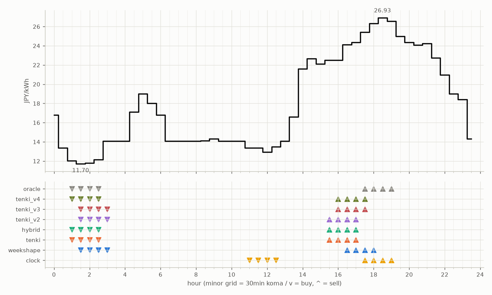

# JEPX仮想蓄電池 フォワード運用レポート

戦略凍結: 2026-08-12 / フォワード開始: 2026-08-14受渡分 / 生成: 2026-09-20 18:29 JST

## 累計成績（リーグ39日目）

| 機体 | 累計損益 | 事前でない日 | **対oracle（共通24日）** | 対oracle（各自の出場日） | 対clock差（pt） |
|---|---|---|---|---|---|
| tenki_v3 | 4,607円 | 21%（8/39日・BT補完） | **88.5%** | 88.9% | +25.7 |
| tenki_v2 | 4,527円 | 18%（7/39日・BT補完） | **88.0%** | 87.6% | +22.9 |
| tenki_v4 | 4,543円 | 26%（10/39日・BT補完） | **86.2%** | 87.1% | +24.5 |
| weekshape | 4,280円 | 38%（15/39日・再計算） | **80.1%** | 80.1% | +19.2 |
| tenki | 4,267円 | 10%（4/39日・BT3日+再計算1日） | **78.5%** | 81.5% | +14.9 |
| hybrid | 4,198円 | 10%（4/39日・BT3日+再計算1日） | **76.6%** | 80.3% | +13.7 |
| clock | 3,582円 | 38%（15/39日・再計算） | **60.9%** | 60.9% | +0.0 |
| oracle | 5,170円 | — | 100.0% | 100.0% | — |

累計損益は**BT補完込み**（参戦前の欠場日を、当時入手可能だったデータのみで再現したバックテストで補完）。**事前でない日**＝価格公表前にコミットされていない日。内訳は**BT補完**（参戦前の穴埋め）と**再計算**（提出が無く採点時にコードから作った日）。clockとweekshapeは2026-08-27まで提出型ではなかったため、それ以前は全日が再計算。**対oracle%と対clock差は事前コミット済みのフォワード日のみ**で計算——対oracle%は値幅のスケールを、対clock差（常設ベンチとの同日ペア差）は時代の取りやすさを一次補正する。

**順位は「対oracle（共通24日）」で付ける。** 「各自の出場日」の列は機体ごとに分母の日が違うので、**順位に使うと難しい日を欠場した機体ほど上に来る**——2026-08-29の敵対的レビューで実際にそうなっていた（tenki_v3が首位に見えていたが、同じ日で揃えるとtenkiとhybridが上）。参考として残すが、比較には使わない。

## 期間別（ISO週別、*=BT補完を含む）

| 週 | tenki | hybrid | clock | weekshape | tenki_v2 | tenki_v3 | tenki_v4 | oracle |
|---|---|---|---|---|---|---|---|---|
| 2026-W33 | 158 | 158 | 241 | 215 | 165* | 180* | 181* | 257 |
| 2026-W34 | 880* | 870* | 796 | 836 | 841* | 856* | 859* | 928 |
| 2026-W35 | 990* | 991* | 842 | 928 | 981* | 1,008* | 1,008* | 1,110 |
| 2026-W36 | 773 | 773 | 499 | 795 | 837 | 860 | 860 | 1,060 |
| 2026-W37 | 731 | 724 | 465 | 714 | 775 | 764 | 707 | 817 |
| 2026-W38 | 644 | 591 | 635 | 690 | 841 | 847 | 829 | 880 |
| 2026-W39 | 91 | 91 | 104 | 101 | 86 | 93 | 98 | 118 |

## 直接対決（全機体出場日 29日のみ）

| 機体 | 累計損益 | 対oracle |
|---|---|---|
| tenki_v3 | 3,302円 | 89.1% |
| tenki_v2 | 3,267円 | 88.2% |
| tenki_v4 | 3,227円 | 87.1% |
| tenki | 2,989円 | 80.7% |
| weekshape | 2,980円 | 80.4% |
| hybrid | 2,922円 | 78.9% |
| clock | 2,318円 | 62.6% |
| oracle | 3,705円 | 100.0% |
## 直近日の解剖（全日分は [daily_anatomy.md](daily_anatomy.md)）

### 2026-09-21（信号: 強）

- 因子: 日射予報 232 W/m2 / 実測 未確定（実測は約5日遅れ） / 乖離 -286 W/m2（普段より曇る方向。判定時の直近28日平均 519、判定は絶対値 286 vs 閾値 199）
- 価格の形: 最安 01:30 11.70円 / 最高 18:30 26.93円 / 山谷比 2.3倍

| 機体 | 充電（買い） | 平均買値 | 放電（売り） | 平均売値 | 損益 |
|---|---|---|---|---|---|
| clock | 11:00, 11:30, 12:00, 12:30 | 13.30円 | 17:30, 18:00, 18:30, 19:00 | 26.30円 | +104円 |
| weekshape | 01:30, 02:00, 02:30, 03:00 | 12.44円 | 16:30, 17:00, 17:30, 18:00 | 25.06円 | +101円 |
| tenki | 01:00, 01:30, 02:00, 02:30 | 11.92円 | 15:30, 16:00, 16:30, 17:00 | 23.37円 | +91円 |
| tenki_v2 | 01:30, 02:00, 02:30, 03:00 | 12.44円 | 15:30, 16:00, 16:30, 17:00 | 23.37円 | +86円 |
| tenki_v3 | 01:30, 02:00, 02:30, 03:00 | 12.44円 | 16:00, 16:30, 17:00, 17:30 | 24.10円 | +93円 |
| tenki_v4 | 01:00, 01:30, 02:00, 02:30 | 11.92円 | 16:00, 16:30, 17:00, 17:30 | 24.10円 | +98円 |
| hybrid | 01:00, 01:30, 02:00, 02:30 | 11.92円 | 15:30, 16:00, 16:30, 17:00 | 23.37円 | +91円 |
| oracle | 01:00, 01:30, 02:00, 02:30 | 11.92円 | 17:30, 18:00, 18:30, 19:00 | 26.30円 | +118円 |

**48コマ価格（円/kWh。太字=最安/最高）**

| 00:00 | 00:30 | 01:00 | 01:30 | 02:00 | 02:30 | 03:00 | 03:30 | 04:00 | 04:30 | 05:00 | 05:30 | 06:00 | 06:30 | 07:00 | 07:30 | 08:00 | 08:30 | 09:00 | 09:30 | 10:00 | 10:30 | 11:00 | 11:30 |
|---|---|---|---|---|---|---|---|---|---|---|---|---|---|---|---|---|---|---|---|---|---|---|---|
| 16.81 | 13.39 | 12.02 | **11.70** | 11.81 | 12.16 | 14.08 | 14.08 | 14.08 | 17.10 | 19.00 | 18.00 | 16.81 | 14.10 | 14.08 | 14.08 | 14.10 | 14.12 | 14.30 | 14.08 | 14.10 | 14.08 | 13.39 | 13.39 |

| 12:00 | 12:30 | 13:00 | 13:30 | 14:00 | 14:30 | 15:00 | 15:30 | 16:00 | 16:30 | 17:00 | 17:30 | 18:00 | 18:30 | 19:00 | 19:30 | 20:00 | 20:30 | 21:00 | 21:30 | 22:00 | 22:30 | 23:00 | 23:30 |
|---|---|---|---|---|---|---|---|---|---|---|---|---|---|---|---|---|---|---|---|---|---|---|---|
| 12.94 | 13.50 | 14.08 | 16.61 | 21.58 | 22.66 | 22.13 | 22.50 | 22.50 | 24.12 | 24.37 | 25.42 | 26.32 | **26.93** | 26.55 | 25.00 | 24.35 | 24.09 | 24.22 | 22.73 | 20.96 | 19.00 | 18.42 | 14.30 |

## 明日のpicks（受渡日 2026-09-22、信号: 平常）

日射予報の乖離 +113 W/m2（普段より晴れる方向。判定時の直近28日平均 505、判定は絶対値 113 vs 閾値 199）

| 機体 | 充電（買い） | 放電（売り） |
|---|---|---|
| clock | 11:00, 11:30, 12:00, 12:30 | 17:30, 18:00, 18:30, 19:00 |
| weekshape | 01:30, 02:00, 02:30, 03:00 | 16:30, 17:00, 17:30, 18:00 |
