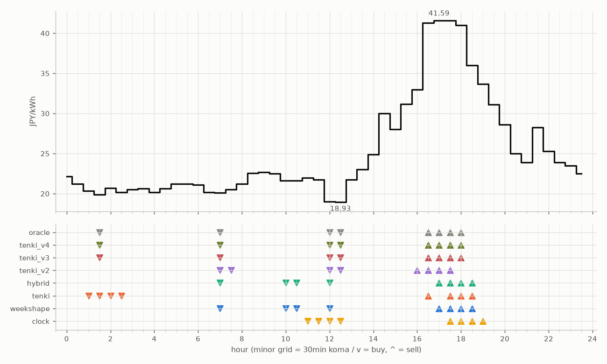

# JEPX仮想蓄電池 フォワード運用レポート

戦略凍結: 2026-08-12 / フォワード開始: 2026-08-14受渡分 / 生成: 2026-08-31 20:05 JST

> ⚠ 8/26受渡: **提出が届いていない**（picksファイルが無い＝strategies側のCIが落ちたか、pushが他のCIと衝突して失われた。気象とは別の原因）のため天気系4機体は**欠場**（実力ではなく計測の欠測。後日、予報アーカイブからBT補完される）
> ⚠ 8/28受渡: **提出が届いていない**（picksファイルが無い＝strategies側のCIが落ちたか、pushが他のCIと衝突して失われた。気象とは別の原因）のため天気系4機体は**欠場**（実力ではなく計測の欠測。後日、予報アーカイブからBT補完される）

## 累計成績（リーグ19日目）

| 機体 | 累計損益 | 事前でない日 | **対oracle（共通4日）** | 対oracle（各自の出場日） | 対clock差（pt） |
|---|---|---|---|---|---|
| hybrid | 2,002円 | 12%（2/17日・BT1日+再計算1日） | **84.3%** | 87.2% | +11.1 |
| tenki | 1,987円 | 12%（2/17日・BT1日+再計算1日） | **83.3%** | 86.5% | +10.5 |
| weekshape | 2,308円 | 79%（15/19日・再計算） | **82.7%** | 82.7% | +13.5 |
| tenki_v3 | 1,793円 | 31%（5/16日・BT補完） | **82.3%** | 87.1% | +16.5 |
| tenki_v4 | 1,798円 | 44%（7/16日・BT補完） | **82.3%** | 86.7% | +16.4 |
| tenki_v2 | 1,908円 | 29%（5/17日・BT補完） | **76.1%** | 82.7% | +9.8 |
| clock | 2,124円 | 79%（15/19日・再計算） | **69.2%** | 69.2% | +0.0 |
| oracle | 2,688円 | — | 100.0% | 100.0% | — |

累計損益は**BT補完込み**（参戦前の欠場日を、当時入手可能だったデータのみで再現したバックテストで補完）。**事前でない日**＝価格公表前にコミットされていない日。内訳は**BT補完**（参戦前の穴埋め）と**再計算**（提出が無く採点時にコードから作った日）。clockとweekshapeは2026-08-27まで提出型ではなかったため、それ以前は全日が再計算。**対oracle%と対clock差は事前コミット済みのフォワード日のみ**で計算——対oracle%は値幅のスケールを、対clock差（常設ベンチとの同日ペア差）は時代の取りやすさを一次補正する。

**順位は「対oracle（共通4日）」で付ける。** 「各自の出場日」の列は機体ごとに分母の日が違うので、**順位に使うと難しい日を欠場した機体ほど上に来る**——2026-08-29の敵対的レビューで実際にそうなっていた（tenki_v3が首位に見えていたが、同じ日で揃えるとtenkiとhybridが上）。参考として残すが、比較には使わない。

⚠ **共通日は4日しかない。順位は暫定。**

### 欠場の内訳

- **補完待ち**（10件）: 8/26 hybrid, 8/26 tenki, 8/26 tenki_v2, 8/26 tenki_v3, 8/26 tenki_v4, 8/28 hybrid, 8/28 tenki, 8/28 tenki_v2, 8/28 tenki_v3, 8/28 tenki_v4
  - 予報アーカイブ（約5日遅れ）の到着後に自動で埋まる。埋まれば全機体が同じ日で戦う
- **設計棄権**（2件）: 8/25 tenki_v3, 8/25 tenki_v4
  - 機体が理由つきで出場を辞退した日。**補完しない**——埋めると出さなかった予測を発明することになる

## 期間別（ISO週別、*=BT補完を含む）

| 週 | tenki | hybrid | clock | weekshape | tenki_v2 | tenki_v3 | tenki_v4 | oracle |
|---|---|---|---|---|---|---|---|---|
| 2026-W33 | 158 | 158 | 241 | 215 | 165* | 180* | 181* | 257 |
| 2026-W34 | 880* | 870* | 796 | 836 | 841* | 856* | 859* | 928 |
| 2026-W35 | 627 | 646 | 842 | 928 | 623 | 429 | 429 | 1,110 |
| 2026-W36 | 323 | 328 | 245 | 328 | 279 | 328 | 328 | 393 |

## 直接対決（全機体出場日 9日のみ）

| 機体 | 累計損益 | 対oracle |
|---|---|---|
| tenki | 1,072円 | 87.7% |
| hybrid | 1,071円 | 87.5% |
| tenki_v3 | 1,066円 | 87.2% |
| tenki_v4 | 1,061円 | 86.7% |
| weekshape | 1,007円 | 82.4% |
| tenki_v2 | 1,007円 | 82.3% |
| clock | 860円 | 70.3% |
| oracle | 1,223円 | 100.0% |
## 直近日の解剖（全日分は [daily_anatomy.md](daily_anatomy.md)）

### 2026-09-01（信号: 平常）

- 因子: 日射予報 497 W/m2 / 実測 未確定（実測は約5日遅れ） / 乖離 -149 W/m2（普段より曇る方向。直近28日平均 646、判定は絶対値 149 vs 閾値 194）
- 価格の形: 最安 12:30 18.93円 / 最高 17:00 41.59円 / 山谷比 2.2倍

| 機体 | 充電（買い） | 平均買値 | 放電（売り） | 平均売値 | 損益 |
|---|---|---|---|---|---|
| clock | 11:00, 11:30, 12:00, 12:30 | 20.42円 | 17:30, 18:00, 18:30, 19:00 | 38.07円 | +141円 |
| weekshape | 07:00, 10:00, 10:30, 12:00 | 20.58円 | 17:00, 17:30, 18:00, 18:30 | 40.05円 | +158円 |
| tenki | 01:00, 01:30, 02:00, 02:30 | 20.27円 | 16:30, 17:30, 18:00, 18:30 | 39.98円 | +160円 |
| tenki_v2 | 07:00, 07:30, 12:00, 12:30 | 19.64円 | 16:00, 16:30, 17:00, 17:30 | 39.37円 | +158円 |
| tenki_v3 | 01:30, 07:00, 12:00, 12:30 | 19.47円 | 16:30, 17:00, 17:30, 18:00 | 41.37円 | +179円 |
| tenki_v4 | 01:30, 07:00, 12:00, 12:30 | 19.47円 | 16:30, 17:00, 17:30, 18:00 | 41.37円 | +179円 |
| hybrid | 07:00, 10:00, 10:30, 12:00 | 20.58円 | 17:00, 17:30, 18:00, 18:30 | 40.05円 | +158円 |
| oracle | 01:30, 07:00, 12:00, 12:30 | 19.47円 | 16:30, 17:00, 17:30, 18:00 | 41.37円 | +179円 |

**48コマ価格（円/kWh。太字=最安/最高）**

| 00:00 | 00:30 | 01:00 | 01:30 | 02:00 | 02:30 | 03:00 | 03:30 | 04:00 | 04:30 | 05:00 | 05:30 | 06:00 | 06:30 | 07:00 | 07:30 | 08:00 | 08:30 | 09:00 | 09:30 | 10:00 | 10:30 | 11:00 | 11:30 |
|---|---|---|---|---|---|---|---|---|---|---|---|---|---|---|---|---|---|---|---|---|---|---|---|
| 22.15 | 21.20 | 20.36 | 19.85 | 20.71 | 20.15 | 20.53 | 20.64 | 20.15 | 20.64 | 21.20 | 21.20 | 21.09 | 20.15 | 20.10 | 20.52 | 21.23 | 22.53 | 22.70 | 22.50 | 21.60 | 21.60 | 22.00 | 21.74 |

| 12:00 | 12:30 | 13:00 | 13:30 | 14:00 | 14:30 | 15:00 | 15:30 | 16:00 | 16:30 | 17:00 | 17:30 | 18:00 | 18:30 | 19:00 | 19:30 | 20:00 | 20:30 | 21:00 | 21:30 | 22:00 | 22:30 | 23:00 | 23:30 |
|---|---|---|---|---|---|---|---|---|---|---|---|---|---|---|---|---|---|---|---|---|---|---|---|
| 19.00 | **18.93** | 21.74 | 23.02 | 24.88 | 30.00 | 28.00 | 31.16 | 32.99 | 41.31 | **41.59** | 41.58 | 41.00 | 36.01 | 33.69 | 31.10 | 28.58 | 25.00 | 23.89 | 28.27 | 25.28 | 23.88 | 23.51 | 22.47 |

## 明日のpicks（受渡日 2026-09-02、信号: 平常）

日射予報の乖離 -109 W/m2（普段より曇る方向。直近28日平均 646、判定は絶対値 109 vs 閾値 194）

| 機体 | 充電（買い） | 放電（売り） |
|---|---|---|
| clock | 11:00, 11:30, 12:00, 12:30 | 17:30, 18:00, 18:30, 19:00 |
| weekshape | 06:30, 07:00, 07:30, 08:00 | 17:00, 17:30, 18:00, 18:30 |
