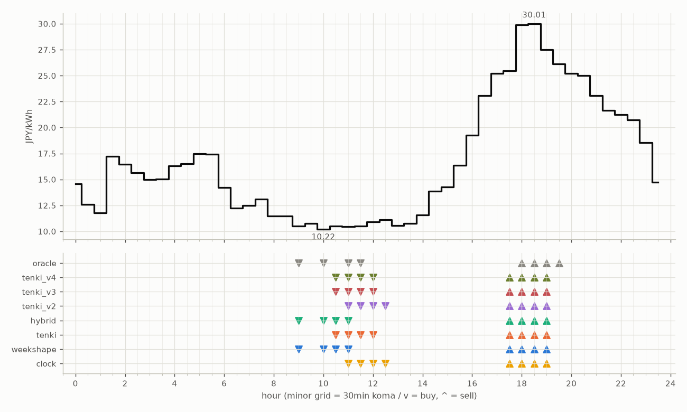

# JEPX仮想蓄電池 フォワード運用レポート

戦略凍結: 2026-08-12 / フォワード開始: 2026-08-14受渡分 / 生成: 2026-08-29 20:19 JST

> ⚠ 8/26受渡: **提出が届いていない**（picksファイルが無い＝strategies側のCIが落ちたか、pushが他のCIと衝突して失われた。気象とは別の原因）のため天気系4機体は**欠場**（実力ではなく計測の欠測。後日、予報アーカイブからBT補完される）
> ⚠ 8/28受渡: **提出が届いていない**（picksファイルが無い＝strategies側のCIが落ちたか、pushが他のCIと衝突して失われた。気象とは別の原因）のため天気系4機体は**欠場**（実力ではなく計測の欠測。後日、予報アーカイブからBT補完される）

## 累計成績（リーグ17日目）

| 機体 | 累計損益 | 事前でない日 | **対oracle（共通7日）** | 対oracle（各自の出場日） | 対clock差（pt） |
|---|---|---|---|---|---|
| tenki | 1,664円 | 13%（2/15日・BT1日+再計算1日） | **90.3%** | 87.6% | +8.3 |
| hybrid | 1,673円 | 13%（2/15日・BT1日+再計算1日） | **89.5%** | 88.0% | +8.8 |
| tenki_v3 | 1,465円 | 36%（5/14日・BT補完） | **89.0%** | 88.4% | +14.9 |
| tenki_v4 | 1,470円 | 50%（7/14日・BT補完） | **88.3%** | 88.3% | +14.2 |
| tenki_v2 | 1,629円 | 33%（5/15日・BT補完） | **87.7%** | 86.1% | +10.1 |
| weekshape | 1,979円 | 88%（15/17日・再計算） | — | — （参考 86.3%・事前2日） | — |
| clock | 1,879円 | 88%（15/17日・再計算） | — | — （参考 81.9%・事前2日） | — |
| oracle | 2,294円 | — | 100.0% | 100.0% | — |

累計損益は**BT補完込み**（参戦前の欠場日を、当時入手可能だったデータのみで再現したバックテストで補完）。**事前でない日**＝価格公表前にコミットされていない日。内訳は**BT補完**（参戦前の穴埋め）と**再計算**（提出が無く採点時にコードから作った日）。clockとweekshapeは2026-08-27まで提出型ではなかったため、それ以前は全日が再計算。**対oracle%と対clock差は事前コミット済みのフォワード日のみ**で計算——対oracle%は値幅のスケールを、対clock差（常設ベンチとの同日ペア差）は時代の取りやすさを一次補正する。

**順位は「対oracle（共通7日）」で付ける。** 「各自の出場日」の列は機体ごとに分母の日が違うので、**順位に使うと難しい日を欠場した機体ほど上に来る**——2026-08-29の敵対的レビューで実際にそうなっていた（tenki_v3が首位に見えていたが、同じ日で揃えるとtenkiとhybridが上）。参考として残すが、比較には使わない。

⚠ **共通日は7日しかない。順位は暫定。**

### 欠場の内訳

- **補完待ち**（10件）: 8/26 hybrid, 8/26 tenki, 8/26 tenki_v2, 8/26 tenki_v3, 8/26 tenki_v4, 8/28 hybrid, 8/28 tenki, 8/28 tenki_v2, 8/28 tenki_v3, 8/28 tenki_v4
  - 予報アーカイブ（約5日遅れ）の到着後に自動で埋まる。埋まれば全機体が同じ日で戦う
- **設計棄権**（2件）: 8/25 tenki_v3, 8/25 tenki_v4
  - 機体が理由つきで出場を辞退した日。**補完しない**——埋めると出さなかった予測を発明することになる

## 期間別（ISO週別、*=BT補完を含む）

| 週 | tenki | hybrid | clock | weekshape | tenki_v2 | tenki_v3 | tenki_v4 | oracle |
|---|---|---|---|---|---|---|---|---|
| 2026-W33 | 158 | 158 | 241 | 215 | 165* | 180* | 181* | 257 |
| 2026-W34 | 880* | 870* | 796 | 836 | 841* | 856* | 859* | 928 |
| 2026-W35 | 627 | 646 | 842 | 928 | 623 | 429 | 429 | 1,110 |

## 直接対決（全機体出場日 7日のみ）

| 機体 | 累計損益 | 対oracle |
|---|---|---|
| tenki | 749円 | 90.3% |
| hybrid | 742円 | 89.5% |
| tenki_v3 | 738円 | 89.0% |
| tenki_v4 | 733円 | 88.3% |
| tenki_v2 | 728円 | 87.7% |
| weekshape | 679円 | 81.9% |
| clock | 615円 | 74.2% |
| oracle | 830円 | 100.0% |
## 直近日の解剖（全日分は [daily_anatomy.md](daily_anatomy.md)）

### 2026-08-30（信号: 平常）

- 因子: 日射予報 451 W/m2 / 実測 未確定（実測は約5日遅れ） / 乖離 -184 W/m2（普段より曇る方向。直近28日平均 635、判定は絶対値 184 vs 閾値 195）
- 価格の形: 最安 10:00 10.22円 / 最高 18:30 30.01円 / 山谷比 2.9倍

| 機体 | 充電（買い） | 平均買値 | 放電（売り） | 平均売値 | 損益 |
|---|---|---|---|---|---|
| clock | 11:00, 11:30, 12:00, 12:30 | 10.76円 | 17:30, 18:00, 18:30, 19:00 | 28.22円 | +147円 |
| weekshape | 09:00, 10:00, 10:30, 11:00 | 10.44円 | 17:30, 18:00, 18:30, 19:00 | 28.22円 | +151円 |
| tenki | 10:30, 11:00, 11:30, 12:00 | 10.61円 | 17:30, 18:00, 18:30, 19:00 | 28.22円 | +149円 |
| tenki_v2 | 11:00, 11:30, 12:00, 12:30 | 10.76円 | 17:30, 18:00, 18:30, 19:00 | 28.22円 | +147円 |
| tenki_v3 | 10:30, 11:00, 11:30, 12:00 | 10.61円 | 17:30, 18:00, 18:30, 19:00 | 28.22円 | +149円 |
| tenki_v4 | 10:30, 11:00, 11:30, 12:00 | 10.61円 | 17:30, 18:00, 18:30, 19:00 | 28.22円 | +149円 |
| hybrid | 09:00, 10:00, 10:30, 11:00 | 10.44円 | 17:30, 18:00, 18:30, 19:00 | 28.22円 | +151円 |
| oracle | 09:00, 10:00, 11:00, 11:30 | 10.43円 | 18:00, 18:30, 19:00, 19:30 | 28.39円 | +153円 |

**48コマ価格（円/kWh。太字=最安/最高）**

| 00:00 | 00:30 | 01:00 | 01:30 | 02:00 | 02:30 | 03:00 | 03:30 | 04:00 | 04:30 | 05:00 | 05:30 | 06:00 | 06:30 | 07:00 | 07:30 | 08:00 | 08:30 | 09:00 | 09:30 | 10:00 | 10:30 | 11:00 | 11:30 |
|---|---|---|---|---|---|---|---|---|---|---|---|---|---|---|---|---|---|---|---|---|---|---|---|
| 14.56 | 12.57 | 11.76 | 17.21 | 16.45 | 15.66 | 15.00 | 15.01 | 16.32 | 16.50 | 17.46 | 17.44 | 14.22 | 12.24 | 12.50 | 13.11 | 11.47 | 11.48 | 10.52 | 10.76 | **10.22** | 10.53 | 10.48 | 10.52 |

| 12:00 | 12:30 | 13:00 | 13:30 | 14:00 | 14:30 | 15:00 | 15:30 | 16:00 | 16:30 | 17:00 | 17:30 | 18:00 | 18:30 | 19:00 | 19:30 | 20:00 | 20:30 | 21:00 | 21:30 | 22:00 | 22:30 | 23:00 | 23:30 |
|---|---|---|---|---|---|---|---|---|---|---|---|---|---|---|---|---|---|---|---|---|---|---|---|
| 10.90 | 11.14 | 10.54 | 10.76 | 11.55 | 13.84 | 14.25 | 16.35 | 19.24 | 23.08 | 25.20 | 25.48 | 29.90 | **30.01** | 27.50 | 26.14 | 25.20 | 25.00 | 23.06 | 21.64 | 21.23 | 20.71 | 18.52 | 14.73 |

## 明日のpicks（受渡日 2026-08-31、信号: 平常）

日射予報の乖離 +7 W/m2（普段より晴れる方向。直近28日平均 635、判定は絶対値 7 vs 閾値 195）

| 機体 | 充電（買い） | 放電（売り） |
|---|---|---|
| clock | 11:00, 11:30, 12:00, 12:30 | 17:30, 18:00, 18:30, 19:00 |
| weekshape | 01:00, 01:30, 02:30, 12:00 | 16:30, 17:30, 18:00, 18:30 |
| tenki | 01:30, 02:00, 06:30, 07:00 | 17:30, 18:00, 18:30, 19:00 |
| tenki_v2 | 10:30, 11:30, 12:00, 12:30 | 16:30, 17:00, 17:30, 18:00 |
| tenki_v3 | 07:00, 07:30, 12:00, 12:30 | 16:30, 17:00, 17:30, 18:00 |
| tenki_v4 | 07:00, 07:30, 12:00, 12:30 | 16:30, 17:00, 17:30, 18:00 |
| hybrid | 01:00, 01:30, 02:30, 12:00 | 16:30, 17:30, 18:00, 18:30 |
