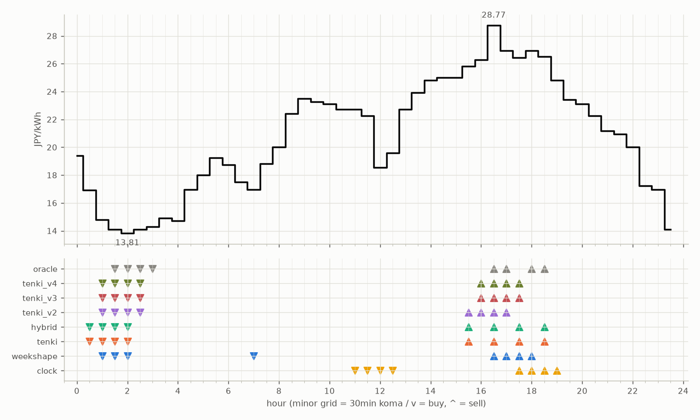

# JEPX仮想蓄電池 フォワード運用レポート

戦略凍結: 2026-08-12 / フォワード開始: 2026-08-14受渡分 / 生成: 2026-09-15 18:34 JST

## 累計成績（リーグ34日目）

| 機体 | 累計損益 | 事前でない日 | **対oracle（共通19日）** | 対oracle（各自の出場日） | 対clock差（pt） |
|---|---|---|---|---|---|
| tenki_v3 | 4,075円 | 24%（8/34日・BT補完） | **87.6%** | 88.4% | +30.0 |
| tenki_v2 | 4,005円 | 21%（7/34日・BT補完） | **87.4%** | 87.1% | +26.9 |
| tenki_v4 | 4,003円 | 29%（10/34日・BT補完） | **84.6%** | 85.9% | +28.9 |
| tenki | 3,910円 | 12%（4/34日・BT3日+再計算1日） | **82.2%** | 84.3% | +21.5 |
| hybrid | 3,887円 | 12%（4/34日・BT3日+再計算1日） | **81.7%** | 84.1% | +21.3 |
| weekshape | 3,815円 | 44%（15/34日・再計算） | **80.0%** | 80.0% | +26.2 |
| clock | 3,048円 | 44%（15/34日・再計算） | **53.8%** | 53.8% | +0.0 |
| oracle | 4,593円 | — | 100.0% | 100.0% | — |

累計損益は**BT補完込み**（参戦前の欠場日を、当時入手可能だったデータのみで再現したバックテストで補完）。**事前でない日**＝価格公表前にコミットされていない日。内訳は**BT補完**（参戦前の穴埋め）と**再計算**（提出が無く採点時にコードから作った日）。clockとweekshapeは2026-08-27まで提出型ではなかったため、それ以前は全日が再計算。**対oracle%と対clock差は事前コミット済みのフォワード日のみ**で計算——対oracle%は値幅のスケールを、対clock差（常設ベンチとの同日ペア差）は時代の取りやすさを一次補正する。

**順位は「対oracle（共通19日）」で付ける。** 「各自の出場日」の列は機体ごとに分母の日が違うので、**順位に使うと難しい日を欠場した機体ほど上に来る**——2026-08-29の敵対的レビューで実際にそうなっていた（tenki_v3が首位に見えていたが、同じ日で揃えるとtenkiとhybridが上）。参考として残すが、比較には使わない。

## 期間別（ISO週別、*=BT補完を含む）

| 週 | tenki | hybrid | clock | weekshape | tenki_v2 | tenki_v3 | tenki_v4 | oracle |
|---|---|---|---|---|---|---|---|---|
| 2026-W33 | 158 | 158 | 241 | 215 | 165* | 180* | 181* | 257 |
| 2026-W34 | 880* | 870* | 796 | 836 | 841* | 856* | 859* | 928 |
| 2026-W35 | 990* | 991* | 842 | 928 | 981* | 1,008* | 1,008* | 1,110 |
| 2026-W36 | 773 | 773 | 499 | 795 | 837 | 860 | 860 | 1,060 |
| 2026-W37 | 731 | 724 | 465 | 714 | 775 | 764 | 707 | 817 |
| 2026-W38 | 378 | 371 | 205 | 326 | 406 | 406 | 387 | 422 |

## 直接対決（全機体出場日 24日のみ）

| 機体 | 累計損益 | 対oracle |
|---|---|---|
| tenki_v3 | 2,769円 | 88.5% |
| tenki_v2 | 2,745円 | 87.7% |
| tenki_v4 | 2,688円 | 85.9% |
| tenki | 2,632円 | 84.1% |
| hybrid | 2,610円 | 83.4% |
| weekshape | 2,515円 | 80.4% |
| clock | 1,784円 | 57.0% |
| oracle | 3,129円 | 100.0% |
## 直近日の解剖（全日分は [daily_anatomy.md](daily_anatomy.md)）

### 2026-09-16（信号: 強）

- 因子: 日射予報 175 W/m2 / 実測 未確定（実測は約5日遅れ） / 乖離 -363 W/m2（普段より曇る方向。直近28日平均 538、判定は絶対値 363 vs 閾値 198）
- 価格の形: 最安 02:00 13.81円 / 最高 16:30 28.77円 / 山谷比 2.1倍

| 機体 | 充電（買い） | 平均買値 | 放電（売り） | 平均売値 | 損益 |
|---|---|---|---|---|---|
| clock | 11:00, 11:30, 12:00, 12:30 | 20.79円 | 17:30, 18:00, 18:30, 19:00 | 26.18円 | +29円 |
| weekshape | 01:00, 01:30, 02:00, 07:00 | 14.91円 | 16:30, 17:00, 17:30, 18:00 | 27.28円 | +97円 |
| tenki | 00:30, 01:00, 01:30, 02:00 | 14.91円 | 15:30, 16:30, 17:30, 18:30 | 26.89円 | +94円 |
| tenki_v2 | 01:00, 01:30, 02:00, 02:30 | 14.19円 | 15:30, 16:00, 16:30, 17:00 | 26.96円 | +101円 |
| tenki_v3 | 01:00, 01:30, 02:00, 02:30 | 14.19円 | 16:00, 16:30, 17:00, 17:30 | 27.12円 | +103円 |
| tenki_v4 | 01:00, 01:30, 02:00, 02:30 | 14.19円 | 16:00, 16:30, 17:00, 17:30 | 27.12円 | +103円 |
| hybrid | 00:30, 01:00, 01:30, 02:00 | 14.91円 | 15:30, 16:30, 17:30, 18:30 | 26.89円 | +94円 |
| oracle | 01:30, 02:00, 02:30, 03:00 | 14.06円 | 16:30, 17:00, 18:00, 18:30 | 27.29円 | +106円 |

**48コマ価格（円/kWh。太字=最安/最高）**

| 00:00 | 00:30 | 01:00 | 01:30 | 02:00 | 02:30 | 03:00 | 03:30 | 04:00 | 04:30 | 05:00 | 05:30 | 06:00 | 06:30 | 07:00 | 07:30 | 08:00 | 08:30 | 09:00 | 09:30 | 10:00 | 10:30 | 11:00 | 11:30 |
|---|---|---|---|---|---|---|---|---|---|---|---|---|---|---|---|---|---|---|---|---|---|---|---|
| 19.38 | 16.94 | 14.80 | 14.08 | **13.81** | 14.08 | 14.28 | 14.90 | 14.73 | 16.95 | 18.00 | 19.26 | 18.75 | 17.50 | 16.95 | 18.82 | 20.00 | 22.40 | 23.51 | 23.26 | 23.11 | 22.74 | 22.74 | 22.26 |

| 12:00 | 12:30 | 13:00 | 13:30 | 14:00 | 14:30 | 15:00 | 15:30 | 16:00 | 16:30 | 17:00 | 17:30 | 18:00 | 18:30 | 19:00 | 19:30 | 20:00 | 20:30 | 21:00 | 21:30 | 22:00 | 22:30 | 23:00 | 23:30 |
|---|---|---|---|---|---|---|---|---|---|---|---|---|---|---|---|---|---|---|---|---|---|---|---|
| 18.56 | 19.60 | 22.74 | 23.93 | 24.81 | 25.00 | 25.00 | 25.82 | 26.30 | **28.77** | 26.95 | 26.45 | 26.95 | 26.50 | 24.81 | 23.41 | 23.11 | 22.27 | 21.16 | 20.94 | 20.00 | 17.23 | 16.95 | 14.10 |

## 明日のpicks（受渡日 2026-09-17、信号: 平常）

日射予報の乖離 +6 W/m2（普段より晴れる方向。直近28日平均 538、判定は絶対値 6 vs 閾値 198）

| 機体 | 充電（買い） | 放電（売り） |
|---|---|---|
| clock | 11:00, 11:30, 12:00, 12:30 | 17:30, 18:00, 18:30, 19:00 |
| weekshape | 01:30, 02:00, 03:00, 06:30 | 15:30, 16:00, 16:30, 17:00 |
