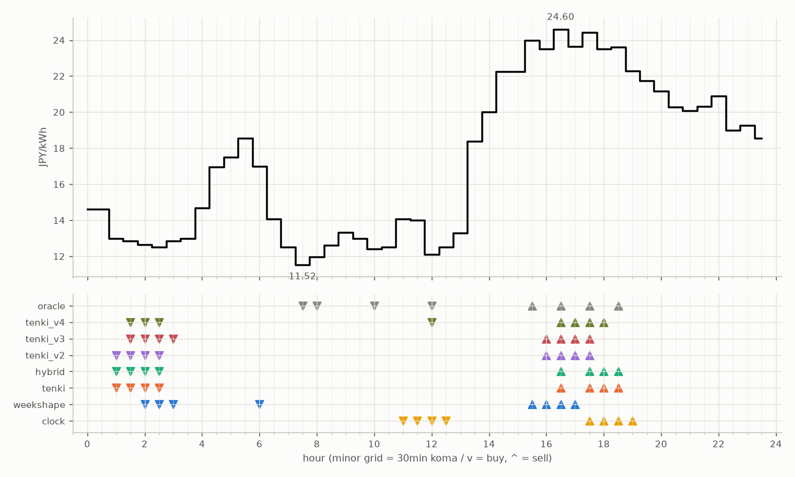

# JEPX仮想蓄電池 フォワード運用レポート

戦略凍結: 2026-08-12 / フォワード開始: 2026-08-14受渡分 / 生成: 2026-09-17 18:42 JST

## 累計成績（リーグ36日目）

| 機体 | 累計損益 | 事前でない日 | **対oracle（共通21日）** | 対oracle（各自の出場日） | 対clock差（pt） |
|---|---|---|---|---|---|
| tenki_v3 | 4,300円 | 22%（8/36日・BT補完） | **88.1%** | 88.7% | +28.3 |
| tenki_v2 | 4,230円 | 19%（7/36日・BT補完） | **88.0%** | 87.5% | +25.5 |
| tenki_v4 | 4,231円 | 28%（10/36日・BT補完） | **85.5%** | 86.6% | +27.2 |
| tenki | 4,117円 | 11%（4/36日・BT3日+再計算1日） | **82.6%** | 84.4% | +20.0 |
| hybrid | 4,048円 | 11%（4/36日・BT3日+再計算1日） | **80.5%** | 83.2% | +18.8 |
| weekshape | 3,966円 | 42%（15/36日・再計算） | **78.6%** | 78.6% | +21.7 |
| clock | 3,264円 | 42%（15/36日・再計算） | **56.9%** | 56.9% | +0.0 |
| oracle | 4,833円 | — | 100.0% | 100.0% | — |

累計損益は**BT補完込み**（参戦前の欠場日を、当時入手可能だったデータのみで再現したバックテストで補完）。**事前でない日**＝価格公表前にコミットされていない日。内訳は**BT補完**（参戦前の穴埋め）と**再計算**（提出が無く採点時にコードから作った日）。clockとweekshapeは2026-08-27まで提出型ではなかったため、それ以前は全日が再計算。**対oracle%と対clock差は事前コミット済みのフォワード日のみ**で計算——対oracle%は値幅のスケールを、対clock差（常設ベンチとの同日ペア差）は時代の取りやすさを一次補正する。

**順位は「対oracle（共通21日）」で付ける。** 「各自の出場日」の列は機体ごとに分母の日が違うので、**順位に使うと難しい日を欠場した機体ほど上に来る**——2026-08-29の敵対的レビューで実際にそうなっていた（tenki_v3が首位に見えていたが、同じ日で揃えるとtenkiとhybridが上）。参考として残すが、比較には使わない。

## 期間別（ISO週別、*=BT補完を含む）

| 週 | tenki | hybrid | clock | weekshape | tenki_v2 | tenki_v3 | tenki_v4 | oracle |
|---|---|---|---|---|---|---|---|---|
| 2026-W33 | 158 | 158 | 241 | 215 | 165* | 180* | 181* | 257 |
| 2026-W34 | 880* | 870* | 796 | 836 | 841* | 856* | 859* | 928 |
| 2026-W35 | 990* | 991* | 842 | 928 | 981* | 1,008* | 1,008* | 1,110 |
| 2026-W36 | 773 | 773 | 499 | 795 | 837 | 860 | 860 | 1,060 |
| 2026-W37 | 731 | 724 | 465 | 714 | 775 | 764 | 707 | 817 |
| 2026-W38 | 586 | 533 | 421 | 477 | 630 | 631 | 615 | 661 |

## 直接対決（全機体出場日 26日のみ）

| 機体 | 累計損益 | 対oracle |
|---|---|---|
| tenki_v3 | 2,994円 | 88.9% |
| tenki_v2 | 2,970円 | 88.2% |
| tenki_v4 | 2,915円 | 86.6% |
| tenki | 2,839円 | 84.3% |
| hybrid | 2,772円 | 82.3% |
| weekshape | 2,666円 | 79.1% |
| clock | 2,000円 | 59.4% |
| oracle | 3,368円 | 100.0% |
## 直近日の解剖（全日分は [daily_anatomy.md](daily_anatomy.md)）

### 2026-09-18（信号: 強）

- 因子: 日射予報 324 W/m2 / 実測 未確定（実測は約5日遅れ） / 乖離 -195 W/m2（普段より曇る方向。直近28日平均 519、判定は絶対値 214 vs 閾値 198）
- 価格の形: 最安 07:30 11.52円 / 最高 16:30 24.60円 / 山谷比 2.1倍

| 機体 | 充電（買い） | 平均買値 | 放電（売り） | 平均売値 | 損益 |
|---|---|---|---|---|---|
| clock | 11:00, 11:30, 12:00, 12:30 | 13.17円 | 17:30, 18:00, 18:30, 19:00 | 23.45円 | +80円 |
| weekshape | 02:00, 02:30, 03:00, 06:00 | 13.75円 | 15:30, 16:00, 16:30, 17:00 | 23.93円 | +79円 |
| tenki | 01:00, 01:30, 02:00, 02:30 | 12.75円 | 16:30, 17:30, 18:00, 18:30 | 24.04円 | +90円 |
| tenki_v2 | 01:00, 01:30, 02:00, 02:30 | 12.75円 | 16:00, 16:30, 17:00, 17:30 | 24.05円 | +89円 |
| tenki_v3 | 01:30, 02:00, 02:30, 03:00 | 12.71円 | 16:00, 16:30, 17:00, 17:30 | 24.05円 | +90円 |
| tenki_v4 | 01:30, 02:00, 02:30, 12:00 | 12.52円 | 16:30, 17:00, 17:30, 18:00 | 24.04円 | +92円 |
| hybrid | 01:00, 01:30, 02:00, 02:30 | 12.75円 | 16:30, 17:30, 18:00, 18:30 | 24.04円 | +90円 |
| oracle | 07:30, 08:00, 10:00, 12:00 | 12.00円 | 15:30, 16:30, 17:30, 18:30 | 24.16円 | +98円 |

**48コマ価格（円/kWh。太字=最安/最高）**

| 00:00 | 00:30 | 01:00 | 01:30 | 02:00 | 02:30 | 03:00 | 03:30 | 04:00 | 04:30 | 05:00 | 05:30 | 06:00 | 06:30 | 07:00 | 07:30 | 08:00 | 08:30 | 09:00 | 09:30 | 10:00 | 10:30 | 11:00 | 11:30 |
|---|---|---|---|---|---|---|---|---|---|---|---|---|---|---|---|---|---|---|---|---|---|---|---|
| 14.63 | 14.63 | 13.00 | 12.84 | 12.64 | 12.52 | 12.84 | 13.00 | 14.69 | 16.95 | 17.50 | 18.56 | 16.98 | 14.07 | 12.52 | **11.52** | 11.97 | 12.62 | 13.33 | 12.99 | 12.42 | 12.52 | 14.07 | 14.01 |

| 12:00 | 12:30 | 13:00 | 13:30 | 14:00 | 14:30 | 15:00 | 15:30 | 16:00 | 16:30 | 17:00 | 17:30 | 18:00 | 18:30 | 19:00 | 19:30 | 20:00 | 20:30 | 21:00 | 21:30 | 22:00 | 22:30 | 23:00 | 23:30 |
|---|---|---|---|---|---|---|---|---|---|---|---|---|---|---|---|---|---|---|---|---|---|---|---|
| 12.10 | 12.52 | 13.29 | 18.37 | 20.00 | 22.25 | 22.26 | 23.97 | 23.51 | **24.60** | 23.64 | 24.43 | 23.50 | 23.62 | 22.27 | 21.74 | 21.17 | 20.28 | 20.09 | 20.33 | 20.91 | 19.00 | 19.27 | 18.56 |

## 明日のpicks（受渡日 2026-09-19、信号: 強）

日射予報の乖離 -271 W/m2（普段より曇る方向。直近28日平均 519、判定は絶対値 271 vs 閾値 199）

| 機体 | 充電（買い） | 放電（売り） |
|---|---|---|
| clock | 11:00, 11:30, 12:00, 12:30 | 17:30, 18:00, 18:30, 19:00 |
| weekshape | 08:00, 11:00, 11:30, 12:00 | 17:30, 18:00, 18:30, 19:00 |
