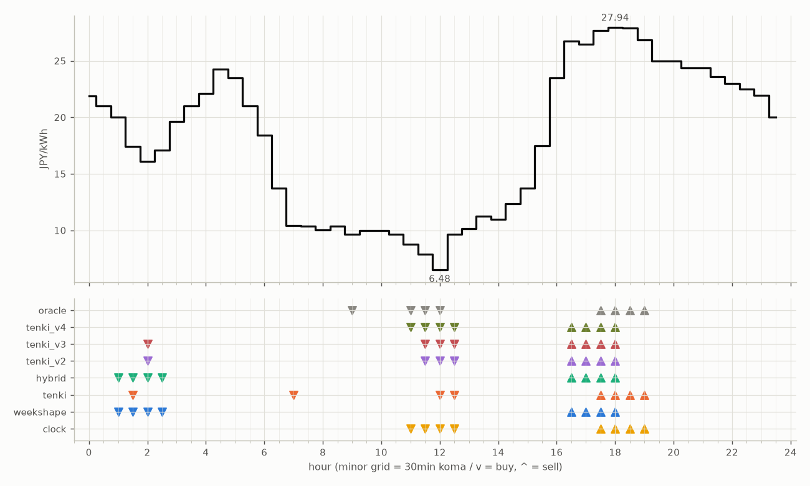

# JEPX仮想蓄電池 フォワード運用レポート

戦略凍結: 2026-08-12 / フォワード開始: 2026-08-14受渡分 / 生成: 2026-09-22 18:27 JST

## 累計成績（リーグ41日目）

| 機体 | 累計損益 | 事前でない日 | **対oracle（共通26日）** | 対oracle（各自の出場日） | 対clock差（pt） |
|---|---|---|---|---|---|
| tenki_v3 | 4,991円 | 20%（8/41日・BT補完） | **88.9%** | 89.3% | +22.6 |
| tenki_v4 | 4,944円 | 24%（10/41日・BT補完） | **87.4%** | 88.1% | +21.7 |
| tenki_v2 | 4,865円 | 17%（7/41日・BT補完） | **87.2%** | 87.0% | +19.2 |
| tenki | 4,609円 | 10%（4/41日・BT3日+再計算1日） | **78.9%** | 81.5% | +12.1 |
| weekshape | 4,420円 | 37%（15/41日・再計算） | **74.7%** | 74.7% | +9.2 |
| hybrid | 4,338円 | 10%（4/41日・BT3日+再計算1日） | **71.6%** | 76.4% | +7.0 |
| clock | 3,997円 | 37%（15/41日・再計算） | **65.5%** | 65.5% | +0.0 |
| oracle | 5,585円 | — | 100.0% | 100.0% | — |

累計損益は**BT補完込み**（参戦前の欠場日を、当時入手可能だったデータのみで再現したバックテストで補完）。**事前でない日**＝価格公表前にコミットされていない日。内訳は**BT補完**（参戦前の穴埋め）と**再計算**（提出が無く採点時にコードから作った日）。clockとweekshapeは2026-08-27まで提出型ではなかったため、それ以前は全日が再計算。**対oracle%と対clock差は事前コミット済みのフォワード日のみ**で計算——対oracle%は値幅のスケールを、対clock差（常設ベンチとの同日ペア差）は時代の取りやすさを一次補正する。

**順位は「対oracle（共通26日）」で付ける。** 「各自の出場日」の列は機体ごとに分母の日が違うので、**順位に使うと難しい日を欠場した機体ほど上に来る**——2026-08-29の敵対的レビューで実際にそうなっていた（tenki_v3が首位に見えていたが、同じ日で揃えるとtenkiとhybridが上）。参考として残すが、比較には使わない。

## 期間別（ISO週別、*=BT補完を含む）

| 週 | tenki | hybrid | clock | weekshape | tenki_v2 | tenki_v3 | tenki_v4 | oracle |
|---|---|---|---|---|---|---|---|---|
| 2026-W33 | 158 | 158 | 241 | 215 | 165* | 180* | 181* | 257 |
| 2026-W34 | 880* | 870* | 796 | 836 | 841* | 856* | 859* | 928 |
| 2026-W35 | 990* | 991* | 842 | 928 | 981* | 1,008* | 1,008* | 1,110 |
| 2026-W36 | 773 | 773 | 499 | 795 | 837 | 860 | 860 | 1,060 |
| 2026-W37 | 731 | 724 | 465 | 714 | 775 | 764 | 707 | 817 |
| 2026-W38 | 644 | 591 | 635 | 690 | 841 | 847 | 829 | 880 |
| 2026-W39 | 433 | 231 | 520 | 241 | 424 | 476 | 499 | 533 |

## 直接対決（全機体出場日 31日のみ）

| 機体 | 累計損益 | 対oracle |
|---|---|---|
| tenki_v3 | 3,686円 | 89.5% |
| tenki_v4 | 3,628円 | 88.1% |
| tenki_v2 | 3,605円 | 87.5% |
| tenki | 3,331円 | 80.8% |
| weekshape | 3,120円 | 75.7% |
| hybrid | 3,062円 | 74.3% |
| clock | 2,733円 | 66.3% |
| oracle | 4,120円 | 100.0% |
## 直近日の解剖（全日分は [daily_anatomy.md](daily_anatomy.md)）

### 2026-09-23（信号: 平常）

- 因子: 日射予報 449 W/m2 / 実測 未確定（実測は約5日遅れ） / 乖離 -57 W/m2（普段より曇る方向。判定時の直近28日平均 505、判定は絶対値 57 vs 閾値 199）
- 価格の形: 最安 12:00 6.48円 / 最高 18:00 27.94円 / 山谷比 4.3倍

| 機体 | 充電（買い） | 平均買値 | 放電（売り） | 平均売値 | 損益 |
|---|---|---|---|---|---|
| clock | 11:00, 11:30, 12:00, 12:30 | 8.19円 | 17:30, 18:00, 18:30, 19:00 | 27.59円 | +167円 |
| weekshape | 01:00, 01:30, 02:00, 02:30 | 17.65円 | 16:30, 17:00, 17:30, 18:00 | 27.20円 | +69円 |
| tenki | 01:30, 07:00, 12:00, 12:30 | 10.98円 | 17:30, 18:00, 18:30, 19:00 | 27.59円 | +140円 |
| tenki_v2 | 02:00, 11:30, 12:00, 12:30 | 10.02円 | 16:30, 17:00, 17:30, 18:00 | 27.20円 | +145円 |
| tenki_v3 | 02:00, 11:30, 12:00, 12:30 | 10.02円 | 16:30, 17:00, 17:30, 18:00 | 27.20円 | +145円 |
| tenki_v4 | 11:00, 11:30, 12:00, 12:30 | 8.19円 | 16:30, 17:00, 17:30, 18:00 | 27.20円 | +163円 |
| hybrid | 01:00, 01:30, 02:00, 02:30 | 17.65円 | 16:30, 17:00, 17:30, 18:00 | 27.20円 | +69円 |
| oracle | 09:00, 11:00, 11:30, 12:00 | 8.19円 | 17:30, 18:00, 18:30, 19:00 | 27.59円 | +167円 |

**48コマ価格（円/kWh。太字=最安/最高）**

| 00:00 | 00:30 | 01:00 | 01:30 | 02:00 | 02:30 | 03:00 | 03:30 | 04:00 | 04:30 | 05:00 | 05:30 | 06:00 | 06:30 | 07:00 | 07:30 | 08:00 | 08:30 | 09:00 | 09:30 | 10:00 | 10:30 | 11:00 | 11:30 |
|---|---|---|---|---|---|---|---|---|---|---|---|---|---|---|---|---|---|---|---|---|---|---|---|
| 21.90 | 21.00 | 20.00 | 17.40 | 16.11 | 17.10 | 19.61 | 21.02 | 22.10 | 24.24 | 23.50 | 21.02 | 18.42 | 13.71 | 10.40 | 10.38 | 10.01 | 10.35 | 9.63 | 10.00 | 9.99 | 9.63 | 8.79 | 7.86 |

| 12:00 | 12:30 | 13:00 | 13:30 | 14:00 | 14:30 | 15:00 | 15:30 | 16:00 | 16:30 | 17:00 | 17:30 | 18:00 | 18:30 | 19:00 | 19:30 | 20:00 | 20:30 | 21:00 | 21:30 | 22:00 | 22:30 | 23:00 | 23:30 |
|---|---|---|---|---|---|---|---|---|---|---|---|---|---|---|---|---|---|---|---|---|---|---|---|
| **6.48** | 9.63 | 10.14 | 11.25 | 10.98 | 12.35 | 13.71 | 17.50 | 23.50 | 26.72 | 26.47 | 27.65 | **27.94** | 27.92 | 26.83 | 25.00 | 25.00 | 24.35 | 24.35 | 23.61 | 22.99 | 22.50 | 21.94 | 20.00 |

## 明日のpicks（受渡日 2026-09-24、信号: 平常）

日射予報の乖離 +29 W/m2（普段より晴れる方向。判定時の直近28日平均 505、判定は絶対値 29 vs 閾値 199）

| 機体 | 充電（買い） | 放電（売り） |
|---|---|---|
| clock | 11:00, 11:30, 12:00, 12:30 | 17:30, 18:00, 18:30, 19:00 |
| weekshape | 01:30, 02:00, 02:30, 03:00 | 15:30, 16:00, 16:30, 17:00 |
