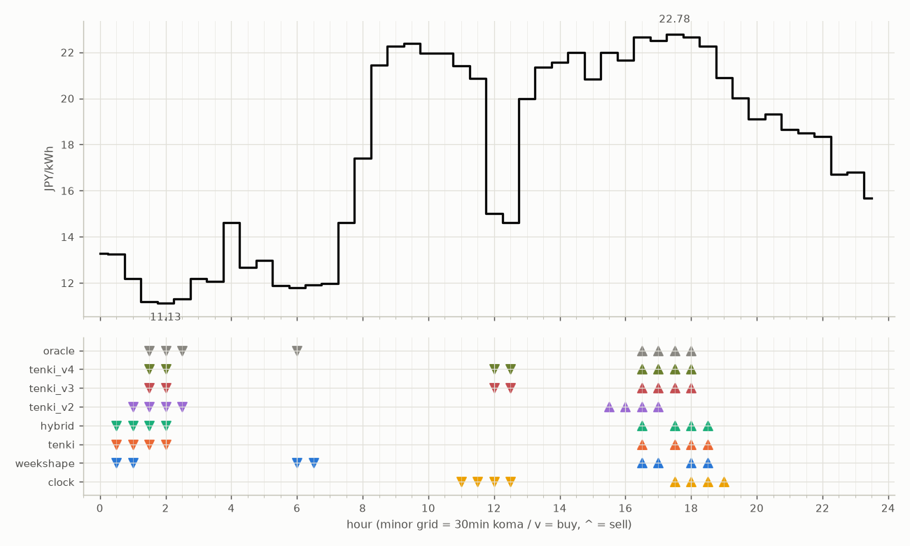

# JEPX仮想蓄電池 フォワード運用レポート

戦略凍結: 2026-08-12 / フォワード開始: 2026-08-14受渡分 / 生成: 2026-09-10 18:08 JST

## 累計成績（リーグ29日目）

| 機体 | 累計損益 | 事前でない日 | **対oracle（共通14日）** | 対oracle（各自の出場日） | 対clock差（pt） |
|---|---|---|---|---|---|
| tenki_v2 | 3,361円 | 24%（7/29日・BT補完） | **84.6%** | 85.3% | +26.6 |
| tenki_v3 | 3,422円 | 28%（8/29日・BT補完） | **84.4%** | 86.4% | +30.2 |
| tenki_v4 | 3,366円 | 34%（10/29日・BT補完） | **81.1%** | 83.6% | +29.4 |
| weekshape | 3,250円 | 52%（15/29日・再計算） | **78.7%** | 78.7% | +29.9 |
| hybrid | 3,277円 | 14%（4/29日・BT3日+再計算1日） | **78.7%** | 82.9% | +21.0 |
| tenki | 3,286円 | 14%（4/29日・BT3日+再計算1日） | **78.6%** | 82.6% | +20.7 |
| clock | 2,593円 | 52%（15/29日・再計算） | **48.9%** | 48.9% | +0.0 |
| oracle | 3,917円 | — | 100.0% | 100.0% | — |

累計損益は**BT補完込み**（参戦前の欠場日を、当時入手可能だったデータのみで再現したバックテストで補完）。**事前でない日**＝価格公表前にコミットされていない日。内訳は**BT補完**（参戦前の穴埋め）と**再計算**（提出が無く採点時にコードから作った日）。clockとweekshapeは2026-08-27まで提出型ではなかったため、それ以前は全日が再計算。**対oracle%と対clock差は事前コミット済みのフォワード日のみ**で計算——対oracle%は値幅のスケールを、対clock差（常設ベンチとの同日ペア差）は時代の取りやすさを一次補正する。

**順位は「対oracle（共通14日）」で付ける。** 「各自の出場日」の列は機体ごとに分母の日が違うので、**順位に使うと難しい日を欠場した機体ほど上に来る**——2026-08-29の敵対的レビューで実際にそうなっていた（tenki_v3が首位に見えていたが、同じ日で揃えるとtenkiとhybridが上）。参考として残すが、比較には使わない。

## 期間別（ISO週別、*=BT補完を含む）

| 週 | tenki | hybrid | clock | weekshape | tenki_v2 | tenki_v3 | tenki_v4 | oracle |
|---|---|---|---|---|---|---|---|---|
| 2026-W33 | 158 | 158 | 241 | 215 | 165* | 180* | 181* | 257 |
| 2026-W34 | 880* | 870* | 796 | 836 | 841* | 856* | 859* | 928 |
| 2026-W35 | 990* | 991* | 842 | 928 | 981* | 1,008* | 1,008* | 1,110 |
| 2026-W36 | 773 | 773 | 499 | 795 | 837 | 860 | 860 | 1,060 |
| 2026-W37 | 486 | 486 | 215 | 475 | 536 | 518 | 457 | 563 |

## 直接対決（全機体出場日 19日のみ）

| 機体 | 累計損益 | 対oracle |
|---|---|---|
| tenki_v3 | 2,117円 | 86.3% |
| tenki_v2 | 2,101円 | 85.7% |
| tenki_v4 | 2,051円 | 83.6% |
| tenki | 2,008円 | 81.9% |
| hybrid | 2,001円 | 81.6% |
| weekshape | 1,950円 | 79.5% |
| clock | 1,329円 | 54.2% |
| oracle | 2,452円 | 100.0% |
## 直近日の解剖（全日分は [daily_anatomy.md](daily_anatomy.md)）

### 2026-09-11（信号: 強）

- 因子: 日射予報 198 W/m2 / 実測 未確定（実測は約5日遅れ） / 乖離 -391 W/m2（普段より曇る方向。直近28日平均 589、判定は絶対値 391 vs 閾値 195）
- 価格の形: 最安 02:00 11.13円 / 最高 17:30 22.78円 / 山谷比 2.0倍

| 機体 | 充電（買い） | 平均買値 | 放電（売り） | 平均売値 | 損益 |
|---|---|---|---|---|---|
| clock | 11:00, 11:30, 12:00, 12:30 | 17.98円 | 17:30, 18:00, 18:30, 19:00 | 22.15円 | +21円 |
| weekshape | 00:30, 01:00, 06:00, 06:30 | 12.29円 | 16:30, 17:00, 18:00, 18:30 | 22.53円 | +81円 |
| tenki | 00:30, 01:00, 01:30, 02:00 | 11.94円 | 16:30, 17:30, 18:00, 18:30 | 22.59円 | +85円 |
| tenki_v2 | 01:00, 01:30, 02:00, 02:30 | 11.46円 | 15:30, 16:00, 16:30, 17:00 | 22.20円 | +86円 |
| tenki_v3 | 01:30, 02:00, 12:00, 12:30 | 12.99円 | 16:30, 17:00, 17:30, 18:00 | 22.66円 | +75円 |
| tenki_v4 | 01:30, 02:00, 12:00, 12:30 | 12.99円 | 16:30, 17:00, 17:30, 18:00 | 22.66円 | +75円 |
| hybrid | 00:30, 01:00, 01:30, 02:00 | 11.94円 | 16:30, 17:30, 18:00, 18:30 | 22.59円 | +85円 |
| oracle | 01:30, 02:00, 02:30, 06:00 | 11.36円 | 16:30, 17:00, 17:30, 18:00 | 22.66円 | +91円 |

**48コマ価格（円/kWh。太字=最安/最高）**

| 00:00 | 00:30 | 01:00 | 01:30 | 02:00 | 02:30 | 03:00 | 03:30 | 04:00 | 04:30 | 05:00 | 05:30 | 06:00 | 06:30 | 07:00 | 07:30 | 08:00 | 08:30 | 09:00 | 09:30 | 10:00 | 10:30 | 11:00 | 11:30 |
|---|---|---|---|---|---|---|---|---|---|---|---|---|---|---|---|---|---|---|---|---|---|---|---|
| 13.27 | 13.24 | 12.20 | 11.19 | **11.13** | 11.32 | 12.20 | 12.06 | 14.61 | 12.66 | 12.99 | 11.87 | 11.80 | 11.91 | 11.99 | 14.61 | 17.40 | 21.43 | 22.27 | 22.39 | 21.97 | 21.97 | 21.41 | 20.87 |

| 12:00 | 12:30 | 13:00 | 13:30 | 14:00 | 14:30 | 15:00 | 15:30 | 16:00 | 16:30 | 17:00 | 17:30 | 18:00 | 18:30 | 19:00 | 19:30 | 20:00 | 20:30 | 21:00 | 21:30 | 22:00 | 22:30 | 23:00 | 23:30 |
|---|---|---|---|---|---|---|---|---|---|---|---|---|---|---|---|---|---|---|---|---|---|---|---|
| 15.00 | 14.63 | 20.00 | 21.34 | 21.57 | 21.98 | 20.84 | 21.98 | 21.66 | 22.66 | 22.51 | **22.78** | 22.67 | 22.26 | 20.89 | 20.01 | 19.10 | 19.31 | 18.64 | 18.50 | 18.35 | 16.72 | 16.80 | 15.69 |

## 明日のpicks（受渡日 2026-09-12、信号: 平常）

日射予報の乖離 -97 W/m2（普段より曇る方向。直近28日平均 589、判定は絶対値 97 vs 閾値 195）

| 機体 | 充電（買い） | 放電（売り） |
|---|---|---|
| clock | 11:00, 11:30, 12:00, 12:30 | 17:30, 18:00, 18:30, 19:00 |
| weekshape | 08:00, 11:00, 11:30, 13:00 | 17:30, 18:00, 18:30, 19:00 |
