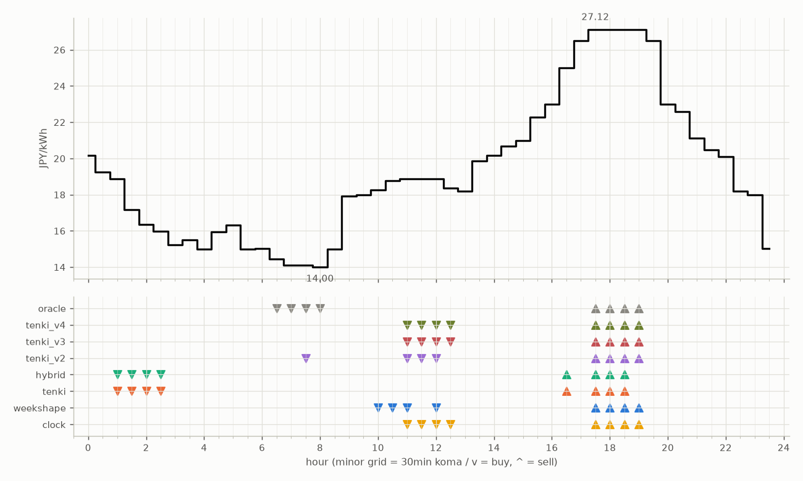

# JEPX仮想蓄電池 フォワード運用レポート

戦略凍結: 2026-08-12 / フォワード開始: 2026-08-14受渡分 / 生成: 2026-08-29 01:52 JST

> ⚠ 8/26受渡: **提出が届いていない**（picksファイルが無い＝strategies側のCIが落ちたか、pushが他のCIと衝突して失われた。気象とは別の原因）のため天気系4機体は**欠場**（実力ではなく計測の欠測。後日、予報アーカイブからBT補完される）
> ⚠ 8/28受渡: **提出が届いていない**（picksファイルが無い＝strategies側のCIが落ちたか、pushが他のCIと衝突して失われた。気象とは別の原因）のため天気系4機体は**欠場**（実力ではなく計測の欠測。後日、予報アーカイブからBT補完される）

## 累計成績（リーグ16日目）

| 機体 | 累計損益 | 事前でない日 | 対oracle（事前コミット日） | 対clock差（pt） |
|---|---|---|---|---|
| tenki_v3 | 1,316円 | 38%（5/13日・BT補完） | 87.0% | +17.1 |
| tenki_v4 | 1,321円 | 54%（7/13日・BT補完） | 86.3% | +17.2 |
| tenki_v2 | 1,481円 | 36%（5/14日・BT補完） | 84.8% | +11.4 |
| hybrid | 1,357円 | 0% | 84.7% | +6.6 |
| tenki | 1,515円 | 7%（1/14日・BT補完） | 84.3% | +6.2 |
| weekshape | 1,829円 | 94%（15/16日・再計算） | — （参考 85.4%・事前1日） | — |
| clock | 1,732円 | 94%（15/16日・再計算） | — （参考 80.9%・事前1日） | — |
| oracle | 2,141円 | — | 100.0% | — |

累計損益は**BT補完込み**（参戦前の欠場日を、当時入手可能だったデータのみで再現したバックテストで補完）。**事前でない日**＝価格公表前にコミットされていない日。内訳は**BT補完**（参戦前の穴埋め）と**再計算**（提出が無く採点時にコードから作った日）。clockとweekshapeは2026-08-27まで提出型ではなかったため、それ以前は全日が再計算。**対oracle%と対clock差は事前コミット済みのフォワード日のみ**で計算——対oracle%は値幅のスケールを、対clock差（常設ベンチとの同日ペア差）は時代の取りやすさを一次補正する。完全対等の比較は下の直接対決（共通日のみ）

## 期間別（ISO週別、*=BT補完を含む）

| 週 | tenki | hybrid | clock | weekshape | tenki_v2 | tenki_v3 | tenki_v4 | oracle |
|---|---|---|---|---|---|---|---|---|
| 2026-W33 | 158 | 158 | 241 | 215 | 165* | 180* | 181* | 257 |
| 2026-W34 | 880* | 704 | 796 | 836 | 841* | 856* | 859* | 928 |
| 2026-W35 | 478 | 495 | 695 | 777 | 475 | 280 | 280 | 957 |

## 直接対決（全機体出場日 6日のみ）

| 機体 | 累計損益 | 対oracle |
|---|---|---|
| tenki | 600円 | 88.7% |
| hybrid | 592円 | 87.4% |
| tenki_v3 | 589円 | 87.1% |
| tenki_v4 | 584円 | 86.3% |
| tenki_v2 | 580円 | 85.7% |
| weekshape | 529円 | 78.1% |
| clock | 468円 | 69.1% |
| oracle | 677円 | 100.0% |
## 直近日の解剖（全日分は [daily_anatomy.md](daily_anatomy.md)）

### 2026-08-29（信号: 強）

- 因子: 日射予報 331 W/m2 / 実測 未確定（実測は約5日遅れ） / 乖離 -304 W/m2（普段より曇る方向。直近28日平均 635、判定は絶対値 311 vs 閾値 195）
- 価格の形: 最安 08:00 14.00円 / 最高 17:30 27.12円 / 山谷比 1.9倍

| 機体 | 充電（買い） | 平均買値 | 放電（売り） | 平均売値 | 損益 |
|---|---|---|---|---|---|
| clock | 11:00, 11:30, 12:00, 12:30 | 18.75円 | 17:30, 18:00, 18:30, 19:00 | 27.12円 | +57円 |
| weekshape | 10:00, 10:30, 11:00, 12:00 | 18.69円 | 17:30, 18:00, 18:30, 19:00 | 27.12円 | +58円 |
| tenki | 01:00, 01:30, 02:00, 02:30 | 17.09円 | 16:30, 17:30, 18:00, 18:30 | 26.59円 | +69円 |
| tenki_v2 | 07:30, 11:00, 11:30, 12:00 | 17.68円 | 17:30, 18:00, 18:30, 19:00 | 27.12円 | +68円 |
| tenki_v3 | 11:00, 11:30, 12:00, 12:30 | 18.75円 | 17:30, 18:00, 18:30, 19:00 | 27.12円 | +57円 |
| tenki_v4 | 11:00, 11:30, 12:00, 12:30 | 18.75円 | 17:30, 18:00, 18:30, 19:00 | 27.12円 | +57円 |
| hybrid | 01:00, 01:30, 02:00, 02:30 | 17.09円 | 16:30, 17:30, 18:00, 18:30 | 26.59円 | +69円 |
| oracle | 06:30, 07:00, 07:30, 08:00 | 14.17円 | 17:30, 18:00, 18:30, 19:00 | 27.12円 | +103円 |

**48コマ価格（円/kWh。太字=最安/最高）**

| 00:00 | 00:30 | 01:00 | 01:30 | 02:00 | 02:30 | 03:00 | 03:30 | 04:00 | 04:30 | 05:00 | 05:30 | 06:00 | 06:30 | 07:00 | 07:30 | 08:00 | 08:30 | 09:00 | 09:30 | 10:00 | 10:30 | 11:00 | 11:30 |
|---|---|---|---|---|---|---|---|---|---|---|---|---|---|---|---|---|---|---|---|---|---|---|---|
| 20.18 | 19.24 | 18.87 | 17.17 | 16.35 | 15.98 | 15.23 | 15.50 | 15.00 | 15.96 | 16.32 | 15.00 | 15.01 | 14.44 | 14.12 | 14.12 | **14.00** | 15.00 | 17.93 | 18.00 | 18.25 | 18.76 | 18.87 | 18.87 |

| 12:00 | 12:30 | 13:00 | 13:30 | 14:00 | 14:30 | 15:00 | 15:30 | 16:00 | 16:30 | 17:00 | 17:30 | 18:00 | 18:30 | 19:00 | 19:30 | 20:00 | 20:30 | 21:00 | 21:30 | 22:00 | 22:30 | 23:00 | 23:30 |
|---|---|---|---|---|---|---|---|---|---|---|---|---|---|---|---|---|---|---|---|---|---|---|---|
| 18.87 | 18.37 | 18.21 | 19.86 | 20.16 | 20.67 | 20.97 | 22.28 | 22.98 | 25.00 | 26.50 | **27.12** | 27.12 | 27.12 | 27.11 | 26.50 | 23.00 | 22.60 | 21.11 | 20.46 | 20.09 | 18.20 | 18.00 | 15.01 |

## 明日のpicks（受渡日 2026-08-30、信号: 平常）

日射予報の乖離 -180 W/m2（普段より曇る方向。直近28日平均 635、判定は絶対値 180 vs 閾値 195）

| 機体 | 充電（買い） | 放電（売り） |
|---|---|---|
| clock | 11:00, 11:30, 12:00, 12:30 | 17:30, 18:00, 18:30, 19:00 |
| weekshape | 09:00, 10:00, 10:30, 11:00 | 17:30, 18:00, 18:30, 19:00 |
| tenki | 10:30, 11:00, 11:30, 12:00 | 17:30, 18:00, 18:30, 19:00 |
| tenki_v2 | 11:00, 11:30, 12:00, 12:30 | 17:30, 18:00, 18:30, 19:00 |
| tenki_v3 | 10:30, 11:00, 11:30, 12:00 | 17:30, 18:00, 18:30, 19:00 |
| tenki_v4 | 10:30, 11:00, 11:30, 12:00 | 17:30, 18:00, 18:30, 19:00 |
| hybrid | 09:00, 10:00, 10:30, 11:00 | 17:30, 18:00, 18:30, 19:00 |
