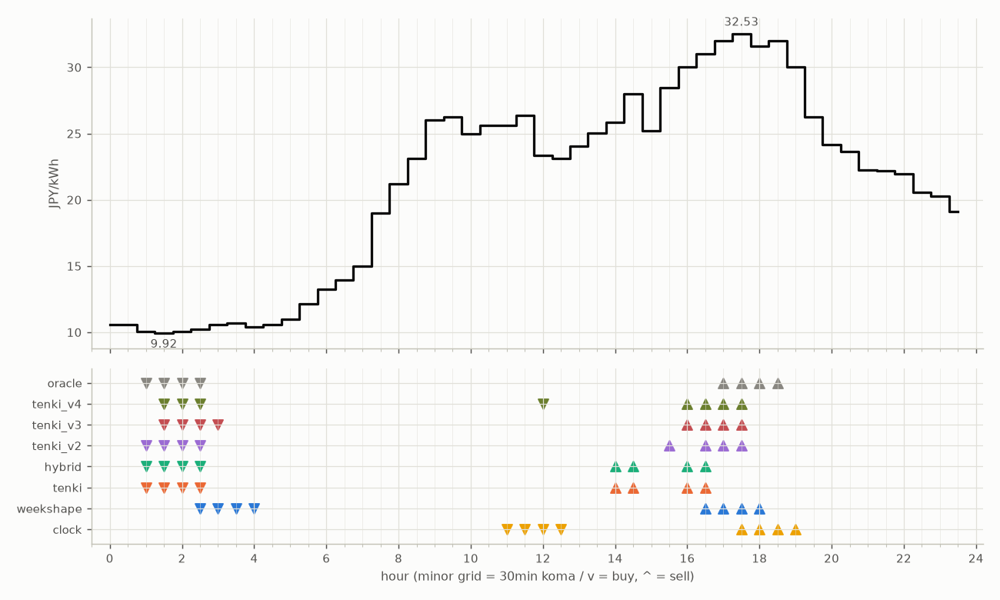

# JEPX仮想蓄電池 フォワード運用レポート

戦略凍結: 2026-08-12 / フォワード開始: 2026-08-14受渡分 / 生成: 2026-09-06 17:50 JST

## 累計成績（リーグ25日目）

| 機体 | 累計損益 | 事前でない日 | **対oracle（共通10日）** | 対oracle（各自の出場日） | 対clock差（pt） |
|---|---|---|---|---|---|
| tenki_v3 | 3,085円 | 32%（8/25日・BT補完） | **82.9%** | 85.8% | +28.2 |
| tenki_v2 | 3,003円 | 28%（7/25日・BT補完） | **81.8%** | 83.8% | +23.5 |
| tenki_v4 | 3,058円 | 40%（10/25日・BT補完） | **80.8%** | 83.8% | +28.3 |
| weekshape | 2,957円 | 60%（15/25日・再計算） | **78.9%** | 78.9% | +29.5 |
| hybrid | 2,949円 | 16%（4/25日・BT3日+再計算1日） | **76.4%** | 82.3% | +18.4 |
| tenki | 2,958円 | 16%（4/25日・BT3日+再計算1日） | **76.3%** | 82.0% | +18.2 |
| clock | 2,417円 | 60%（15/25日・再計算） | **49.4%** | 49.4% | +0.0 |
| oracle | 3,543円 | — | 100.0% | 100.0% | — |

累計損益は**BT補完込み**（参戦前の欠場日を、当時入手可能だったデータのみで再現したバックテストで補完）。**事前でない日**＝価格公表前にコミットされていない日。内訳は**BT補完**（参戦前の穴埋め）と**再計算**（提出が無く採点時にコードから作った日）。clockとweekshapeは2026-08-27まで提出型ではなかったため、それ以前は全日が再計算。**対oracle%と対clock差は事前コミット済みのフォワード日のみ**で計算——対oracle%は値幅のスケールを、対clock差（常設ベンチとの同日ペア差）は時代の取りやすさを一次補正する。

**順位は「対oracle（共通10日）」で付ける。** 「各自の出場日」の列は機体ごとに分母の日が違うので、**順位に使うと難しい日を欠場した機体ほど上に来る**——2026-08-29の敵対的レビューで実際にそうなっていた（tenki_v3が首位に見えていたが、同じ日で揃えるとtenkiとhybridが上）。参考として残すが、比較には使わない。

## 期間別（ISO週別、*=BT補完を含む）

| 週 | tenki | hybrid | clock | weekshape | tenki_v2 | tenki_v3 | tenki_v4 | oracle |
|---|---|---|---|---|---|---|---|---|
| 2026-W33 | 158 | 158 | 241 | 215 | 165* | 180* | 181* | 257 |
| 2026-W34 | 880* | 870* | 796 | 836 | 841* | 856* | 859* | 928 |
| 2026-W35 | 990* | 991* | 842 | 928 | 981* | 1,008* | 1,008* | 1,110 |
| 2026-W36 | 773 | 773 | 499 | 795 | 837 | 860 | 860 | 1,060 |
| 2026-W37 | 157 | 157 | 39 | 182 | 179 | 181 | 149 | 189 |

## 直接対決（全機体出場日 15日のみ）

| 機体 | 累計損益 | 対oracle |
|---|---|---|
| tenki_v3 | 1,780円 | 85.6% |
| tenki_v2 | 1,743円 | 83.9% |
| tenki_v4 | 1,742円 | 83.8% |
| tenki | 1,680円 | 80.8% |
| hybrid | 1,673円 | 80.5% |
| weekshape | 1,657円 | 79.7% |
| clock | 1,153円 | 55.5% |
| oracle | 2,078円 | 100.0% |
## 直近日の解剖（全日分は [daily_anatomy.md](daily_anatomy.md)）

### 2026-09-07（信号: 強）

- 因子: 日射予報 141 W/m2 / 実測 未確定（実測は約5日遅れ） / 乖離 -472 W/m2（普段より曇る方向。直近28日平均 613、判定は絶対値 472 vs 閾値 195）
- 価格の形: 最安 01:30 9.92円 / 最高 17:30 32.53円 / 山谷比 3.3倍

| 機体 | 充電（買い） | 平均買値 | 放電（売り） | 平均売値 | 損益 |
|---|---|---|---|---|---|
| clock | 11:00, 11:30, 12:00, 12:30 | 24.62円 | 17:30, 18:00, 18:30, 19:00 | 31.54円 | +39円 |
| weekshape | 02:30, 03:00, 03:30, 04:00 | 10.48円 | 16:30, 17:00, 17:30, 18:00 | 31.79円 | +182円 |
| tenki | 01:00, 01:30, 02:00, 02:30 | 10.05円 | 14:00, 14:30, 16:00, 16:30 | 28.70円 | +157円 |
| tenki_v2 | 01:00, 01:30, 02:00, 02:30 | 10.05円 | 15:30, 16:30, 17:00, 17:30 | 31.01円 | +179円 |
| tenki_v3 | 01:30, 02:00, 02:30, 03:00 | 10.19円 | 16:00, 16:30, 17:00, 17:30 | 31.38円 | +181円 |
| tenki_v4 | 01:30, 02:00, 02:30, 12:00 | 13.38円 | 16:00, 16:30, 17:00, 17:30 | 31.38円 | +149円 |
| hybrid | 01:00, 01:30, 02:00, 02:30 | 10.05円 | 14:00, 14:30, 16:00, 16:30 | 28.70円 | +157円 |
| oracle | 01:00, 01:30, 02:00, 02:30 | 10.05円 | 17:00, 17:30, 18:00, 18:30 | 32.05円 | +189円 |

**48コマ価格（円/kWh。太字=最安/最高）**

| 00:00 | 00:30 | 01:00 | 01:30 | 02:00 | 02:30 | 03:00 | 03:30 | 04:00 | 04:30 | 05:00 | 05:30 | 06:00 | 06:30 | 07:00 | 07:30 | 08:00 | 08:30 | 09:00 | 09:30 | 10:00 | 10:30 | 11:00 | 11:30 |
|---|---|---|---|---|---|---|---|---|---|---|---|---|---|---|---|---|---|---|---|---|---|---|---|
| 10.60 | 10.60 | 10.03 | **9.92** | 10.03 | 10.21 | 10.60 | 10.72 | 10.38 | 10.60 | 11.01 | 12.16 | 13.24 | 13.92 | 15.00 | 19.00 | 21.21 | 23.12 | 26.00 | 26.28 | 25.00 | 25.61 | 25.61 | 26.38 |

| 12:00 | 12:30 | 13:00 | 13:30 | 14:00 | 14:30 | 15:00 | 15:30 | 16:00 | 16:30 | 17:00 | 17:30 | 18:00 | 18:30 | 19:00 | 19:30 | 20:00 | 20:30 | 21:00 | 21:30 | 22:00 | 22:30 | 23:00 | 23:30 |
|---|---|---|---|---|---|---|---|---|---|---|---|---|---|---|---|---|---|---|---|---|---|---|---|
| 23.36 | 23.12 | 24.06 | 25.01 | 25.82 | 28.00 | 25.20 | 28.48 | 30.00 | 31.00 | 32.01 | **32.53** | 31.61 | 32.03 | 30.00 | 26.26 | 24.18 | 23.65 | 22.25 | 22.18 | 21.98 | 20.57 | 20.30 | 19.12 |

## 明日のpicks（受渡日 2026-09-08、信号: 強）

日射予報の乖離 -373 W/m2（普段より曇る方向。直近28日平均 613、判定は絶対値 373 vs 閾値 195）

| 機体 | 充電（買い） | 放電（売り） |
|---|---|---|
| clock | 11:00, 11:30, 12:00, 12:30 | 17:30, 18:00, 18:30, 19:00 |
| weekshape | 07:00, 07:30, 12:00, 12:30 | 17:00, 17:30, 18:00, 18:30 |
