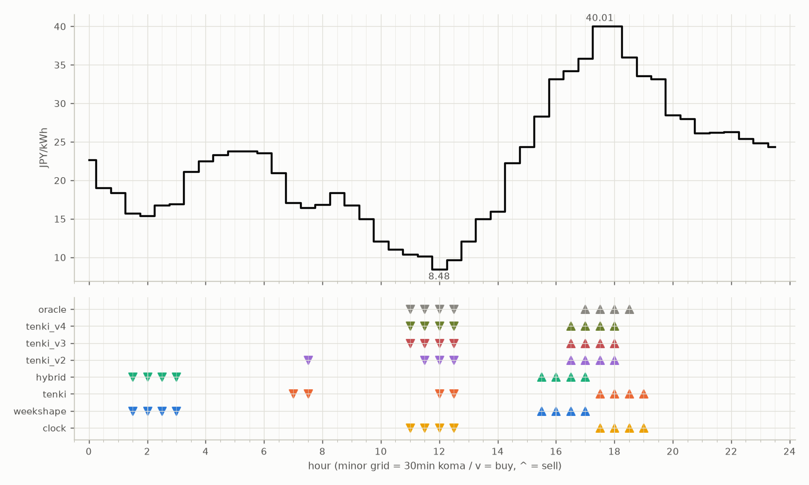

# JEPX仮想蓄電池 フォワード運用レポート

戦略凍結: 2026-08-12 / フォワード開始: 2026-08-14受渡分 / 生成: 2026-09-23 18:34 JST

## 累計成績（リーグ42日目）

| 機体 | 累計損益 | 事前でない日 | **対oracle（共通27日）** | 対oracle（各自の出場日） | 対clock差（pt） |
|---|---|---|---|---|---|
| tenki_v3 | 5,232円 | 19%（8/42日・BT補完） | **89.5%** | 89.7% | +21.3 |
| tenki_v4 | 5,184円 | 24%（10/42日・BT補完） | **88.1%** | 88.6% | +20.4 |
| tenki_v2 | 5,090円 | 17%（7/42日・BT補完） | **87.5%** | 87.2% | +17.9 |
| tenki | 4,819円 | 10%（4/42日・BT3日+再計算1日） | **79.3%** | 81.7% | +10.9 |
| weekshape | 4,553円 | 36%（15/42日・再計算） | **73.3%** | 73.3% | +5.7 |
| hybrid | 4,471円 | 10%（4/42日・BT3日+再計算1日） | **70.4%** | 75.3% | +4.6 |
| clock | 4,240円 | 36%（15/42日・再計算） | **67.6%** | 67.6% | +0.0 |
| oracle | 5,832円 | — | 100.0% | 100.0% | — |

累計損益は**BT補完込み**（参戦前の欠場日を、当時入手可能だったデータのみで再現したバックテストで補完）。**事前でない日**＝価格公表前にコミットされていない日。内訳は**BT補完**（参戦前の穴埋め）と**再計算**（提出が無く採点時にコードから作った日）。clockとweekshapeは2026-08-27まで提出型ではなかったため、それ以前は全日が再計算。**対oracle%と対clock差は事前コミット済みのフォワード日のみ**で計算——対oracle%は値幅のスケールを、対clock差（常設ベンチとの同日ペア差）は時代の取りやすさを一次補正する。

**順位は「対oracle（共通27日）」で付ける。** 「各自の出場日」の列は機体ごとに分母の日が違うので、**順位に使うと難しい日を欠場した機体ほど上に来る**——2026-08-29の敵対的レビューで実際にそうなっていた（tenki_v3が首位に見えていたが、同じ日で揃えるとtenkiとhybridが上）。参考として残すが、比較には使わない。

## 期間別（ISO週別、*=BT補完を含む）

| 週 | tenki | hybrid | clock | weekshape | tenki_v2 | tenki_v3 | tenki_v4 | oracle |
|---|---|---|---|---|---|---|---|---|
| 2026-W33 | 158 | 158 | 241 | 215 | 165* | 180* | 181* | 257 |
| 2026-W34 | 880* | 870* | 796 | 836 | 841* | 856* | 859* | 928 |
| 2026-W35 | 990* | 991* | 842 | 928 | 981* | 1,008* | 1,008* | 1,110 |
| 2026-W36 | 773 | 773 | 499 | 795 | 837 | 860 | 860 | 1,060 |
| 2026-W37 | 731 | 724 | 465 | 714 | 775 | 764 | 707 | 817 |
| 2026-W38 | 644 | 591 | 635 | 690 | 841 | 847 | 829 | 880 |
| 2026-W39 | 643 | 364 | 762 | 374 | 650 | 717 | 739 | 780 |

## 直接対決（全機体出場日 32日のみ）

| 機体 | 累計損益 | 対oracle |
|---|---|---|
| tenki_v3 | 3,926円 | 89.9% |
| tenki_v4 | 3,869円 | 88.6% |
| tenki_v2 | 3,830円 | 87.7% |
| tenki | 3,541円 | 81.1% |
| weekshape | 3,253円 | 74.5% |
| hybrid | 3,195円 | 73.1% |
| clock | 2,976円 | 68.1% |
| oracle | 4,367円 | 100.0% |
## 直近日の解剖（全日分は [daily_anatomy.md](daily_anatomy.md)）

### 2026-09-24（信号: 平常）

- 因子: 日射予報 553 W/m2 / 実測 未確定（実測は約5日遅れ） / 乖離 +48 W/m2（普段より晴れる方向。判定時の直近28日平均 505、判定は絶対値 48 vs 閾値 199）
- 価格の形: 最安 12:00 8.48円 / 最高 17:30 40.01円 / 山谷比 4.7倍

| 機体 | 充電（買い） | 平均買値 | 放電（売り） | 平均売値 | 損益 |
|---|---|---|---|---|---|
| clock | 11:00, 11:30, 12:00, 12:30 | 9.66円 | 17:30, 18:00, 18:30, 19:00 | 37.40円 | +243円 |
| weekshape | 01:30, 02:00, 02:30, 03:00 | 16.23円 | 15:30, 16:00, 16:30, 17:00 | 32.87円 | +133円 |
| tenki | 07:00, 07:30, 12:00, 12:30 | 12.92円 | 17:30, 18:00, 18:30, 19:00 | 37.40円 | +210円 |
| tenki_v2 | 07:30, 11:30, 12:00, 12:30 | 11.18円 | 16:30, 17:00, 17:30, 18:00 | 37.51円 | +226円 |
| tenki_v3 | 11:00, 11:30, 12:00, 12:30 | 9.66円 | 16:30, 17:00, 17:30, 18:00 | 37.51円 | +241円 |
| tenki_v4 | 11:00, 11:30, 12:00, 12:30 | 9.66円 | 16:30, 17:00, 17:30, 18:00 | 37.51円 | +241円 |
| hybrid | 01:30, 02:00, 02:30, 03:00 | 16.23円 | 15:30, 16:00, 16:30, 17:00 | 32.87円 | +133円 |
| oracle | 11:00, 11:30, 12:00, 12:30 | 9.66円 | 17:00, 17:30, 18:00, 18:30 | 37.96円 | +247円 |

**48コマ価格（円/kWh。太字=最安/最高）**

| 00:00 | 00:30 | 01:00 | 01:30 | 02:00 | 02:30 | 03:00 | 03:30 | 04:00 | 04:30 | 05:00 | 05:30 | 06:00 | 06:30 | 07:00 | 07:30 | 08:00 | 08:30 | 09:00 | 09:30 | 10:00 | 10:30 | 11:00 | 11:30 |
|---|---|---|---|---|---|---|---|---|---|---|---|---|---|---|---|---|---|---|---|---|---|---|---|
| 22.71 | 19.01 | 18.42 | 15.75 | 15.43 | 16.80 | 16.93 | 21.10 | 22.51 | 23.35 | 23.78 | 23.78 | 23.53 | 21.00 | 17.10 | 16.48 | 16.85 | 18.43 | 16.81 | 15.00 | 12.13 | 11.08 | 10.41 | 10.12 |

| 12:00 | 12:30 | 13:00 | 13:30 | 14:00 | 14:30 | 15:00 | 15:30 | 16:00 | 16:30 | 17:00 | 17:30 | 18:00 | 18:30 | 19:00 | 19:30 | 20:00 | 20:30 | 21:00 | 21:30 | 22:00 | 22:30 | 23:00 | 23:30 |
|---|---|---|---|---|---|---|---|---|---|---|---|---|---|---|---|---|---|---|---|---|---|---|---|
| **8.48** | 9.63 | 12.10 | 15.00 | 16.00 | 22.26 | 24.35 | 28.31 | 33.15 | 34.20 | 35.83 | **40.01** | 40.00 | 36.00 | 33.59 | 33.15 | 28.50 | 28.00 | 26.17 | 26.21 | 26.28 | 25.45 | 24.84 | 24.33 |

## 明日のpicks（受渡日 2026-09-25、信号: 平常）

日射予報の乖離 -67 W/m2（普段より曇る方向。判定時の直近28日平均 482、判定は絶対値 67 vs 閾値 200）

| 機体 | 充電（買い） | 放電（売り） |
|---|---|---|
| clock | 11:00, 11:30, 12:00, 12:30 | 17:30, 18:00, 18:30, 19:00 |
| weekshape | 02:00, 02:30, 03:00, 03:30 | 15:30, 16:00, 16:30, 17:00 |
