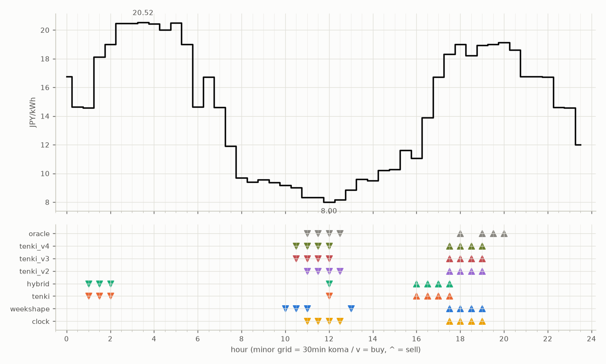

# JEPX仮想蓄電池 フォワード運用レポート

戦略凍結: 2026-08-12 / フォワード開始: 2026-08-14受渡分 / 生成: 2026-09-04 18:01 JST

## 累計成績（リーグ23日目）

| 機体 | 累計損益 | 事前でない日 | **対oracle（共通8日）** | 対oracle（各自の出場日） | 対clock差（pt） |
|---|---|---|---|---|---|
| tenki_v3 | 2,815円 | 35%（8/23日・BT補完） | **80.1%** | 84.5% | +25.2 |
| tenki_v4 | 2,819円 | 43%（10/23日・BT補完） | **80.1%** | 83.8% | +26.6 |
| tenki_v2 | 2,737円 | 30%（7/23日・BT補完） | **79.1%** | 82.6% | +20.4 |
| hybrid | 2,747円 | 17%（4/23日・BT3日+再計算1日） | **77.7%** | 83.5% | +17.6 |
| tenki | 2,756円 | 17%（4/23日・BT3日+再計算1日） | **77.6%** | 83.2% | +17.3 |
| weekshape | 2,685円 | 65%（15/23日・再計算） | **74.9%** | 74.9% | +24.4 |
| clock | 2,291円 | 65%（15/23日・再計算） | **50.5%** | 50.5% | +0.0 |
| oracle | 3,258円 | — | 100.0% | 100.0% | — |

累計損益は**BT補完込み**（参戦前の欠場日を、当時入手可能だったデータのみで再現したバックテストで補完）。**事前でない日**＝価格公表前にコミットされていない日。内訳は**BT補完**（参戦前の穴埋め）と**再計算**（提出が無く採点時にコードから作った日）。clockとweekshapeは2026-08-27まで提出型ではなかったため、それ以前は全日が再計算。**対oracle%と対clock差は事前コミット済みのフォワード日のみ**で計算——対oracle%は値幅のスケールを、対clock差（常設ベンチとの同日ペア差）は時代の取りやすさを一次補正する。

**順位は「対oracle（共通8日）」で付ける。** 「各自の出場日」の列は機体ごとに分母の日が違うので、**順位に使うと難しい日を欠場した機体ほど上に来る**——2026-08-29の敵対的レビューで実際にそうなっていた（tenki_v3が首位に見えていたが、同じ日で揃えるとtenkiとhybridが上）。参考として残すが、比較には使わない。

⚠ **共通日は8日しかない。順位は暫定。**

## 期間別（ISO週別、*=BT補完を含む）

| 週 | tenki | hybrid | clock | weekshape | tenki_v2 | tenki_v3 | tenki_v4 | oracle |
|---|---|---|---|---|---|---|---|---|
| 2026-W33 | 158 | 158 | 241 | 215 | 165* | 180* | 181* | 257 |
| 2026-W34 | 880* | 870* | 796 | 836 | 841* | 856* | 859* | 928 |
| 2026-W35 | 990* | 991* | 842 | 928 | 981* | 1,008* | 1,008* | 1,110 |
| 2026-W36 | 728 | 728 | 411 | 705 | 749 | 771 | 771 | 964 |

## 直接対決（全機体出場日 13日のみ）

| 機体 | 累計損益 | 対oracle |
|---|---|---|
| tenki_v3 | 1,509円 | 84.1% |
| tenki_v4 | 1,504円 | 83.8% |
| tenki | 1,478円 | 82.4% |
| tenki_v2 | 1,477円 | 82.3% |
| hybrid | 1,471円 | 82.0% |
| weekshape | 1,385円 | 77.2% |
| clock | 1,027円 | 57.2% |
| oracle | 1,794円 | 100.0% |
## 直近日の解剖（全日分は [daily_anatomy.md](daily_anatomy.md)）

### 2026-09-05（信号: 強）

- 因子: 日射予報 259 W/m2 / 実測 未確定（実測は約5日遅れ） / 乖離 -372 W/m2（普段より曇る方向。直近28日平均 631、判定は絶対値 372 vs 閾値 194）
- 価格の形: 最安 12:00 8.00円 / 最高 03:30 20.52円 / 山谷比 2.6倍

| 機体 | 充電（買い） | 平均買値 | 放電（売り） | 平均売値 | 損益 |
|---|---|---|---|---|---|
| clock | 11:00, 11:30, 12:00, 12:30 | 8.21円 | 17:30, 18:00, 18:30, 19:00 | 18.62円 | +86円 |
| weekshape | 10:00, 10:30, 11:00, 13:00 | 8.83円 | 17:30, 18:00, 18:30, 19:00 | 18.62円 | +80円 |
| tenki | 01:00, 01:30, 02:00, 12:00 | 14.92円 | 16:00, 16:30, 17:00, 17:30 | 14.99円 | -15円 |
| tenki_v2 | 11:00, 11:30, 12:00, 12:30 | 8.21円 | 17:30, 18:00, 18:30, 19:00 | 18.62円 | +86円 |
| tenki_v3 | 10:30, 11:00, 11:30, 12:00 | 8.41円 | 17:30, 18:00, 18:30, 19:00 | 18.62円 | +84円 |
| tenki_v4 | 10:30, 11:00, 11:30, 12:00 | 8.41円 | 17:30, 18:00, 18:30, 19:00 | 18.62円 | +84円 |
| hybrid | 01:00, 01:30, 02:00, 12:00 | 14.92円 | 16:00, 16:30, 17:00, 17:30 | 14.99円 | -15円 |
| oracle | 11:00, 11:30, 12:00, 12:30 | 8.21円 | 18:00, 19:00, 19:30, 20:00 | 19.02円 | +90円 |

**48コマ価格（円/kWh。太字=最安/最高）**

| 00:00 | 00:30 | 01:00 | 01:30 | 02:00 | 02:30 | 03:00 | 03:30 | 04:00 | 04:30 | 05:00 | 05:30 | 06:00 | 06:30 | 07:00 | 07:30 | 08:00 | 08:30 | 09:00 | 09:30 | 10:00 | 10:30 | 11:00 | 11:30 |
|---|---|---|---|---|---|---|---|---|---|---|---|---|---|---|---|---|---|---|---|---|---|---|---|
| 16.76 | 14.63 | 14.56 | 18.12 | 19.00 | 20.45 | 20.45 | **20.52** | 20.43 | 20.00 | 20.51 | 19.00 | 14.63 | 16.72 | 14.61 | 11.89 | 9.69 | 9.39 | 9.57 | 9.36 | 9.17 | 9.00 | 8.33 | 8.33 |

| 12:00 | 12:30 | 13:00 | 13:30 | 14:00 | 14:30 | 15:00 | 15:30 | 16:00 | 16:30 | 17:00 | 17:30 | 18:00 | 18:30 | 19:00 | 19:30 | 20:00 | 20:30 | 21:00 | 21:30 | 22:00 | 22:30 | 23:00 | 23:30 |
|---|---|---|---|---|---|---|---|---|---|---|---|---|---|---|---|---|---|---|---|---|---|---|---|
| **8.00** | 8.16 | 8.84 | 9.59 | 9.51 | 10.21 | 10.29 | 11.60 | 11.06 | 13.88 | 16.72 | 18.32 | 19.00 | 18.23 | 18.93 | 19.01 | 19.12 | 18.61 | 16.76 | 16.76 | 16.72 | 14.60 | 14.56 | 12.00 |

## 明日のpicks（受渡日 2026-09-06、信号: 強）

日射予報の乖離 -354 W/m2（普段より曇る方向。直近28日平均 631、判定は絶対値 354 vs 閾値 194）

| 機体 | 充電（買い） | 放電（売り） |
|---|---|---|
| clock | 11:00, 11:30, 12:00, 12:30 | 17:30, 18:00, 18:30, 19:00 |
| weekshape | 09:00, 10:00, 10:30, 11:00 | 17:30, 18:00, 18:30, 19:00 |
