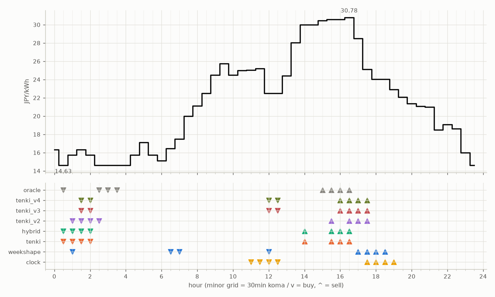

# JEPX仮想蓄電池 フォワード運用レポート

戦略凍結: 2026-08-12 / フォワード開始: 2026-08-14受渡分 / 生成: 2026-09-03 18:10 JST

## 累計成績（リーグ22日目）

| 機体 | 累計損益 | 事前でない日 | **対oracle（共通7日）** | 対oracle（各自の出場日） | 対clock差（pt） |
|---|---|---|---|---|---|
| hybrid | 2,763円 | 18%（4/22日・BT3日+再計算1日） | **85.2%** | 87.0% | +22.2 |
| tenki | 2,771円 | 18%（4/22日・BT3日+再計算1日） | **85.1%** | 86.7% | +21.9 |
| tenki_v3 | 2,731円 | 36%（8/22日・BT補完） | **79.0%** | 84.1% | +26.4 |
| tenki_v4 | 2,736円 | 45%（10/22日・BT補完） | **79.0%** | 83.3% | +28.1 |
| tenki_v2 | 2,651円 | 32%（7/22日・BT補完） | **77.7%** | 82.1% | +21.2 |
| weekshape | 2,605円 | 68%（15/22日・再計算） | **73.8%** | 73.8% | +26.9 |
| clock | 2,205円 | 68%（15/22日・再計算） | **46.9%** | 46.9% | +0.0 |
| oracle | 3,169円 | — | 100.0% | 100.0% | — |

累計損益は**BT補完込み**（参戦前の欠場日を、当時入手可能だったデータのみで再現したバックテストで補完）。**事前でない日**＝価格公表前にコミットされていない日。内訳は**BT補完**（参戦前の穴埋め）と**再計算**（提出が無く採点時にコードから作った日）。clockとweekshapeは2026-08-27まで提出型ではなかったため、それ以前は全日が再計算。**対oracle%と対clock差は事前コミット済みのフォワード日のみ**で計算——対oracle%は値幅のスケールを、対clock差（常設ベンチとの同日ペア差）は時代の取りやすさを一次補正する。

**順位は「対oracle（共通7日）」で付ける。** 「各自の出場日」の列は機体ごとに分母の日が違うので、**順位に使うと難しい日を欠場した機体ほど上に来る**——2026-08-29の敵対的レビューで実際にそうなっていた（tenki_v3が首位に見えていたが、同じ日で揃えるとtenkiとhybridが上）。参考として残すが、比較には使わない。

⚠ **共通日は7日しかない。順位は暫定。**

## 期間別（ISO週別、*=BT補完を含む）

| 週 | tenki | hybrid | clock | weekshape | tenki_v2 | tenki_v3 | tenki_v4 | oracle |
|---|---|---|---|---|---|---|---|---|
| 2026-W33 | 158 | 158 | 241 | 215 | 165* | 180* | 181* | 257 |
| 2026-W34 | 880* | 870* | 796 | 836 | 841* | 856* | 859* | 928 |
| 2026-W35 | 990* | 991* | 842 | 928 | 981* | 1,008* | 1,008* | 1,110 |
| 2026-W36 | 744 | 744 | 325 | 626 | 663 | 687 | 687 | 875 |

## 直接対決（全機体出場日 12日のみ）

| 機体 | 累計損益 | 対oracle |
|---|---|---|
| tenki | 1,493円 | 87.6% |
| hybrid | 1,486円 | 87.2% |
| tenki_v3 | 1,426円 | 83.6% |
| tenki_v4 | 1,420円 | 83.3% |
| tenki_v2 | 1,391円 | 81.6% |
| weekshape | 1,305円 | 76.6% |
| clock | 941円 | 55.2% |
| oracle | 1,704円 | 100.0% |
## 直近日の解剖（全日分は [daily_anatomy.md](daily_anatomy.md)）

### 2026-09-04（信号: 強）

- 因子: 日射予報 156 W/m2 / 実測 未確定（実測は約5日遅れ） / 乖離 -475 W/m2（普段より曇る方向。直近28日平均 631、判定は絶対値 475 vs 閾値 194）
- 価格の形: 最安 00:30 14.63円 / 最高 16:30 30.78円 / 山谷比 2.1倍

| 機体 | 充電（買い） | 平均買値 | 放電（売り） | 平均売値 | 損益 |
|---|---|---|---|---|---|
| clock | 11:00, 11:30, 12:00, 12:30 | 23.81円 | 17:30, 18:00, 18:30, 19:00 | 24.03円 | -21円 |
| weekshape | 01:00, 06:30, 07:00, 12:00 | 18.05円 | 17:00, 17:30, 18:00, 18:30 | 25.43円 | +50円 |
| tenki | 00:30, 01:00, 01:30, 02:00 | 15.61円 | 14:00, 15:30, 16:00, 16:30 | 30.48円 | +119円 |
| tenki_v2 | 01:00, 01:30, 02:00, 02:30 | 15.61円 | 15:30, 16:30, 17:00, 17:30 | 28.74円 | +105円 |
| tenki_v3 | 01:30, 02:00, 12:00, 12:30 | 19.27円 | 16:00, 16:30, 17:00, 17:30 | 28.74円 | +68円 |
| tenki_v4 | 01:30, 02:00, 12:00, 12:30 | 19.27円 | 16:00, 16:30, 17:00, 17:30 | 28.74円 | +68円 |
| hybrid | 00:30, 01:00, 01:30, 02:00 | 15.61円 | 14:00, 15:30, 16:00, 16:30 | 30.48円 | +119円 |
| oracle | 00:30, 02:30, 03:00, 03:30 | 14.63円 | 15:00, 15:30, 16:00, 16:30 | 30.59円 | +130円 |

**48コマ価格（円/kWh。太字=最安/最高）**

| 00:00 | 00:30 | 01:00 | 01:30 | 02:00 | 02:30 | 03:00 | 03:30 | 04:00 | 04:30 | 05:00 | 05:30 | 06:00 | 06:30 | 07:00 | 07:30 | 08:00 | 08:30 | 09:00 | 09:30 | 10:00 | 10:30 | 11:00 | 11:30 |
|---|---|---|---|---|---|---|---|---|---|---|---|---|---|---|---|---|---|---|---|---|---|---|---|
| 16.34 | **14.63** | 15.75 | 16.33 | 15.74 | 14.63 | 14.63 | 14.63 | 14.63 | 15.74 | 17.11 | 15.74 | 15.13 | 16.43 | 17.50 | 19.97 | 21.13 | 22.48 | 24.49 | 25.75 | 24.49 | 25.00 | 25.05 | 25.20 |

| 12:00 | 12:30 | 13:00 | 13:30 | 14:00 | 14:30 | 15:00 | 15:30 | 16:00 | 16:30 | 17:00 | 17:30 | 18:00 | 18:30 | 19:00 | 19:30 | 20:00 | 20:30 | 21:00 | 21:30 | 22:00 | 22:30 | 23:00 | 23:30 |
|---|---|---|---|---|---|---|---|---|---|---|---|---|---|---|---|---|---|---|---|---|---|---|---|
| 22.50 | 22.50 | 24.40 | 28.04 | 30.00 | 30.01 | 30.46 | 30.57 | 30.57 | **30.78** | 28.50 | 25.10 | 24.05 | 24.05 | 22.92 | 22.09 | 21.35 | 21.09 | 21.00 | 18.50 | 19.07 | 18.63 | 15.99 | 14.63 |

## 明日のpicks（受渡日 2026-09-05、信号: 強）

日射予報の乖離 -336 W/m2（普段より曇る方向。直近28日平均 631、判定は絶対値 336 vs 閾値 194）

| 機体 | 充電（買い） | 放電（売り） |
|---|---|---|
| clock | 11:00, 11:30, 12:00, 12:30 | 17:30, 18:00, 18:30, 19:00 |
| weekshape | 10:00, 10:30, 11:00, 13:00 | 17:30, 18:00, 18:30, 19:00 |
