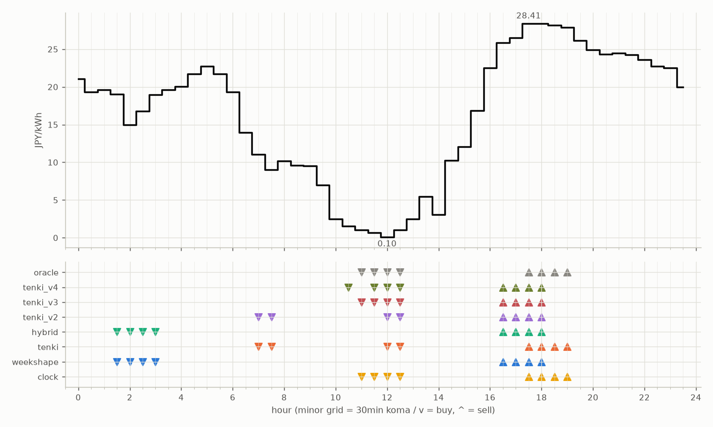

# JEPX仮想蓄電池 フォワード運用レポート

戦略凍結: 2026-08-12 / フォワード開始: 2026-08-14受渡分 / 生成: 2026-09-21 19:11 JST

## 累計成績（リーグ40日目）

| 機体 | 累計損益 | 事前でない日 | **対oracle（共通25日）** | 対oracle（各自の出場日） | 対clock差（pt） |
|---|---|---|---|---|---|
| tenki_v3 | 4,846円 | 20%（8/40日・BT補完） | **89.0%** | 89.4% | +24.0 |
| tenki_v2 | 4,720円 | 18%（7/40日・BT補完） | **87.2%** | 87.0% | +20.5 |
| tenki_v4 | 4,781円 | 25%（10/40日・BT補完） | **87.0%** | 87.7% | +22.7 |
| tenki | 4,469円 | 10%（4/40日・BT3日+再計算1日） | **78.7%** | 81.5% | +13.1 |
| weekshape | 4,351円 | 38%（15/40日・再計算） | **76.4%** | 76.4% | +12.6 |
| hybrid | 4,270円 | 10%（4/40日・BT3日+再計算1日） | **73.1%** | 77.6% | +9.3 |
| clock | 3,830円 | 38%（15/40日・再計算） | **63.8%** | 63.8% | +0.0 |
| oracle | 5,418円 | — | 100.0% | 100.0% | — |

累計損益は**BT補完込み**（参戦前の欠場日を、当時入手可能だったデータのみで再現したバックテストで補完）。**事前でない日**＝価格公表前にコミットされていない日。内訳は**BT補完**（参戦前の穴埋め）と**再計算**（提出が無く採点時にコードから作った日）。clockとweekshapeは2026-08-27まで提出型ではなかったため、それ以前は全日が再計算。**対oracle%と対clock差は事前コミット済みのフォワード日のみ**で計算——対oracle%は値幅のスケールを、対clock差（常設ベンチとの同日ペア差）は時代の取りやすさを一次補正する。

**順位は「対oracle（共通25日）」で付ける。** 「各自の出場日」の列は機体ごとに分母の日が違うので、**順位に使うと難しい日を欠場した機体ほど上に来る**——2026-08-29の敵対的レビューで実際にそうなっていた（tenki_v3が首位に見えていたが、同じ日で揃えるとtenkiとhybridが上）。参考として残すが、比較には使わない。

## 期間別（ISO週別、*=BT補完を含む）

| 週 | tenki | hybrid | clock | weekshape | tenki_v2 | tenki_v3 | tenki_v4 | oracle |
|---|---|---|---|---|---|---|---|---|
| 2026-W33 | 158 | 158 | 241 | 215 | 165* | 180* | 181* | 257 |
| 2026-W34 | 880* | 870* | 796 | 836 | 841* | 856* | 859* | 928 |
| 2026-W35 | 990* | 991* | 842 | 928 | 981* | 1,008* | 1,008* | 1,110 |
| 2026-W36 | 773 | 773 | 499 | 795 | 837 | 860 | 860 | 1,060 |
| 2026-W37 | 731 | 724 | 465 | 714 | 775 | 764 | 707 | 817 |
| 2026-W38 | 644 | 591 | 635 | 690 | 841 | 847 | 829 | 880 |
| 2026-W39 | 293 | 163 | 352 | 173 | 279 | 331 | 335 | 366 |

## 直接対決（全機体出場日 30日のみ）

| 機体 | 累計損益 | 対oracle |
|---|---|---|
| tenki_v3 | 3,541円 | 89.6% |
| tenki_v4 | 3,465円 | 87.7% |
| tenki_v2 | 3,460円 | 87.5% |
| tenki | 3,191円 | 80.7% |
| weekshape | 3,051円 | 77.2% |
| hybrid | 2,993円 | 75.7% |
| clock | 2,566円 | 64.9% |
| oracle | 3,953円 | 100.0% |
## 直近日の解剖（全日分は [daily_anatomy.md](daily_anatomy.md)）

### 2026-09-22（信号: 平常）

- 因子: 日射予報 563 W/m2 / 実測 未確定（実測は約5日遅れ） / 乖離 +57 W/m2（普段より晴れる方向。判定時の直近28日平均 505、判定は絶対値 57 vs 閾値 199）
- 価格の形: 最安 12:00 0.10円 / 最高 17:30 28.41円 / 山谷比 284.1倍

| 機体 | 充電（買い） | 平均買値 | 放電（売り） | 平均売値 | 損益 |
|---|---|---|---|---|---|
| clock | 11:00, 11:30, 12:00, 12:30 | 0.70円 | 17:30, 18:00, 18:30, 19:00 | 28.23円 | +248円 |
| weekshape | 01:30, 02:00, 02:30, 03:00 | 17.45円 | 16:30, 17:00, 17:30, 18:00 | 27.31円 | +71円 |
| tenki | 07:00, 07:30, 12:00, 12:30 | 5.29円 | 17:30, 18:00, 18:30, 19:00 | 28.23円 | +202円 |
| tenki_v2 | 07:00, 07:30, 12:00, 12:30 | 5.29円 | 16:30, 17:00, 17:30, 18:00 | 27.31円 | +193円 |
| tenki_v3 | 11:00, 11:30, 12:00, 12:30 | 0.70円 | 16:30, 17:00, 17:30, 18:00 | 27.31円 | +239円 |
| tenki_v4 | 10:30, 11:30, 12:00, 12:30 | 0.83円 | 16:30, 17:00, 17:30, 18:00 | 27.31円 | +238円 |
| hybrid | 01:30, 02:00, 02:30, 03:00 | 17.45円 | 16:30, 17:00, 17:30, 18:00 | 27.31円 | +71円 |
| oracle | 11:00, 11:30, 12:00, 12:30 | 0.70円 | 17:30, 18:00, 18:30, 19:00 | 28.23円 | +248円 |

**48コマ価格（円/kWh。太字=最安/最高）**

| 00:00 | 00:30 | 01:00 | 01:30 | 02:00 | 02:30 | 03:00 | 03:30 | 04:00 | 04:30 | 05:00 | 05:30 | 06:00 | 06:30 | 07:00 | 07:30 | 08:00 | 08:30 | 09:00 | 09:30 | 10:00 | 10:30 | 11:00 | 11:30 |
|---|---|---|---|---|---|---|---|---|---|---|---|---|---|---|---|---|---|---|---|---|---|---|---|
| 21.10 | 19.30 | 19.59 | 19.00 | 15.00 | 16.81 | 18.99 | 19.60 | 20.03 | 21.74 | 22.76 | 21.74 | 19.29 | 13.95 | 11.06 | 9.00 | 10.21 | 9.63 | 9.50 | 7.00 | 2.50 | 1.51 | 1.00 | 0.70 |

| 12:00 | 12:30 | 13:00 | 13:30 | 14:00 | 14:30 | 15:00 | 15:30 | 16:00 | 16:30 | 17:00 | 17:30 | 18:00 | 18:30 | 19:00 | 19:30 | 20:00 | 20:30 | 21:00 | 21:30 | 22:00 | 22:30 | 23:00 | 23:30 |
|---|---|---|---|---|---|---|---|---|---|---|---|---|---|---|---|---|---|---|---|---|---|---|---|
| **0.10** | 1.00 | 2.50 | 5.45 | 3.10 | 10.28 | 12.04 | 16.85 | 22.48 | 25.88 | 26.54 | **28.41** | 28.41 | 28.19 | 27.91 | 26.17 | 24.90 | 24.36 | 24.49 | 24.29 | 23.64 | 22.76 | 22.50 | 20.00 |

## 明日のpicks（受渡日 2026-09-23、信号: 平常）

日射予報の乖離 -13 W/m2（普段より曇る方向。判定時の直近28日平均 505、判定は絶対値 13 vs 閾値 199）

| 機体 | 充電（買い） | 放電（売り） |
|---|---|---|
| clock | 11:00, 11:30, 12:00, 12:30 | 17:30, 18:00, 18:30, 19:00 |
| weekshape | 01:00, 01:30, 02:00, 02:30 | 16:30, 17:00, 17:30, 18:00 |
