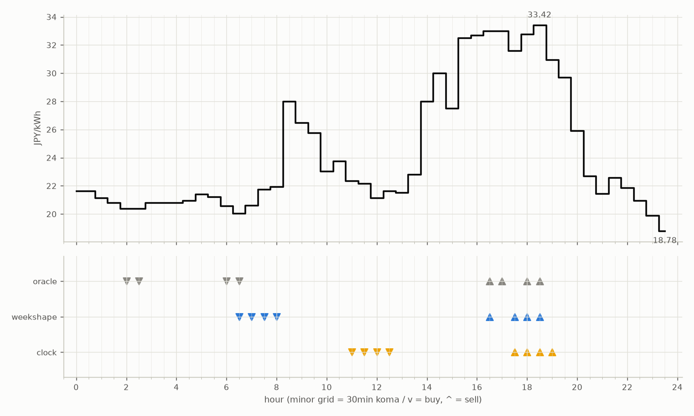

# JEPX仮想蓄電池 フォワード運用レポート

戦略凍結: 2026-08-12 / フォワード開始: 2026-08-14受渡分 / 生成: 2026-08-27 20:49 JST

> ⚠ 8/26受渡: **提出が届いていない**（picksファイルが無い＝strategies側のCIが落ちたか、pushが他のCIと衝突して失われた。気象とは別の原因）のため天気系4機体は**欠場**（実力ではなく計測の欠測。後日、予報アーカイブからBT補完される）
> ⚠ 8/28受渡: **提出が届いていない**（picksファイルが無い＝strategies側のCIが落ちたか、pushが他のCIと衝突して失われた。気象とは別の原因）のため天気系4機体は**欠場**（実力ではなく計測の欠測。後日、予報アーカイブからBT補完される）

## 累計成績（リーグ15日目）

| 機体 | 累計損益 | BT率 | 対oracle（Fwd） | 対clock差（Fwd, pt） |
|---|---|---|---|---|
| tenki_v4 | 1,263円 | 58%（7/12日） | 91.8% | +20.3 |
| tenki_v3 | 1,259円 | 42%（5/12日） | 90.7% | +19.1 |
| weekshape | 1,771円 | 0% | 86.9% | +4.7 |
| tenki_v2 | 1,413円 | 38%（5/13日） | 86.5% | +11.4 |
| hybrid | 1,288円 | 0% | 85.9% | +6.3 |
| tenki | 1,446円 | 8%（1/13日） | 85.5% | +5.9 |
| clock | 1,675円 | 0% | 82.2% | +0.0 |
| oracle | 2,038円 | 0% | 100.0% | — |

累計損益は**BT補完込み**（参戦前の欠場日を、当時入手可能だったデータのみで再現したバックテストで補完。BT率＝そのうち事前コミットでない日の割合。割り引いて読む）。**対oracle%と対clock差は事前コミット済みのフォワード日のみ**で計算——対oracle%は値幅のスケールを、対clock差（常設ベンチとの同日ペア差）は時代の取りやすさを一次補正する。完全対等の比較は下の直接対決（共通日のみ）

## 期間別（ISO週別、*=BT補完を含む）

| 週 | clock | weekshape | tenki | hybrid | tenki_v2 | tenki_v3 | tenki_v4 | oracle |
|---|---|---|---|---|---|---|---|---|
| 2026-W33 | 241 | 215 | 158 | 158 | 165* | 180* | 181* | 257 |
| 2026-W34 | 796 | 836 | 880* | 704 | 841* | 856* | 859* | 928 |
| 2026-W35 | 637 | 719 | 409 | 426 | 407 | 223 | 223 | 854 |

## 直接対決（全機体出場日 5日のみ）

| 機体 | 累計損益 | 対oracle |
|---|---|---|
| tenki_v3 | 532円 | 92.8% |
| tenki | 531円 | 92.6% |
| tenki_v4 | 527円 | 91.8% |
| hybrid | 523円 | 91.2% |
| tenki_v2 | 512円 | 89.3% |
| weekshape | 471円 | 82.0% |
| clock | 410円 | 71.5% |
| oracle | 574円 | 100.0% |
## 直近日の解剖（全日分は [daily_anatomy.md](daily_anatomy.md)）

### 2026-08-28（信号: ?）

- 因子: picksの_meta欠落
- 価格の形: 最安 23:30 18.78円 / 最高 18:30 33.42円 / 山谷比 1.8倍

| 機体 | 充電（買い） | 平均買値 | 放電（売り） | 平均売値 | 損益 |
|---|---|---|---|---|---|
| clock | 11:00, 11:30, 12:00, 12:30 | 21.82円 | 17:30, 18:00, 18:30, 19:00 | 32.18円 | +73円 |
| weekshape | 06:30, 07:00, 07:30, 08:00 | 21.09円 | 16:30, 17:30, 18:00, 18:30 | 32.69円 | +84円 |
| oracle | 02:00, 02:30, 06:00, 06:30 | 20.34円 | 16:30, 17:00, 18:00, 18:30 | 33.04円 | +95円 |

**48コマ価格（円/kWh。太字=最安/最高）**

| 00:00 | 00:30 | 01:00 | 01:30 | 02:00 | 02:30 | 03:00 | 03:30 | 04:00 | 04:30 | 05:00 | 05:30 | 06:00 | 06:30 | 07:00 | 07:30 | 08:00 | 08:30 | 09:00 | 09:30 | 10:00 | 10:30 | 11:00 | 11:30 |
|---|---|---|---|---|---|---|---|---|---|---|---|---|---|---|---|---|---|---|---|---|---|---|---|
| 21.63 | 21.63 | 21.14 | 20.80 | 20.38 | 20.38 | 20.80 | 20.80 | 20.80 | 20.97 | 21.41 | 21.23 | 20.58 | 20.03 | 20.62 | 21.75 | 21.95 | 28.00 | 26.50 | 25.75 | 23.02 | 23.76 | 22.36 | 22.16 |

| 12:00 | 12:30 | 13:00 | 13:30 | 14:00 | 14:30 | 15:00 | 15:30 | 16:00 | 16:30 | 17:00 | 17:30 | 18:00 | 18:30 | 19:00 | 19:30 | 20:00 | 20:30 | 21:00 | 21:30 | 22:00 | 22:30 | 23:00 | 23:30 |
|---|---|---|---|---|---|---|---|---|---|---|---|---|---|---|---|---|---|---|---|---|---|---|---|
| 21.15 | 21.63 | 21.51 | 22.80 | 28.00 | 30.00 | 27.50 | 32.50 | 32.69 | 33.00 | 32.99 | 31.58 | 32.76 | **33.42** | 30.95 | 29.69 | 25.92 | 22.69 | 21.45 | 22.58 | 21.87 | 20.94 | 19.88 | **18.78** |

## 明日のpicks（受渡日 2026-08-29、信号: 強）

日射予報の乖離 -346 W/m2（普段より曇る方向。直近28日平均 635、判定は絶対値 346 vs 閾値 195）

| 機体 | 充電（買い） | 放電（売り） |
|---|---|---|
| clock | 11:00, 11:30, 12:00, 12:30 | 17:30, 18:00, 18:30, 19:00 |
| weekshape | 10:00, 10:30, 11:00, 12:00 | 17:30, 18:00, 18:30, 19:00 |
| tenki | 01:00, 01:30, 02:00, 02:30 | 16:30, 17:30, 18:00, 18:30 |
| tenki_v2 | 07:30, 11:00, 11:30, 12:00 | 17:30, 18:00, 18:30, 19:00 |
| tenki_v3 | 11:00, 11:30, 12:00, 12:30 | 17:30, 18:00, 18:30, 19:00 |
| tenki_v4 | 11:00, 11:30, 12:00, 12:30 | 17:30, 18:00, 18:30, 19:00 |
| hybrid | 01:00, 01:30, 02:00, 02:30 | 16:30, 17:30, 18:00, 18:30 |
