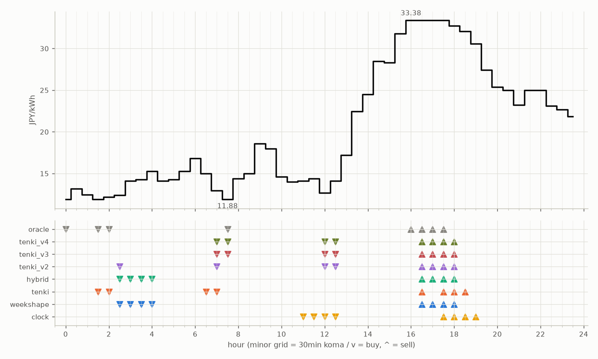

# JEPX仮想蓄電池 フォワード運用レポート

戦略凍結: 2026-08-12 / フォワード開始: 2026-08-14受渡分 / 生成: 2026-09-13 18:42 JST

## 累計成績（リーグ32日目）

| 機体 | 累計損益 | 事前でない日 | **対oracle（共通17日）** | 対oracle（各自の出場日） | 対clock差（pt） |
|---|---|---|---|---|---|
| tenki_v3 | 3,839円 | 25%（8/32日・BT補完） | **86.5%** | 87.6% | +26.5 |
| tenki_v2 | 3,769円 | 22%（7/32日・BT補完） | **86.3%** | 86.4% | +23.4 |
| tenki_v4 | 3,787円 | 31%（10/32日・BT補完） | **84.0%** | 85.6% | +25.6 |
| tenki | 3,699円 | 12%（4/32日・BT3日+再計算1日） | **81.6%** | 84.1% | +18.6 |
| weekshape | 3,649円 | 47%（15/32日・再計算） | **81.1%** | 81.1% | +24.0 |
| hybrid | 3,676円 | 12%（4/32日・BT3日+再計算1日） | **81.1%** | 83.9% | +18.4 |
| clock | 2,996円 | 47%（15/32日・再計算） | **57.1%** | 57.1% | +0.0 |
| oracle | 4,353円 | — | 100.0% | 100.0% | — |

累計損益は**BT補完込み**（参戦前の欠場日を、当時入手可能だったデータのみで再現したバックテストで補完）。**事前でない日**＝価格公表前にコミットされていない日。内訳は**BT補完**（参戦前の穴埋め）と**再計算**（提出が無く採点時にコードから作った日）。clockとweekshapeは2026-08-27まで提出型ではなかったため、それ以前は全日が再計算。**対oracle%と対clock差は事前コミット済みのフォワード日のみ**で計算——対oracle%は値幅のスケールを、対clock差（常設ベンチとの同日ペア差）は時代の取りやすさを一次補正する。

**順位は「対oracle（共通17日）」で付ける。** 「各自の出場日」の列は機体ごとに分母の日が違うので、**順位に使うと難しい日を欠場した機体ほど上に来る**——2026-08-29の敵対的レビューで実際にそうなっていた（tenki_v3が首位に見えていたが、同じ日で揃えるとtenkiとhybridが上）。参考として残すが、比較には使わない。

## 期間別（ISO週別、*=BT補完を含む）

| 週 | tenki | hybrid | clock | weekshape | tenki_v2 | tenki_v3 | tenki_v4 | oracle |
|---|---|---|---|---|---|---|---|---|
| 2026-W33 | 158 | 158 | 241 | 215 | 165* | 180* | 181* | 257 |
| 2026-W34 | 880* | 870* | 796 | 836 | 841* | 856* | 859* | 928 |
| 2026-W35 | 990* | 991* | 842 | 928 | 981* | 1,008* | 1,008* | 1,110 |
| 2026-W36 | 773 | 773 | 499 | 795 | 837 | 860 | 860 | 1,060 |
| 2026-W37 | 731 | 724 | 465 | 714 | 775 | 764 | 707 | 817 |
| 2026-W38 | 167 | 160 | 153 | 160 | 170 | 171 | 171 | 182 |

## 直接対決（全機体出場日 22日のみ）

| 機体 | 累計損益 | 対oracle |
|---|---|---|
| tenki_v3 | 2,534円 | 87.7% |
| tenki_v2 | 2,509円 | 86.9% |
| tenki_v4 | 2,472円 | 85.6% |
| tenki | 2,421円 | 83.8% |
| hybrid | 2,399円 | 83.1% |
| weekshape | 2,348円 | 81.3% |
| clock | 1,732円 | 60.0% |
| oracle | 2,888円 | 100.0% |
## 直近日の解剖（全日分は [daily_anatomy.md](daily_anatomy.md)）

### 2026-09-14（信号: 平常）

- 因子: 日射予報 546 W/m2 / 実測 未確定（実測は約5日遅れ） / 乖離 -15 W/m2（普段より曇る方向。直近28日平均 561、判定は絶対値 15 vs 閾値 196）
- 価格の形: 最安 07:30 11.88円 / 最高 16:00 33.38円 / 山谷比 2.8倍

| 機体 | 充電（買い） | 平均買値 | 放電（売り） | 平均売値 | 損益 |
|---|---|---|---|---|---|
| clock | 11:00, 11:30, 12:00, 12:30 | 13.83円 | 17:30, 18:00, 18:30, 19:00 | 32.19円 | +153円 |
| weekshape | 02:30, 03:00, 03:30, 04:00 | 14.02円 | 16:30, 17:00, 17:30, 18:00 | 33.22円 | +160円 |
| tenki | 01:30, 02:00, 06:30, 07:00 | 13.01円 | 16:30, 17:30, 18:00, 18:30 | 32.90円 | +167円 |
| tenki_v2 | 02:30, 07:00, 12:00, 12:30 | 13.03円 | 16:30, 17:00, 17:30, 18:00 | 33.22円 | +170円 |
| tenki_v3 | 07:00, 07:30, 12:00, 12:30 | 12.90円 | 16:30, 17:00, 17:30, 18:00 | 33.22円 | +171円 |
| tenki_v4 | 07:00, 07:30, 12:00, 12:30 | 12.90円 | 16:30, 17:00, 17:30, 18:00 | 33.22円 | +171円 |
| hybrid | 02:30, 03:00, 03:30, 04:00 | 14.02円 | 16:30, 17:00, 17:30, 18:00 | 33.22円 | +160円 |
| oracle | 00:00, 01:30, 02:00, 07:30 | 11.97円 | 16:00, 16:30, 17:00, 17:30 | 33.38円 | +182円 |

**48コマ価格（円/kWh。太字=最安/最高）**

| 00:00 | 00:30 | 01:00 | 01:30 | 02:00 | 02:30 | 03:00 | 03:30 | 04:00 | 04:30 | 05:00 | 05:30 | 06:00 | 06:30 | 07:00 | 07:30 | 08:00 | 08:30 | 09:00 | 09:30 | 10:00 | 10:30 | 11:00 | 11:30 |
|---|---|---|---|---|---|---|---|---|---|---|---|---|---|---|---|---|---|---|---|---|---|---|---|
| 11.92 | 13.15 | 12.47 | 11.89 | 12.20 | 12.39 | 14.11 | 14.28 | 15.28 | 14.12 | 14.30 | 15.28 | 16.80 | 15.00 | 12.95 | **11.88** | 14.41 | 15.00 | 18.56 | 18.00 | 14.63 | 14.01 | 14.12 | 14.41 |

| 12:00 | 12:30 | 13:00 | 13:30 | 14:00 | 14:30 | 15:00 | 15:30 | 16:00 | 16:30 | 17:00 | 17:30 | 18:00 | 18:30 | 19:00 | 19:30 | 20:00 | 20:30 | 21:00 | 21:30 | 22:00 | 22:30 | 23:00 | 23:30 |
|---|---|---|---|---|---|---|---|---|---|---|---|---|---|---|---|---|---|---|---|---|---|---|---|
| 12.66 | 14.12 | 17.23 | 22.48 | 24.48 | 28.47 | 28.31 | 31.80 | **33.38** | 33.38 | 33.38 | 33.38 | 32.74 | 32.09 | 30.55 | 27.43 | 25.38 | 25.00 | 23.24 | 25.00 | 25.00 | 23.13 | 22.65 | 21.82 |

## 明日のpicks（受渡日 2026-09-15、信号: 強）

日射予報の乖離 -419 W/m2（普段より曇る方向。直近28日平均 561、判定は絶対値 419 vs 閾値 196）

| 機体 | 充電（買い） | 放電（売り） |
|---|---|---|
| clock | 11:00, 11:30, 12:00, 12:30 | 17:30, 18:00, 18:30, 19:00 |
| weekshape | 06:30, 07:00, 07:30, 12:00 | 16:30, 17:00, 17:30, 18:00 |
