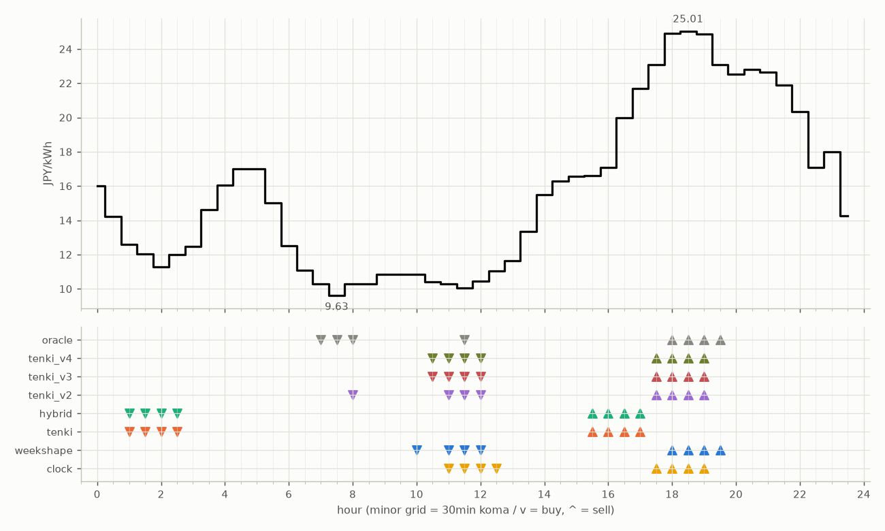

# JEPX仮想蓄電池 フォワード運用レポート

戦略凍結: 2026-08-12 / フォワード開始: 2026-08-14受渡分 / 生成: 2026-09-19 17:57 JST

## 累計成績（リーグ38日目）

| 機体 | 累計損益 | 事前でない日 | **対oracle（共通23日）** | 対oracle（各自の出場日） | 対clock差（pt） |
|---|---|---|---|---|---|
| tenki_v3 | 4,515円 | 21%（8/38日・BT補完） | **88.8%** | 89.3% | +26.8 |
| tenki_v2 | 4,441円 | 18%（7/38日・BT補完） | **88.6%** | 88.0% | +24.0 |
| tenki_v4 | 4,445円 | 26%（10/38日・BT補完） | **86.4%** | 87.3% | +25.5 |
| weekshape | 4,179円 | 39%（15/38日・再計算） | **79.9%** | 79.9% | +20.1 |
| tenki | 4,176円 | 11%（4/38日・BT3日+再計算1日） | **78.5%** | 81.6% | +15.6 |
| hybrid | 4,107円 | 11%（4/38日・BT3日+再計算1日） | **76.6%** | 80.4% | +14.4 |
| clock | 3,478円 | 39%（15/38日・再計算） | **59.8%** | 59.8% | +0.0 |
| oracle | 5,052円 | — | 100.0% | 100.0% | — |

累計損益は**BT補完込み**（参戦前の欠場日を、当時入手可能だったデータのみで再現したバックテストで補完）。**事前でない日**＝価格公表前にコミットされていない日。内訳は**BT補完**（参戦前の穴埋め）と**再計算**（提出が無く採点時にコードから作った日）。clockとweekshapeは2026-08-27まで提出型ではなかったため、それ以前は全日が再計算。**対oracle%と対clock差は事前コミット済みのフォワード日のみ**で計算——対oracle%は値幅のスケールを、対clock差（常設ベンチとの同日ペア差）は時代の取りやすさを一次補正する。

**順位は「対oracle（共通23日）」で付ける。** 「各自の出場日」の列は機体ごとに分母の日が違うので、**順位に使うと難しい日を欠場した機体ほど上に来る**——2026-08-29の敵対的レビューで実際にそうなっていた（tenki_v3が首位に見えていたが、同じ日で揃えるとtenkiとhybridが上）。参考として残すが、比較には使わない。

## 期間別（ISO週別、*=BT補完を含む）

| 週 | tenki | hybrid | clock | weekshape | tenki_v2 | tenki_v3 | tenki_v4 | oracle |
|---|---|---|---|---|---|---|---|---|
| 2026-W33 | 158 | 158 | 241 | 215 | 165* | 180* | 181* | 257 |
| 2026-W34 | 880* | 870* | 796 | 836 | 841* | 856* | 859* | 928 |
| 2026-W35 | 990* | 991* | 842 | 928 | 981* | 1,008* | 1,008* | 1,110 |
| 2026-W36 | 773 | 773 | 499 | 795 | 837 | 860 | 860 | 1,060 |
| 2026-W37 | 731 | 724 | 465 | 714 | 775 | 764 | 707 | 817 |
| 2026-W38 | 644 | 591 | 635 | 690 | 841 | 847 | 829 | 880 |

## 直接対決（全機体出場日 28日のみ）

| 機体 | 累計損益 | 対oracle |
|---|---|---|
| tenki_v3 | 3,209円 | 89.5% |
| tenki_v2 | 3,181円 | 88.7% |
| tenki_v4 | 3,130円 | 87.3% |
| tenki | 2,898円 | 80.8% |
| weekshape | 2,879円 | 80.3% |
| hybrid | 2,830円 | 78.9% |
| clock | 2,214円 | 61.7% |
| oracle | 3,587円 | 100.0% |
## 直近日の解剖（全日分は [daily_anatomy.md](daily_anatomy.md)）

### 2026-09-20（信号: 強）

- 因子: 日射予報 231 W/m2 / 実測 未確定（実測は約5日遅れ） / 乖離 -288 W/m2（普段より曇る方向。判定時の直近28日平均 519、判定は絶対値 288 vs 閾値 199）
- 価格の形: 最安 07:30 9.63円 / 最高 18:30 25.01円 / 山谷比 2.6倍

| 機体 | 充電（買い） | 平均買値 | 放電（売り） | 平均売値 | 損益 |
|---|---|---|---|---|---|
| clock | 11:00, 11:30, 12:00, 12:30 | 10.45円 | 17:30, 18:00, 18:30, 19:00 | 24.47円 | +116円 |
| weekshape | 10:00, 11:00, 11:30, 12:00 | 10.41円 | 18:00, 18:30, 19:00, 19:30 | 24.47円 | +117円 |
| tenki | 01:00, 01:30, 02:00, 02:30 | 11.97円 | 15:30, 16:00, 16:30, 17:00 | 18.85円 | +49円 |
| tenki_v2 | 08:00, 11:00, 11:30, 12:00 | 10.27円 | 17:30, 18:00, 18:30, 19:00 | 24.47円 | +118円 |
| tenki_v3 | 10:30, 11:00, 11:30, 12:00 | 10.30円 | 17:30, 18:00, 18:30, 19:00 | 24.47円 | +118円 |
| tenki_v4 | 10:30, 11:00, 11:30, 12:00 | 10.30円 | 17:30, 18:00, 18:30, 19:00 | 24.47円 | +118円 |
| hybrid | 01:00, 01:30, 02:00, 02:30 | 11.97円 | 15:30, 16:00, 16:30, 17:00 | 18.85円 | +49円 |
| oracle | 07:00, 07:30, 08:00, 11:30 | 10.06円 | 18:00, 18:30, 19:00, 19:30 | 24.47円 | +121円 |

**48コマ価格（円/kWh。太字=最安/最高）**

| 00:00 | 00:30 | 01:00 | 01:30 | 02:00 | 02:30 | 03:00 | 03:30 | 04:00 | 04:30 | 05:00 | 05:30 | 06:00 | 06:30 | 07:00 | 07:30 | 08:00 | 08:30 | 09:00 | 09:30 | 10:00 | 10:30 | 11:00 | 11:30 |
|---|---|---|---|---|---|---|---|---|---|---|---|---|---|---|---|---|---|---|---|---|---|---|---|
| 16.00 | 14.21 | 12.61 | 12.02 | 11.26 | 11.99 | 12.49 | 14.63 | 16.05 | 17.00 | 17.02 | 15.00 | 12.53 | 11.08 | 10.28 | **9.63** | 10.28 | 10.28 | 10.86 | 10.86 | 10.86 | 10.41 | 10.28 | 10.04 |

| 12:00 | 12:30 | 13:00 | 13:30 | 14:00 | 14:30 | 15:00 | 15:30 | 16:00 | 16:30 | 17:00 | 17:30 | 18:00 | 18:30 | 19:00 | 19:30 | 20:00 | 20:30 | 21:00 | 21:30 | 22:00 | 22:30 | 23:00 | 23:30 |
|---|---|---|---|---|---|---|---|---|---|---|---|---|---|---|---|---|---|---|---|---|---|---|---|
| 10.46 | 11.03 | 11.65 | 13.36 | 15.50 | 16.29 | 16.58 | 16.62 | 17.10 | 20.00 | 21.69 | 23.10 | 24.90 | **25.01** | 24.87 | 23.10 | 22.51 | 22.80 | 22.65 | 21.87 | 20.35 | 17.10 | 18.00 | 14.27 |

## 明日のpicks（受渡日 2026-09-21、信号: 強）

日射予報の乖離 -321 W/m2（普段より曇る方向。判定時の直近28日平均 519、判定は絶対値 321 vs 閾値 199）

| 機体 | 充電（買い） | 放電（売り） |
|---|---|---|
| clock | 11:00, 11:30, 12:00, 12:30 | 17:30, 18:00, 18:30, 19:00 |
| weekshape | 01:30, 02:00, 02:30, 03:00 | 16:30, 17:00, 17:30, 18:00 |
