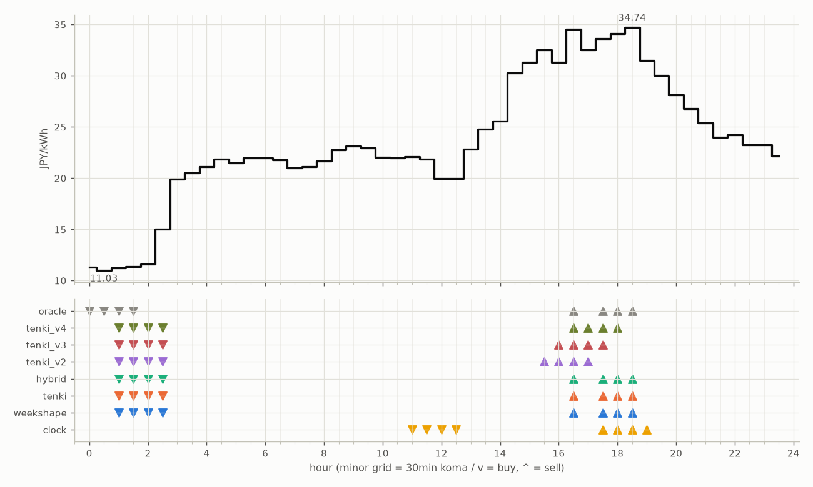

# JEPX仮想蓄電池 フォワード運用レポート

戦略凍結: 2026-08-12 / フォワード開始: 2026-08-14受渡分 / 生成: 2026-10-04 19:49 JST

> ⚠ 9/30受渡: **提出が届いていない**（picksファイルが無い＝strategies側のCIが落ちたか、pushが他のCIと衝突して失われた。気象とは別の原因）のため天気系4機体は**欠場**（実力ではなく計測の欠測。後日、予報アーカイブからBT補完される）

## 累計成績（リーグ53日目）

| 機体 | 累計損益 | 事前でない日 | **対oracle（共通37日）** | 対oracle（各自の出場日） | 対clock差（pt） |
|---|---|---|---|---|---|
| tenki_v3 | 6,807円 | 15%（8/52日・BT補完） | **90.2%** | 90.2% | +21.3 |
| tenki_v4 | 6,786円 | 19%（10/52日・BT補完） | **89.7%** | 89.9% | +21.1 |
| tenki_v2 | 6,658円 | 13%（7/52日・BT補完） | **88.6%** | 88.3% | +18.7 |
| tenki | 6,331円 | 8%（4/52日・BT3日+再計算1日） | **82.0%** | 83.3% | +12.6 |
| weekshape | 6,023円 | 30%（16/53日・再計算） | **74.6%** | 74.6% | +6.1 |
| hybrid | 5,887円 | 8%（4/52日・BT3日+再計算1日） | **74.2%** | 77.1% | +6.4 |
| clock | 5,717円 | 30%（16/53日・再計算） | **68.5%** | 68.5% | +0.0 |
| oracle | 7,821円 | — | 100.0% | 100.0% | — |

累計損益は**BT補完込み**（参戦前の欠場日を、当時入手可能だったデータのみで再現したバックテストで補完）。**事前でない日**＝価格公表前にコミットされていない日。内訳は**BT補完**（参戦前の穴埋め）と**再計算**（提出が無く採点時にコードから作った日）。clockとweekshapeは2026-08-27まで提出型ではなかったため、それ以前は全日が再計算。**対oracle%と対clock差は事前コミット済みのフォワード日のみ**で計算——対oracle%は値幅のスケールを、対clock差（常設ベンチとの同日ペア差）は時代の取りやすさを一次補正する。

**順位は「対oracle（共通37日）」で付ける。** 「各自の出場日」の列は機体ごとに分母の日が違うので、**順位に使うと難しい日を欠場した機体ほど上に来る**——2026-08-29の敵対的レビューで実際にそうなっていた（tenki_v3が首位に見えていたが、同じ日で揃えるとtenkiとhybridが上）。参考として残すが、比較には使わない。

### 欠場の内訳

- **補完待ち**（5件）: 9/30 hybrid, 9/30 tenki, 9/30 tenki_v2, 9/30 tenki_v3, 9/30 tenki_v4
  - 予報アーカイブ（約5日遅れ）の到着後に自動で埋まる。埋まれば全機体が同じ日で戦う

## 期間別（ISO週別、*=BT補完を含む）

| 週 | tenki | hybrid | clock | weekshape | tenki_v2 | tenki_v3 | tenki_v4 | oracle |
|---|---|---|---|---|---|---|---|---|
| 2026-W33 | 158 | 158 | 241 | 215 | 165* | 180* | 181* | 257 |
| 2026-W34 | 880* | 870* | 796 | 836 | 841* | 856* | 859* | 928 |
| 2026-W35 | 990* | 991* | 842 | 928 | 981* | 1,008* | 1,008* | 1,110 |
| 2026-W36 | 773 | 773 | 499 | 795 | 837 | 860 | 860 | 1,060 |
| 2026-W37 | 731 | 724 | 465 | 714 | 775 | 764 | 707 | 817 |
| 2026-W38 | 644 | 591 | 635 | 690 | 841 | 847 | 829 | 880 |
| 2026-W39 | 924 | 605 | 1,046 | 607 | 933 | 1,007 | 1,026 | 1,108 |
| 2026-W40 | 1,046 | 990 | 1,100 | 1,052 | 1,111 | 1,111 | 1,134 | 1,464 |
| 2026-W41 | 186 | 186 | 93 | 186 | 172 | 174 | 181 | 196 |

## 直接対決（全機体出場日 42日のみ）

| 機体 | 累計損益 | 対oracle |
|---|---|---|
| tenki_v3 | 5,501円 | 90.4% |
| tenki_v4 | 5,470円 | 89.9% |
| tenki_v2 | 5,398円 | 88.7% |
| tenki | 5,053円 | 83.0% |
| hybrid | 4,611円 | 75.8% |
| weekshape | 4,585円 | 75.3% |
| clock | 4,187円 | 68.8% |
| oracle | 6,086円 | 100.0% |
## 直近日の解剖（全日分は [daily_anatomy.md](daily_anatomy.md)）

### 2026-10-05（信号: 平常）

- 因子: 日射予報 280 W/m2 / 実測 未確定（実測は約5日遅れ） / 乖離 -158 W/m2（普段より曇る方向。判定時の直近28日平均 438、判定は絶対値 158 vs 閾値 203）
- 価格の形: 最安 00:30 11.03円 / 最高 18:30 34.74円 / 山谷比 3.1倍

| 機体 | 充電（買い） | 平均買値 | 放電（売り） | 平均売値 | 損益 |
|---|---|---|---|---|---|
| clock | 11:00, 11:30, 12:00, 12:30 | 20.97円 | 17:30, 18:00, 18:30, 19:00 | 33.48円 | +93円 |
| weekshape | 01:00, 01:30, 02:00, 02:30 | 12.31円 | 16:30, 17:30, 18:00, 18:30 | 34.24円 | +186円 |
| tenki | 01:00, 01:30, 02:00, 02:30 | 12.31円 | 16:30, 17:30, 18:00, 18:30 | 34.24円 | +186円 |
| tenki_v2 | 01:00, 01:30, 02:00, 02:30 | 12.31円 | 15:30, 16:00, 16:30, 17:00 | 32.72円 | +172円 |
| tenki_v3 | 01:00, 01:30, 02:00, 02:30 | 12.31円 | 16:00, 16:30, 17:00, 17:30 | 32.99円 | +174円 |
| tenki_v4 | 01:00, 01:30, 02:00, 02:30 | 12.31円 | 16:30, 17:00, 17:30, 18:00 | 33.69円 | +181円 |
| hybrid | 01:00, 01:30, 02:00, 02:30 | 12.31円 | 16:30, 17:30, 18:00, 18:30 | 34.24円 | +186円 |
| oracle | 00:00, 00:30, 01:00, 01:30 | 11.25円 | 16:30, 17:30, 18:00, 18:30 | 34.24円 | +196円 |

**48コマ価格（円/kWh。太字=最安/最高）**

| 00:00 | 00:30 | 01:00 | 01:30 | 02:00 | 02:30 | 03:00 | 03:30 | 04:00 | 04:30 | 05:00 | 05:30 | 06:00 | 06:30 | 07:00 | 07:30 | 08:00 | 08:30 | 09:00 | 09:30 | 10:00 | 10:30 | 11:00 | 11:30 |
|---|---|---|---|---|---|---|---|---|---|---|---|---|---|---|---|---|---|---|---|---|---|---|---|
| 11.32 | **11.03** | 11.27 | 11.38 | 11.60 | 15.00 | 19.88 | 20.50 | 21.13 | 21.88 | 21.47 | 21.96 | 21.98 | 21.77 | 21.00 | 21.13 | 21.70 | 22.74 | 23.12 | 22.98 | 22.03 | 21.95 | 22.09 | 21.88 |

| 12:00 | 12:30 | 13:00 | 13:30 | 14:00 | 14:30 | 15:00 | 15:30 | 16:00 | 16:30 | 17:00 | 17:30 | 18:00 | 18:30 | 19:00 | 19:30 | 20:00 | 20:30 | 21:00 | 21:30 | 22:00 | 22:30 | 23:00 | 23:30 |
|---|---|---|---|---|---|---|---|---|---|---|---|---|---|---|---|---|---|---|---|---|---|---|---|
| 19.95 | 19.95 | 22.85 | 24.80 | 25.55 | 30.26 | 31.30 | 32.50 | 31.31 | 34.52 | 32.55 | 33.59 | 34.10 | **34.74** | 31.50 | 30.00 | 28.13 | 26.80 | 25.36 | 23.97 | 24.20 | 23.24 | 23.24 | 22.13 |

## 明日のpicks（受渡日 2026-10-06、信号: 平常）

日射予報の乖離 -8 W/m2（普段より曇る方向。判定時の直近28日平均 438、判定は絶対値 8 vs 閾値 204）

| 機体 | 充電（買い） | 放電（売り） |
|---|---|---|
| clock | 11:00, 11:30, 12:00, 12:30 | 17:30, 18:00, 18:30, 19:00 |
| weekshape | 01:30, 02:00, 02:30, 12:00 | 16:30, 17:00, 17:30, 18:00 |
