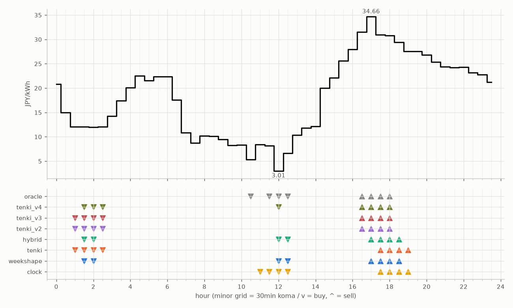

# JEPX仮想蓄電池 フォワード運用レポート

戦略凍結: 2026-08-12 / フォワード開始: 2026-08-14受渡分 / 生成: 2026-09-30 19:42 JST

> ⚠ 9/30受渡: **提出が届いていない**（picksファイルが無い＝strategies側のCIが落ちたか、pushが他のCIと衝突して失われた。気象とは別の原因）のため天気系4機体は**欠場**（実力ではなく計測の欠測。後日、予報アーカイブからBT補完される）

## 累計成績（リーグ49日目）

| 機体 | 累計損益 | 事前でない日 | **対oracle（共通33日）** | 対oracle（各自の出場日） | 対clock差（pt） |
|---|---|---|---|---|---|
| tenki_v3 | 6,046円 | 17%（8/48日・BT補完） | **89.0%** | 89.3% | +22.7 |
| tenki_v4 | 6,018円 | 21%（10/48日・BT補完） | **88.3%** | 88.7% | +22.5 |
| tenki_v2 | 5,899円 | 15%（7/48日・BT補完） | **87.3%** | 87.2% | +19.7 |
| tenki | 5,578円 | 8%（4/48日・BT3日+再計算1日） | **79.7%** | 81.6% | +12.9 |
| weekshape | 5,378円 | 33%（16/49日・再計算） | **73.4%** | 73.4% | +7.8 |
| hybrid | 5,242円 | 8%（4/48日・BT3日+再計算1日） | **72.8%** | 76.4% | +7.7 |
| clock | 5,042円 | 33%（16/49日・再計算） | **65.6%** | 65.6% | +0.0 |
| oracle | 7,035円 | — | 100.0% | 100.0% | — |

累計損益は**BT補完込み**（参戦前の欠場日を、当時入手可能だったデータのみで再現したバックテストで補完）。**事前でない日**＝価格公表前にコミットされていない日。内訳は**BT補完**（参戦前の穴埋め）と**再計算**（提出が無く採点時にコードから作った日）。clockとweekshapeは2026-08-27まで提出型ではなかったため、それ以前は全日が再計算。**対oracle%と対clock差は事前コミット済みのフォワード日のみ**で計算——対oracle%は値幅のスケールを、対clock差（常設ベンチとの同日ペア差）は時代の取りやすさを一次補正する。

**順位は「対oracle（共通33日）」で付ける。** 「各自の出場日」の列は機体ごとに分母の日が違うので、**順位に使うと難しい日を欠場した機体ほど上に来る**——2026-08-29の敵対的レビューで実際にそうなっていた（tenki_v3が首位に見えていたが、同じ日で揃えるとtenkiとhybridが上）。参考として残すが、比較には使わない。

### 欠場の内訳

- **補完待ち**（5件）: 9/30 hybrid, 9/30 tenki, 9/30 tenki_v2, 9/30 tenki_v3, 9/30 tenki_v4
  - 予報アーカイブ（約5日遅れ）の到着後に自動で埋まる。埋まれば全機体が同じ日で戦う

## 期間別（ISO週別、*=BT補完を含む）

| 週 | tenki | hybrid | clock | weekshape | tenki_v2 | tenki_v3 | tenki_v4 | oracle |
|---|---|---|---|---|---|---|---|---|
| 2026-W33 | 158 | 158 | 241 | 215 | 165* | 180* | 181* | 257 |
| 2026-W34 | 880* | 870* | 796 | 836 | 841* | 856* | 859* | 928 |
| 2026-W35 | 990* | 991* | 842 | 928 | 981* | 1,008* | 1,008* | 1,110 |
| 2026-W36 | 773 | 773 | 499 | 795 | 837 | 860 | 860 | 1,060 |
| 2026-W37 | 731 | 724 | 465 | 714 | 775 | 764 | 707 | 817 |
| 2026-W38 | 644 | 591 | 635 | 690 | 841 | 847 | 829 | 880 |
| 2026-W39 | 924 | 605 | 1,046 | 607 | 933 | 1,007 | 1,026 | 1,108 |
| 2026-W40 | 478 | 530 | 518 | 593 | 525 | 524 | 546 | 875 |

## 直接対決（全機体出場日 38日のみ）

| 機体 | 累計損益 | 対oracle |
|---|---|---|
| tenki_v3 | 4,740円 | 89.4% |
| tenki_v4 | 4,702円 | 88.7% |
| tenki_v2 | 4,639円 | 87.5% |
| tenki | 4,300円 | 81.1% |
| hybrid | 3,966円 | 74.8% |
| weekshape | 3,939円 | 74.3% |
| clock | 3,511円 | 66.2% |
| oracle | 5,300円 | 100.0% |
## 直近日の解剖（全日分は [daily_anatomy.md](daily_anatomy.md)）

### 2026-10-01（信号: 平常）

- 因子: 日射予報 373 W/m2 / 実測 未確定（実測は約5日遅れ） / 乖離 -78 W/m2（普段より曇る方向。判定時の直近28日平均 450、判定は絶対値 78 vs 閾値 204）
- 価格の形: 最安 12:00 3.01円 / 最高 17:00 34.66円 / 山谷比 11.5倍

| 機体 | 充電（買い） | 平均買値 | 放電（売り） | 平均売値 | 損益 |
|---|---|---|---|---|---|
| clock | 11:00, 11:30, 12:00, 12:30 | 6.55円 | 17:30, 18:00, 18:30, 19:00 | 29.69円 | +203円 |
| weekshape | 01:30, 02:00, 12:00, 12:30 | 8.41円 | 17:00, 17:30, 18:00, 18:30 | 31.46円 | +201円 |
| tenki | 01:00, 01:30, 02:00, 02:30 | 12.04円 | 17:30, 18:00, 18:30, 19:00 | 29.69円 | +149円 |
| tenki_v2 | 01:00, 01:30, 02:00, 02:30 | 12.04円 | 16:30, 17:00, 17:30, 18:00 | 31.98円 | +169円 |
| tenki_v3 | 01:00, 01:30, 02:00, 02:30 | 12.04円 | 16:30, 17:00, 17:30, 18:00 | 31.98円 | +169円 |
| tenki_v4 | 01:30, 02:00, 02:30, 12:00 | 9.78円 | 16:30, 17:00, 17:30, 18:00 | 31.98円 | +191円 |
| hybrid | 01:30, 02:00, 12:00, 12:30 | 8.41円 | 17:00, 17:30, 18:00, 18:30 | 31.46円 | +201円 |
| oracle | 10:30, 11:30, 12:00, 12:30 | 5.79円 | 16:30, 17:00, 17:30, 18:00 | 31.98円 | +231円 |

**48コマ価格（円/kWh。太字=最安/最高）**

| 00:00 | 00:30 | 01:00 | 01:30 | 02:00 | 02:30 | 03:00 | 03:30 | 04:00 | 04:30 | 05:00 | 05:30 | 06:00 | 06:30 | 07:00 | 07:30 | 08:00 | 08:30 | 09:00 | 09:30 | 10:00 | 10:30 | 11:00 | 11:30 |
|---|---|---|---|---|---|---|---|---|---|---|---|---|---|---|---|---|---|---|---|---|---|---|---|
| 20.80 | 15.00 | 12.06 | 12.06 | 11.98 | 12.06 | 14.23 | 17.38 | 20.10 | 22.55 | 21.54 | 22.33 | 22.33 | 17.57 | 10.81 | 8.78 | 10.23 | 10.10 | 9.50 | 8.27 | 8.34 | 5.36 | 8.43 | 8.17 |

| 12:00 | 12:30 | 13:00 | 13:30 | 14:00 | 14:30 | 15:00 | 15:30 | 16:00 | 16:30 | 17:00 | 17:30 | 18:00 | 18:30 | 19:00 | 19:30 | 20:00 | 20:30 | 21:00 | 21:30 | 22:00 | 22:30 | 23:00 | 23:30 |
|---|---|---|---|---|---|---|---|---|---|---|---|---|---|---|---|---|---|---|---|---|---|---|---|
| **3.01** | 6.60 | 10.34 | 11.79 | 12.13 | 19.99 | 22.11 | 25.62 | 27.94 | 31.50 | **34.66** | 30.93 | 30.83 | 29.43 | 27.57 | 27.53 | 26.80 | 25.33 | 24.42 | 24.22 | 24.33 | 23.21 | 22.78 | 21.19 |

## 明日のpicks（受渡日 2026-10-02、信号: 平常）

日射予報の乖離 +124 W/m2（普段より晴れる方向。判定時の直近28日平均 451、判定は絶対値 124 vs 閾値 203）

| 機体 | 充電（買い） | 放電（売り） |
|---|---|---|
| clock | 11:00, 11:30, 12:00, 12:30 | 17:30, 18:00, 18:30, 19:00 |
| weekshape | 01:30, 02:00, 02:30, 03:00 | 15:30, 16:00, 16:30, 17:00 |
| tenki | 10:30, 11:30, 12:00, 12:30 | 18:00, 18:30, 19:00, 19:30 |
| tenki_v2 | 11:00, 11:30, 12:00, 12:30 | 16:30, 17:00, 17:30, 18:00 |
| tenki_v3 | 10:30, 11:30, 12:00, 12:30 | 16:30, 17:00, 17:30, 18:00 |
| tenki_v4 | 10:30, 11:30, 12:00, 12:30 | 16:30, 17:00, 17:30, 18:00 |
| hybrid | 01:30, 02:00, 02:30, 03:00 | 15:30, 16:00, 16:30, 17:00 |
