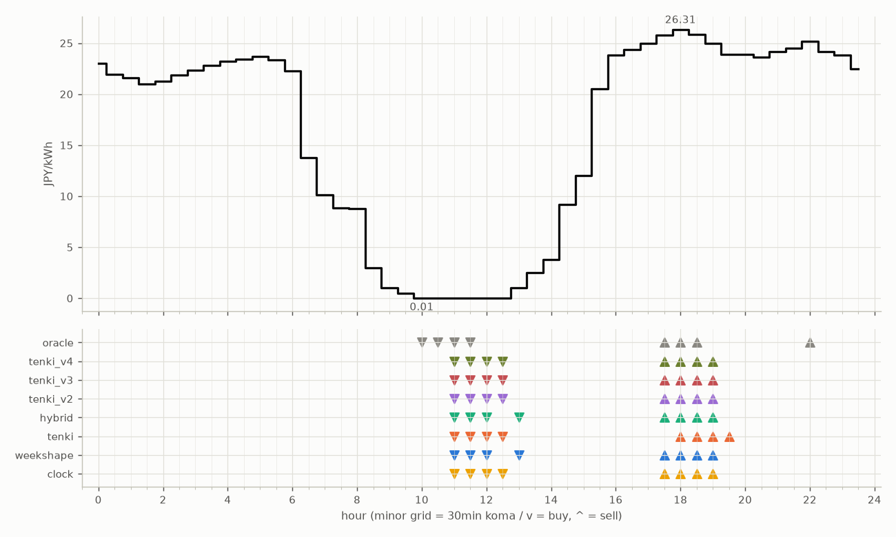

# JEPX仮想蓄電池 フォワード運用レポート

戦略凍結: 2026-08-12 / フォワード開始: 2026-08-14受渡分 / 生成: 2026-10-10 19:47 JST

> ⚠ 10/07受渡: **提出が届いていない**（picksファイルが無い＝strategies側のCIが落ちたか、pushが他のCIと衝突して失われた。気象とは別の原因）のため天気系4機体は**欠場**（実力ではなく計測の欠測。後日、予報アーカイブからBT補完される）

## 累計成績（リーグ59日目）

| 機体 | 累計損益 | 事前でない日 | **対oracle（共通42日）** | 対oracle（各自の出場日） | 対clock差（pt） |
|---|---|---|---|---|---|
| tenki_v4 | 8,198円 | 19%（11/58日・BT補完） | **91.3%** | 91.4% | +18.6 |
| tenki_v3 | 8,157円 | 16%（9/58日・BT補完） | **91.3%** | 91.2% | +18.5 |
| tenki_v2 | 8,070円 | 14%（8/58日・BT補完） | **90.5%** | 89.9% | +16.7 |
| tenki | 7,570円 | 9%（5/58日・BT4日+再計算1日） | **83.0%** | 83.9% | +9.9 |
| weekshape | 7,206円 | 29%（17/59日・再計算） | **76.4%** | 76.4% | +3.6 |
| hybrid | 7,009円 | 9%（5/58日・BT4日+再計算1日） | **76.0%** | 78.2% | +4.2 |
| clock | 6,984円 | 29%（17/59日・再計算） | **72.9%** | 72.9% | +0.0 |
| oracle | 9,181円 | — | 100.0% | 100.0% | — |

累計損益は**BT補完込み**（参戦前の欠場日を、当時入手可能だったデータのみで再現したバックテストで補完）。**事前でない日**＝価格公表前にコミットされていない日。内訳は**BT補完**（参戦前の穴埋め）と**再計算**（提出が無く採点時にコードから作った日）。clockとweekshapeは2026-08-27まで提出型ではなかったため、それ以前は全日が再計算。**対oracle%と対clock差は事前コミット済みのフォワード日のみ**で計算——対oracle%は値幅のスケールを、対clock差（常設ベンチとの同日ペア差）は時代の取りやすさを一次補正する。

**順位は「対oracle（共通42日）」で付ける。** 「各自の出場日」の列は機体ごとに分母の日が違うので、**順位に使うと難しい日を欠場した機体ほど上に来る**——2026-08-29の敵対的レビューで実際にそうなっていた（tenki_v3が首位に見えていたが、同じ日で揃えるとtenkiとhybridが上）。参考として残すが、比較には使わない。

### 欠場の内訳

- **補完待ち**（5件）: 10/07 hybrid, 10/07 tenki, 10/07 tenki_v2, 10/07 tenki_v3, 10/07 tenki_v4
  - 予報アーカイブ（約5日遅れ）の到着後に自動で埋まる。埋まれば全機体が同じ日で戦う

## 期間別（ISO週別、*=BT補完を含む）

| 週 | tenki | hybrid | clock | weekshape | tenki_v2 | tenki_v3 | tenki_v4 | oracle |
|---|---|---|---|---|---|---|---|---|
| 2026-W33 | 158 | 158 | 241 | 215 | 165* | 180* | 181* | 257 |
| 2026-W34 | 880* | 870* | 796 | 836 | 841* | 856* | 859* | 928 |
| 2026-W35 | 990* | 991* | 842 | 928 | 981* | 1,008* | 1,008* | 1,110 |
| 2026-W36 | 773 | 773 | 499 | 795 | 837 | 860 | 860 | 1,060 |
| 2026-W37 | 731 | 724 | 465 | 714 | 775 | 764 | 707 | 817 |
| 2026-W38 | 644 | 591 | 635 | 690 | 841 | 847 | 829 | 880 |
| 2026-W39 | 924 | 605 | 1,046 | 607 | 933 | 1,007 | 1,026 | 1,108 |
| 2026-W40 | 1,275* | 1,129* | 1,100 | 1,052 | 1,377* | 1,343* | 1,399* | 1,464 |
| 2026-W41 | 1,196 | 1,168 | 1,360 | 1,368 | 1,319 | 1,292 | 1,328 | 1,557 |

## 直接対決（全機体出場日 47日のみ）

| 機体 | 累計損益 | 対oracle |
|---|---|---|
| tenki_v3 | 6,619円 | 91.4% |
| tenki_v4 | 6,617円 | 91.4% |
| tenki_v2 | 6,545円 | 90.4% |
| tenki | 6,064円 | 83.7% |
| hybrid | 5,594円 | 77.2% |
| weekshape | 5,567円 | 76.9% |
| clock | 5,270円 | 72.8% |
| oracle | 7,241円 | 100.0% |
## 直近日の解剖（全日分は [daily_anatomy.md](daily_anatomy.md)）

### 2026-10-11（信号: 平常）

- 因子: 日射予報 547 W/m2 / 実測 未確定（実測は約5日遅れ） / 乖離 +113 W/m2（普段より晴れる方向。判定時の直近28日平均 434、判定は絶対値 113 vs 閾値 204）
- 価格の形: 最安 10:00 0.01円 / 最高 18:00 26.31円 / 山谷比 2631.0倍

| 機体 | 充電（買い） | 平均買値 | 放電（売り） | 平均売値 | 損益 |
|---|---|---|---|---|---|
| clock | 11:00, 11:30, 12:00, 12:30 | 0.02円 | 17:30, 18:00, 18:30, 19:00 | 25.74円 | +232円 |
| weekshape | 11:00, 11:30, 12:00, 13:00 | 0.26円 | 17:30, 18:00, 18:30, 19:00 | 25.74円 | +230円 |
| tenki | 11:00, 11:30, 12:00, 12:30 | 0.02円 | 18:00, 18:30, 19:00, 19:30 | 25.27円 | +229円 |
| tenki_v2 | 11:00, 11:30, 12:00, 12:30 | 0.02円 | 17:30, 18:00, 18:30, 19:00 | 25.74円 | +232円 |
| tenki_v3 | 11:00, 11:30, 12:00, 12:30 | 0.02円 | 17:30, 18:00, 18:30, 19:00 | 25.74円 | +232円 |
| tenki_v4 | 11:00, 11:30, 12:00, 12:30 | 0.02円 | 17:30, 18:00, 18:30, 19:00 | 25.74円 | +232円 |
| hybrid | 11:00, 11:30, 12:00, 13:00 | 0.26円 | 17:30, 18:00, 18:30, 19:00 | 25.74円 | +230円 |
| oracle | 10:00, 10:30, 11:00, 11:30 | 0.01円 | 17:30, 18:00, 18:30, 22:00 | 25.79円 | +233円 |

**48コマ価格（円/kWh。太字=最安/最高）**

| 00:00 | 00:30 | 01:00 | 01:30 | 02:00 | 02:30 | 03:00 | 03:30 | 04:00 | 04:30 | 05:00 | 05:30 | 06:00 | 06:30 | 07:00 | 07:30 | 08:00 | 08:30 | 09:00 | 09:30 | 10:00 | 10:30 | 11:00 | 11:30 |
|---|---|---|---|---|---|---|---|---|---|---|---|---|---|---|---|---|---|---|---|---|---|---|---|
| 23.00 | 21.93 | 21.60 | 20.99 | 21.25 | 21.89 | 22.36 | 22.84 | 23.22 | 23.40 | 23.70 | 23.38 | 22.24 | 13.79 | 10.10 | 8.86 | 8.75 | 3.00 | 1.00 | 0.50 | **0.01** | 0.01 | 0.01 | 0.01 |

| 12:00 | 12:30 | 13:00 | 13:30 | 14:00 | 14:30 | 15:00 | 15:30 | 16:00 | 16:30 | 17:00 | 17:30 | 18:00 | 18:30 | 19:00 | 19:30 | 20:00 | 20:30 | 21:00 | 21:30 | 22:00 | 22:30 | 23:00 | 23:30 |
|---|---|---|---|---|---|---|---|---|---|---|---|---|---|---|---|---|---|---|---|---|---|---|---|
| 0.01 | 0.04 | 1.00 | 2.50 | 3.80 | 9.19 | 12.00 | 20.50 | 23.80 | 24.35 | 25.00 | 25.79 | **26.31** | 25.86 | 24.99 | 23.91 | 23.86 | 23.59 | 24.13 | 24.50 | 25.20 | 24.19 | 23.84 | 22.48 |

## 明日のpicks（受渡日 2026-10-12、信号: 平常）

日射予報の乖離 -39 W/m2（普段より曇る方向。判定時の直近28日平均 434、判定は絶対値 39 vs 閾値 204）

| 機体 | 充電（買い） | 放電（売り） |
|---|---|---|
| clock | 11:00, 11:30, 12:00, 12:30 | 17:30, 18:00, 18:30, 19:00 |
| weekshape | 00:30, 01:00, 01:30, 02:00 | 16:30, 17:30, 18:00, 18:30 |
| tenki | 07:00, 07:30, 12:00, 12:30 | 17:30, 18:00, 18:30, 19:00 |
| tenki_v2 | 02:00, 02:30, 12:00, 12:30 | 16:30, 17:00, 17:30, 18:00 |
| tenki_v3 | 10:30, 11:30, 12:00, 12:30 | 16:30, 17:00, 17:30, 18:00 |
| tenki_v4 | 10:30, 11:30, 12:00, 12:30 | 16:30, 17:00, 17:30, 18:00 |
| hybrid | 00:30, 01:00, 01:30, 02:00 | 16:30, 17:30, 18:00, 18:30 |
