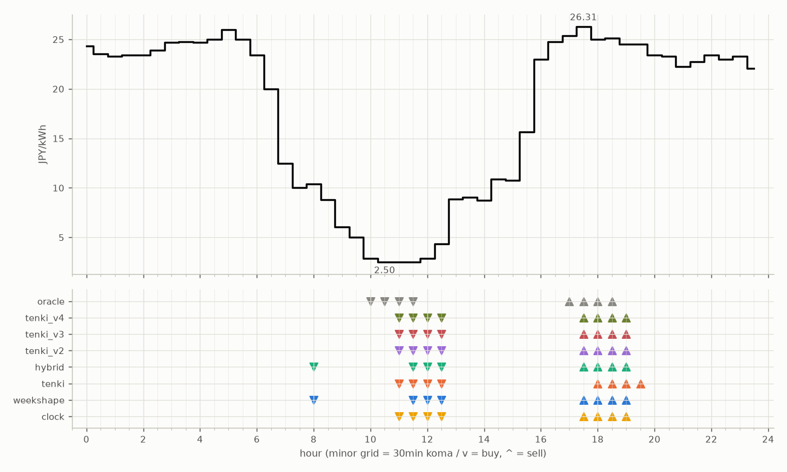

# JEPX仮想蓄電池 フォワード運用レポート

戦略凍結: 2026-08-12 / フォワード開始: 2026-08-14受渡分 / 生成: 2026-10-09 20:29 JST

> ⚠ 10/07受渡: **提出が届いていない**（picksファイルが無い＝strategies側のCIが落ちたか、pushが他のCIと衝突して失われた。気象とは別の原因）のため天気系4機体は**欠場**（実力ではなく計測の欠測。後日、予報アーカイブからBT補完される）

## 累計成績（リーグ58日目）

| 機体 | 累計損益 | 事前でない日 | **対oracle（共通41日）** | 対oracle（各自の出場日） | 対clock差（pt） |
|---|---|---|---|---|---|
| tenki_v4 | 7,965円 | 19%（11/57日・BT補完） | **91.0%** | 91.1% | +19.2 |
| tenki_v3 | 7,925円 | 16%（9/57日・BT補完） | **91.0%** | 90.9% | +19.1 |
| tenki_v2 | 7,837円 | 14%（8/57日・BT補完） | **90.1%** | 89.6% | +17.2 |
| tenki | 7,342円 | 9%（5/57日・BT4日+再計算1日） | **82.4%** | 83.4% | +10.2 |
| weekshape | 6,976円 | 29%（17/58日・再計算） | **75.6%** | 75.6% | +3.7 |
| hybrid | 6,779円 | 9%（5/57日・BT4日+再計算1日） | **75.2%** | 77.6% | +4.4 |
| clock | 6,752円 | 29%（17/58日・再計算） | **71.9%** | 71.9% | +0.0 |
| oracle | 8,948円 | — | 100.0% | 100.0% | — |

累計損益は**BT補完込み**（参戦前の欠場日を、当時入手可能だったデータのみで再現したバックテストで補完）。**事前でない日**＝価格公表前にコミットされていない日。内訳は**BT補完**（参戦前の穴埋め）と**再計算**（提出が無く採点時にコードから作った日）。clockとweekshapeは2026-08-27まで提出型ではなかったため、それ以前は全日が再計算。**対oracle%と対clock差は事前コミット済みのフォワード日のみ**で計算——対oracle%は値幅のスケールを、対clock差（常設ベンチとの同日ペア差）は時代の取りやすさを一次補正する。

**順位は「対oracle（共通41日）」で付ける。** 「各自の出場日」の列は機体ごとに分母の日が違うので、**順位に使うと難しい日を欠場した機体ほど上に来る**——2026-08-29の敵対的レビューで実際にそうなっていた（tenki_v3が首位に見えていたが、同じ日で揃えるとtenkiとhybridが上）。参考として残すが、比較には使わない。

### 欠場の内訳

- **補完待ち**（5件）: 10/07 hybrid, 10/07 tenki, 10/07 tenki_v2, 10/07 tenki_v3, 10/07 tenki_v4
  - 予報アーカイブ（約5日遅れ）の到着後に自動で埋まる。埋まれば全機体が同じ日で戦う

## 期間別（ISO週別、*=BT補完を含む）

| 週 | tenki | hybrid | clock | weekshape | tenki_v2 | tenki_v3 | tenki_v4 | oracle |
|---|---|---|---|---|---|---|---|---|
| 2026-W33 | 158 | 158 | 241 | 215 | 165* | 180* | 181* | 257 |
| 2026-W34 | 880* | 870* | 796 | 836 | 841* | 856* | 859* | 928 |
| 2026-W35 | 990* | 991* | 842 | 928 | 981* | 1,008* | 1,008* | 1,110 |
| 2026-W36 | 773 | 773 | 499 | 795 | 837 | 860 | 860 | 1,060 |
| 2026-W37 | 731 | 724 | 465 | 714 | 775 | 764 | 707 | 817 |
| 2026-W38 | 644 | 591 | 635 | 690 | 841 | 847 | 829 | 880 |
| 2026-W39 | 924 | 605 | 1,046 | 607 | 933 | 1,007 | 1,026 | 1,108 |
| 2026-W40 | 1,275* | 1,129* | 1,100 | 1,052 | 1,377* | 1,343* | 1,399* | 1,464 |
| 2026-W41 | 967 | 938 | 1,128 | 1,138 | 1,087 | 1,060 | 1,095 | 1,324 |

## 直接対決（全機体出場日 46日のみ）

| 機体 | 累計損益 | 対oracle |
|---|---|---|
| tenki_v3 | 6,387円 | 91.1% |
| tenki_v4 | 6,384円 | 91.1% |
| tenki_v2 | 6,312円 | 90.1% |
| tenki | 5,835円 | 83.3% |
| hybrid | 5,363円 | 76.5% |
| weekshape | 5,337円 | 76.2% |
| clock | 5,038円 | 71.9% |
| oracle | 7,008円 | 100.0% |
## 直近日の解剖（全日分は [daily_anatomy.md](daily_anatomy.md)）

### 2026-10-10（信号: 平常）

- 因子: 日射予報 549 W/m2 / 実測 未確定（実測は約5日遅れ） / 乖離 +142 W/m2（普段より晴れる方向。判定時の直近28日平均 408、判定は絶対値 142 vs 閾値 204）
- 価格の形: 最安 10:30 2.50円 / 最高 17:30 26.31円 / 山谷比 10.5倍

| 機体 | 充電（買い） | 平均買値 | 放電（売り） | 平均売値 | 損益 |
|---|---|---|---|---|---|
| clock | 11:00, 11:30, 12:00, 12:30 | 3.07円 | 17:30, 18:00, 18:30, 19:00 | 25.23円 | +197円 |
| weekshape | 08:00, 11:30, 12:00, 12:30 | 5.05円 | 17:30, 18:00, 18:30, 19:00 | 25.23円 | +178円 |
| tenki | 11:00, 11:30, 12:00, 12:30 | 3.07円 | 18:00, 18:30, 19:00, 19:30 | 24.77円 | +193円 |
| tenki_v2 | 11:00, 11:30, 12:00, 12:30 | 3.07円 | 17:30, 18:00, 18:30, 19:00 | 25.23円 | +197円 |
| tenki_v3 | 11:00, 11:30, 12:00, 12:30 | 3.07円 | 17:30, 18:00, 18:30, 19:00 | 25.23円 | +197円 |
| tenki_v4 | 11:00, 11:30, 12:00, 12:30 | 3.07円 | 17:30, 18:00, 18:30, 19:00 | 25.23円 | +197円 |
| hybrid | 08:00, 11:30, 12:00, 12:30 | 5.05円 | 17:30, 18:00, 18:30, 19:00 | 25.23円 | +178円 |
| oracle | 10:00, 10:30, 11:00, 11:30 | 2.60円 | 17:00, 17:30, 18:00, 18:30 | 25.45円 | +204円 |

**48コマ価格（円/kWh。太字=最安/最高）**

| 00:00 | 00:30 | 01:00 | 01:30 | 02:00 | 02:30 | 03:00 | 03:30 | 04:00 | 04:30 | 05:00 | 05:30 | 06:00 | 06:30 | 07:00 | 07:30 | 08:00 | 08:30 | 09:00 | 09:30 | 10:00 | 10:30 | 11:00 | 11:30 |
|---|---|---|---|---|---|---|---|---|---|---|---|---|---|---|---|---|---|---|---|---|---|---|---|
| 24.36 | 23.52 | 23.31 | 23.40 | 23.40 | 23.93 | 24.69 | 24.74 | 24.70 | 25.00 | 25.99 | 25.00 | 23.40 | 20.00 | 12.50 | 10.01 | 10.42 | 8.81 | 6.07 | 5.00 | 2.90 | **2.50** | 2.50 | 2.50 |

| 12:00 | 12:30 | 13:00 | 13:30 | 14:00 | 14:30 | 15:00 | 15:30 | 16:00 | 16:30 | 17:00 | 17:30 | 18:00 | 18:30 | 19:00 | 19:30 | 20:00 | 20:30 | 21:00 | 21:30 | 22:00 | 22:30 | 23:00 | 23:30 |
|---|---|---|---|---|---|---|---|---|---|---|---|---|---|---|---|---|---|---|---|---|---|---|---|
| 2.90 | 4.37 | 8.86 | 9.03 | 8.76 | 10.90 | 10.77 | 15.65 | 23.00 | 24.74 | 25.38 | **26.31** | 25.00 | 25.10 | 24.50 | 24.50 | 23.40 | 23.29 | 22.24 | 22.76 | 23.40 | 23.00 | 23.29 | 22.05 |

## 明日のpicks（受渡日 2026-10-11、信号: 平常）

日射予報の乖離 +127 W/m2（普段より晴れる方向。判定時の直近28日平均 434、判定は絶対値 127 vs 閾値 204）

| 機体 | 充電（買い） | 放電（売り） |
|---|---|---|
| clock | 11:00, 11:30, 12:00, 12:30 | 17:30, 18:00, 18:30, 19:00 |
| weekshape | 11:00, 11:30, 12:00, 13:00 | 17:30, 18:00, 18:30, 19:00 |
| tenki | 11:00, 11:30, 12:00, 12:30 | 18:00, 18:30, 19:00, 19:30 |
| tenki_v2 | 11:00, 11:30, 12:00, 12:30 | 17:30, 18:00, 18:30, 19:00 |
| tenki_v3 | 11:00, 11:30, 12:00, 12:30 | 17:30, 18:00, 18:30, 19:00 |
| tenki_v4 | 11:00, 11:30, 12:00, 12:30 | 17:30, 18:00, 18:30, 19:00 |
| hybrid | 11:00, 11:30, 12:00, 13:00 | 17:30, 18:00, 18:30, 19:00 |
