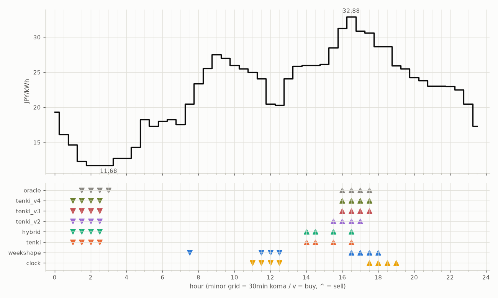

# JEPX仮想蓄電池 フォワード運用レポート

戦略凍結: 2026-08-12 / フォワード開始: 2026-08-14受渡分 / 生成: 2026-09-28 20:11 JST

## 累計成績（リーグ47日目）

| 機体 | 累計損益 | 事前でない日 | **対oracle（共通32日）** | 対oracle（各自の出場日） | 対clock差（pt） |
|---|---|---|---|---|---|
| tenki_v3 | 5,877円 | 17%（8/47日・BT補完） | **89.9%** | 90.0% | +24.4 |
| tenki_v4 | 5,826円 | 21%（10/47日・BT補完） | **88.6%** | 89.0% | +23.7 |
| tenki_v2 | 5,730円 | 15%（7/47日・BT補完） | **88.0%** | 87.7% | +21.2 |
| tenki | 5,429円 | 9%（4/47日・BT3日+再計算1日） | **80.5%** | 82.3% | +14.4 |
| weekshape | 5,039円 | 32%（15/47日・再計算） | **72.7%** | 72.7% | +8.3 |
| hybrid | 5,041円 | 9%（4/47日・BT3日+再計算1日） | **72.1%** | 76.0% | +8.1 |
| clock | 4,572円 | 32%（15/47日・再計算） | **64.5%** | 64.5% | +0.0 |
| oracle | 6,533円 | — | 100.0% | 100.0% | — |

累計損益は**BT補完込み**（参戦前の欠場日を、当時入手可能だったデータのみで再現したバックテストで補完）。**事前でない日**＝価格公表前にコミットされていない日。内訳は**BT補完**（参戦前の穴埋め）と**再計算**（提出が無く採点時にコードから作った日）。clockとweekshapeは2026-08-27まで提出型ではなかったため、それ以前は全日が再計算。**対oracle%と対clock差は事前コミット済みのフォワード日のみ**で計算——対oracle%は値幅のスケールを、対clock差（常設ベンチとの同日ペア差）は時代の取りやすさを一次補正する。

**順位は「対oracle（共通32日）」で付ける。** 「各自の出場日」の列は機体ごとに分母の日が違うので、**順位に使うと難しい日を欠場した機体ほど上に来る**——2026-08-29の敵対的レビューで実際にそうなっていた（tenki_v3が首位に見えていたが、同じ日で揃えるとtenkiとhybridが上）。参考として残すが、比較には使わない。

## 期間別（ISO週別、*=BT補完を含む）

| 週 | tenki | hybrid | clock | weekshape | tenki_v2 | tenki_v3 | tenki_v4 | oracle |
|---|---|---|---|---|---|---|---|---|
| 2026-W33 | 158 | 158 | 241 | 215 | 165* | 180* | 181* | 257 |
| 2026-W34 | 880* | 870* | 796 | 836 | 841* | 856* | 859* | 928 |
| 2026-W35 | 990* | 991* | 842 | 928 | 981* | 1,008* | 1,008* | 1,110 |
| 2026-W36 | 773 | 773 | 499 | 795 | 837 | 860 | 860 | 1,060 |
| 2026-W37 | 731 | 724 | 465 | 714 | 775 | 764 | 707 | 817 |
| 2026-W38 | 644 | 591 | 635 | 690 | 841 | 847 | 829 | 880 |
| 2026-W39 | 924 | 605 | 1,046 | 607 | 933 | 1,007 | 1,026 | 1,108 |
| 2026-W40 | 330 | 330 | 48 | 253 | 356 | 355 | 355 | 373 |

## 直接対決（全機体出場日 37日のみ）

| 機体 | 累計損益 | 対oracle |
|---|---|---|
| tenki_v3 | 4,571円 | 90.2% |
| tenki_v4 | 4,511円 | 89.0% |
| tenki_v2 | 4,470円 | 88.2% |
| tenki | 4,151円 | 81.9% |
| hybrid | 3,765円 | 74.3% |
| weekshape | 3,739円 | 73.8% |
| clock | 3,307円 | 65.3% |
| oracle | 5,069円 | 100.0% |
## 直近日の解剖（全日分は [daily_anatomy.md](daily_anatomy.md)）

### 2026-09-29（信号: 強）

- 因子: 日射予報 175 W/m2 / 実測 未確定（実測は約5日遅れ） / 乖離 -275 W/m2（普段より曇る方向。判定時の直近28日平均 450、判定は絶対値 275 vs 閾値 204）
- 価格の形: 最安 03:00 11.68円 / 最高 16:30 32.88円 / 山谷比 2.8倍

| 機体 | 充電（買い） | 平均買値 | 放電（売り） | 平均売値 | 損益 |
|---|---|---|---|---|---|
| clock | 11:00, 11:30, 12:00, 12:30 | 22.48円 | 17:30, 18:00, 18:30, 19:00 | 28.45円 | +33円 |
| weekshape | 07:30, 11:30, 12:00, 12:30 | 21.35円 | 16:30, 17:00, 17:30, 18:00 | 30.75円 | +65円 |
| tenki | 01:00, 01:30, 02:00, 02:30 | 12.57円 | 14:00, 14:30, 15:30, 16:30 | 28.34円 | +128円 |
| tenki_v2 | 01:00, 01:30, 02:00, 02:30 | 12.57円 | 15:30, 16:00, 16:30, 17:00 | 30.88円 | +153円 |
| tenki_v3 | 01:00, 01:30, 02:00, 02:30 | 12.57円 | 16:00, 16:30, 17:00, 17:30 | 31.41円 | +158円 |
| tenki_v4 | 01:00, 01:30, 02:00, 02:30 | 12.57円 | 16:00, 16:30, 17:00, 17:30 | 31.41円 | +158円 |
| hybrid | 01:00, 01:30, 02:00, 02:30 | 12.57円 | 14:00, 14:30, 15:30, 16:30 | 28.34円 | +128円 |
| oracle | 01:30, 02:00, 02:30, 03:00 | 11.84円 | 16:00, 16:30, 17:00, 17:30 | 31.41円 | +165円 |

**48コマ価格（円/kWh。太字=最安/最高）**

| 00:00 | 00:30 | 01:00 | 01:30 | 02:00 | 02:30 | 03:00 | 03:30 | 04:00 | 04:30 | 05:00 | 05:30 | 06:00 | 06:30 | 07:00 | 07:30 | 08:00 | 08:30 | 09:00 | 09:30 | 10:00 | 10:30 | 11:00 | 11:30 |
|---|---|---|---|---|---|---|---|---|---|---|---|---|---|---|---|---|---|---|---|---|---|---|---|
| 19.32 | 16.10 | 14.63 | 12.29 | 11.69 | 11.69 | **11.68** | 12.75 | 12.75 | 14.31 | 18.24 | 17.29 | 18.00 | 18.26 | 17.54 | 20.50 | 23.37 | 25.54 | 27.52 | 27.00 | 26.00 | 25.51 | 25.00 | 24.08 |

| 12:00 | 12:30 | 13:00 | 13:30 | 14:00 | 14:30 | 15:00 | 15:30 | 16:00 | 16:30 | 17:00 | 17:30 | 18:00 | 18:30 | 19:00 | 19:30 | 20:00 | 20:30 | 21:00 | 21:30 | 22:00 | 22:30 | 23:00 | 23:30 |
|---|---|---|---|---|---|---|---|---|---|---|---|---|---|---|---|---|---|---|---|---|---|---|---|
| 20.50 | 20.33 | 24.06 | 25.86 | 26.00 | 26.00 | 26.15 | 28.48 | 31.28 | **32.88** | 30.86 | 30.61 | 28.67 | 28.64 | 25.90 | 25.50 | 24.22 | 23.79 | 23.04 | 23.04 | 22.99 | 22.50 | 20.50 | 17.29 |

## 明日のpicks（受渡日 2026-09-30、信号: 平常）

日射予報の乖離 +52 W/m2（普段より晴れる方向。判定時の直近28日平均 450、判定は絶対値 52 vs 閾値 204）

| 機体 | 充電（買い） | 放電（売り） |
|---|---|---|
| clock | 11:00, 11:30, 12:00, 12:30 | 17:30, 18:00, 18:30, 19:00 |
| weekshape | 01:30, 02:00, 02:30, 07:00 | 16:30, 17:00, 17:30, 18:00 |
