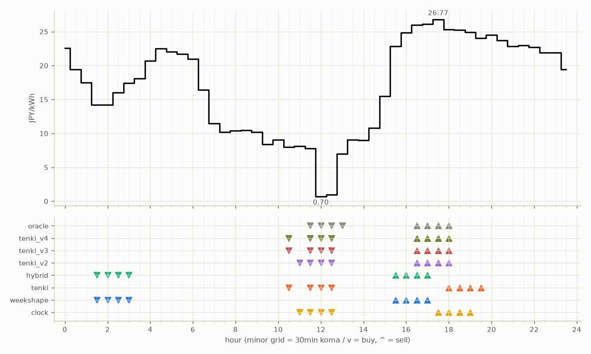

# JEPX仮想蓄電池 フォワード運用レポート

戦略凍結: 2026-08-12 / フォワード開始: 2026-08-14受渡分 / 生成: 2026-10-01 20:09 JST

> ⚠ 9/30受渡: **提出が届いていない**（picksファイルが無い＝strategies側のCIが落ちたか、pushが他のCIと衝突して失われた。気象とは別の原因）のため天気系4機体は**欠場**（実力ではなく計測の欠測。後日、予報アーカイブからBT補完される）

## 累計成績（リーグ50日目）

| 機体 | 累計損益 | 事前でない日 | **対oracle（共通34日）** | 対oracle（各自の出場日） | 対clock差（pt） |
|---|---|---|---|---|---|
| tenki_v3 | 6,237円 | 16%（8/49日・BT補完） | **89.4%** | 89.6% | +22.1 |
| tenki_v4 | 6,209円 | 20%（10/49日・BT補完） | **88.8%** | 89.1% | +21.8 |
| tenki_v2 | 6,090円 | 14%（7/49日・BT補完） | **87.8%** | 87.5% | +19.2 |
| tenki | 5,759円 | 8%（4/49日・BT3日+再計算1日） | **80.3%** | 82.0% | +12.4 |
| weekshape | 5,448円 | 32%（16/50日・再計算） | **71.9%** | 71.9% | +5.1 |
| hybrid | 5,312円 | 8%（4/49日・BT3日+再計算1日） | **71.4%** | 75.2% | +5.6 |
| clock | 5,228円 | 32%（16/50日・再計算） | **66.8%** | 66.8% | +0.0 |
| oracle | 7,229円 | — | 100.0% | 100.0% | — |

累計損益は**BT補完込み**（参戦前の欠場日を、当時入手可能だったデータのみで再現したバックテストで補完）。**事前でない日**＝価格公表前にコミットされていない日。内訳は**BT補完**（参戦前の穴埋め）と**再計算**（提出が無く採点時にコードから作った日）。clockとweekshapeは2026-08-27まで提出型ではなかったため、それ以前は全日が再計算。**対oracle%と対clock差は事前コミット済みのフォワード日のみ**で計算——対oracle%は値幅のスケールを、対clock差（常設ベンチとの同日ペア差）は時代の取りやすさを一次補正する。

**順位は「対oracle（共通34日）」で付ける。** 「各自の出場日」の列は機体ごとに分母の日が違うので、**順位に使うと難しい日を欠場した機体ほど上に来る**——2026-08-29の敵対的レビューで実際にそうなっていた（tenki_v3が首位に見えていたが、同じ日で揃えるとtenkiとhybridが上）。参考として残すが、比較には使わない。

### 欠場の内訳

- **補完待ち**（5件）: 9/30 hybrid, 9/30 tenki, 9/30 tenki_v2, 9/30 tenki_v3, 9/30 tenki_v4
  - 予報アーカイブ（約5日遅れ）の到着後に自動で埋まる。埋まれば全機体が同じ日で戦う

## 期間別（ISO週別、*=BT補完を含む）

| 週 | tenki | hybrid | clock | weekshape | tenki_v2 | tenki_v3 | tenki_v4 | oracle |
|---|---|---|---|---|---|---|---|---|
| 2026-W33 | 158 | 158 | 241 | 215 | 165* | 180* | 181* | 257 |
| 2026-W34 | 880* | 870* | 796 | 836 | 841* | 856* | 859* | 928 |
| 2026-W35 | 990* | 991* | 842 | 928 | 981* | 1,008* | 1,008* | 1,110 |
| 2026-W36 | 773 | 773 | 499 | 795 | 837 | 860 | 860 | 1,060 |
| 2026-W37 | 731 | 724 | 465 | 714 | 775 | 764 | 707 | 817 |
| 2026-W38 | 644 | 591 | 635 | 690 | 841 | 847 | 829 | 880 |
| 2026-W39 | 924 | 605 | 1,046 | 607 | 933 | 1,007 | 1,026 | 1,108 |
| 2026-W40 | 659 | 600 | 704 | 663 | 716 | 715 | 738 | 1,069 |

## 直接対決（全機体出場日 39日のみ）

| 機体 | 累計損益 | 対oracle |
|---|---|---|
| tenki_v3 | 4,932円 | 89.8% |
| tenki_v4 | 4,894円 | 89.1% |
| tenki_v2 | 4,830円 | 87.9% |
| tenki | 4,481円 | 81.6% |
| hybrid | 4,035円 | 73.5% |
| weekshape | 4,009円 | 73.0% |
| clock | 3,698円 | 67.3% |
| oracle | 5,494円 | 100.0% |
## 直近日の解剖（全日分は [daily_anatomy.md](daily_anatomy.md)）

### 2026-10-02（信号: 平常）

- 因子: 日射予報 530 W/m2 / 実測 未確定（実測は約5日遅れ） / 乖離 +79 W/m2（普段より晴れる方向。判定時の直近28日平均 451、判定は絶対値 79 vs 閾値 203）
- 価格の形: 最安 12:00 0.70円 / 最高 17:30 26.77円 / 山谷比 38.2倍

| 機体 | 充電（買い） | 平均買値 | 放電（売り） | 平均売値 | 損益 |
|---|---|---|---|---|---|
| clock | 11:00, 11:30, 12:00, 12:30 | 4.41円 | 17:30, 18:00, 18:30, 19:00 | 25.55円 | +187円 |
| weekshape | 01:30, 02:00, 02:30, 03:00 | 15.48円 | 15:30, 16:00, 16:30, 17:00 | 24.94円 | +70円 |
| tenki | 10:30, 11:30, 12:00, 12:30 | 4.38円 | 18:00, 18:30, 19:00, 19:30 | 24.88円 | +181円 |
| tenki_v2 | 11:00, 11:30, 12:00, 12:30 | 4.41円 | 16:30, 17:00, 17:30, 18:00 | 26.05円 | +191円 |
| tenki_v3 | 10:30, 11:30, 12:00, 12:30 | 4.38円 | 16:30, 17:00, 17:30, 18:00 | 26.05円 | +192円 |
| tenki_v4 | 10:30, 11:30, 12:00, 12:30 | 4.38円 | 16:30, 17:00, 17:30, 18:00 | 26.05円 | +192円 |
| hybrid | 01:30, 02:00, 02:30, 03:00 | 15.48円 | 15:30, 16:00, 16:30, 17:00 | 24.94円 | +70円 |
| oracle | 11:30, 12:00, 12:30, 13:00 | 4.13円 | 16:30, 17:00, 17:30, 18:00 | 26.05円 | +194円 |

**48コマ価格（円/kWh。太字=最安/最高）**

| 00:00 | 00:30 | 01:00 | 01:30 | 02:00 | 02:30 | 03:00 | 03:30 | 04:00 | 04:30 | 05:00 | 05:30 | 06:00 | 06:30 | 07:00 | 07:30 | 08:00 | 08:30 | 09:00 | 09:30 | 10:00 | 10:30 | 11:00 | 11:30 |
|---|---|---|---|---|---|---|---|---|---|---|---|---|---|---|---|---|---|---|---|---|---|---|---|
| 22.58 | 19.43 | 17.50 | 14.23 | 14.23 | 16.00 | 17.44 | 18.10 | 20.67 | 22.51 | 22.05 | 21.68 | 20.99 | 16.40 | 11.46 | 10.23 | 10.37 | 10.46 | 10.23 | 8.38 | 9.06 | 8.00 | 8.13 | 7.81 |

| 12:00 | 12:30 | 13:00 | 13:30 | 14:00 | 14:30 | 15:00 | 15:30 | 16:00 | 16:30 | 17:00 | 17:30 | 18:00 | 18:30 | 19:00 | 19:30 | 20:00 | 20:30 | 21:00 | 21:30 | 22:00 | 22:30 | 23:00 | 23:30 |
|---|---|---|---|---|---|---|---|---|---|---|---|---|---|---|---|---|---|---|---|---|---|---|---|
| **0.70** | 1.00 | 7.00 | 9.03 | 9.00 | 10.81 | 15.50 | 22.85 | 24.83 | 26.01 | 26.08 | **26.77** | 25.34 | 25.22 | 24.89 | 24.06 | 24.50 | 23.73 | 22.86 | 23.00 | 22.68 | 21.90 | 21.87 | 19.43 |

## 明日のpicks（受渡日 2026-10-03、信号: 平常）

日射予報の乖離 +174 W/m2（普段より晴れる方向。判定時の直近28日平均 451、判定は絶対値 174 vs 閾値 203）

| 機体 | 充電（買い） | 放電（売り） |
|---|---|---|
| clock | 11:00, 11:30, 12:00, 12:30 | 17:30, 18:00, 18:30, 19:00 |
| weekshape | 08:00, 11:30, 12:00, 12:30 | 18:00, 18:30, 19:00, 19:30 |
| tenki | 11:00, 11:30, 12:00, 12:30 | 18:30, 19:00, 19:30, 20:00 |
| tenki_v2 | 11:00, 11:30, 12:00, 12:30 | 17:30, 18:00, 18:30, 19:00 |
| tenki_v3 | 10:30, 11:00, 11:30, 12:00 | 17:30, 18:00, 18:30, 19:00 |
| tenki_v4 | 11:00, 11:30, 12:00, 12:30 | 17:30, 18:00, 18:30, 19:00 |
| hybrid | 08:00, 11:30, 12:00, 12:30 | 18:00, 18:30, 19:00, 19:30 |
