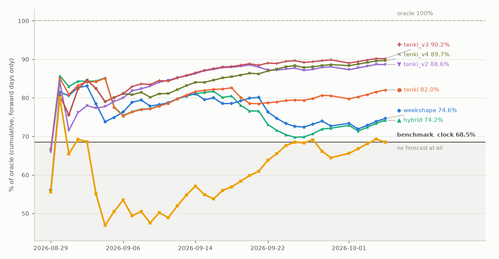
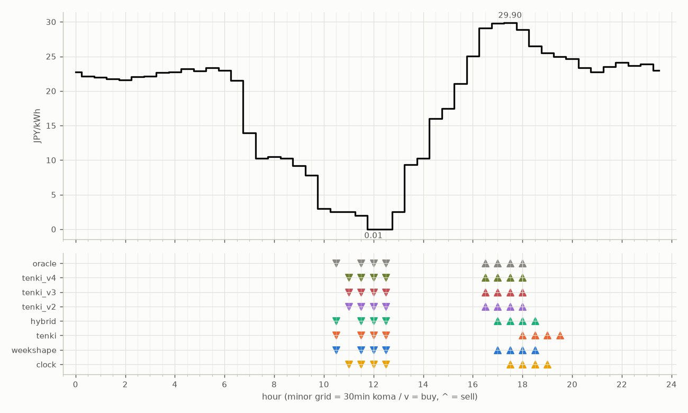

# JEPX仮想蓄電池 フォワード運用レポート

戦略凍結: 2026-08-12 / フォワード開始: 2026-08-14受渡分 / 生成: 2026-10-07 20:19 JST

> ⚠ 10/07受渡: **提出が届いていない**（picksファイルが無い＝strategies側のCIが落ちたか、pushが他のCIと衝突して失われた。気象とは別の原因）のため天気系4機体は**欠場**（実力ではなく計測の欠測。後日、予報アーカイブからBT補完される）

## 累計成績（リーグ56日目）

| 機体 | 累計損益 | 事前でない日 | **対oracle（共通39日）** | 対oracle（各自の出場日） | 対clock差（pt） |
|---|---|---|---|---|---|
| tenki_v4 | 7,570円 | 20%（11/55日・BT補完） | **90.6%** | 90.7% | +20.1 |
| tenki_v3 | 7,530円 | 16%（9/55日・BT補完） | **90.5%** | 90.5% | +19.9 |
| tenki_v2 | 7,442円 | 15%（8/55日・BT補完） | **89.6%** | 89.1% | +17.9 |
| tenki | 6,981円 | 9%（5/55日・BT4日+再計算1日） | **81.9%** | 83.1% | +11.0 |
| weekshape | 6,639円 | 30%（17/56日・再計算） | **75.1%** | 75.1% | +4.6 |
| hybrid | 6,442円 | 9%（5/55日・BT4日+再計算1日） | **74.7%** | 77.3% | +5.2 |
| clock | 6,375円 | 30%（17/56日・再計算） | **70.5%** | 70.5% | +0.0 |
| oracle | 8,546円 | — | 100.0% | 100.0% | — |

累計損益は**BT補完込み**（参戦前の欠場日を、当時入手可能だったデータのみで再現したバックテストで補完）。**事前でない日**＝価格公表前にコミットされていない日。内訳は**BT補完**（参戦前の穴埋め）と**再計算**（提出が無く採点時にコードから作った日）。clockとweekshapeは2026-08-27まで提出型ではなかったため、それ以前は全日が再計算。**対oracle%と対clock差は事前コミット済みのフォワード日のみ**で計算——対oracle%は値幅のスケールを、対clock差（常設ベンチとの同日ペア差）は時代の取りやすさを一次補正する。

**順位は「対oracle（共通39日）」で付ける。** 「各自の出場日」の列は機体ごとに分母の日が違うので、**順位に使うと難しい日を欠場した機体ほど上に来る**——2026-08-29の敵対的レビューで実際にそうなっていた（tenki_v3が首位に見えていたが、同じ日で揃えるとtenkiとhybridが上）。参考として残すが、比較には使わない。

### 欠場の内訳

- **補完待ち**（5件）: 10/07 hybrid, 10/07 tenki, 10/07 tenki_v2, 10/07 tenki_v3, 10/07 tenki_v4
  - 予報アーカイブ（約5日遅れ）の到着後に自動で埋まる。埋まれば全機体が同じ日で戦う

## 期間別（ISO週別、*=BT補完を含む）

| 週 | tenki | hybrid | clock | weekshape | tenki_v2 | tenki_v3 | tenki_v4 | oracle |
|---|---|---|---|---|---|---|---|---|
| 2026-W33 | 158 | 158 | 241 | 215 | 165* | 180* | 181* | 257 |
| 2026-W34 | 880* | 870* | 796 | 836 | 841* | 856* | 859* | 928 |
| 2026-W35 | 990* | 991* | 842 | 928 | 981* | 1,008* | 1,008* | 1,110 |
| 2026-W36 | 773 | 773 | 499 | 795 | 837 | 860 | 860 | 1,060 |
| 2026-W37 | 731 | 724 | 465 | 714 | 775 | 764 | 707 | 817 |
| 2026-W38 | 644 | 591 | 635 | 690 | 841 | 847 | 829 | 880 |
| 2026-W39 | 924 | 605 | 1,046 | 607 | 933 | 1,007 | 1,026 | 1,108 |
| 2026-W40 | 1,275* | 1,129* | 1,100 | 1,052 | 1,377* | 1,343* | 1,399* | 1,464 |
| 2026-W41 | 606 | 602 | 751 | 801 | 691 | 664 | 700 | 921 |

## 直接対決（全機体出場日 44日のみ）

| 機体 | 累計損益 | 対oracle |
|---|---|---|
| tenki_v3 | 5,992円 | 90.7% |
| tenki_v4 | 5,989円 | 90.7% |
| tenki_v2 | 5,917円 | 89.6% |
| tenki | 5,474円 | 82.9% |
| hybrid | 5,027円 | 76.1% |
| weekshape | 5,001円 | 75.7% |
| clock | 4,660円 | 70.5% |
| oracle | 6,606円 | 100.0% |
## 直近日の解剖（全日分は [daily_anatomy.md](daily_anatomy.md)）

### 2026-10-08（信号: 平常）

- 因子: 日射予報 596 W/m2 / 実測 未確定（実測は約5日遅れ） / 乖離 +188 W/m2（普段より晴れる方向。判定時の直近28日平均 408、判定は絶対値 188 vs 閾値 204）
- 価格の形: 最安 12:00 0.01円 / 最高 17:30 29.90円 / 山谷比 2990.0倍

| 機体 | 充電（買い） | 平均買値 | 放電（売り） | 平均売値 | 損益 |
|---|---|---|---|---|---|
| clock | 11:00, 11:30, 12:00, 12:30 | 1.12円 | 17:30, 18:00, 18:30, 19:00 | 27.70円 | +240円 |
| weekshape | 10:30, 11:30, 12:00, 12:30 | 1.12円 | 17:00, 17:30, 18:00, 18:30 | 28.77円 | +249円 |
| tenki | 10:30, 11:30, 12:00, 12:30 | 1.12円 | 18:00, 18:30, 19:00, 19:30 | 26.47円 | +228円 |
| tenki_v2 | 11:00, 11:30, 12:00, 12:30 | 1.12円 | 16:30, 17:00, 17:30, 18:00 | 29.42円 | +255円 |
| tenki_v3 | 11:00, 11:30, 12:00, 12:30 | 1.12円 | 16:30, 17:00, 17:30, 18:00 | 29.42円 | +255円 |
| tenki_v4 | 11:00, 11:30, 12:00, 12:30 | 1.12円 | 16:30, 17:00, 17:30, 18:00 | 29.42円 | +255円 |
| hybrid | 10:30, 11:30, 12:00, 12:30 | 1.12円 | 17:00, 17:30, 18:00, 18:30 | 28.77円 | +249円 |
| oracle | 10:30, 11:30, 12:00, 12:30 | 1.12円 | 16:30, 17:00, 17:30, 18:00 | 29.42円 | +255円 |

**48コマ価格（円/kWh。太字=最安/最高）**

| 00:00 | 00:30 | 01:00 | 01:30 | 02:00 | 02:30 | 03:00 | 03:30 | 04:00 | 04:30 | 05:00 | 05:30 | 06:00 | 06:30 | 07:00 | 07:30 | 08:00 | 08:30 | 09:00 | 09:30 | 10:00 | 10:30 | 11:00 | 11:30 |
|---|---|---|---|---|---|---|---|---|---|---|---|---|---|---|---|---|---|---|---|---|---|---|---|
| 22.72 | 22.12 | 22.01 | 21.76 | 21.56 | 22.06 | 22.13 | 22.66 | 22.72 | 23.23 | 22.88 | 23.35 | 22.99 | 21.49 | 13.92 | 10.23 | 10.46 | 10.23 | 9.19 | 7.83 | 3.00 | 2.50 | 2.50 | 1.95 |

| 12:00 | 12:30 | 13:00 | 13:30 | 14:00 | 14:30 | 15:00 | 15:30 | 16:00 | 16:30 | 17:00 | 17:30 | 18:00 | 18:30 | 19:00 | 19:30 | 20:00 | 20:30 | 21:00 | 21:30 | 22:00 | 22:30 | 23:00 | 23:30 |
|---|---|---|---|---|---|---|---|---|---|---|---|---|---|---|---|---|---|---|---|---|---|---|---|
| **0.01** | 0.02 | 2.50 | 9.33 | 10.27 | 16.00 | 17.49 | 21.05 | 25.01 | 29.13 | 29.79 | **29.90** | 28.85 | 26.53 | 25.51 | 25.00 | 24.68 | 23.34 | 22.78 | 23.52 | 24.12 | 23.65 | 23.92 | 23.00 |

## 明日のpicks（受渡日 2026-10-09、信号: 平常）

日射予報の乖離 +175 W/m2（普段より晴れる方向。判定時の直近28日平均 408、判定は絶対値 175 vs 閾値 204）

| 機体 | 充電（買い） | 放電（売り） |
|---|---|---|
| clock | 11:00, 11:30, 12:00, 12:30 | 17:30, 18:00, 18:30, 19:00 |
| weekshape | 07:00, 07:30, 12:00, 12:30 | 16:30, 17:00, 17:30, 18:00 |
| tenki | 10:30, 11:30, 12:00, 12:30 | 18:00, 18:30, 19:00, 19:30 |
| tenki_v2 | 11:00, 11:30, 12:00, 12:30 | 16:30, 17:00, 17:30, 18:00 |
| tenki_v3 | 11:00, 11:30, 12:00, 12:30 | 16:30, 17:00, 17:30, 18:00 |
| tenki_v4 | 11:00, 11:30, 12:00, 12:30 | 16:30, 17:00, 17:30, 18:00 |
| hybrid | 07:00, 07:30, 12:00, 12:30 | 16:30, 17:00, 17:30, 18:00 |
