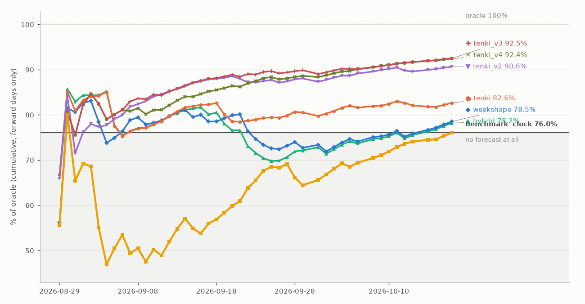
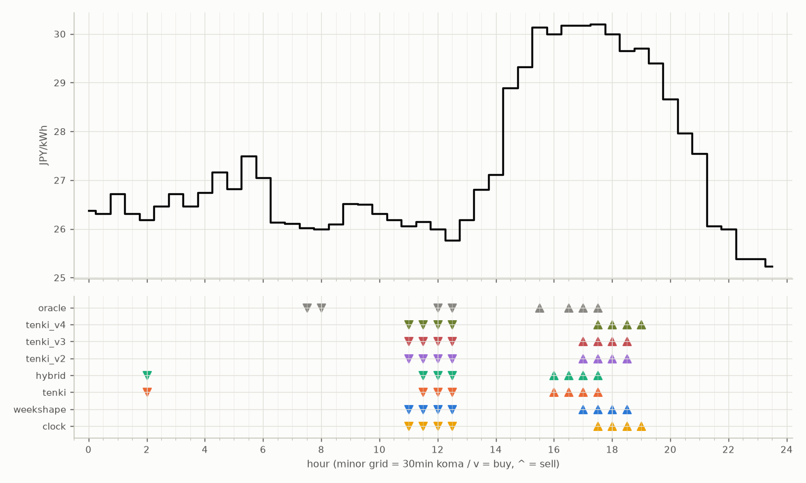

# JEPX仮想蓄電池 フォワード運用レポート

戦略凍結: 2026-08-12 / フォワード開始: 2026-08-14受渡分 / 生成: 2026-10-23 18:36 JST

## 累計成績（リーグ72日目）

| 機体 | 累計損益 | 事前でない日 | **対oracle（共通54日）** | 対oracle（各自の出場日） | 対clock差（pt） |
|---|---|---|---|---|---|
| tenki_v3 | 10,686円 | 15%（11/72日・BT補完） | **92.9%** | 92.7% | +17.4 |
| tenki_v4 | 10,717円 | 18%（13/72日・BT補完） | **92.0%** | 92.0% | +16.6 |
| tenki_v2 | 10,504円 | 14%（10/72日・BT補完） | **91.2%** | 90.6% | +15.1 |
| tenki | 9,787円 | 10%（7/72日・BT6日+再計算1日） | **82.9%** | 83.6% | +7.5 |
| hybrid | 9,446円 | 10%（7/72日・BT6日+再計算1日） | **79.7%** | 80.9% | +4.8 |
| weekshape | 9,395円 | 25%（18/72日・再計算） | **79.4%** | 79.4% | +3.8 |
| clock | 9,049円 | 25%（18/72日・再計算） | **75.6%** | 75.6% | +0.0 |
| oracle | 11,669円 | — | 100.0% | 100.0% | — |

累計損益は**BT補完込み**（参戦前の欠場日を、当時入手可能だったデータのみで再現したバックテストで補完）。**事前でない日**＝価格公表前にコミットされていない日。内訳は**BT補完**（参戦前の穴埋め）と**再計算**（提出が無く採点時にコードから作った日）。clockとweekshapeは2026-08-27まで提出型ではなかったため、それ以前は全日が再計算。**対oracle%と対clock差は事前コミット済みのフォワード日のみ**で計算——対oracle%は値幅のスケールを、対clock差（常設ベンチとの同日ペア差）は時代の取りやすさを一次補正する。

**順位は「対oracle（共通54日）」で付ける。** 「各自の出場日」の列は機体ごとに分母の日が違うので、**順位に使うと難しい日を欠場した機体ほど上に来る**——2026-08-29の敵対的レビューで実際にそうなっていた（tenki_v3が首位に見えていたが、同じ日で揃えるとtenkiとhybridが上）。参考として残すが、比較には使わない。

## 期間別（ISO週別、*=BT補完を含む）

| 週 | tenki | hybrid | clock | weekshape | tenki_v2 | tenki_v3 | tenki_v4 | oracle |
|---|---|---|---|---|---|---|---|---|
| 2026-W33 | 158 | 158 | 241 | 215 | 165* | 180* | 181* | 257 |
| 2026-W34 | 880* | 870* | 796 | 836 | 841* | 856* | 859* | 928 |
| 2026-W35 | 990* | 991* | 842 | 928 | 981* | 1,008* | 1,008* | 1,110 |
| 2026-W36 | 773 | 773 | 499 | 795 | 837 | 860 | 860 | 1,060 |
| 2026-W37 | 731 | 724 | 465 | 714 | 775 | 764 | 707 | 817 |
| 2026-W38 | 644 | 591 | 635 | 690 | 841 | 847 | 829 | 880 |
| 2026-W39 | 924 | 605 | 1,046 | 607 | 933 | 1,007 | 1,026 | 1,108 |
| 2026-W40 | 1,275* | 1,129* | 1,100 | 1,052 | 1,377* | 1,343* | 1,399* | 1,464 |
| 2026-W41 | 1,371* | 1,368* | 1,360 | 1,368 | 1,521* | 1,494* | 1,529* | 1,557 |
| 2026-W42 | 1,235* | 1,364* | 1,380 | 1,364 | 1,330* | 1,417* | 1,480* | 1,543 |
| 2026-W43 | 806 | 874 | 684 | 825 | 903 | 910 | 837 | 945 |

## 直接対決（全機体出場日 59日のみ）

| 機体 | 累計損益 | 対oracle |
|---|---|---|
| tenki_v3 | 8,872円 | 92.9% |
| tenki_v4 | 8,791円 | 92.0% |
| tenki_v2 | 8,697円 | 91.0% |
| tenki | 7,976円 | 83.5% |
| hybrid | 7,679円 | 80.4% |
| weekshape | 7,603円 | 79.6% |
| clock | 7,204円 | 75.4% |
| oracle | 9,553円 | 100.0% |
## 直近日の解剖（全日分は [daily_anatomy.md](daily_anatomy.md)）

### 2026-10-24（信号: 強）

- 因子: 日射予報 188 W/m2 / 実測 未確定（実測は約5日遅れ） / 乖離 -279 W/m2（普段より曇る方向。判定時の直近28日平均 467、判定は絶対値 279 vs 閾値 202）
- 価格の形: 最安 23:30 25.23円 / 最高 17:30 30.20円 / 山谷比 1.2倍

| 機体 | 充電（買い） | 平均買値 | 放電（売り） | 平均売値 | 損益 |
|---|---|---|---|---|---|
| clock | 11:00, 11:30, 12:00, 12:30 | 25.99円 | 17:30, 18:00, 18:30, 19:00 | 29.89円 | +10円 |
| weekshape | 11:00, 11:30, 12:00, 12:30 | 25.99円 | 17:00, 17:30, 18:00, 18:30 | 30.01円 | +11円 |
| tenki | 02:00, 11:30, 12:00, 12:30 | 26.02円 | 16:00, 16:30, 17:00, 17:30 | 30.14円 | +12円 |
| tenki_v2 | 11:00, 11:30, 12:00, 12:30 | 25.99円 | 17:00, 17:30, 18:00, 18:30 | 30.01円 | +11円 |
| tenki_v3 | 11:00, 11:30, 12:00, 12:30 | 25.99円 | 17:00, 17:30, 18:00, 18:30 | 30.01円 | +11円 |
| tenki_v4 | 11:00, 11:30, 12:00, 12:30 | 25.99円 | 17:30, 18:00, 18:30, 19:00 | 29.89円 | +10円 |
| hybrid | 02:00, 11:30, 12:00, 12:30 | 26.02円 | 16:00, 16:30, 17:00, 17:30 | 30.14円 | +12円 |
| oracle | 07:30, 08:00, 12:00, 12:30 | 25.94円 | 15:30, 16:30, 17:00, 17:30 | 30.18円 | +13円 |

**48コマ価格（円/kWh。太字=最安/最高）**

| 00:00 | 00:30 | 01:00 | 01:30 | 02:00 | 02:30 | 03:00 | 03:30 | 04:00 | 04:30 | 05:00 | 05:30 | 06:00 | 06:30 | 07:00 | 07:30 | 08:00 | 08:30 | 09:00 | 09:30 | 10:00 | 10:30 | 11:00 | 11:30 |
|---|---|---|---|---|---|---|---|---|---|---|---|---|---|---|---|---|---|---|---|---|---|---|---|
| 26.38 | 26.31 | 26.72 | 26.31 | 26.18 | 26.47 | 26.72 | 26.47 | 26.75 | 27.16 | 26.82 | 27.49 | 27.05 | 26.14 | 26.11 | 26.02 | 25.99 | 26.10 | 26.51 | 26.50 | 26.31 | 26.18 | 26.06 | 26.15 |

| 12:00 | 12:30 | 13:00 | 13:30 | 14:00 | 14:30 | 15:00 | 15:30 | 16:00 | 16:30 | 17:00 | 17:30 | 18:00 | 18:30 | 19:00 | 19:30 | 20:00 | 20:30 | 21:00 | 21:30 | 22:00 | 22:30 | 23:00 | 23:30 |
|---|---|---|---|---|---|---|---|---|---|---|---|---|---|---|---|---|---|---|---|---|---|---|---|
| 25.99 | 25.77 | 26.18 | 26.81 | 27.11 | 28.89 | 29.33 | 30.14 | 30.00 | 30.18 | 30.18 | **30.20** | 30.00 | 29.65 | 29.70 | 29.40 | 28.66 | 27.97 | 27.54 | 26.06 | 25.99 | 25.38 | 25.38 | **25.23** |

## 明日のpicks（受渡日 2026-10-25、信号: 強）

日射予報の乖離 -250 W/m2（普段より曇る方向。判定時の直近28日平均 481、判定は絶対値 250 vs 閾値 200）

| 機体 | 充電（買い） | 放電（売り） |
|---|---|---|
| clock | 11:00, 11:30, 12:00, 12:30 | 17:30, 18:00, 18:30, 19:00 |
| weekshape | 10:00, 10:30, 11:00, 12:00 | 17:00, 17:30, 18:00, 18:30 |
