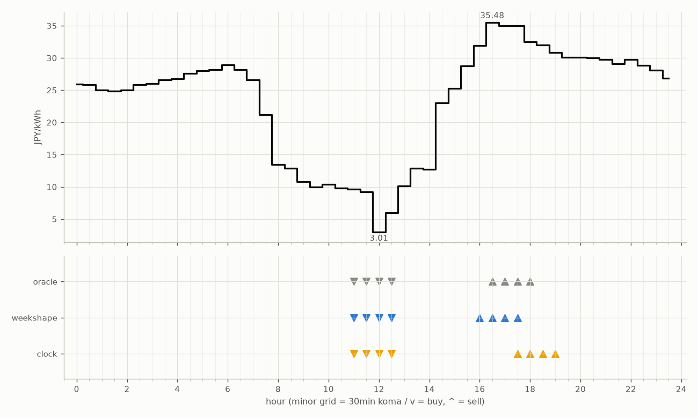

# JEPX仮想蓄電池 フォワード運用レポート

戦略凍結: 2026-08-12 / フォワード開始: 2026-08-14受渡分 / 生成: 2026-10-27 19:00 JST

> ⚠ 10/28受渡: **提出が届いていない**（picksファイルが無い＝strategies側のCIが落ちたか、pushが他のCIと衝突して失われた。気象とは別の原因）のため天気系4機体は**欠場**（実力ではなく計測の欠測。後日、予報アーカイブからBT補完される）

## 累計成績（リーグ76日目）

| 機体 | 累計損益 | 事前でない日 | **対oracle（共通57日）** | 対oracle（各自の出場日） | 対clock差（pt） |
|---|---|---|---|---|---|
| tenki_v3 | 10,930円 | 15%（11/75日・BT補完） | **91.8%** | 91.7% | +17.2 |
| tenki_v4 | 10,994円 | 17%（13/75日・BT補完） | **91.3%** | 91.3% | +16.8 |
| tenki_v2 | 10,852円 | 13%（10/75日・BT補完） | **91.2%** | 90.7% | +16.0 |
| tenki | 10,061円 | 9%（7/75日・BT6日+再計算1日） | **82.5%** | 83.2% | +8.0 |
| hybrid | 9,798円 | 9%（7/75日・BT6日+再計算1日） | **80.2%** | 81.3% | +6.1 |
| weekshape | 9,987円 | 25%（19/76日・再計算） | **80.0%** | 80.0% | +5.3 |
| clock | 9,468円 | 25%（19/76日・再計算） | **74.7%** | 74.7% | +0.0 |
| oracle | 12,287円 | — | 100.0% | 100.0% | — |

累計損益は**BT補完込み**（参戦前の欠場日を、当時入手可能だったデータのみで再現したバックテストで補完）。**事前でない日**＝価格公表前にコミットされていない日。内訳は**BT補完**（参戦前の穴埋め）と**再計算**（提出が無く採点時にコードから作った日）。clockとweekshapeは2026-08-27まで提出型ではなかったため、それ以前は全日が再計算。**対oracle%と対clock差は事前コミット済みのフォワード日のみ**で計算——対oracle%は値幅のスケールを、対clock差（常設ベンチとの同日ペア差）は時代の取りやすさを一次補正する。

**順位は「対oracle（共通57日）」で付ける。** 「各自の出場日」の列は機体ごとに分母の日が違うので、**順位に使うと難しい日を欠場した機体ほど上に来る**——2026-08-29の敵対的レビューで実際にそうなっていた（tenki_v3が首位に見えていたが、同じ日で揃えるとtenkiとhybridが上）。参考として残すが、比較には使わない。

### 欠場の内訳

- **補完待ち**（5件）: 10/28 hybrid, 10/28 tenki, 10/28 tenki_v2, 10/28 tenki_v3, 10/28 tenki_v4
  - 予報アーカイブ（約5日遅れ）の到着後に自動で埋まる。埋まれば全機体が同じ日で戦う

## 期間別（ISO週別、*=BT補完を含む）

| 週 | tenki | hybrid | clock | weekshape | tenki_v2 | tenki_v3 | tenki_v4 | oracle |
|---|---|---|---|---|---|---|---|---|
| 2026-W33 | 158 | 158 | 241 | 215 | 165* | 180* | 181* | 257 |
| 2026-W34 | 880* | 870* | 796 | 836 | 841* | 856* | 859* | 928 |
| 2026-W35 | 990* | 991* | 842 | 928 | 981* | 1,008* | 1,008* | 1,110 |
| 2026-W36 | 773 | 773 | 499 | 795 | 837 | 860 | 860 | 1,060 |
| 2026-W37 | 731 | 724 | 465 | 714 | 775 | 764 | 707 | 817 |
| 2026-W38 | 644 | 591 | 635 | 690 | 841 | 847 | 829 | 880 |
| 2026-W39 | 924 | 605 | 1,046 | 607 | 933 | 1,007 | 1,026 | 1,108 |
| 2026-W40 | 1,275* | 1,129* | 1,100 | 1,052 | 1,377* | 1,343* | 1,399* | 1,464 |
| 2026-W41 | 1,371* | 1,368* | 1,360 | 1,368 | 1,521* | 1,494* | 1,529* | 1,557 |
| 2026-W42 | 1,235* | 1,364* | 1,380 | 1,364 | 1,330* | 1,417* | 1,480* | 1,543 |
| 2026-W43 | 825 | 892 | 703 | 853 | 923 | 930 | 857 | 980 |
| 2026-W44 | 256 | 333 | 401 | 564 | 328 | 224 | 258 | 583 |

## 直接対決（全機体出場日 62日のみ）

| 機体 | 累計損益 | 対oracle |
|---|---|---|
| tenki_v3 | 9,116円 | 91.8% |
| tenki_v4 | 9,069円 | 91.3% |
| tenki_v2 | 9,045円 | 91.1% |
| tenki | 8,250円 | 83.1% |
| hybrid | 8,030円 | 80.9% |
| weekshape | 7,955円 | 80.1% |
| clock | 7,398円 | 74.5% |
| oracle | 9,929円 | 100.0% |
## 直近日の解剖（全日分は [daily_anatomy.md](daily_anatomy.md)）

### 2026-10-28（信号: ?）

- 因子: picksの_meta欠落
- 価格の形: 最安 12:00 3.01円 / 最高 16:30 35.48円 / 山谷比 11.8倍

| 機体 | 充電（買い） | 平均買値 | 放電（売り） | 平均売値 | 損益 |
|---|---|---|---|---|---|
| clock | 11:00, 11:30, 12:00, 12:30 | 6.95円 | 17:30, 18:00, 18:30, 19:00 | 32.59円 | +225円 |
| weekshape | 11:00, 11:30, 12:00, 12:30 | 6.95円 | 16:00, 16:30, 17:00, 17:30 | 34.35円 | +240円 |
| oracle | 11:00, 11:30, 12:00, 12:30 | 6.95円 | 16:30, 17:00, 17:30, 18:00 | 34.50円 | +243円 |

**48コマ価格（円/kWh。太字=最安/最高）**

| 00:00 | 00:30 | 01:00 | 01:30 | 02:00 | 02:30 | 03:00 | 03:30 | 04:00 | 04:30 | 05:00 | 05:30 | 06:00 | 06:30 | 07:00 | 07:30 | 08:00 | 08:30 | 09:00 | 09:30 | 10:00 | 10:30 | 11:00 | 11:30 |
|---|---|---|---|---|---|---|---|---|---|---|---|---|---|---|---|---|---|---|---|---|---|---|---|
| 25.97 | 25.82 | 25.05 | 24.86 | 25.00 | 25.81 | 26.04 | 26.64 | 26.78 | 27.60 | 27.98 | 28.21 | 28.91 | 28.22 | 26.64 | 21.18 | 13.45 | 12.87 | 10.81 | 9.98 | 10.40 | 9.81 | 9.60 | 9.20 |

| 12:00 | 12:30 | 13:00 | 13:30 | 14:00 | 14:30 | 15:00 | 15:30 | 16:00 | 16:30 | 17:00 | 17:30 | 18:00 | 18:30 | 19:00 | 19:30 | 20:00 | 20:30 | 21:00 | 21:30 | 22:00 | 22:30 | 23:00 | 23:30 |
|---|---|---|---|---|---|---|---|---|---|---|---|---|---|---|---|---|---|---|---|---|---|---|---|
| **3.01** | 6.00 | 10.15 | 12.87 | 12.75 | 23.00 | 25.30 | 28.78 | 31.91 | **35.48** | 35.01 | 35.00 | 32.50 | 32.00 | 30.84 | 30.10 | 30.06 | 29.97 | 29.73 | 29.12 | 29.78 | 28.88 | 28.13 | 26.88 |

## 明日のpicks（受渡日 2026-10-29、信号: 平常）

日射予報の乖離 -96 W/m2（普段より曇る方向。判定時の直近28日平均 469、判定は絶対値 96 vs 閾値 201）

| 機体 | 充電（買い） | 放電（売り） |
|---|---|---|
| clock | 11:00, 11:30, 12:00, 12:30 | 17:30, 18:00, 18:30, 19:00 |
| weekshape | 10:30, 11:30, 12:00, 12:30 | 16:30, 17:00, 17:30, 18:00 |
| tenki | 01:30, 02:00, 02:30, 12:00 | 16:00, 16:30, 17:00, 17:30 |
| tenki_v2 | 11:00, 11:30, 12:00, 12:30 | 16:00, 16:30, 17:00, 17:30 |
| tenki_v3 | 11:00, 11:30, 12:00, 12:30 | 16:30, 17:00, 17:30, 18:00 |
| tenki_v4 | 11:00, 11:30, 12:00, 12:30 | 16:30, 17:00, 17:30, 18:00 |
| hybrid | 10:30, 11:30, 12:00, 12:30 | 16:30, 17:00, 17:30, 18:00 |
