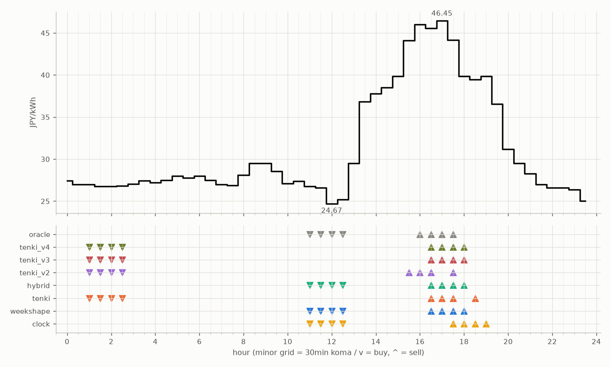

# JEPX仮想蓄電池 フォワード運用レポート

戦略凍結: 2026-08-12 / フォワード開始: 2026-08-14受渡分 / 生成: 2026-10-20 18:45 JST

## 累計成績（リーグ69日目）

| 機体 | 累計損益 | 事前でない日 | **対oracle（共通51日）** | 対oracle（各自の出場日） | 対clock差（pt） |
|---|---|---|---|---|---|
| tenki_v3 | 10,155円 | 15%（10/68日・BT補完） | **92.6%** | 92.4% | +17.8 |
| tenki_v4 | 10,181円 | 18%（12/68日・BT補完） | **92.5%** | 92.4% | +17.7 |
| tenki_v2 | 9,972円 | 13%（9/68日・BT補完） | **90.8%** | 90.3% | +15.4 |
| tenki | 9,290円 | 9%（6/68日・BT5日+再計算1日） | **83.1%** | 83.8% | +8.3 |
| hybrid | 8,865円 | 9%（6/68日・BT5日+再計算1日） | **79.0%** | 80.4% | +4.9 |
| weekshape | 8,967円 | 26%（18/69日・再計算） | **78.7%** | 78.7% | +3.9 |
| clock | 8,631円 | 26%（18/69日・再計算） | **74.9%** | 74.9% | +0.0 |
| oracle | 11,204円 | — | 100.0% | 100.0% | — |

累計損益は**BT補完込み**（参戦前の欠場日を、当時入手可能だったデータのみで再現したバックテストで補完）。**事前でない日**＝価格公表前にコミットされていない日。内訳は**BT補完**（参戦前の穴埋め）と**再計算**（提出が無く採点時にコードから作った日）。clockとweekshapeは2026-08-27まで提出型ではなかったため、それ以前は全日が再計算。**対oracle%と対clock差は事前コミット済みのフォワード日のみ**で計算——対oracle%は値幅のスケールを、対clock差（常設ベンチとの同日ペア差）は時代の取りやすさを一次補正する。

**順位は「対oracle（共通51日）」で付ける。** 「各自の出場日」の列は機体ごとに分母の日が違うので、**順位に使うと難しい日を欠場した機体ほど上に来る**——2026-08-29の敵対的レビューで実際にそうなっていた（tenki_v3が首位に見えていたが、同じ日で揃えるとtenkiとhybridが上）。参考として残すが、比較には使わない。

### 欠場の内訳

- **補完待ち**（5件）: 10/14 hybrid, 10/14 tenki, 10/14 tenki_v2, 10/14 tenki_v3, 10/14 tenki_v4
  - 予報アーカイブ（約5日遅れ）の到着後に自動で埋まる。埋まれば全機体が同じ日で戦う

## 期間別（ISO週別、*=BT補完を含む）

| 週 | tenki | hybrid | clock | weekshape | tenki_v2 | tenki_v3 | tenki_v4 | oracle |
|---|---|---|---|---|---|---|---|---|
| 2026-W33 | 158 | 158 | 241 | 215 | 165* | 180* | 181* | 257 |
| 2026-W34 | 880* | 870* | 796 | 836 | 841* | 856* | 859* | 928 |
| 2026-W35 | 990* | 991* | 842 | 928 | 981* | 1,008* | 1,008* | 1,110 |
| 2026-W36 | 773 | 773 | 499 | 795 | 837 | 860 | 860 | 1,060 |
| 2026-W37 | 731 | 724 | 465 | 714 | 775 | 764 | 707 | 817 |
| 2026-W38 | 644 | 591 | 635 | 690 | 841 | 847 | 829 | 880 |
| 2026-W39 | 924 | 605 | 1,046 | 607 | 933 | 1,007 | 1,026 | 1,108 |
| 2026-W40 | 1,275* | 1,129* | 1,100 | 1,052 | 1,377* | 1,343* | 1,399* | 1,464 |
| 2026-W41 | 1,371* | 1,368* | 1,360 | 1,368 | 1,521* | 1,494* | 1,529* | 1,557 |
| 2026-W42 | 1,106 | 1,211 | 1,380 | 1,364 | 1,250 | 1,342 | 1,337 | 1,543 |
| 2026-W43 | 438 | 445 | 266 | 397 | 450 | 454 | 445 | 480 |

## 直接対決（全機体出場日 56日のみ）

| 機体 | 累計損益 | 対oracle |
|---|---|---|
| tenki_v3 | 8,415円 | 92.6% |
| tenki_v4 | 8,398円 | 92.4% |
| tenki_v2 | 8,245円 | 90.7% |
| tenki | 7,608円 | 83.7% |
| hybrid | 7,250円 | 79.8% |
| weekshape | 7,176円 | 79.0% |
| clock | 6,786円 | 74.7% |
| oracle | 9,088円 | 100.0% |
## 直近日の解剖（全日分は [daily_anatomy.md](daily_anatomy.md)）

### 2026-10-21（信号: 平常）

- 因子: 日射予報 308 W/m2 / 実測 未確定（実測は約5日遅れ） / 乖離 -155 W/m2（普段より曇る方向。判定時の直近28日平均 463、判定は絶対値 155 vs 閾値 203）
- 価格の形: 最安 12:00 24.67円 / 最高 17:00 46.45円 / 山谷比 1.9倍

| 機体 | 充電（買い） | 平均買値 | 放電（売り） | 平均売値 | 損益 |
|---|---|---|---|---|---|
| clock | 11:00, 11:30, 12:00, 12:30 | 25.80円 | 17:30, 18:00, 18:30, 19:00 | 40.83円 | +111円 |
| weekshape | 11:00, 11:30, 12:00, 12:30 | 25.80円 | 16:30, 17:00, 17:30, 18:00 | 44.01円 | +141円 |
| tenki | 01:00, 01:30, 02:00, 02:30 | 26.83円 | 16:30, 17:00, 17:30, 18:30 | 43.92円 | +130円 |
| tenki_v2 | 01:00, 01:30, 02:00, 02:30 | 26.83円 | 15:30, 16:00, 16:30, 17:30 | 44.97円 | +138円 |
| tenki_v3 | 01:00, 01:30, 02:00, 02:30 | 26.83円 | 16:30, 17:00, 17:30, 18:00 | 44.01円 | +131円 |
| tenki_v4 | 01:00, 01:30, 02:00, 02:30 | 26.83円 | 16:30, 17:00, 17:30, 18:00 | 44.01円 | +131円 |
| hybrid | 11:00, 11:30, 12:00, 12:30 | 25.80円 | 16:30, 17:00, 17:30, 18:00 | 44.01円 | +141円 |
| oracle | 11:00, 11:30, 12:00, 12:30 | 25.80円 | 16:00, 16:30, 17:00, 17:30 | 45.55円 | +154円 |

**48コマ価格（円/kWh。太字=最安/最高）**

| 00:00 | 00:30 | 01:00 | 01:30 | 02:00 | 02:30 | 03:00 | 03:30 | 04:00 | 04:30 | 05:00 | 05:30 | 06:00 | 06:30 | 07:00 | 07:30 | 08:00 | 08:30 | 09:00 | 09:30 | 10:00 | 10:30 | 11:00 | 11:30 |
|---|---|---|---|---|---|---|---|---|---|---|---|---|---|---|---|---|---|---|---|---|---|---|---|
| 27.43 | 27.00 | 26.98 | 26.78 | 26.78 | 26.79 | 27.03 | 27.42 | 27.19 | 27.47 | 28.02 | 27.79 | 28.02 | 27.48 | 27.00 | 26.89 | 28.13 | 29.52 | 29.53 | 28.55 | 27.09 | 27.37 | 26.77 | 26.57 |

| 12:00 | 12:30 | 13:00 | 13:30 | 14:00 | 14:30 | 15:00 | 15:30 | 16:00 | 16:30 | 17:00 | 17:30 | 18:00 | 18:30 | 19:00 | 19:30 | 20:00 | 20:30 | 21:00 | 21:30 | 22:00 | 22:30 | 23:00 | 23:30 |
|---|---|---|---|---|---|---|---|---|---|---|---|---|---|---|---|---|---|---|---|---|---|---|---|
| **24.67** | 25.20 | 29.49 | 36.81 | 37.76 | 38.51 | 39.83 | 44.13 | 46.00 | 45.58 | **46.45** | 44.17 | 39.83 | 39.48 | 39.83 | 36.53 | 31.17 | 29.53 | 28.30 | 26.96 | 26.62 | 26.62 | 26.36 | 25.00 |

## 明日のpicks（受渡日 2026-10-22、信号: 平常）

日射予報の乖離 +3 W/m2（普段より晴れる方向。判定時の直近28日平均 467、判定は絶対値 3 vs 閾値 202）

| 機体 | 充電（買い） | 放電（売り） |
|---|---|---|
| clock | 11:00, 11:30, 12:00, 12:30 | 17:30, 18:00, 18:30, 19:00 |
| weekshape | 10:30, 11:30, 12:00, 12:30 | 16:30, 17:00, 17:30, 18:00 |
