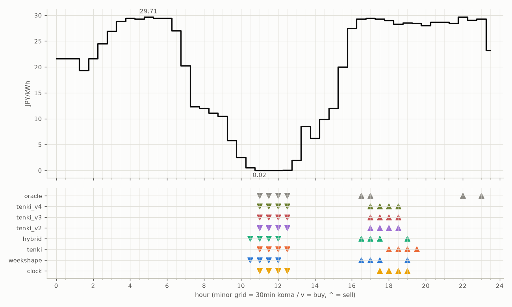

# JEPX仮想蓄電池 フォワード運用レポート

戦略凍結: 2026-08-12 / フォワード開始: 2026-08-14受渡分 / 生成: 2026-11-06 21:21 JST

## 累計成績（リーグ86日目）

| 機体 | 累計損益 | 事前でない日 | **対oracle（共通65日）** | 対oracle（各自の出場日） | 対clock差（pt） |
|---|---|---|---|---|---|
| tenki_v2 | 13,247円 | 15%（13/86日・BT補完） | **92.3%** | 91.8% | +16.8 |
| tenki_v3 | 13,210円 | 16%（14/86日・BT補完） | **91.8%** | 91.7% | +17.0 |
| tenki_v4 | 13,306円 | 19%（16/86日・BT補完） | **91.7%** | 91.7% | +16.9 |
| tenki | 12,253円 | 12%（10/86日・BT9日+再計算1日） | **83.4%** | 83.9% | +8.5 |
| hybrid | 12,189円 | 12%（10/86日・BT9日+再計算1日） | **83.1%** | 83.7% | +8.3 |
| weekshape | 11,969円 | 24%（21/86日・再計算） | **81.9%** | 81.9% | +6.9 |
| clock | 11,146円 | 24%（21/86日・再計算） | **74.9%** | 74.9% | +0.0 |
| oracle | 14,478円 | — | 100.0% | 100.0% | — |

累計損益は**BT補完込み**（参戦前の欠場日を、当時入手可能だったデータのみで再現したバックテストで補完）。**事前でない日**＝価格公表前にコミットされていない日。内訳は**BT補完**（参戦前の穴埋め）と**再計算**（提出が無く採点時にコードから作った日）。clockとweekshapeは2026-08-27まで提出型ではなかったため、それ以前は全日が再計算。**対oracle%と対clock差は事前コミット済みのフォワード日のみ**で計算——対oracle%は値幅のスケールを、対clock差（常設ベンチとの同日ペア差）は時代の取りやすさを一次補正する。

**順位は「対oracle（共通65日）」で付ける。** 「各自の出場日」の列は機体ごとに分母の日が違うので、**順位に使うと難しい日を欠場した機体ほど上に来る**——2026-08-29の敵対的レビューで実際にそうなっていた（tenki_v3が首位に見えていたが、同じ日で揃えるとtenkiとhybridが上）。参考として残すが、比較には使わない。

## 期間別（ISO週別、*=BT補完を含む）

| 週 | tenki | hybrid | clock | weekshape | tenki_v2 | tenki_v3 | tenki_v4 | oracle |
|---|---|---|---|---|---|---|---|---|
| 2026-W33 | 158 | 158 | 241 | 215 | 165* | 180* | 181* | 257 |
| 2026-W34 | 880* | 870* | 796 | 836 | 841* | 856* | 859* | 928 |
| 2026-W35 | 990* | 991* | 842 | 928 | 981* | 1,008* | 1,008* | 1,110 |
| 2026-W36 | 773 | 773 | 499 | 795 | 837 | 860 | 860 | 1,060 |
| 2026-W37 | 731 | 724 | 465 | 714 | 775 | 764 | 707 | 817 |
| 2026-W38 | 644 | 591 | 635 | 690 | 841 | 847 | 829 | 880 |
| 2026-W39 | 924 | 605 | 1,046 | 607 | 933 | 1,007 | 1,026 | 1,108 |
| 2026-W40 | 1,275* | 1,129* | 1,100 | 1,052 | 1,377* | 1,343* | 1,399* | 1,464 |
| 2026-W41 | 1,371* | 1,368* | 1,360 | 1,368 | 1,521* | 1,494* | 1,529* | 1,557 |
| 2026-W42 | 1,235* | 1,364* | 1,380 | 1,364 | 1,330* | 1,417* | 1,480* | 1,543 |
| 2026-W43 | 825 | 892 | 703 | 853 | 923 | 930 | 857 | 980 |
| 2026-W44 | 1,196* | 1,411* | 1,133 | 1,350 | 1,415* | 1,292* | 1,329* | 1,445 |
| 2026-W45 | 1,253* | 1,314* | 945 | 1,197 | 1,309* | 1,213* | 1,241* | 1,330 |

## 直接対決（全機体出場日 70日のみ）

| 機体 | 累計損益 | 対oracle |
|---|---|---|
| tenki_v2 | 10,816円 | 92.2% |
| tenki_v3 | 10,782円 | 91.9% |
| tenki_v4 | 10,763円 | 91.7% |
| tenki | 9,835円 | 83.8% |
| hybrid | 9,800円 | 83.5% |
| weekshape | 9,608円 | 81.9% |
| clock | 8,775円 | 74.8% |
| oracle | 11,736円 | 100.0% |
## 直近日の解剖（全日分は [daily_anatomy.md](daily_anatomy.md)）

### 2026-11-07（信号: 平常）

- 因子: 日射予報 452 W/m2 / 実測 未確定（実測は約5日遅れ） / 乖離 +9 W/m2（普段より晴れる方向。判定時の直近28日平均 443、判定は絶対値 9 vs 閾値 203）
- 価格の形: 最安 11:00 0.02円 / 最高 05:00 29.71円 / 山谷比 1485.5倍

| 機体 | 充電（買い） | 平均買値 | 放電（売り） | 平均売値 | 損益 |
|---|---|---|---|---|---|
| clock | 11:00, 11:30, 12:00, 12:30 | 0.03円 | 17:30, 18:00, 18:30, 19:00 | 28.79円 | +260円 |
| weekshape | 10:30, 11:00, 11:30, 12:00 | 0.14円 | 16:30, 17:00, 17:30, 19:00 | 29.15円 | +262円 |
| tenki | 11:00, 11:30, 12:00, 12:30 | 0.03円 | 18:00, 18:30, 19:00, 19:30 | 28.57円 | +258円 |
| tenki_v2 | 11:00, 11:30, 12:00, 12:30 | 0.03円 | 17:00, 17:30, 18:00, 18:30 | 29.03円 | +262円 |
| tenki_v3 | 11:00, 11:30, 12:00, 12:30 | 0.03円 | 17:00, 17:30, 18:00, 18:30 | 29.03円 | +262円 |
| tenki_v4 | 11:00, 11:30, 12:00, 12:30 | 0.03円 | 17:00, 17:30, 18:00, 18:30 | 29.03円 | +262円 |
| hybrid | 10:30, 11:00, 11:30, 12:00 | 0.14円 | 16:30, 17:00, 17:30, 19:00 | 29.15円 | +262円 |
| oracle | 11:00, 11:30, 12:00, 12:30 | 0.03円 | 16:30, 17:00, 22:00, 23:00 | 29.43円 | +265円 |

**48コマ価格（円/kWh。太字=最安/最高）**

| 00:00 | 00:30 | 01:00 | 01:30 | 02:00 | 02:30 | 03:00 | 03:30 | 04:00 | 04:30 | 05:00 | 05:30 | 06:00 | 06:30 | 07:00 | 07:30 | 08:00 | 08:30 | 09:00 | 09:30 | 10:00 | 10:30 | 11:00 | 11:30 |
|---|---|---|---|---|---|---|---|---|---|---|---|---|---|---|---|---|---|---|---|---|---|---|---|
| 21.58 | 21.58 | 21.58 | 19.30 | 21.58 | 24.51 | 26.96 | 28.85 | 29.45 | 29.28 | **29.71** | 29.45 | 29.42 | 27.00 | 20.21 | 12.32 | 12.00 | 11.14 | 10.52 | 5.81 | 2.50 | 0.50 | **0.02** | 0.02 |

| 12:00 | 12:30 | 13:00 | 13:30 | 14:00 | 14:30 | 15:00 | 15:30 | 16:00 | 16:30 | 17:00 | 17:30 | 18:00 | 18:30 | 19:00 | 19:30 | 20:00 | 20:30 | 21:00 | 21:30 | 22:00 | 22:30 | 23:00 | 23:30 |
|---|---|---|---|---|---|---|---|---|---|---|---|---|---|---|---|---|---|---|---|---|---|---|---|
| 0.02 | 0.05 | 2.00 | 8.52 | 6.28 | 9.86 | 12.00 | 20.00 | 27.50 | 29.32 | 29.45 | 29.32 | 29.00 | 28.34 | 28.50 | 28.43 | 28.02 | 28.67 | 28.70 | 28.43 | 29.69 | 29.10 | 29.28 | 23.19 |

## 明日のpicks（受渡日 2026-11-08、信号: 平常）

日射予報の乖離 -0 W/m2（普段より曇る方向。判定時の直近28日平均 443、判定は絶対値 0 vs 閾値 203）

| 機体 | 充電（買い） | 放電（売り） |
|---|---|---|
| clock | 11:00, 11:30, 12:00, 12:30 | 17:30, 18:00, 18:30, 19:00 |
| weekshape | 09:30, 10:00, 10:30, 11:00 | 17:00, 17:30, 18:00, 18:30 |
| tenki | 11:00, 11:30, 12:00, 12:30 | 18:00, 18:30, 19:00, 19:30 |
| tenki_v2 | 11:00, 11:30, 12:00, 12:30 | 17:00, 17:30, 18:00, 18:30 |
| tenki_v3 | 11:00, 11:30, 12:00, 12:30 | 17:00, 17:30, 18:00, 18:30 |
| tenki_v4 | 11:00, 11:30, 12:00, 12:30 | 17:00, 17:30, 18:00, 18:30 |
| hybrid | 09:30, 10:00, 10:30, 11:00 | 17:00, 17:30, 18:00, 18:30 |
