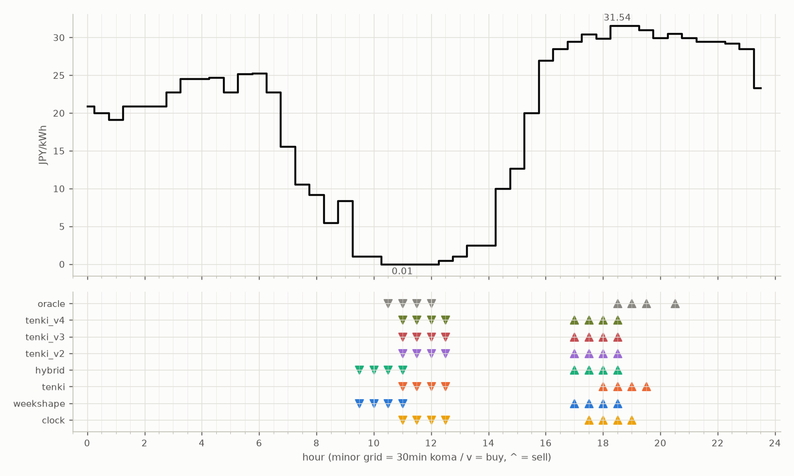

# JEPX仮想蓄電池 フォワード運用レポート

戦略凍結: 2026-08-12 / フォワード開始: 2026-08-14受渡分 / 生成: 2026-11-07 20:20 JST

## 累計成績（リーグ87日目）

| 機体 | 累計損益 | 事前でない日 | **対oracle（共通66日）** | 対oracle（各自の出場日） | 対clock差（pt） |
|---|---|---|---|---|---|
| tenki_v2 | 13,519円 | 15%（13/87日・BT補完） | **92.4%** | 91.9% | +16.4 |
| tenki_v3 | 13,482円 | 16%（14/87日・BT補完） | **91.9%** | 91.9% | +16.6 |
| tenki_v4 | 13,578円 | 18%（16/87日・BT補完） | **91.8%** | 91.8% | +16.5 |
| tenki | 12,532円 | 11%（10/87日・BT9日+再計算1日） | **83.7%** | 84.2% | +8.3 |
| hybrid | 12,458円 | 11%（10/87日・BT9日+再計算1日） | **83.4%** | 84.0% | +8.1 |
| weekshape | 12,237円 | 24%（21/87日・再計算） | **82.2%** | 82.2% | +6.7 |
| clock | 11,423円 | 24%（21/87日・再計算） | **75.5%** | 75.5% | +0.0 |
| oracle | 14,760円 | — | 100.0% | 100.0% | — |

累計損益は**BT補完込み**（参戦前の欠場日を、当時入手可能だったデータのみで再現したバックテストで補完）。**事前でない日**＝価格公表前にコミットされていない日。内訳は**BT補完**（参戦前の穴埋め）と**再計算**（提出が無く採点時にコードから作った日）。clockとweekshapeは2026-08-27まで提出型ではなかったため、それ以前は全日が再計算。**対oracle%と対clock差は事前コミット済みのフォワード日のみ**で計算——対oracle%は値幅のスケールを、対clock差（常設ベンチとの同日ペア差）は時代の取りやすさを一次補正する。

**順位は「対oracle（共通66日）」で付ける。** 「各自の出場日」の列は機体ごとに分母の日が違うので、**順位に使うと難しい日を欠場した機体ほど上に来る**——2026-08-29の敵対的レビューで実際にそうなっていた（tenki_v3が首位に見えていたが、同じ日で揃えるとtenkiとhybridが上）。参考として残すが、比較には使わない。

## 期間別（ISO週別、*=BT補完を含む）

| 週 | tenki | hybrid | clock | weekshape | tenki_v2 | tenki_v3 | tenki_v4 | oracle |
|---|---|---|---|---|---|---|---|---|
| 2026-W33 | 158 | 158 | 241 | 215 | 165* | 180* | 181* | 257 |
| 2026-W34 | 880* | 870* | 796 | 836 | 841* | 856* | 859* | 928 |
| 2026-W35 | 990* | 991* | 842 | 928 | 981* | 1,008* | 1,008* | 1,110 |
| 2026-W36 | 773 | 773 | 499 | 795 | 837 | 860 | 860 | 1,060 |
| 2026-W37 | 731 | 724 | 465 | 714 | 775 | 764 | 707 | 817 |
| 2026-W38 | 644 | 591 | 635 | 690 | 841 | 847 | 829 | 880 |
| 2026-W39 | 924 | 605 | 1,046 | 607 | 933 | 1,007 | 1,026 | 1,108 |
| 2026-W40 | 1,275* | 1,129* | 1,100 | 1,052 | 1,377* | 1,343* | 1,399* | 1,464 |
| 2026-W41 | 1,371* | 1,368* | 1,360 | 1,368 | 1,521* | 1,494* | 1,529* | 1,557 |
| 2026-W42 | 1,235* | 1,364* | 1,380 | 1,364 | 1,330* | 1,417* | 1,480* | 1,543 |
| 2026-W43 | 825 | 892 | 703 | 853 | 923 | 930 | 857 | 980 |
| 2026-W44 | 1,196* | 1,411* | 1,133 | 1,350 | 1,415* | 1,292* | 1,329* | 1,445 |
| 2026-W45 | 1,531* | 1,582* | 1,222 | 1,465 | 1,581* | 1,485* | 1,513* | 1,611 |

## 直接対決（全機体出場日 71日のみ）

| 機体 | 累計損益 | 対oracle |
|---|---|---|
| tenki_v2 | 11,088円 | 92.3% |
| tenki_v3 | 11,053円 | 92.0% |
| tenki_v4 | 11,035円 | 91.8% |
| tenki | 10,114円 | 84.2% |
| hybrid | 10,068円 | 83.8% |
| weekshape | 9,876円 | 82.2% |
| clock | 9,052円 | 75.3% |
| oracle | 12,017円 | 100.0% |
## 直近日の解剖（全日分は [daily_anatomy.md](daily_anatomy.md)）

### 2026-11-08（信号: 平常）

- 因子: 日射予報 415 W/m2 / 実測 未確定（実測は約5日遅れ） / 乖離 -28 W/m2（普段より曇る方向。判定時の直近28日平均 443、判定は絶対値 28 vs 閾値 203）
- 価格の形: 最安 11:00 0.01円 / 最高 18:30 31.54円 / 山谷比 3154.0倍

| 機体 | 充電（買い） | 平均買値 | 放電（売り） | 平均売値 | 損益 |
|---|---|---|---|---|---|
| clock | 11:00, 11:30, 12:00, 12:30 | 0.14円 | 17:30, 18:00, 18:30, 19:00 | 30.86円 | +277円 |
| weekshape | 09:30, 10:00, 10:30, 11:00 | 0.51円 | 17:00, 17:30, 18:00, 18:30 | 30.35円 | +268円 |
| tenki | 11:00, 11:30, 12:00, 12:30 | 0.14円 | 18:00, 18:30, 19:00, 19:30 | 31.00円 | +278円 |
| tenki_v2 | 11:00, 11:30, 12:00, 12:30 | 0.14円 | 17:00, 17:30, 18:00, 18:30 | 30.35円 | +272円 |
| tenki_v3 | 11:00, 11:30, 12:00, 12:30 | 0.14円 | 17:00, 17:30, 18:00, 18:30 | 30.35円 | +272円 |
| tenki_v4 | 11:00, 11:30, 12:00, 12:30 | 0.14円 | 17:00, 17:30, 18:00, 18:30 | 30.35円 | +272円 |
| hybrid | 09:30, 10:00, 10:30, 11:00 | 0.51円 | 17:00, 17:30, 18:00, 18:30 | 30.35円 | +268円 |
| oracle | 10:30, 11:00, 11:30, 12:00 | 0.02円 | 18:30, 19:00, 19:30, 20:30 | 31.16円 | +281円 |

**48コマ価格（円/kWh。太字=最安/最高）**

| 00:00 | 00:30 | 01:00 | 01:30 | 02:00 | 02:30 | 03:00 | 03:30 | 04:00 | 04:30 | 05:00 | 05:30 | 06:00 | 06:30 | 07:00 | 07:30 | 08:00 | 08:30 | 09:00 | 09:30 | 10:00 | 10:30 | 11:00 | 11:30 |
|---|---|---|---|---|---|---|---|---|---|---|---|---|---|---|---|---|---|---|---|---|---|---|---|
| 20.89 | 19.99 | 19.12 | 20.89 | 20.89 | 20.89 | 22.74 | 24.51 | 24.51 | 24.72 | 22.74 | 25.16 | 25.30 | 22.74 | 15.56 | 10.56 | 9.18 | 5.50 | 8.38 | 1.01 | 1.00 | 0.02 | **0.01** | 0.01 |

| 12:00 | 12:30 | 13:00 | 13:30 | 14:00 | 14:30 | 15:00 | 15:30 | 16:00 | 16:30 | 17:00 | 17:30 | 18:00 | 18:30 | 19:00 | 19:30 | 20:00 | 20:30 | 21:00 | 21:30 | 22:00 | 22:30 | 23:00 | 23:30 |
|---|---|---|---|---|---|---|---|---|---|---|---|---|---|---|---|---|---|---|---|---|---|---|---|
| 0.02 | 0.50 | 1.01 | 2.49 | 2.50 | 9.98 | 12.69 | 20.00 | 27.00 | 28.50 | 29.50 | 30.46 | 29.89 | **31.54** | 31.54 | 31.02 | 29.98 | 30.54 | 29.98 | 29.45 | 29.45 | 29.25 | 28.50 | 23.30 |

## 明日のpicks（受渡日 2026-11-09、信号: 強）

日射予報の乖離 -297 W/m2（普段より曇る方向。判定時の直近28日平均 442、判定は絶対値 297 vs 閾値 203）

| 機体 | 充電（買い） | 放電（売り） |
|---|---|---|
| clock | 11:00, 11:30, 12:00, 12:30 | 17:30, 18:00, 18:30, 19:00 |
| weekshape | 01:00, 01:30, 02:00, 02:30 | 16:00, 16:30, 17:00, 17:30 |
| tenki | 01:00, 01:30, 02:00, 02:30 | 15:30, 16:00, 16:30, 17:00 |
| tenki_v2 | 00:30, 01:00, 12:00, 12:30 | 16:00, 16:30, 17:00, 17:30 |
| tenki_v3 | 01:00, 01:30, 12:00, 12:30 | 16:00, 16:30, 17:00, 17:30 |
| tenki_v4 | 01:00, 11:30, 12:00, 12:30 | 16:00, 16:30, 17:00, 17:30 |
| hybrid | 01:00, 01:30, 02:00, 02:30 | 15:30, 16:00, 16:30, 17:00 |
