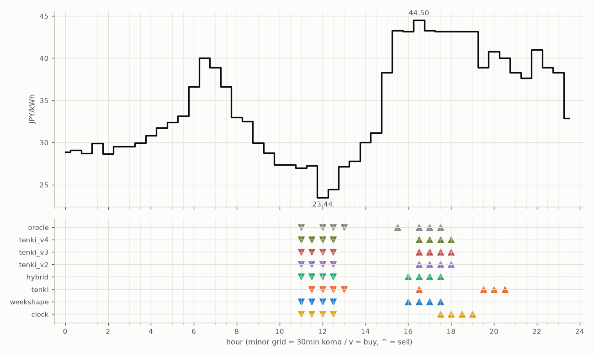

# JEPX仮想蓄電池 フォワード運用レポート

戦略凍結: 2026-08-12 / フォワード開始: 2026-08-14受渡分 / 生成: 2026-11-19 22:46 JST

> ⚠ 11/17受渡: 気象予報の取得に失敗（forecast_unavailable/signal_unavailable）のため天気系4機体は**欠場**（実力ではなく計測の欠測。後日、予報アーカイブからBT補完される）

## 累計成績（リーグ99日目）

| 機体 | 累計損益 | 事前でない日 | **対oracle（共通77日）** | 対oracle（各自の出場日） | 対clock差（pt） |
|---|---|---|---|---|---|
| tenki_v2 | 15,490円 | 13%（13/98日・BT補完） | **92.0%** | 91.6% | +15.2 |
| tenki_v3 | 15,483円 | 14%（14/98日・BT補完） | **91.8%** | 91.7% | +15.5 |
| tenki_v4 | 15,524円 | 16%（16/98日・BT補完） | **91.3%** | 91.3% | +15.0 |
| tenki | 14,531円 | 10%（10/98日・BT9日+再計算1日） | **84.9%** | 85.2% | +8.5 |
| hybrid | 14,425円 | 10%（10/98日・BT9日+再計算1日） | **84.4%** | 84.8% | +8.0 |
| weekshape | 14,281円 | 21%（21/99日・再計算） | **83.3%** | 83.2% | +6.8 |
| clock | 13,290円 | 21%（21/99日・再計算） | **76.5%** | 76.4% | +0.0 |
| oracle | 17,070円 | — | 100.0% | 100.0% | — |

累計損益は**BT補完込み**（参戦前の欠場日を、当時入手可能だったデータのみで再現したバックテストで補完）。**事前でない日**＝価格公表前にコミットされていない日。内訳は**BT補完**（参戦前の穴埋め）と**再計算**（提出が無く採点時にコードから作った日）。clockとweekshapeは2026-08-27まで提出型ではなかったため、それ以前は全日が再計算。**対oracle%と対clock差は事前コミット済みのフォワード日のみ**で計算——対oracle%は値幅のスケールを、対clock差（常設ベンチとの同日ペア差）は時代の取りやすさを一次補正する。

**順位は「対oracle（共通77日）」で付ける。** 「各自の出場日」の列は機体ごとに分母の日が違うので、**順位に使うと難しい日を欠場した機体ほど上に来る**——2026-08-29の敵対的レビューで実際にそうなっていた（tenki_v3が首位に見えていたが、同じ日で揃えるとtenkiとhybridが上）。参考として残すが、比較には使わない。

### 欠場の内訳

- **設計棄権**（5件）: 11/17 hybrid, 11/17 tenki, 11/17 tenki_v2, 11/17 tenki_v3, 11/17 tenki_v4
  - 機体が理由つきで出場を辞退した日。**補完しない**——埋めると出さなかった予測を発明することになる

## 期間別（ISO週別、*=BT補完を含む）

| 週 | tenki | hybrid | clock | weekshape | tenki_v2 | tenki_v3 | tenki_v4 | oracle |
|---|---|---|---|---|---|---|---|---|
| 2026-W33 | 158 | 158 | 241 | 215 | 165* | 180* | 181* | 257 |
| 2026-W34 | 880* | 870* | 796 | 836 | 841* | 856* | 859* | 928 |
| 2026-W35 | 990* | 991* | 842 | 928 | 981* | 1,008* | 1,008* | 1,110 |
| 2026-W36 | 773 | 773 | 499 | 795 | 837 | 860 | 860 | 1,060 |
| 2026-W37 | 731 | 724 | 465 | 714 | 775 | 764 | 707 | 817 |
| 2026-W38 | 644 | 591 | 635 | 690 | 841 | 847 | 829 | 880 |
| 2026-W39 | 924 | 605 | 1,046 | 607 | 933 | 1,007 | 1,026 | 1,108 |
| 2026-W40 | 1,275* | 1,129* | 1,100 | 1,052 | 1,377* | 1,343* | 1,399* | 1,464 |
| 2026-W41 | 1,371* | 1,368* | 1,360 | 1,368 | 1,521* | 1,494* | 1,529* | 1,557 |
| 2026-W42 | 1,235* | 1,364* | 1,380 | 1,364 | 1,330* | 1,417* | 1,480* | 1,543 |
| 2026-W43 | 825 | 892 | 703 | 853 | 923 | 930 | 857 | 980 |
| 2026-W44 | 1,196* | 1,411* | 1,133 | 1,350 | 1,415* | 1,292* | 1,329* | 1,445 |
| 2026-W45 | 1,531* | 1,582* | 1,222 | 1,465 | 1,581* | 1,485* | 1,513* | 1,611 |
| 2026-W46 | 1,322 | 1,400 | 1,071 | 1,365 | 1,271 | 1,276 | 1,221 | 1,459 |
| 2026-W47 | 678 | 567 | 796 | 678 | 700 | 724 | 724 | 851 |

## 直接対決（全機体出場日 82日のみ）

| 機体 | 累計損益 | 対oracle |
|---|---|---|
| tenki_v2 | 13,059円 | 91.9% |
| tenki_v3 | 13,054円 | 91.8% |
| tenki_v4 | 12,981円 | 91.3% |
| tenki | 12,113円 | 85.2% |
| hybrid | 12,035円 | 84.7% |
| weekshape | 11,840円 | 83.3% |
| clock | 10,843円 | 76.3% |
| oracle | 14,216円 | 100.0% |
## 直近日の解剖（全日分は [daily_anatomy.md](daily_anatomy.md)）

### 2026-11-20（信号: 平常）

- 因子: 日射予報 358 W/m2 / 実測 未確定（実測は約5日遅れ） / 乖離 -20 W/m2（普段より曇る方向。判定時の直近28日平均 378、判定は絶対値 20 vs 閾値 203）
- 価格の形: 最安 12:00 23.44円 / 最高 16:30 44.50円 / 山谷比 1.9倍

| 機体 | 充電（買い） | 平均買値 | 放電（売り） | 平均売値 | 損益 |
|---|---|---|---|---|---|
| clock | 11:00, 11:30, 12:00, 12:30 | 25.53円 | 17:30, 18:00, 18:30, 19:00 | 43.19円 | +134円 |
| weekshape | 11:00, 11:30, 12:00, 12:30 | 25.53円 | 16:00, 16:30, 17:00, 17:30 | 43.54円 | +138円 |
| tenki | 11:30, 12:00, 12:30, 13:00 | 25.56円 | 16:30, 19:30, 20:00, 20:30 | 41.04円 | +115円 |
| tenki_v2 | 11:00, 11:30, 12:00, 12:30 | 25.53円 | 16:30, 17:00, 17:30, 18:00 | 43.54円 | +138円 |
| tenki_v3 | 11:00, 11:30, 12:00, 12:30 | 25.53円 | 16:30, 17:00, 17:30, 18:00 | 43.54円 | +138円 |
| tenki_v4 | 11:00, 11:30, 12:00, 12:30 | 25.53円 | 16:30, 17:00, 17:30, 18:00 | 43.54円 | +138円 |
| hybrid | 11:00, 11:30, 12:00, 12:30 | 25.53円 | 16:00, 16:30, 17:00, 17:30 | 43.54円 | +138円 |
| oracle | 11:00, 12:00, 12:30, 13:00 | 25.50円 | 15:30, 16:30, 17:00, 17:30 | 43.57円 | +138円 |

**48コマ価格（円/kWh。太字=最安/最高）**

| 00:00 | 00:30 | 01:00 | 01:30 | 02:00 | 02:30 | 03:00 | 03:30 | 04:00 | 04:30 | 05:00 | 05:30 | 06:00 | 06:30 | 07:00 | 07:30 | 08:00 | 08:30 | 09:00 | 09:30 | 10:00 | 10:30 | 11:00 | 11:30 |
|---|---|---|---|---|---|---|---|---|---|---|---|---|---|---|---|---|---|---|---|---|---|---|---|
| 28.89 | 29.10 | 28.71 | 29.88 | 28.66 | 29.52 | 29.51 | 29.97 | 30.80 | 31.74 | 32.37 | 33.14 | 36.61 | 40.00 | 38.89 | 36.61 | 33.00 | 32.52 | 29.98 | 28.76 | 27.34 | 27.34 | 27.00 | 27.23 |

| 12:00 | 12:30 | 13:00 | 13:30 | 14:00 | 14:30 | 15:00 | 15:30 | 16:00 | 16:30 | 17:00 | 17:30 | 18:00 | 18:30 | 19:00 | 19:30 | 20:00 | 20:30 | 21:00 | 21:30 | 22:00 | 22:30 | 23:00 | 23:30 |
|---|---|---|---|---|---|---|---|---|---|---|---|---|---|---|---|---|---|---|---|---|---|---|---|
| **23.44** | 24.45 | 27.12 | 27.77 | 29.99 | 31.14 | 38.31 | 43.29 | 43.19 | **44.50** | 43.29 | 43.19 | 43.19 | 43.19 | 43.19 | 38.89 | 40.78 | 40.00 | 38.30 | 37.67 | 41.00 | 38.89 | 38.30 | 32.89 |

## 明日のpicks（受渡日 2026-11-21、信号: 平常）

日射予報の乖離 +25 W/m2（普段より晴れる方向。判定時の直近28日平均 361、判定は絶対値 25 vs 閾値 203）

| 機体 | 充電（買い） | 放電（売り） |
|---|---|---|
| clock | 11:00, 11:30, 12:00, 12:30 | 17:30, 18:00, 18:30, 19:00 |
| weekshape | 10:30, 11:00, 11:30, 12:00 | 16:30, 17:00, 17:30, 20:00 |
| tenki | 11:00, 11:30, 12:00, 12:30 | 17:30, 18:00, 18:30, 19:00 |
| tenki_v2 | 11:00, 11:30, 12:00, 12:30 | 17:00, 17:30, 18:30, 19:00 |
| tenki_v3 | 11:00, 11:30, 12:00, 12:30 | 17:00, 17:30, 18:00, 18:30 |
| tenki_v4 | 11:00, 11:30, 12:00, 12:30 | 17:00, 17:30, 18:00, 18:30 |
| hybrid | 10:30, 11:00, 11:30, 12:00 | 16:30, 17:00, 17:30, 20:00 |
