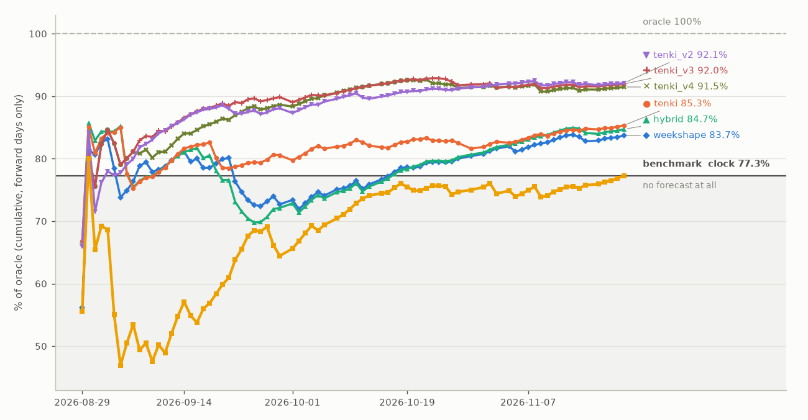
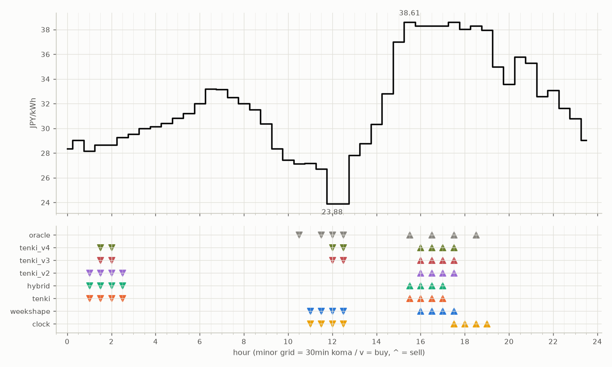

# JEPX仮想蓄電池 フォワード運用レポート

戦略凍結: 2026-08-12 / フォワード開始: 2026-08-14受渡分 / 生成: 2026-11-17 22:43 JST

> ⚠ 11/17受渡: 気象予報の取得に失敗（forecast_unavailable/signal_unavailable）のため天気系4機体は**欠場**（実力ではなく計測の欠測。後日、予報アーカイブからBT補完される）

## 累計成績（リーグ97日目）

| 機体 | 累計損益 | 事前でない日 | **対oracle（共通75日）** | 対oracle（各自の出場日） | 対clock差（pt） |
|---|---|---|---|---|---|
| tenki_v2 | 15,131円 | 14%（13/96日・BT補完） | **91.8%** | 91.4% | +15.5 |
| tenki_v3 | 15,123円 | 15%（14/96日・BT補完） | **91.6%** | 91.5% | +15.9 |
| tenki_v4 | 15,164円 | 17%（16/96日・BT補完） | **91.1%** | 91.1% | +15.4 |
| tenki | 14,194円 | 10%（10/96日・BT9日+再計算1日） | **84.7%** | 85.0% | +8.8 |
| hybrid | 14,065円 | 10%（10/96日・BT9日+再計算1日） | **84.0%** | 84.4% | +8.2 |
| weekshape | 13,921円 | 22%（21/97日・再計算） | **82.9%** | 82.8% | +6.9 |
| clock | 12,940円 | 22%（21/97日・再計算） | **75.9%** | 75.9% | +0.0 |
| oracle | 16,709円 | — | 100.0% | 100.0% | — |

累計損益は**BT補完込み**（参戦前の欠場日を、当時入手可能だったデータのみで再現したバックテストで補完）。**事前でない日**＝価格公表前にコミットされていない日。内訳は**BT補完**（参戦前の穴埋め）と**再計算**（提出が無く採点時にコードから作った日）。clockとweekshapeは2026-08-27まで提出型ではなかったため、それ以前は全日が再計算。**対oracle%と対clock差は事前コミット済みのフォワード日のみ**で計算——対oracle%は値幅のスケールを、対clock差（常設ベンチとの同日ペア差）は時代の取りやすさを一次補正する。

**順位は「対oracle（共通75日）」で付ける。** 「各自の出場日」の列は機体ごとに分母の日が違うので、**順位に使うと難しい日を欠場した機体ほど上に来る**——2026-08-29の敵対的レビューで実際にそうなっていた（tenki_v3が首位に見えていたが、同じ日で揃えるとtenkiとhybridが上）。参考として残すが、比較には使わない。

### 欠場の内訳

- **設計棄権**（5件）: 11/17 hybrid, 11/17 tenki, 11/17 tenki_v2, 11/17 tenki_v3, 11/17 tenki_v4
  - 機体が理由つきで出場を辞退した日。**補完しない**——埋めると出さなかった予測を発明することになる

## 期間別（ISO週別、*=BT補完を含む）

| 週 | tenki | hybrid | clock | weekshape | tenki_v2 | tenki_v3 | tenki_v4 | oracle |
|---|---|---|---|---|---|---|---|---|
| 2026-W33 | 158 | 158 | 241 | 215 | 165* | 180* | 181* | 257 |
| 2026-W34 | 880* | 870* | 796 | 836 | 841* | 856* | 859* | 928 |
| 2026-W35 | 990* | 991* | 842 | 928 | 981* | 1,008* | 1,008* | 1,110 |
| 2026-W36 | 773 | 773 | 499 | 795 | 837 | 860 | 860 | 1,060 |
| 2026-W37 | 731 | 724 | 465 | 714 | 775 | 764 | 707 | 817 |
| 2026-W38 | 644 | 591 | 635 | 690 | 841 | 847 | 829 | 880 |
| 2026-W39 | 924 | 605 | 1,046 | 607 | 933 | 1,007 | 1,026 | 1,108 |
| 2026-W40 | 1,275* | 1,129* | 1,100 | 1,052 | 1,377* | 1,343* | 1,399* | 1,464 |
| 2026-W41 | 1,371* | 1,368* | 1,360 | 1,368 | 1,521* | 1,494* | 1,529* | 1,557 |
| 2026-W42 | 1,235* | 1,364* | 1,380 | 1,364 | 1,330* | 1,417* | 1,480* | 1,543 |
| 2026-W43 | 825 | 892 | 703 | 853 | 923 | 930 | 857 | 980 |
| 2026-W44 | 1,196* | 1,411* | 1,133 | 1,350 | 1,415* | 1,292* | 1,329* | 1,445 |
| 2026-W45 | 1,531* | 1,582* | 1,222 | 1,465 | 1,581* | 1,485* | 1,513* | 1,611 |
| 2026-W46 | 1,322 | 1,400 | 1,071 | 1,365 | 1,271 | 1,276 | 1,221 | 1,459 |
| 2026-W47 | 340 | 207 | 445 | 318 | 340 | 364 | 364 | 491 |

## 直接対決（全機体出場日 80日のみ）

| 機体 | 累計損益 | 対oracle |
|---|---|---|
| tenki_v2 | 12,700円 | 91.7% |
| tenki_v3 | 12,694円 | 91.6% |
| tenki_v4 | 12,621円 | 91.1% |
| tenki | 11,776円 | 85.0% |
| hybrid | 11,675円 | 84.3% |
| weekshape | 11,480円 | 82.9% |
| clock | 10,493円 | 75.7% |
| oracle | 13,855円 | 100.0% |
## 直近日の解剖（全日分は [daily_anatomy.md](daily_anatomy.md)）

### 2026-11-18（信号: 強）

- 因子: 日射予報 156 W/m2 / 実測 未確定（実測は約5日遅れ） / 乖離 -244 W/m2（普段より曇る方向。判定時の直近28日平均 399、判定は絶対値 244 vs 閾値 203）
- 価格の形: 最安 12:00 23.88円 / 最高 15:30 38.61円 / 山谷比 1.6倍

| 機体 | 充電（買い） | 平均買値 | 放電（売り） | 平均売値 | 損益 |
|---|---|---|---|---|---|
| clock | 11:00, 11:30, 12:00, 12:30 | 25.42円 | 17:30, 18:00, 18:30, 19:00 | 38.22円 | +91円 |
| weekshape | 11:00, 11:30, 12:00, 12:30 | 25.42円 | 16:00, 16:30, 17:00, 17:30 | 38.38円 | +92円 |
| tenki | 01:00, 01:30, 02:00, 02:30 | 28.68円 | 15:30, 16:00, 16:30, 17:00 | 38.38円 | +60円 |
| tenki_v2 | 01:00, 01:30, 02:00, 02:30 | 28.68円 | 16:00, 16:30, 17:00, 17:30 | 38.38円 | +59円 |
| tenki_v3 | 01:30, 02:00, 12:00, 12:30 | 26.27円 | 16:00, 16:30, 17:00, 17:30 | 38.38円 | +84円 |
| tenki_v4 | 01:30, 02:00, 12:00, 12:30 | 26.27円 | 16:00, 16:30, 17:00, 17:30 | 38.38円 | +84円 |
| hybrid | 01:00, 01:30, 02:00, 02:30 | 28.68円 | 15:30, 16:00, 16:30, 17:00 | 38.38円 | +60円 |
| oracle | 10:30, 11:30, 12:00, 12:30 | 25.40円 | 15:30, 16:30, 17:30, 18:30 | 38.45円 | +93円 |

**48コマ価格（円/kWh。太字=最安/最高）**

| 00:00 | 00:30 | 01:00 | 01:30 | 02:00 | 02:30 | 03:00 | 03:30 | 04:00 | 04:30 | 05:00 | 05:30 | 06:00 | 06:30 | 07:00 | 07:30 | 08:00 | 08:30 | 09:00 | 09:30 | 10:00 | 10:30 | 11:00 | 11:30 |
|---|---|---|---|---|---|---|---|---|---|---|---|---|---|---|---|---|---|---|---|---|---|---|---|
| 28.37 | 29.05 | 28.15 | 28.66 | 28.66 | 29.25 | 29.53 | 30.00 | 30.14 | 30.41 | 30.84 | 31.22 | 32.00 | 33.18 | 33.15 | 32.51 | 32.00 | 31.50 | 30.36 | 28.34 | 27.45 | 27.12 | 27.18 | 26.73 |

| 12:00 | 12:30 | 13:00 | 13:30 | 14:00 | 14:30 | 15:00 | 15:30 | 16:00 | 16:30 | 17:00 | 17:30 | 18:00 | 18:30 | 19:00 | 19:30 | 20:00 | 20:30 | 21:00 | 21:30 | 22:00 | 22:30 | 23:00 | 23:30 |
|---|---|---|---|---|---|---|---|---|---|---|---|---|---|---|---|---|---|---|---|---|---|---|---|
| **23.88** | 23.88 | 27.83 | 28.77 | 30.35 | 32.82 | 37.00 | **38.61** | 38.30 | 38.31 | 38.30 | 38.60 | 38.03 | 38.30 | 37.95 | 35.00 | 33.57 | 35.80 | 35.27 | 32.57 | 33.06 | 31.62 | 30.81 | 29.05 |

## 明日のpicks（受渡日 2026-11-19、信号: 平常）

日射予報の乖離 +27 W/m2（普段より晴れる方向。判定時の直近28日平均 378、判定は絶対値 27 vs 閾値 203）

| 機体 | 充電（買い） | 放電（売り） |
|---|---|---|
| clock | 11:00, 11:30, 12:00, 12:30 | 17:30, 18:00, 18:30, 19:00 |
| weekshape | 11:00, 11:30, 12:00, 12:30 | 16:00, 16:30, 17:00, 17:30 |
| tenki | 11:00, 11:30, 12:00, 12:30 | 16:30, 17:00, 17:30, 18:00 |
| tenki_v2 | 11:00, 11:30, 12:00, 12:30 | 16:30, 17:00, 17:30, 18:00 |
| tenki_v3 | 11:00, 11:30, 12:00, 12:30 | 16:30, 17:00, 17:30, 18:00 |
| tenki_v4 | 11:00, 11:30, 12:00, 12:30 | 16:30, 17:00, 17:30, 18:00 |
| hybrid | 11:00, 11:30, 12:00, 12:30 | 16:00, 16:30, 17:00, 17:30 |
