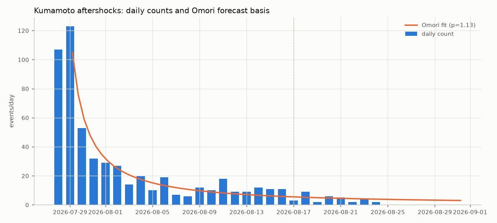

# 熊本余震・週次件数フォワード予測

戦略凍結 2026-08-13（omori/flat、採点=対数誤差、週=ISO月〜日） / 生成: 2026-08-24 05:30

| 週 | 実績 | omori予測 | flat予測 | 誤差omori | 誤差flat |
|---|---|---|---|---|---|
| 2026-W34 | 31 | 50.4 | 80 | 0.474 | 0.929 |

累計対数誤差: omori 0.474 vs flat 0.929（小さいほど良い）
