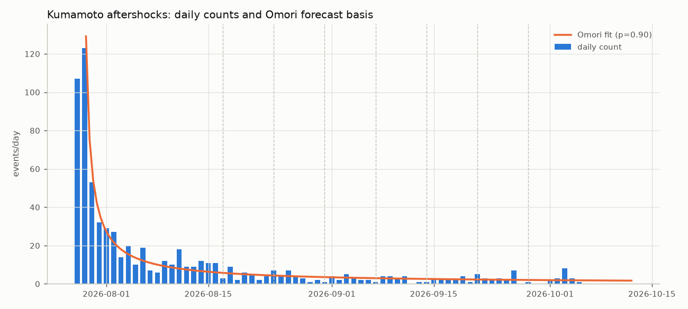

# 熊本余震・週次件数フォワード予測

戦略凍結 2026-08-13（omori/flat、採点=対数誤差、週=ISO月〜日） / 生成: 2026-10-05 11:55

| 週 | 実績 | omori予測 | flat予測 | 誤差omori | 誤差flat |
|---|---|---|---|---|---|
| 2026-W34 | 31 | 50.4 | 80 | 0.474 | 0.929 |
| 2026-W35 | 28 | 27.4 | 31 | 0.021 | 0.098 |
| 2026-W36 | 19 | 19.6 | 28 | 0.03 | 0.372 |
| 2026-W37 | 17 | 14.4 | 19 | 0.156 | 0.105 |
| 2026-W38 | 18 | 13.2 | 17 | 0.291 | 0.054 |
| 2026-W39 | 22 | 12.1 | 18 | 0.563 | 0.191 |
| 2026-W40 | 17 | 13.0 | 22 | 0.251 | 0.245 |

累計対数誤差: omori 1.786 vs flat 1.994（小さいほど良い）
